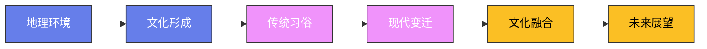

# 全球传统节日大全

## 一、东亚节日

### 1. 春节（中国、越南、韩国等）

**起源**：春节起源于上古时代的岁首祈年祭祀，已有4000多年历史。传说中"年"是一种怪兽，每到除夕夜出来伤人，人们发现它害怕红色、火光和响声，于是贴红对联、放鞭炮、守夜到天亮，这就是"过年"的由来。

**时间**：农历正月初一（通常在公历1月下旬至2月中旬）。春节的庆祝从腊月二十三（小年）开始，到正月十五（元宵节）结束，前后持续近一个月。

**核心仪式**：
- 腊月二十三/二十四：祭灶王爷（糖瓜粘住灶王爷的嘴，让他上天言好事）
- 腊月二十八/二十九：贴春联、贴窗花、挂灯笼
- 除夕：年夜饭（全家团聚，北方吃饺子、南方吃年糕和汤圆）、守岁（通宵不睡）、放鞭炮、发红包（长辈给晚辈压岁钱）
- 正月初一：拜年、穿新衣、吃汤圆或饺子
- 正月十五：元宵节（赏花灯、猜灯谜、吃元宵）

**特色饮食**：饺子（北方，形似元宝象征招财进宝）、年糕（南方，谐音"年高"寓意年年高升）、汤圆（团圆）、鱼（年年有余）、春卷、腊肉腊肠。

**当代变迁**：电子红包取代了纸质红包、春晚成为新年俗、"集五福"成为数字时代的年味。城市禁放鞭炮后年味变淡，但春运（全球最大规模的人口迁徙，约30亿人次）仍体现了中国人对"回家过年"的执念。

### 2. 元宵节（中国）

**起源**：汉文帝为纪念"平吕之乱"而设，后与佛教"燃灯礼佛"习俗融合。司马迁创建《太初历》时将元宵节列为重大节日。

**时间**：农历正月十五（春节后的第一个月圆之夜）。

**核心仪式**：赏花灯（从汉代延续至今）、猜灯谜（南宋开始流行）、舞龙舞狮、踩高跷、扭秧歌。未婚男女在古代可以借赏灯之机相识——元宵节是中国古代的"情人节"（辛弃疾"众里寻他千百度，蓦然回首，那人却在灯火阑珊处"描写的就是元宵节）。

**特色饮食**：元宵/汤圆（北方"滚"元宵、南方"包"汤圆，做法不同但寓意相同——团团圆圆）。

### 3. 中秋节（中国、日本、韩国、越南）

**起源**：源于上古时代的秋夕祭月，唐代成为固定节日，宋代开始盛行赏月之风。嫦娥奔月、吴刚伐桂、玉兔捣药是中秋节的经典传说。

**时间**：农历八月十五（通常在公历9月中旬至10月上旬）。

**核心仪式**：赏月（中秋之夜月亮最圆最亮）、吃月饼、拜月（古代女子在中秋夜拜月祈求美貌）、燃灯（南方有放孔明灯的习俗）、观潮（钱塘江大潮在中秋前后最壮观）。

**特色饮食**：月饼（广式、苏式、京式、潮式四大流派，近年出现冰皮月饼、流心月饼等新品种）、桂花酒、柚子、芋头（南方）。

**日本的中秋**：日本称中秋为"月见"（Tsukimi），赏月吃月见团子（糯米团子堆成金字塔形），摆放芒草和月见兔子装饰。

### 4. 端午节（中国）

**起源**：最广为人知的传说是纪念屈原——公元前278年，楚国诗人屈原投汨罗江自尽，百姓划船捞救、投粽子入江防止鱼虾啃食屈原遗体。但端午节的实际起源更早，与古代龙图腾祭祀和驱邪避疫有关。

**时间**：农历五月初五（通常在公历5月下旬至6月中旬）。

**核心仪式**：赛龙舟（南方尤为盛行，广东、福建、湖南等地的龙舟赛规模宏大）、吃粽子、挂艾草和菖蒲（驱邪）、佩香囊、饮雄黄酒（《白蛇传》中白娘子就是在端午节喝雄黄酒后现出原形）。

**特色饮食**：粽子（北方甜粽——红枣豆沙馅；南方咸粽——鲜肉蛋黄馅。甜咸之争是中国互联网的永恒话题）、五黄（黄鳝、黄鱼、黄瓜、咸蛋黄、雄黄酒，江浙一带端午必吃）。

### 5. 七夕节（中国）

**起源**：源于牛郎织女的传说——天上的织女与凡间的牛郎相爱，被王母娘娘用银河隔开，每年七月初七由喜鹊搭桥相会。七夕在古代是女子乞巧的节日（向织女乞求手艺），而非"中国情人节"。

**时间**：农历七月初七（通常在公历8月中旬）。

**核心仪式**：穿针乞巧（月下用彩线穿七孔针，穿得快的得巧最多）、拜织女、晒书晒衣（古代习俗）、吃巧果（油炸面食）。

**当代变迁**：现代七夕被商家包装为"中国情人节"，送花、送巧克力、烛光晚餐成为标配。但传统的乞巧习俗几乎消失。

### 6. 清明节（中国）

**起源**：源于上古时代的春祭，与寒食节（纪念介子推）合并后成为固定节日。清明是二十四节气之一，也是唯一一个既是节气又是节日的日子。

**时间**：公历4月4日或5日。

**核心仪式**：扫墓祭祖（清除墓地杂草、摆放供品、烧纸钱）、踏青（春天郊游）、放风筝（有的地方会剪断风筝线，象征放走晦气）、插柳戴柳、蹴鞠（古代足球）。

**特色饮食**：青团（江浙一带，用艾草汁和糯米粉做皮、豆沙做馅）、馓子（北方油炸面食）、润饼（闽南一带，类似春卷）。

### 7. 韩国秋夕（Chuseok）

**起源**：秋夕是韩国最重要的传统节日之一，源于古代新罗时期的丰收祭祀。传说中新罗王在中秋之夜组织织女比赛，输的一方要请赢的一方喝酒吃饭。

**时间**：农历八月十五（与中国中秋节同一天，但习俗不同）。

**核心仪式**：归乡省亲（韩国人回老家的规模堪比中国春运）、茶礼（祭祀祖先，摆放酒、食物和水果）、扫墓（秋夕前后去祖坟除草祭拜）、跳强羌水月来（韩国传统圆圈舞）。

**特色饮食**：松饼（Songpyeon，半月形米糕，用松针蒸制，馅料有芝麻、红豆、栗子等）、芋头汤、新酒（新米酿的酒）。

### 8. 日本新年（正月）

**起源**：日本新年原在农历正月，明治维新后改为公历1月1日。但冲绳和部分农村地区仍按农历过新年。

**时间**：公历12月31日（大晦日）至1月3日。

**核心仪式**：
- 大晦日（除夕）：吃年越�的荞麦面（长长的面条象征长寿）、看红白歌会（NHK年度音乐节目）、去神社寺庙听除夜之钟（敲108下，消除108种烦恼）
- 元旦：初诣（新年第一次参拜神社，日本三大初诣——明治神宫、�的成田山、住吉大社各吸引数百万人）、吃御节料理（装在漆盒里的新年料理，每道菜都有吉祥寓意）
- 正月装饰：门松（松竹梅装饰）、�的�的（注连饰，稻草绳装饰）、镜饼（圆形年糕）

**特色饮食**：御节料理（黑豆象征勤勉、鲱鱼子象征多子多孙、�的�的鱼卷象征喜庆）、年越荞麦面、杂煮（年糕汤，各地区做法不同）。

## 二、南亚与东南亚节日

### 9. 排灯节（Diwali，印度）

**起源**：排灯节是印度教最重要的节日，庆祝光明战胜黑暗、善良战胜邪恶。最流行的传说与罗摩有关——罗摩王子流放14年后返回阿约提亚，百姓点灯欢迎他回家。

**时间**：通常在公历10月至11月（印度历的第7个月新月日）。

**核心仪式**：点灯（家家户户点油灯和蜡烛，城市被灯火照亮）、放烟火、画Rangoli（门口用彩色粉末画几何图案）、祭拜拉克什米女神（财富女神）、互赠礼物和甜食。

**特色饮食**：各种甜食——Gulab Jamun（油炸面球泡糖浆）、Barfi（奶制甜点）、Ladoo（球形甜点）、Jalebi（油炸螺旋甜点泡糖浆）。排灯节期间印度人消费的甜食量是平时的数倍。

**当代规模**：排灯节是全球最大的节日之一——超过10亿人庆祝。印度每年排灯节的消费额超过数百亿美元。2022年，美国白宫首次举办排灯节庆祝活动。

### 10. 洒红节（Holi，印度）

**起源**：庆祝春天的到来和善恶的胜利。传说中魔王Hiranyakashipu的妹妹Holika试图在火中烧死王子Prahlada，但最终自己被烧死，洒红节因此得名。

**时间**：通常在公历3月（印度历的最后一个月满月日）。

**核心仪式**：互相泼洒彩色粉末（Gulal）和彩色水——无论贫富贵贱、男女老少，在这一天都被色彩覆盖，所有的社会界限暂时消失。夜晚点燃篝火（Holika Dahan），象征烧毁邪恶。

**特色饮食**：Thandai（杏仁奶饮品，有时加入大麻）、Gujiya（半月形甜馅饺子）、Puran Poli（甜馅饼）。

**文化意义**：洒红节是印度最"平等"的节日——在色彩面前，没有人是特殊的。近年来洒红节已传播到全球——伦敦、纽约、悉尼等地都有大型洒红节活动。

### 11. 泼水节（Songkran，泰国等东南亚国家）

**起源**：泼水节是傣历新年，起源于印度教的洒红节，后与佛教和当地传统融合。在泰国，泼水节也与尊敬长辈的习俗有关——年轻人用清水为长辈洗手洗脚以示敬意。

**时间**：公历4月13-15日（泰国、老挝、缅甸、柬埔寨等国庆祝）。

**核心仪式**：泼水（最初是温和地洒水祝福，现在演变为全民水仗——水枪、水管、冰水桶齐上阵）、浴佛（用清水浇灌佛像）、堆沙塔（在寺庙里用沙子堆小塔）、放生（释放鱼和鸟）。

**特色饮食**：Khao Chae（冰水泡饭，配各种小菜）、芒果糯米饭、椰汁鸡汤。泼水节期间也是泰国芒果的旺季。

**当代规模**：曼谷的考山路和清迈的古城是泼水节最疯狂的地方——连续三天的水仗吸引了全球游客。近年来泼水节已成为泰国最大的旅游品牌。

### 12. 水灯节（Loy Krathong，泰国）

**起源**：水灯节的起源有多个版本——最流行的说法是素可泰王朝的诺帕玛王妃用香蕉叶做灯放在水面上祈福。也有人认为是为了祭祀水神。

**时间**：泰历十二月十五日（通常在公历11月）。

**核心仪式**：放水灯（Krathong，用香蕉叶和花做的小船，上面放蜡烛、香和硬币，放入河流中）、放天灯（清迈的Yi Peng节与水灯节同期，成千上万的天灯同时升空，场面壮观）、选美比赛、花车游行。

**文化意义**：水灯节被称为"泰国最浪漫的节日"——情侣一起放水灯祈求爱情美满。清迈的天灯节是全球最美的节庆场景之一。

### 13. 宋干节老挝版本（Pi Mai Lao）

**起源**：与泰国泼水节同源，但老挝版本更加温和和传统。

**时间**：公历4月13-15日。

**核心仪式**：泼水祝福（比泰国温和，更多是洒水而非水仗）、浴佛、沙塔堆建、拴线仪式（Baci，用白线绑在手腕上祈福）、抬佛像游行。

**特色饮食**：Laap（老挝肉末沙拉）、Khao Niao（糯米饭，老挝人的主食）、Beerlao（老挝啤酒，被称为"亚洲最好的啤酒"之一）。

### 14. 大宝森节（Thaipusam，马来西亚、印度）

**起源**：纪念印度教战神穆鲁干（Murugan）战胜恶魔。信徒通过极端的苦行来表达虔诚和感恩。

**时间**：泰米尔历的Thai月（公历1月至2月）满月日。

**核心仪式**：苦行穿刺——信徒在身体各部位插入铁钩、长针甚至穿刺舌头和脸颊，背负巨大的Kavadi（金属框架装饰物）步行数公里前往黑风洞（Batu Caves）。信徒在苦行前需斋戒数周。

**文化争议**：大宝森节的苦行仪式引发了人权和动物保护方面的讨论，但对信徒来说这是神圣的信仰表达。

## 三、欧洲节日

### 15. 圣诞节（Christian Christmas，全球基督教国家）

**起源**：纪念耶稣基督的诞生。12月25日的确切来源有争议——可能与罗马帝国的太阳神节（Sol Invictus）有关，也可能是早期教会为了取代异教冬至庆典而选定的日期。许多圣诞节传统（如圣诞树、槲寄生、圣诞老人）实际上源于异教习俗。

**时间**：12月25日（东正教为1月7日）。圣诞节的庆祝从12月初就开始——降临节（Advent）倒计时、圣诞市场、办公室派对。

**核心仪式**：
- 圣诞树（16世纪德国人开始在室内摆放装饰松树，后传遍全球）
- 圣诞老人（Santa Claus，原型是4世纪的圣尼古拉斯主教，19世纪美国人赋予他红衣白胡子的现代形象）
- 礼物交换（12月24日晚或25日早晨拆礼物）
- 圣诞大餐（英国吃火鸡、德国吃鲤鱼、意大利吃七鱼宴、瑞典吃Julbord自助餐）
- 唱圣诞颂歌（Silent Night、Jingle Bells等）
- 教堂午夜弥撒

**特色饮食**：火鸡（英国、美国）、姜饼屋、圣诞布丁（英国，提前几个月制作）、Stollen（德国圣诞面包）、Panettone（意大利圣诞蛋糕）、蛋奶酒（Eggnog）。

### 16. 复活节（Easter，全球基督教国家）

**起源**：纪念耶稣基督被钉十字架后第三天复活——这是基督教最核心的信仰事件。复活节的日期不固定——每年春分后第一个满月后的第一个星期日（3月22日至4月25日之间）。

**核心仪式**：
- 复活节彩蛋（象征新生和复活，中世纪开始装饰蛋，后来演变为巧克力蛋）
- 复活节兔子（Easter Bunny，源于日耳曼生育女神Ostara的象征——兔子代表多产）
- 教堂复活节弥撒
- 复活节游行（纽约第五大道的复活节游行最著名——人们戴着夸张的帽子参加）
- 寻蛋活动（在花园里藏彩蛋让孩子寻找）

**特色饮食**：巧克力蛋、热十字面包（Hot Cross Buns，面包上有十字架标记）、烤羊肉（复活节吃羊肉象征耶稣是"上帝的羔羊"）。

### 17. 万圣节（Halloween，爱尔兰、美国、英国等）

**起源**：起源于凯尔特人的萨温节（Samhain，约2000年前）——10月31日是凯尔特新年，这一天亡灵会回到人间。后来基督教将11月1日定为万圣节（All Saints' Day），10月31日成为"万圣节前夜"（All Hallows' Eve → Halloween）。

**核心仪式**：
- 南瓜灯（Jack-o'-lantern，最初在爱尔兰是用萝卜雕刻的，移民美国后改为南瓜）
- "不给糖就捣蛋"（Trick or Treat，孩子们装扮成各种角色挨家挨户要糖果）
- 化装舞会（万圣节是成年人也有理由打扮的日子）
- 鬼屋（美国的鬼屋产业价值数十亿美元）
- 看恐怖电影

**特色饮食**：糖果（美国万圣节糖果销售额超过30亿美元）、太妃苹果（Toffee Apple）、南瓜派、苹果酒。

**文化输出**：万圣节从爱尔兰民间节日演变为全球性的文化现象——日本的万圣节变装（涩谷的万圣节狂欢闻名世界）、中国的万圣节派对（上海欢乐谷的万圣节活动越来越受欢迎）。

### 18. 慕尼黑啤酒节（Oktoberfest，德国）

**起源**：1810年10月12日，巴伐利亚王储路德维希与萨克森公主特蕾莎的婚礼庆典，市民在慕尼黑城门前的草地上饮酒狂欢。此后每年举办，逐渐演变为世界最大的民间节日。

**时间**：9月中旬至10月初（持续16-18天）。

**核心仪式**：喝啤酒（用1升容量的Maß杯喝，只允许饮用慕尼黑本地酿造的6家啤酒厂的啤酒）、吃烤鸡和椒盐卷饼、穿传统服装（男士穿皮裤Lederhose、女士穿紧身连衣裙Dirndl）、坐旋转木马和摩天轮、乐队演奏啤酒节传统歌曲。

**规模**：每年吸引超过600万游客，消费超过700万升啤酒、50万只烤鸡。啤酒节帐篷是世界上最大的临时建筑——最大的帐篷可容纳1万人。

**当代变迁**：啤酒节已传播到全球——加拿大基奇纳-滑铁卢的啤酒节（北美洲最大）、中国多个城市也举办自己的啤酒节。但慕尼黑原版的地位无可替代。

### 19. 威尼斯狂欢节（Carnevale di Venezia，意大利）

**起源**：起源于1162年威尼斯共和国庆祝对乌尔里科的胜利。18世纪是狂欢节的全盛期——贵族和市民戴着面具混在一起，暂时消除阶级界限。1797年拿破仑征服威尼斯后禁止狂欢节，1979年才恢复。

**时间**：大斋期（Lent）前的两周，通常在2月至3月。

**核心仪式**：戴面具（威尼斯面具是世界级工艺品——Colombina半脸面具、Bauta全脸面具、Medico della Peste瘟疫医生面具）、穿华服（18世纪巴洛克风格的华丽礼服）、参加在圣马可广场举行的面具比赛、水上巡游、化装舞会。

**特色饮食**：Frittelle（油炸甜甜圈，狂欢节期间必吃）、Galani（薄脆炸面片）、萨拉米香肠和葡萄酒。

### 20. 圣帕特里克节（St. Patrick's Day，爱尔兰）

**起源**：纪念爱尔兰守护圣人圣帕特里克（385-461年），他将基督教传入爱尔兰，传说中用三叶草（Shamrock）解释三位一体。最初是宗教节日，现在演变为爱尔兰文化的全球庆祝。

**时间**：3月17日（圣帕特里克去世的日子）。

**核心仪式**：穿绿色（爱尔兰人说如果你不穿绿色，就会被别人捏）、游行（都柏林的圣帕特里克节游行持续5天）、喝吉尼斯黑啤酒（Guinness）、去教堂参加弥撒、河流染绿（芝加哥每年将芝加哥河染成绿色）。

**文化输出**：圣帕特里克节已成为全球性的节日——全球有超过200个城市举办游行。纽约的圣帕特里克节游行是世界上最大的游行之一——每年有超过200万人观看。

### 21. 奔牛节（San Fermín，西班牙）

**起源**：纪念纳瓦拉地区的守护圣人圣费尔明。奔牛活动起源于将牛从城外赶到斗牛场的日常运输——年轻人跑在牛前面寻求刺激，逐渐演变为节日传统。海明威1926年的小说《太阳照常升起》让奔牛节闻名世界。

**时间**：7月6日至7月14日（每年）。

**核心仪式**：奔牛（每天早上8点，6头公牛被放出，数百人沿着875米的路线奔跑——每年约有50-100人受伤，偶尔有人死亡）、穿白衣红围巾、街头派对、烟花、宗教游行。

**争议**：动物保护组织强烈反对奔牛节——每年有约50头牛在节日期间死亡。西班牙国内对此也存在激烈争论。

## 四、美洲节日

### 22. 亡灵节（Día de los Muertos，墨西哥）

**起源**：亡灵节源于阿兹特克文明对死亡的独特理解——死亡不是终结，而是生命的延续。西班牙殖民后与天主教的万灵节（11月2日）融合，形成了现在的亡灵节。

**时间**：11月1日（纪念夭折的儿童）和11月2日（纪念成年亡者）。

**核心仪式**：
- 家庭祭坛（Ofrenda）——摆放亡者生前喜欢的食物、饮料、照片、万寿菊（花香引导亡灵回家）、蜡烛
- 墓地守夜——家人在墓地过夜，点蜡烛、摆放食物、弹吉他唱歌，气氛欢乐而非悲伤
- 骷髅妆——面部画成彩色骷髅（Calavera），源自墨西哥版画家José Guadalupe Posada的骷髅画
- 骷髅糖（Calavera de azúcar）——用糖霜装饰的骷髅形状糖果
- 剪纸（Papel Picado）——彩色纸张剪出镂空图案装饰

**特色饮食**：亡灵面包（Pan de Muerto，圆形面包上有骨头形状的装饰）、骷髅糖、莫莱酱、龙舌兰酒。

**全球影响**：2017年皮克斯动画电影《寻梦环游记》（Coco）让亡灵节在全球范围内获得了巨大关注。亡灵节体现了墨西哥人对死亡的独特态度——不恐惧、不悲伤，而是以欢乐和爱来纪念逝去的亲人。

### 23. 感恩节（Thanksgiving，美国）

**起源**：最流行的说法是1621年普利茅斯殖民地的清教徒与万帕诺亚格印第安人共同庆祝丰收。但感恩节作为全国性节日是林肯总统在1863年正式确立的——在内战最黑暗的时期，他希望通过感恩节团结国家。

**时间**：11月第四个星期四（加拿大为10月第二个星期一）。

**核心仪式**：家庭团聚（感恩节是美国人团聚的日子，交通拥堵程度仅次于圣诞节）、感恩节大游行（纽约梅西百货感恩节游行，巨型卡通气球是标志）、看橄榄球比赛（NFL感恩节比赛是传统）、黑色星期五购物（感恩节后的第一天是美国最大的购物日）。

**特色饮食**：火鸡（烤火鸡是感恩节的灵魂，每年有超过4500万只火鸡在感恩节被吃掉）、蔓越莓酱、南瓜派、土豆泥、填料（Stuffing，面包碎混合蔬菜塞入火鸡腹中烤制）、砂锅菜（Green Bean Casserole）。

**文化争议**：感恩节对印第安人来说是"全国哀悼日"——欧洲殖民者最终对印第安人进行了种族灭绝。近年来，越来越多的美国人开始反思感恩节的历史叙事。

### 24. 狂欢节（Carnival，巴西）

**起源**：Carnival源于拉丁语"carne vale"，意为"告别肉食"——狂欢节是天主教大斋期（Lent）前的最后狂欢。巴西狂欢节融合了葡萄牙殖民者、非洲奴隶和原住民的文化——桑巴舞源于非洲，华丽的服装受葡萄牙贵族化装舞会影响。

**时间**：大斋期前40天开始，高潮在斋期前一周（通常在2月至3月）。

**核心仪式**：
- 桑巴游行——里约热内卢的桑巴大道（Sambadrome）是狂欢节的主战场，12所桑巴学校各派出3000-5000人的队伍，花车、鼓乐队、舞者持续两天两夜的竞技表演
- 街头派对（Blocos）——里约街头有超过500个免费派对，每个派对有不同的音乐风格
- 扮装——从华丽的羽毛装到搞笑的Cosplay，没有"太夸张"这回事
- 黑脸舞（Bloco Afro）——致敬非洲文化

**规模**：里约狂欢节每年吸引超过200万游客，经济产值超过10亿美元。圣保罗的狂欢节游行规模甚至超过里约（桑巴大道更长）。

**特色饮食**：啤酒（狂欢节期间里约的啤酒消费量是平时的3倍）、巴西烤肉、阿萨伊果碗、甘蔗汁鸡尾酒（Caipirinha）。

### 25. 亡灵游行（Día de los Muertos，中美洲和南美洲其他国家）

**危地马拉的亡灵节**：最具特色的是巨型风筝节（Barriletes Gigantes）——在萨卡特佩克斯省的圣地亚哥萨卡特佩克村，人们制作直径超过20米的巨型风筝放飞，风筝上画着亡者的肖像和宗教图案。这个传统已有数百年历史。

**玻利维亚的骷髅节（Día de los ñatitas）**：11月8日，玻利维亚人将祖先的头骨（ñatitas）装饰上鲜花和彩带到街上巡游。这些头骨有些是家族传承的，有些是从墓地出土的。人们相信头骨能带来好运和保护。

## 五、非洲节日

### 26. 马丁·路德·金纪念日（Martin Luther King Jr. Day，美国）

**起源**：纪念美国民权运动领袖马丁·路德·金博士（1929-1968年），他是非暴力抵抗种族隔离的象征。1983年里根总统签署法案，1986年首次庆祝。

**时间**：1月第三个星期一。

**核心仪式**：社区服务（"一天不是假期，而是一天服务"）、游行和集会、参观民权运动遗址（亚特兰大的马丁·路德·金国家历史公园）、反思种族平等。

### 27. 赫布节（Heb Sed Festival，古埃及，已失传）

**起源**：古埃及最盛大的节日之一，法老在登基30年后举行的"重生"庆典。庆典上法老要奔跑、跳舞、参加各种体力测试，证明自己仍然有能力统治。此后每3年举行一次。

**核心仪式**：法老在两个石碑（Sed Pavilions）之间奔跑，象征同时统治上下埃及。竖立奥西里斯神像、举行献祭仪式、法老重新加冕。

**文化意义**：赫布节体现了古埃及人对王权和永生的信仰——法老不是普通人，而是神的化身，需要通过仪式不断"更新"神力。

### 28. 蒙巴萨嘉年华（Mombasa Carnival，肯尼亚）

**起源**：蒙巴萨是东非最大的港口城市，受阿拉伯、印度、葡萄牙和非洲本土文化影响。嘉年华是庆祝这种多元文化融合的节日。

**时间**：通常在11月。

**核心仪式**：游行（各个文化群体展示自己的传统服饰和音乐）、街头舞蹈、音乐表演、美食摊位。斯瓦希里文化是嘉年华的主角——Taarab音乐、Bango舞蹈、Henna纹身。

## 六、中东节日

### 29. 开斋节（Eid al-Fitr，全球穆斯林）

**起源**：斋月（Ramadan）结束后的庆祝——穆斯林在斋月期间从日出到日落禁食、禁水、禁烟，开斋节是对一个月虔诚斋戒的庆祝和感恩。

**时间**：斋月结束后第1天（伊斯兰历10月1日，公历日期每年不同）。

**核心仪式**：晨礼（开斋节的特殊祈祷，通常在清真寺或广场举行）、施舍（Zakat al-Fitr，向穷人捐赠食物或金钱）、穿新衣、互访亲友、给孩子发红包和糖果。

**特色饮食**：因地区而异——中东吃Ma'amoul（坚果馅酥饼）、东南亚吃Ketupat（棕榈叶编织的粽子状米饭）、南亚吃Sheer Khurma（牛奶枣子面食甜汤）、北非吃Tamina（蜂蜜黄油面糊）。

**全球规模**：全球约有18亿穆斯林庆祝开斋节，是世界上被庆祝人数最多的节日之一。

### 30. 宰牲节（Eid al-Adha，全球穆斯林）

**起源**：纪念先知易卜拉欣（亚伯拉罕）愿意献祭自己的儿子以示对真主的服从——真主在最后一刻用羊替代了孩子。这是伊斯兰教最重要的节日之一。

**时间**：伊斯兰历12月10日（公历日期每年不同），与朝觐（Hajj）同期。

**核心仪式**：宰牲（通常宰杀绵羊、山羊或牛，肉分成三份——自家、亲友、穷人各一份）、晨礼、穿新衣、互访亲友。

**特色饮食**：烤肉（中东地区的Mansaf——羊肉配酸奶米饭是约旦国菜）、Biryani（南亚香料饭）、各种羊肉菜肴。

### 31. 诺鲁孜节（Nowruz，波斯新年，伊朗等中亚国家）

**起源**：诺鲁孜节（意为"新的一天"）是波斯新年，已有3000多年历史。起源于琐罗亚斯德教（拜火教），但与伊斯兰教融合后继续庆祝。春分日庆祝，象征万物复苏。

**时间**：春分日（3月20或21日），持续13天。

**核心仪式**：
- 七鲜桌（Haft-Sin）——桌上摆放7种以S开头的物品：麦芽（象征重生）、苹果（象征美丽）、醋（象征耐心）、蒜（象征健康）、沙枣（象征爱情）、漆树（象征日出）、金币（象征财富）
- 跳火节（Chaharshanbe Suri，春分前最后一个星期二晚上，跳过篝火喊"把你的黄色给我，把我的红色给你"——黄色象征疾病，红色象征健康）
- 13日外出（Sizdah Bedar，第13天全家到户外野餐，将麦芽扔进河里象征送走霉运）

**特色饮食**：Sabzi Polo ba Mahi（香草米饭配炸鱼）、Kuku Sabzi（香草蛋饼）、坚果和干果拼盘。

**全球规模**：诺鲁孜节是联合国承认的国际节日——全球约有3亿人庆祝，覆盖伊朗、阿富汗、塔吉克斯坦、库尔德斯坦、阿塞拜疆等地区。

## 七、大洋洲节日

### 32. 澳新军团日（ANZAC Day，澳大利亚和新西兰）

**起源**：纪念1915年4月25日澳新军团（ANZAC，澳大利亚和新西兰联合军团）在加里波利战役中登陆土耳其——这是澳新军团第一次重大战役，超过8000名澳大利亚人和2700名新西兰人阵亡。ANZAC日不仅是战争纪念，更被视为两国国家认同的奠基时刻。

**时间**：4月25日。

**核心仪式**：黎明纪念仪式（Dawn Service，清晨5-6点在战争纪念馆举行，模拟当年登陆的时间）、老兵游行、佩戴虞美人花（红色虞美人象征战争中牺牲的鲜血）、玩Two-Up（一种传统的掷硬币赌博游戏，只在ANZAC日合法）、吃ANZAC饼干（燕麦椰丝饼干，一战时妻子们寄给前线丈夫的——因为不含鸡蛋，长途运输不会变质）。

### 33. 毛利新年（Matariki，新西兰）

**起源**：Matariki是毛利人的新年，以昴星团（Matariki，毛利语"昴星团"）升起为标志。这是一个反思过去、庆祝当下、规划未来的节日。2022年新西兰将Matariki定为法定公共假日。

**时间**：通常在6月或7月（昴星团升起的日子，具体日期因年份而异）。

**核心仪式**：观星（在Matariki升起的早晨观看星空）、点篝火纪念亡者、分享食物、制定新年计划、传统舞蹈和歌曲表演。

**文化意义**：Matariki代表了新西兰对原住民文化的重新认可——这是新西兰第一个以毛利传统为基础的法定假日。

## 八、跨文化节日

### 34. 世界音乐节（WOMAD，全球）

**起源**：1982年由Peter Gabriel创立，旨在展示世界音乐的多样性。WOMAD是"World of Music, Arts and Dance"的缩写。

**规模**：在超过27个国家举办过活动，每年在英国、新西兰、智利等地有固定节日。

### 35. 火人节（Burning Man，美国）

**起源**：1986年旧金山贝克海滩上一个小型焚烧人偶仪式，1990年后移至内华达州黑石沙漠（Black Rock Desert）。火人节不是传统节日——它是一个"临时城市"（Black Rock City），每年存在8天后消失。

**时间**：8月最后一个星期一到9月第一个星期一。

**核心仪式**：建造临时城市（每年约7万人参加）、艺术装置展示、焚烧巨大的人形木偶（"火人"）、"去商品化"（火人节不卖任何东西，除了咖啡和冰——参与者需要自带一切）、Radical Self-expression（激进的自我表达）。

**争议**：火人节近年来因商业化（硅谷精英的"奢华露营"）和环境问题（留下大量垃圾）而受到批评。

## 九、结语

节日是人类文明的基因——它记录了我们从哪里来、我们相信什么、我们如何与彼此和自然相处。从中国的春节到墨西哥的亡灵节，从印度的排灯节到爱尔兰的圣帕特里克节，每一个节日都是一部浓缩的文化史。它们的共同点比我们想象的更多——团聚、感恩、纪念、狂欢，这些需求跨越了语言、宗教和地理的界限。在一个日益全球化的世界里，节日是我们保持文化多样性的最后堡垒之一。

