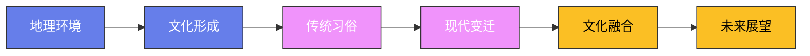

# 咖啡可可茶叶传播史

## 一、茶叶

### 1. 茶的起源（中国）

**传说**：神农尝百草，日遇七十二毒，得荼（茶）而解之。这个传说将茶的发现追溯到公元前2737年——虽然这个日期无法考证，但中国确实是茶的发源地。

**考古证据**：最早的茶叶实物发现于汉景帝阳陵（公元前141年）——经鉴定是小叶种茶树的芽尖。这证明至少在2100多年前，中国人已经开始饮茶。

**地理起源**：茶树（Camellia sinensis）原产于中国西南部的云贵高原——云南的古茶树（如勐海的巴达古茶树，树龄约1700年）是世界上现存最古老的茶树。从云贵高原出发，茶的种植逐渐向东和向南传播。

### 2. 茶在中国的发展

**唐代**（618-907）：茶文化的关键转折——陆羽写出了世界上第一部茶学专著《茶经》（约760年）。《茶经》系统论述了茶的起源、制作、器具、用水和品饮方法。陆羽因此被尊为"茶圣"。

唐代饮茶方式是"煎茶"——将茶饼碾碎成粉末，放入沸水中煎煮，加入盐调味。寺庙中的僧侣是茶文化的重要推动者——茶能提神，帮助僧侣在打坐时不犯困。

**宋代**（960-1279）：宋代将茶文化推向艺术的巅峰——"点茶法"出现：将茶粉放入碗中，注入少量热水调成膏，再用茶筅（竹制搅拌器）快速搅打至产生泡沫。宋人斗茶（比赛谁打出的泡沫更细密持久）是上至皇帝下至百姓的全民活动。

宋徽宗赵佶写了《大观茶论》——一个皇帝亲自撰写茶学著作，可见宋代茶文化的狂热程度。建窑黑釉兔毫盏（福建建阳出产）是宋代斗茶的标配——黑色碗壁衬托白色泡沫，便于评判。

**明代**（1368-1644）：明太祖朱元璋废除了团茶（茶饼）进贡的制度，改用散茶（茶叶直接冲泡）。这就是今天中国人喝茶的方式——用沸水冲泡散茶叶。紫砂壶（江苏宜兴）在明代兴起——紫砂的透气性适合泡茶，养壶成为文人的雅趣。

**清代**（1644-1912）：清代的茶馆文化达到巅峰——北京的茶馆（大茶馆、清茶馆、书茶馆、野茶馆）、成都的盖碗茶、广州的早茶，各有特色。

### 3. 茶向世界的传播

**传入日本**：唐代（约805年）日本僧人最澄和空海从中国带回茶种。宋代（1191年）荣西禅师从中国带回抹茶法——写出了《吃茶养生记》，被尊为"日本茶祖"。日本将中国宋代的点茶法发展为茶道——千利休（1522-1591年）将茶道推向极致，创立了"和敬清寂"的茶道精神。

**传入西藏**：文成公主入藏（641年）将茶带入西藏。藏族人将茶叶与酥油、盐混合打制成酥油茶——高热量、高脂肪，帮助适应高原气候。茶马古道（从四川到西藏的贸易路线）因茶而兴起——马帮用骡马将茶叶运入西藏，换回马匹。

**传入英国**：1662年葡萄牙公主凯瑟琳嫁给英国国王查理二世时，将茶叶作为嫁妆带到英国——这是英国人接触茶的开始。到18世纪，茶已成为英国的国民饮品。

**英国下午茶**：1840年贝德福德公爵夫人安娜开创了下午茶的传统——下午4点左右，一杯红茶配三明治、司康饼和蛋糕。下午茶迅速成为英国上流社会的社交活动——至今仍是英国文化的标志。

**英式红茶**：英国人喜欢在红茶中加入牛奶和糖——这与中国人的清饮习惯截然不同。英国人消费的茶叶以红茶为主——大吉岭（印度）、阿萨姆（印度）、锡兰（斯里兰卡）是英国红茶的三大来源。

**鸦片战争的导火索**：18世纪英国从中国进口大量茶叶，导致贸易逆差严重。英国东印度公司向中国走私鸦片来平衡贸易——最终引发了鸦片战争（1840-1842）。一杯茶，改变了中国的历史走向。

### 4. 茶在印度和斯里兰卡

**印度茶**：英国东印度公司为打破中国对茶叶的垄断，19世纪在印度阿萨姆邦和大吉岭开辟茶园。阿萨姆红茶（浓烈、麦芽香）和大吉岭红茶（清淡、花香）成为世界名茶。

**斯里兰卡茶**：1867年英国人詹姆斯·泰勒在斯里兰卡（当时的锡兰）开辟了第一个茶园。锡兰红茶（Ceylon Tea）以其清爽的口感闻名世界——斯里兰卡至今是世界上最大的茶叶出口国之一。

### 5. 茶的全球文化影响

**摩洛哥薄荷茶**：摩洛哥人用中国绿茶加新鲜薄荷和大量糖冲泡薄荷茶——被称为"摩洛哥威士忌"（因为穆斯林不饮酒）。薄荷茶的冲泡有仪式感——从高处将茶倒入小玻璃杯中，产生泡沫。

**俄罗斯茶炊**：俄罗斯人用茶炊（Samovar，一种金属加热器）煮浓茶（Zavarka），然后用热水稀释饮用。俄罗斯人喝茶时配果酱——用小勺舀果酱放入口中，再喝一口茶。

**土耳其红茶**：土耳其是世界上人均茶叶消费量最高的国家——每人每年约3公斤。土耳其红茶用双层壶（Çaydanlık）冲泡——下层壶烧水，上层壶煮浓茶，饮用时根据个人口味用热水稀释，加方糖。

## 二、咖啡

### 6. 咖啡的起源（埃塞俄比亚）

**传说**：咖啡的发现有多个传说——最流行的是牧羊人卡尔迪的故事：9世纪（或15世纪，不同版本时间不同）的埃塞俄比亚牧羊人卡尔迪发现他的山羊吃了一种红色浆果后异常兴奋，整夜不睡。他将浆果带给修道院的僧侣——僧侣们烘焙后煮水饮用，发现能帮助他们在夜间祈祷时保持清醒。

**地理起源**：咖啡树（Coffea）原产于埃塞俄比亚的卡法地区（Kaffa）——至今仍有野生咖啡树在埃塞俄比亚的森林中生长。咖啡的"Kaffa"名称可能就来自这个地名。

### 7. 咖啡在阿拉伯世界

**也门的咖啡种植**：15世纪，咖啡从埃塞俄比亚传入也门——也门成为第一个大规模种植咖啡的地方。也门的摩卡港（Mocha/Mokha）是世界上第一个咖啡贸易中心——"摩卡咖啡"的名字就来自这个港口。

**咖啡馆的诞生**：世界上最早的咖啡馆出现在15世纪的麦加——"Kaveh Kanes"（咖啡屋）是人们聚会、讨论宗教和政治的场所。但咖啡馆很快引起了宗教保守派的反对——1511年麦加的宗教法官禁止了咖啡，认为咖啡是"魔鬼的饮料"。禁令最终被推翻。

**奥斯曼帝国的咖啡文化**：16世纪咖啡传入奥斯曼帝国——伊斯坦布尔的咖啡馆成为知识分子和艺术家的聚集地。土耳其咖啡（Turkish Coffee）用极细的咖啡粉在铜壶（Cezve）中煮制——不经过过滤，咖啡渣沉在杯底。土耳其人用咖啡渣占卜——将杯子倒扣在碟子上，根据杯底的咖啡渣图案预测未来。

### 8. 咖啡传入欧洲

**威尼斯商人**：1615年威尼斯商人将咖啡引入欧洲——最初被一些人视为"撒旦的饮料"。教皇克莱门特八世品尝后说"这种饮料如此美味，只让异教徒喝太可惜了"——他为咖啡"施洗"，使其成为基督教世界的合法饮品。

**欧洲咖啡馆的兴起**：
- **威尼斯**（1629年）：欧洲最早的咖啡馆之一。
- **牛津**（1650年）：英国第一家咖啡馆——"雅各布咖啡馆"。
- **伦敦**（1652年）：伦敦的咖啡馆被称为"一便士大学"——花一便士买杯咖啡就能加入讨论、阅读报纸、获取信息。劳合社（Lloyd's，全球最大的保险市场）起源于爱德华·劳埃德的咖啡馆（1688年）——船东和保险商在咖啡馆中讨论航运保险。
- **巴黎**（1672年）：巴黎的咖啡馆是启蒙运动的温床——伏尔泰、卢梭、狄德罗在普罗可布咖啡馆（Café Procope）讨论哲学和政治。伏尔泰据说每天喝40-50杯咖啡。
- **维也纳**（1683年）：维也纳咖啡馆文化源于一个传奇故事——1683年奥斯曼帝国围攻维也纳失败后撤退，波兰士兵弗朗茨·乔治·科尔斯基在奥斯曼军营中发现了咖啡豆，开设了维也纳第一家咖啡馆。维也纳咖啡馆以其独特的氛围闻名——大理石桌面、报纸架、天鹅绒座椅，客人可以坐一整天只点一杯咖啡。

### 9. 咖啡传入美洲

**巴西咖啡**：1727年巴西军官弗朗西斯科·德·梅洛·帕赫塔从法属圭亚那偷运咖啡种子到巴西——传说中他用咖啡豆赢得了圭亚那总督夫人的芳心。巴西迅速成为世界上最大的咖啡生产国——至今仍是（占全球产量的约35%）。

**美国咖啡文化**：
- **波士顿倾茶事件**（1773年）：美国独立运动的标志性事件——殖民者将英国东印度公司的茶叶倒入波士顿港，抗议茶叶税。此后美国人转向咖啡——饮茶被视为"不爱国"。
- **星巴克**（1971年）：星巴克在西雅图开设第一家店，将意大利浓缩咖啡文化引入美国。如今星巴克在全球有超过3.5万家门店。

### 10. 咖啡的当代文化

**第三波咖啡浪潮**：第一波是速溶咖啡的普及（1950-60年代，雀巢）；第二波是连锁咖啡店（1970-90年代，星巴克）；第三波是精品咖啡（2000年代至今）——强调单一产地、手工烘焙、手冲萃取。

**主要咖啡品种**：
- **阿拉比卡**（Arabica）：占全球产量的60%，口感更细腻、酸度更高。
- **罗布斯塔**（Robusta）：占全球产量的40%，咖啡因含量是阿拉比卡的两倍，口感更苦。
- **利比里卡**（Liberica）：产量极少，风味独特（有水果和花香）。

**全球咖啡贸易**：咖啡是世界上交易量第二大的商品（仅次于石油）——全球每天消费超过20亿杯咖啡。咖啡贸易养活了超过1.25亿人——主要在发展中国家。但咖啡农的收入极低——一杯星巴克拿铁的价格可能超过咖啡农一天的收入。

## 三、可可

### 11. 可可的起源（中美洲）

**奥尔梅克文明**（约公元前1500年）：最早的可可使用证据来自墨西哥的奥尔梅克文明——考古学家在奥尔梅克遗址中发现了可可残留物。

**玛雅文明**：玛雅人将可可豆研磨成粉末，与水、辣椒、玉米粉混合制成苦味饮品——与现代巧克力完全不同。可可饮品是精英阶层的专属——普通人喝不起。玛雅人还将可可豆用作货币——100个可可豆可以买一只火鸡。

**阿兹特克文明**：阿兹特克人称可可饮品为"Xocolatl"（苦水）——这是"Chocolate"（巧克力）的词源。蒙特祖马二世据说每天喝50杯可可饮品——用金杯饮用，不加糖（加辣椒和香草）。可可豆是阿兹特克帝国的法定货币——一个火鸡值100个可可豆，一个奴隶值30个可可豆。

### 12. 可可传入欧洲

**哥伦布**（1502年）：哥伦布第四次航行时在洪都拉斯海岸遇到了一艘玛雅商船——船上装满了可可豆。但哥伦布没有意识到可可的价值——他将可可豆误认为是"杏仁"。

**科尔特斯**（1519年）：西班牙征服者科尔特斯在阿兹特克宫廷中品尝了可可饮品——他意识到了可可的商业价值，将可可豆和制作方法带回西班牙。

**西班牙巧克力**：16世纪西班牙人将可可饮品改良——加入糖和香草（去掉了辣椒），加热后饮用。西班牙宫廷将巧克力视为奢侈品——制作方法保密了近一个世纪。

**传播到欧洲各国**：
- **意大利**（1606年）：西班牙商人将巧克力带到意大利。
- **法国**（1615年）：西班牙公主安娜嫁给法国国王路易十三时，将巧克力作为嫁妆带到法国。
- **英国**（1650年代）：伦敦出现了巧克力屋（Chocolate House）——与咖啡屋竞争。

### 13. 巧克力的革命

**固体巧克力**：1847年英国的J.S. Fry & Sons公司发明了第一块固体巧克力——将可可脂、糖和可可粉混合压模。1876年瑞士人丹尼尔·彼得在巧克力中加入奶粉——发明了牛奶巧克力。1879年瑞士人鲁道夫·莲（Rodolphe Lindt）发明了"精炼"工艺——让巧克力口感更加丝滑。

**巧克力棒**：20世纪初巧克力棒成为大众消费品——好时（Hershey's，1900年）、士力架（Snickers，1930年）、M&M's（1941年）、奇巧（Kit Kat，1935年）。

**当代可可产业**：全球约70%的可可产自西非——科特迪瓦和加纳是最大的生产国。可可种植面临严重的童工问题——国际劳工组织估计有超过150万儿童在可可种植园工作。

## 四、三种饮品的比较

### 14. 传播路径的相似性

三种饮品的传播都遵循类似的模式：
1. **起源地的垄断期**：中国垄断茶叶数千年、埃塞俄比亚/也门垄断咖啡数百年、中美洲垄断可可数千年。
2. **贸易打破垄断**：丝绸之路和茶马古道传播了茶叶、阿拉伯商人传播了咖啡、西班牙征服者传播了可可。
3. **殖民扩张的推动**：英国在印度和斯里兰卡种植茶、荷兰在爪哇种植咖啡、欧洲在非洲种植可可——都是为了打破对原产地的依赖。
4. **工业化使之大众化**：袋泡茶（1904年）、速溶咖啡（1938年）、巧克力棒（20世纪初）让这些曾经的贵族饮品走入寻常百姓家。

### 15. 社会功能的差异

- **茶**：在中国是文人的雅事（修身养性），在日本是禅修的仪式（茶道），在英国是社交的媒介（下午茶），在摩洛哥是待客的礼仪。
- **咖啡**：在阿拉伯世界是宗教的辅助（夜间祈祷），在欧洲是思想的催化剂（启蒙运动），在美国是效率的象征（"一杯咖啡开始新的一天"）。
- **可可**：在中美洲是权力的象征（精英专属），在欧洲是奢侈品（贵族的享受），在现代是快感的来源（巧克力的甜蜜）。

## 五、结语

茶、咖啡和可可——这三种饮品从各自的发源地出发，经过数千年的传播，最终征服了全世界。它们的传播史就是人类文明的交流史：贸易路线、殖民帝国、宗教改革、工业革命，都在这些饮品的杯子里留下了痕迹。今天，全球每天消费的茶超过30亿杯、咖啡超过20亿杯、可可制品超过数十亿份。这些数字证明了一个简单的事实：人类对苦味饮品的热爱是跨越文化、种族和地理界限的。从神农尝百草到星巴克的拿铁，从玛雅人的苦水到瑞士人的牛奶巧克力，每一种饮品都承载着人类的故事——关于发现、贸易、权力、文化和对美好生活的追求。

