# 北欧五国

## 一、维京遗产：龙船与如尼文的年代

### 1. 林迪斯法恩的龙首船

公元793年6月，一群驾着龙头长船的北欧人洗劫了英格兰东北海岸的林迪斯法恩修道院——欧洲编年史家用颤抖的笔记录了这一事件，史学界通常以它作为"维京时代"的开端；1066年挪威国王哈拉尔·哈德拉达在斯坦福桥战败身亡，则常被当作这个时代的终点。近三百年间，维京人既是劫掠者也是商人：他们沿伏尔加河与第聂伯河南下，把毛皮、蜂蜜和奴隶卖到君士坦丁堡和巴格达，阿拉伯银币因此在瑞典哥特兰岛上成批出土；他们也向西远航，建立了冰岛和格陵兰定居点。1960年，挪威探险家赫尔格·英斯塔夫妇在纽芬兰的兰塞奥兹牧草地发掘出北欧人定居点遗址，证实维京人约公元1000年（莱夫·埃里克松时代）就踏上了北美——比哥伦布早将近五百年。

维京长船是那个时代最先进的海军技术：船体吃水不足一米，可以直接抢滩登陆；一条标准长船配三十多对桨，挂上方帆后航速可达十几节，既能横渡北大西洋，也能溯河深入欧洲腹地。奥斯陆的维京船博物馆里保存的奥斯伯格号和戈克斯塔德号，是9世纪贵族的陪葬船，船身雕花精美，随葬品里甚至有小车和雪橇——维京首领把整艘船当作驶向另一个世界的座驾。

### 2. 如尼石与蓝牙王

维京人用如尼文（Runes）刻石记事。丹麦耶灵（Jelling）的两块如尼石碑是丹麦的"建国证书"：老国王戈姆立石纪念妻子，其子哈拉尔"蓝牙王"（Harald Bluetooth）则在大石碑上刻下"统一丹麦、使丹麦人皈依基督教"的功绩，碑上刻着欧洲最早的基督像之一。一千多年后，爱立信公司研发短距离无线技术时，借用了这位"统一者"的名字——蓝牙（Bluetooth）的图标正是哈拉尔名字首字母的两枚如尼文拼合。930年，冰岛各家族首领在辛格维利尔（Thingvellir）召开露天大会"阿尔庭"（Althing），订立法律、裁决纠纷——它被公认为世界上现存最古老的议会，开会地点的玄武岩裂谷至今仍在。

## 二、从海盗到福利国家：北欧模式

### 3. 高税收背后的契约

今天的北欧五国（丹麦、瑞典、挪威、芬兰、冰岛）常年占据全球幸福指数、清廉指数和创新指数的前列，这条从海盗到模范生的转型之路耐人寻味。北欧模式的核心是一份社会契约：个人缴纳世界上最高的税率之一（丹麦和瑞典的最高边际税率超过50%），换取从摇篮到坟墓的保障——免费教育、全民医保、丰厚的失业救济。丹麦人把这种劳动力市场制度称为"灵活保障"（Flexicurity）：企业解雇员工相对容易，失业者则能领取可观的救济并获得再培训，劳动力市场因此在灵活与安全之间取得平衡。瑞典的父母育儿假总计480天，其中父母各有90天不可转让——斯德哥尔摩街头推着婴儿车的"拿铁爸爸"（Lattepappa）由此成为日常风景。与这套制度配套的是一种心照不宣的文化默契——"詹特法则"（Janteloven）：这条源自丹麦-挪威作家桑德摩塞1933年小说的"十条诫律"核心只有一句"不要以为你比别人特别"，它解释了北欧人为何对炫富和张扬本能地排斥，也解释了高税率为何能被普遍接受——平等首先是一种自我约束。

### 4. 仲夏节与极夜的烛光

北欧的节庆被光照节律深刻塑造。6月下旬的仲夏节是瑞典人一年中最重要的节日：人们头戴野花编成的花环，围着缠满桦树叶和鲜花的五月柱（Midsommarstång）跳"小青蛙舞"，餐桌上必有腌鲱鱼、新土豆配酸奶油和草莓蛋糕；丹麦人则在6月23日圣汉斯节之夜点燃海边篝火，火堆上烧一个女巫草人——这一习俗记忆着16-17世纪焚烧女巫的历史。与此相对的是漫长的冬季：北极圈以北的特罗姆瑟每年有两个月的极夜，太阳完全不升起。北欧人对抗黑暗的方式是光——丹麦人均燃烧的蜡烛量居世界前列，窗台上一盏灯、餐桌上一束火，是漫长冬夜里最小的避难所。

## 三、丹麦：hygge 的国度

### 5. 蜡烛、乐高与自行车

丹麦语词 hygge（近似读音"呼嘎"）无法准确翻译，大意是"舒适惬意的共处时光"：冬夜壁炉前的热红酒、烛光下的棋盘游戏、和朋友裹着毯子聊天的雨夜，都是 hygge。丹麦连续多年被评为全球最幸福国家之一，研究者们普遍认为 hygge 文化——对亲密关系和小确幸的刻意经营——是重要原因。丹麦国旗"丹尼布洛"（Dannebrog）传说在1219年对爱沙尼亚的战役中从天而降，是世界上仍在使用的最古老国旗。

这个六百万人口的小国贡献了不成比例的文化符号：安徒生的童话（哥本哈根长堤公园的小美人鱼铜像1913年揭幕，已成为国家象征，曾多次被斩首或炸倒又修复）；1932年木匠奥勒·柯克·克里斯蒂安森在比隆镇创办的乐高（LEGO 来自丹麦语 leg godt，"玩得好"，1958年取得凸点-管锁定积木专利，如今按销量计是全球最大玩具公司之一）；还有自行车——哥本哈根市区骑自行车通勤的市民超过四成，自行车数量比市民还多，冬天铲雪车先清自行车道再清机动车道。2000年通车的厄勒海峡大桥把哥本哈根和瑞典马尔默连成一座双子城，桥隧结合，全长16公里。

## 四、瑞典：lagom 与诺贝尔奖

### 6. 不多不少的哲学与 fika

瑞典人信奉 lagom——"不多不少、恰如其分"。这个词常被追溯到维京时代共饮牛角杯时"轮流适量"（laget om，轮着来）的传统；它渗透在瑞典社会的一切层面：设计不炫技、谈话不抢话、工作不加班、收入差距不大。与 lagom 配套的日常仪式是 fika：每天雷打不动的咖啡歇，配上肉桂卷（Kanelbulle，瑞典甚至有10月4日的肉桂卷日），同事围坐闲聊，这不是偷懒而是写进劳资协议的权利。瑞典人的厨房也有黑暗一面：发酵鲱鱼 Surströmming 气味浓烈到许多航空公司禁止携带，按传统多在夏末开罐，配薄面包和洋葱食用。

瑞典历史上也有一番跌宕：17世纪古斯塔夫二世时代是波罗的海霸主，1628年下水的旗舰瓦萨号（Vasa）因设计缺陷首航20分钟就在斯德哥尔摩港沉没，1961年整体打捞出水，98%的船体为原件，如今是瑞典最受欢迎的博物馆。1895年，炸药发明人阿尔弗雷德·诺贝尔立遗嘱把遗产设为基金奖励"为人类作出卓越贡献的人"，1901年首届诺贝尔奖颁发——物理、化学、医学、文学奖在斯德哥尔摩颁发，和平奖则按遗嘱在奥斯陆颁发（当时瑞典与挪威还是联合王国）。1973年斯德哥尔摩诺马尔姆广场银行劫案中，人质竟对劫匪产生同情并为其辩护，犯罪学家由此创造了"斯德哥尔摩综合症"一词；而1974年 ABBA 乐队凭《滑铁卢》拿下欧洲歌唱大赛冠军，则开启了瑞典作为世界流行音乐出口大国的传统——瑞典常年位居全球音乐出口前三，流媒体平台 Spotify 2006年诞生于斯德哥尔摩，如今是全球最大的音乐流媒体服务之一；H&M、沃尔沃、爱立信、伊莱克斯、绝对伏特加——这个千万人口国家的品牌清单长得不成比例。

## 五、挪威：峡湾、石油与极地探险家

### 7. 峡湾与全球最大的主权基金

挪威西海岸是被冰川刨蚀出来的峡湾博物馆：松恩峡湾深入内陆204公里，是挪威最长最深的峡湾（最深处1308米），两岸山体垂直落差上千米；盖朗厄尔峡湾与纳柔依峡湾2005年列入世界遗产。挪威人自古与海为生，维京血脉在近代化为极地探险的黄金时代：1893年南森乘特制的"前进号"（Fram）主动冻进北极冰盖，验证冰层随洋流漂过极点的假说；1911年12月14日，罗尔德·阿蒙森的狗拉雪橇队抵达南极点，比英国的斯科特队早了约五周——斯科特全队归途遇难，阿蒙森则全身而退，极地探险史上这场最残酷的竞赛至今引人唏嘘。

1969年，北海埃科菲斯克（Ekofisk）油田的发现改变了这个曾经的欧洲穷国。挪威人没有把石油收入花掉，而是在1990年设立石油基金（今政府全球养老基金），只准动用投资收益——如今基金规模超过万亿美元、持有全球上市公司约1.5%的股票，是全球最大的主权财富基金。三文鱼养殖、水电（挪威约九成电力来自水电）和航运则构成了化石能源之外的现代经济底盘——挪威是全球最大的养殖三文鱼生产国，峡湾网箱里的三文鱼游向全球餐桌，而北部罗弗敦群岛的冬季鳕鱼捕捞已延续千年，维京人风干的鳕鱼干（Stockfish）当年一路卖到意大利。南森还留下了另一重遗产：一战后他主持国际联盟难民事务，为无国籍难民发明的"南森护照"挽救了数十万人的命运，他本人因此获得1922年诺贝尔和平奖。

## 六、芬兰：桑拿与沉默的国度

### 8. 每两个人一间桑拿

芬兰有约330万间桑拿房，而全国人口只有550万——桑拿密度接近每两人一间。芬兰人的一生与桑拿绑定：过去孩子出生在桑拿房（那里是全屋最洁净的地方），逝者也在桑拿房里净身；今天的商务谈判、议会讨论照样可以边蒸边谈。往烧热的石头上浇一瓢水（蒸汽叫 löyly，原意是"灵魂"），温度瞬间升到80-100摄氏度，蒸到浑身通红再跳进冰湖或雪地里打滚，冷热交替被芬兰人视为极乐。2020年，"芬兰桑拿文化"列入联合国人类非遗名录。

与桑拿并立的是芬兰人的沉默文化：芬兰谚语说"沉默是金，开口是银"，公交车上陌生人并肩而坐半小时一言不发毫无尴尬。这个民族性格或许与语言有关——芬兰语属乌拉尔语系，与周边印欧语毫无亲缘（唯一的远亲是匈牙利语和爱沙尼亚语），一个句子动辄十几个格的黏着形态让学习者望而生畏。设计师阿尔瓦·阿尔托的曲木家具和萨伏伊花瓶（1936年）、Marimekko 1964年的 Unikko 罂粟花图案则代表了芬兰外放的另一面。1865年创办的木浆厂诺基亚在1990年代转型为手机霸主，巅峰时期贡献了芬兰全国出口的五分之一。北极圈上的罗瓦涅米是联合国认证的"圣诞老人故乡"，圣诞老人村邮局每年收到来自世界各地儿童的几十万封信；作家托芙·扬松笔下的姆明（Moomin）河马一家，则是芬兰送给全世界的温柔。

## 七、冰岛：萨迦与冰火之岛

### 9. 写在羊皮纸上的家族史

冰岛是中世纪欧洲 literacy 的一个异数：12-14世纪，当欧洲大陆的识字率还低得可怜时，冰岛的农庄里已经在抄写"萨迦"（Saga）——用古诺斯语写成的家族史诗，讲述9-10世纪移民拓荒、血亲复仇的往事，文笔冷峻克制，被公认为中世纪欧洲文学的高峰之一；记录北欧诸神神话的《诗体埃达》和《散文埃达》也保存于冰岛。由于没有经历大规模语言更替，现代冰岛人仍能直接阅读八百年前的原文。冰岛社会还有一个特别的风俗：没有家族姓氏，孩子以父亲的名字加后缀 -son（之子）或 -dóttir（之女）为名，电话簿因此按名字而非姓氏排序，人人直呼其名，包括总统。

地质上冰岛是地球上最年轻的陆地之一：辛格维利尔国家公园里，北美板块和欧亚板块的裂谷露出地表，人可以在两大板块之间行走；全国遍布活火山、间歇泉（英语 geyser 一词就来自冰岛的盖歇尔间歇泉）和地热温泉，绝大多数住宅由地热供暖。2010年艾雅法拉火山喷发，火山灰让欧洲航空瘫痪数日。蓝湖温泉的乳白色湖水富含硅泥，是冰岛最上镜的泡澡胜地；而每年夏季的极昼，让雷克雅未克的午夜阳光成为这个国家最奢侈的日常。雷克雅未克集中了全国近三分之二人口，是世界最北的首都；冰岛马自9世纪随维京人上岛后从未与其他品种混血——法律禁止进口马匹，离岛的马也不许回国，血统因此纯化了上千年。冰岛不设常备军，是北约唯一没有军队的成员国。

## 八、北欧设计：一把椅子的哲学

### 10. 从蛋椅到宜家

北欧设计的信条是"民主的设计"——好设计不属于富人，而属于日常生活。丹麦建筑师阿纳·雅各布森1958年为哥本哈根 SAS 皇家酒店设计的蛋椅和天鹅椅，用一整块玻璃钢模压出贴合人体的曲面，至今仍在生产；汉斯·瓦格纳一生设计五百多把椅子，1949年的"The Chair"线条简洁到被称为"椅子中的椅子"——1960年肯尼迪与尼克松的首次总统电视辩论，两人坐的就是它。1943年，17岁的英格瓦·坎普拉德在瑞典南部创办宜家（IKEA，名字来自他姓名与家乡农庄的首字母），1956年发明平板包装——把桌子拆成板子让顾客自己运回家，这一简单的念头重构了全球家具业；餐厅里便宜的瑞典肉丸，则被宜家称为"最好的沙发推销员"。北欧设计的材料始终朴素：桦木、羊毛、皮革、亚麻，颜色取自极地的灰白、苔绿与雾蓝——在漫长的冬天里，家具必须替阳光工作。

## 结语

北欧五国提供了一种独特的现代化样本：它证明了一个社会可以在保持高竞争力的同时维持低贫富差距，可以在全球化的时代守住自己的语言和生活节奏。维京人的冒险基因没有消失，只是从龙船转移到了极地科学、航海贸易和创业公司；hygge、lagom、桑拿这些无法翻译的词，则是北欧人对"何为良好生活"的回答——克制物质、珍视共处、与自然节律和解。从阿尔庭的露天议会到今天的全民福利，北欧的千年实验或许可以概括成一句话：把对外的征服欲，转化为对内的建设欲。

```mermaid
graph LR
    A["维京遗产：龙船与如尼文"] --> B["从海盗到福利国家"]
    B --> C["丹麦：hygge 的国度"]
    C --> D["瑞典：lagom 与诺贝尔奖"]
    D --> E["挪威：峡湾、石油与极地探险"]
    E --> F["芬兰：桑拿与沉默"]
    F --> G["冰岛：萨迦与冰火之岛"]
    G --> H["北欧设计：一把椅子的哲学"]

    classDef early fill:#667eea,stroke:#333,color:white
    classDef mid fill:#f093fb,stroke:#333,color:white
    classDef modern fill:#fbbf24,stroke:#333,color:black

    class A,B,C early
    class D,E mid
    class F,G,H modern
```

