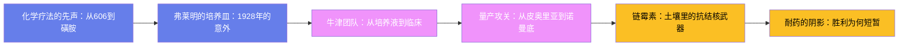

# 抗生素时代：从青霉素到耐药危机

## 一、化学疗法的先声：从606到磺胺

19 世纪末，科赫和巴斯德确立了疾病的细菌学说——1876 年炭疽、1882 年结核的病原体相继现形，但医生手里依然没有武器。第一个提出系统解决方案的是保罗·埃尔利希（Paul Ehrlich，1854-1915）。他设想存在一种**魔弹**：只杀病原体、不伤人体的化合物。经过数百次筛选，1909 年第 606 号砷剂在助手秦佐八郎的实验中被证实对梅毒螺旋体有效，1910 年以"洒尔佛散"（Salvarsan）之名上市——这是历史上第一种现代化学治疗药，埃尔利希也被称为化学疗法之父。

真正的突破来自染料工业。1932 年 12 月，拜耳公司病理研究所的格哈德·多马克（Gerhard Domagk，1895-1964）发现红色偶氮染料**百浪多息**（Prontosil）能治愈小鼠的致死性链球菌感染，1935 年发表临床结果——此前一年，多马克自己女儿因针刺感染引发链球菌败血症，据传正是百浪多息把她从截肢边缘救了回来；1936 年，美国总统罗斯福之子小富兰克林患链球菌性咽喉炎垂危，经磺胺类药物治疗痊愈的新闻登上全美头条，磺胺一夜成名。巴黎巴斯德研究所的特雷富埃尔团队很快证明：百浪多息的有效成分是其体内代谢产物对氨基苯磺酰胺——即磺胺，一种 1908 年就被合成、不受专利保护的廉价化合物。磺胺类药物随即井喷，磺胺吡啶对肺炎的疗效惊人，1943 年还救过丘吉尔的命。产褥热、脑膜炎、淋病的死亡率应声腰斩。1937 年美国还发生"磺胺酏剂事件"：一家药厂用二甘醇作溶剂配制儿童用磺胺口服液，导致百余人肾衰竭死亡——这场悲剧直接催生了 1938 年《联邦食品、药品和化妆品法案》，新药上市前必须证明安全性，现代药品监管由此奠基。1939 年多马克获诺贝尔奖，纳粹政府迫其拒领，直到 1947 年才补颁奖章。但磺胺对葡萄球菌等许多细菌效果有限，世界仍在等待一件真正的广谱武器——它已经静静地躺在伦敦一间实验室的培养皿里，等了七年。

## 二、弗莱明的培养皿：1928年的意外

亚历山大·弗莱明（Alexander Fleming，1881-1955）是苏格兰农民之子，靠奖学金进入伦敦圣玛丽医院医学院，毕业后留在细菌学家阿尔姆罗思·赖特的接种实验室。他有一种与众不同的天赋：对培养皿上的异常现象极度敏感。一战期间他在法国前线随军医院研究伤口感染，发现当时惯用的杀菌剂根本渗不进深部伤口、反而破坏白细胞——这段经历让他终身对"能杀菌"和"能治病"之间的鸿沟保持清醒。1922 年他感冒时把几滴自己的鼻涕滴进细菌培养皿，几天后鼻涕周围的细菌溶解了——他由此发现**溶菌酶**，一种存在于眼泪、唾液中的天然抗菌物质。可惜它对致病菌杀伤力太弱，临床价值有限。

1928 年 8 月，弗莱明去乡下度假前把一批葡萄球菌培养皿堆在实验台角落。9 月 3 日回来收拾时，他注意到一个平皿被青绿色霉菌污染，而霉菌菌落周围的葡萄球菌全部溶解，形成一圈透明带。他培养这种霉菌，证实其分泌物能杀灭葡萄球菌、链球菌、肺炎球菌、淋球菌，却对白细胞无毒。经鉴定这是青霉属真菌（当时定名特异青霉 Penicillium notatum，2011 年基因组测序重新鉴定为 P. rubens），他把分泌物命名为**青霉素**（penicillin）。1929 年 6 月他在《英国实验病理学杂志》发表论文，明确指出青霉素的抗菌潜力——然后，几乎没有然后了。粗提物极不稳定，他和助手无法纯化；30 年代初磺胺风头正劲，弗莱明兴趣渐淡，把菌种束之高阁。需要澄清的是后来流行的"弗莱明神话"：青霉素能走进病房，靠的是牛津团队十年磨一剑的药学攻关，而非一个培养皿的运气。那个著名的培养皿，静静等待牛津的一群人。

## 三、牛津团队：从培养液到临床

1935 年，澳大利亚人霍华德·弗洛里（Howard Florey，1898-1968）执掌牛津大学邓恩病理学院，网罗了一批难民科学家，其中包括 1933 年逃离纳粹德国的犹太生化学家恩斯特·钱恩（Ernst Chain，1906-1979）。1938 年，钱恩在文献堆里翻到弗莱明那篇被冷落九年的论文，提议系统研究微生物产生的抗菌物质；剑桥毕业的生化学家诺曼·希特利（Norman Heatley，1911-2004）负责定量测定与提取工艺，他设计的"杯碟法"把青霉素效力定义成可测量的"牛津单位"，不同批次的提取物第一次可以相互比较。1939 年，洛克菲勒基金会提供了关键资助。

1940 年 5 月 25 日，历史性的小鼠实验：8 只小鼠腹腔注射致死量链球菌，其中 4 只注射青霉素。次日清晨，治疗组 4 只全部存活，对照组全部死亡。弗洛里难掩激动："It looks like a miracle."1940 年 8 月 24 日论文登上《柳叶刀》，署名七位作者，钱恩排在首位。1941 年 2 月 12 日迎来首例全身用药的患者：牛津警察阿尔伯特·亚历山大，一次花园划伤引发葡萄球菌与链球菌混合败血症，面部脓肿严重到摘除了一只眼睛，命在旦夕。注射青霉素后他迅速好转——体温下降、脓肿消退，牛津团队第一次亲眼看到青霉素在人体内的威力；但实验室的全部产量很快耗尽——希特利带人回收患者尿液重新提取，仍供不应求——第五天断药，感染反扑，3 月 15 日亚历山大去世。此后几位患者（包括一名 15 岁的败血症少年）在剂量勉强够用的情况下获救，疗效无可置疑。为扩大产量，希特利跑遍牛津的陶瓷作坊，定制了一批形似便盆的浅底培养容器，让青霉在大面积浅液面上生长，实验室几乎变成霉菌农场。这位警察的死亡证明了药物有效，也暴露了真正的瓶颈：**产量**。治疗一个病人需要数千升培养液，战时英国的工业机器无暇他顾，出路在大西洋彼岸。

## 四、量产攻关：从皮奥里亚到诺曼底

1941 年夏，弗洛里与希特利带着菌种飞往美国——钱恩因"敌侨"身份无法同行，留在牛津继续改进纯化工艺。美国农业部把他们引荐到伊利诺伊州皮奥里亚的北方区域研究实验室（NRRL）。发酵工程师安德鲁·莫耶发现，用玉米湿磨工业的废料**玉米浆**作培养基，青霉素产量提高约十倍。1943 年，实验室助理玛丽·亨特从皮奥里亚市场买回一只发霉的哈密瓜，从中分离出产黄青霉（Penicillium chrysogenum，编号 NRRL-1951），产量远超弗莱明的原株——这位"发霉的玛丽"找来的菌株再经紫外线与 X 射线诱变育种，成为此后所有工业青霉素菌株的祖先。

1942 年 3 月 14 日，康涅狄格州的安妮·米勒因产后败血症濒死，用掉了当时美国青霉素库存的一半后痊愈，1999 年以 90 岁高龄去世——她的获救在美国舆论界引爆了青霉素热。美国政府随即把青霉素列为与橡胶同级的战时战略物资，默克、辉瑞、施贵宝等二十余家公司加入生产计划并共享菌株与工艺情报。辉瑞工程师把制柠檬酸用的**深罐发酵**技术移植过来，把表面培养换成数千加仑的搅拌发酵罐，1944 年初布鲁克林工厂的深罐车间投产，产量呈指数级增长。到 1944 年 6 月诺曼底登陆时，盟军已能为所有伤员提供充足的青霉素——这是史上第一次，军队因感染死亡的士兵少于因战伤死亡的士兵。值得一提的是，牛津团队始终没有为青霉素本身申请专利——弗洛里认为救命药不该牟利，战时合作也让工艺情报在盟国间开放共享；这与日后制药业的专利高墙形成耐人寻味的对照。1945 年 12 月，弗莱明、弗洛里与钱恩共享诺贝尔生理学或医学奖；居功至伟的希特利不在名单上。弗莱明在诺奖演说中留下一句被历史反复验证的警告：实验室里让细菌接触不足以杀死它们的青霉素浓度，就能培养出耐药株——**滥用青霉素，就是在亲自筛选耐药的细菌**。

## 五、链霉素：土壤里的抗结核武器

青霉素对革兰阳性菌所向披靡，却奈何不了结核分枝杆菌。下一个英雄来自土壤。塞尔曼·瓦克斯曼（Selman Waksman，1888-1973）是乌克兰犹太移民，罗格斯大学土壤微生物学家，他创造了"抗生素"（antibiotic）这个词，并坚信土壤微生物为争夺生存空间一定进化出了抗菌物质。1940 年起，他的实验室开始系统筛选放线菌。

研究生阿尔伯特·沙茨（Albert Schatz，1920-2005）在地下室实验室里连续数月筛样，1943 年秋从灰色链霉菌中分离出**链霉素**——论文于 1944 年发表，署名沙茨、布吉、瓦克斯曼。链霉素是第一种氨基糖苷类抗生素，对结核杆菌、鼠疫杆菌、兔热病等青霉素无效的革兰阴性菌有效——代价是耳毒性，剂量控制不当可致不可逆的听力损伤，氨基糖苷类的这一阴影伴随至今。瓦克斯曼实验室此后又陆续发现新霉素等多种抗生素，土壤微生物被证明是一座药物宝库。梅奥诊所的费尔德曼与欣肖迅速完成动物和人体试验。1946 年，英国医学研究理事会启动链霉素治疗肺结核的临床试验，由统计学家布拉德福德·希尔设计随机分配方案，1948 年发表的结果成为现代**随机对照试验**的里程碑之一。1952 年诺贝尔生理学或医学奖却只颁给了瓦克斯曼。沙茨提起诉讼，1950 年和解：他获得专利费的 3% 和"共同发现者"的法律承认。罗格斯用这笔专利费建起了瓦克斯曼微生物研究所。

黄金时代随之而来：氯霉素 1947 年、金霉素 1948 年、土霉素 1950 年、红霉素 1952 年、万古霉素 1958 年相继上市；抗结核战线 1952 年又添异烟肼，1965 年利福平问世，"四联"方案把结核病变成门诊可治的慢性病。黄金时代也早早暴露了代价：氯霉素 1950 年代被发现可致罕见的再生障碍性贫血，四环素会在儿童牙齿上留下永久性染色——抗生素从来不是没有代价的礼物。1957 年英国比彻姆公司分离出青霉素母核 6-APA，半合成青霉素（甲氧西林 1960、氨苄西林 1961）扩展了抗菌谱。到 1960 年代末，医学界一度乐观地宣布：传染病即将成为历史。

## 六、耐药的阴影：胜利为何短暂

细菌的反击几乎与抗生素同龄。1940 年钱恩与亚伯拉罕就报道过能分解青霉素的细菌酶；弗莱明 1945 年的警告余音未落，1960 年甲氧西林刚上市，1961 年英国学者杰文斯就报道了耐甲氧西林金黄色葡萄球菌——即今天大名鼎鼎的 **MRSA**。新药上市一年内出现耐药，成为此后六十年反复重演的剧本。耐药的武器库层出不穷：β-内酰胺酶水解药物、改变结合靶点、外排泵把药泵出细胞，而耐药基因可以搭质粒的便车在不同菌种间水平转移——1950 年代末日本学者发现志贺菌的多重耐药竟能传给肠道里的其他细菌，渡边力 1963 年提出"R 因子"概念，预示了全球性耐药传播的机制。

结核病是耐药演化最惨烈的战场：单用链霉素数月即可筛选出耐药株，由此确立的联合用药原则沿用至今——1946 年对氨基水杨酸加入、1952 年异烟肼问世后，"三药联用"才第一次让结核病成为可治愈的疾病；1990 年代耐多药结核（MDR-TB）蔓延，2006 年 WHO 与美国 CDC 定义了广泛耐药结核（XDR-TB）——此前南非图格拉渡口暴发的疫情中 53 名患者 52 人死亡。1988 年首个耐万古霉素肠球菌（VRE）出现，"最后防线"失守；2008 年携带 NDM-1 超级耐药基因的肠杆菌在印度被发现，2010 年报道后全球警报拉响。

与耐药进化形成反差的是研发管线的枯竭：1987 年之后，再无全新作用机制的抗生素类别获批上市。农业滥用同样在火上浇油——1950 年美国发现饲料中添加四环素能让畜禽长得更快，促生长用抗生素随即全球铺开；1969 年英国斯旺报告率先建议限制，欧盟直到 2006 年才全面禁用促生长添加剂。经济学逻辑冰冷——抗生素疗程短、会被刻意保留使用，大药企无利可图纷纷退出。2013 年美国疾控中心发布首份耐药威胁报告：仅美国每年就有两百多万人感染耐药菌、两万三千人因此死亡。2014 年英国政府委托的奥尼尔报告预测：若不行动，到 2050 年耐药感染每年将夺走 1000 万条生命；2022 年《柳叶刀》发表的系统研究估计，2019 年全球约 495 万例死亡与细菌耐药相关，其中 127 万例直接归因于耐药。对策正在多线展开：抗生素管理计划要求每一张抗生素处方都有明确指征和疗程，限制农业促生长使用，用快速诊断在门诊区分细菌与病毒感染，噬菌体疗法在耐药绝境中重新受到重视，"市场入场奖励"等新型商业模式则试图重启研发管线。2015 年科学家用 iChip 技术从过去无法培养的土壤细菌中发现 teixobactin，证明土壤这座宝库远未挖尽。

抗生素把人类的平均预期寿命拉长了十年以上，把肺炎、产褥热、结核从死刑判决变成门诊处方。但这场军备竞赛没有终局——我们每开出一粒药，都在为细菌出一道演化考题，而细菌从不交白卷。弗莱明培养皿上那圈透明带，既是医学史上最伟大的发现之一，也是一个至今有效的提醒：胜利永远是暂时的，谨慎才是常态——这是抗生素时代留给每一代医生的遗产。

