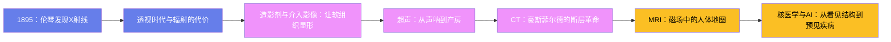

# 医学影像史：从X光到AI的透视革命

## 一、1895：伦琴发现X射线

1895 年 11 月 8 日深夜，德国维尔茨堡大学物理教授威廉·康拉德·伦琴（Wilhelm Conrad Röntgen，1845-1923）在实验室研究阴极射线。他把放电管用黑纸严密包裹，房间一片漆黑——接通电源的瞬间，几米外一块涂有铂氰酸钡的荧光屏发出了微弱的绿光。阴极射线在空气中只能传播几厘米，这束能穿透黑纸的东西前所未见。伦琴把它命名为 **X 射线**，X 代表未知——直到 1912 年劳厄用晶体衍射实验证明它是一种波长极短的电磁波，"未知"才有了物理身份。

接下来七周他几乎住在实验室：X 射线穿透书本、木板和橡胶，却被骨骼与铅挡住。12 月 22 日，他请妻子贝莎把手放在感光板上，拍下人类第一张 X 光照片——手骨轮廓分明，无名指上的戒指清晰可辨。贝莎看后惊骇地说："我看到了自己的死亡。"12 月 28 日伦琴提交论文《论一种新的射线》，1896 年元旦把预印本寄给欧洲同行；1 月 5 日维也纳《新闻报》率先报道，消息随即席卷全球报纸。1 月 23 日他在维尔茨堡物理医学会演讲，当场为解剖学家克利克尔拍下一张手片，全场起立欢呼，克利克尔提议将其命名为"伦琴射线"。消息像野火蔓延，数月内全球数百个实验室架起放电管。1896 年 2 月 3 日，美国达特茅斯学院的物理学教授吉尔曼·弗罗斯特为一名摔伤手腕的男孩拍下北美最早的临床 X 光片；同年内，维也纳医生用 X 射线定位患者手部的子弹，X 光正式进入外科常规。1901 年，伦琴获得首届诺贝尔物理学奖，他拒绝申请专利，把奖金全部捐给了维尔茨堡大学，晚年在战后的通货膨胀中清贫困顿，1923 年因肠癌去世——是否与毕生接触辐射有关，后人无从证实，他生前立遗嘱拒绝了解剖。

## 二、透视时代与辐射的代价

人们最初只看见奇迹，看不见代价。爱迪生 1896 年发明荧光透视器（fluoroscope），用钨酸钙屏把 X 光图像实时显示，医生第一次能"看着"心脏跳动、观察钡剂流过肠道。他的助手克拉伦斯·达利双手反复暴露在射线中调试设备，先是皮炎脱发，继而皮肤癌变，双手相继截肢，1904 年死于转移癌——爱迪生从此放弃 X 光研究，余生说"别跟我提 X 光，我怕它们"。早期的"剂量"靠皮肤烤出红斑来度量，许多先驱者付出手指、手臂乃至生命。一战期间，玛丽·居里把 X 光机装上卡车开赴前线——这些被称为"小居里车"的移动放射站在战壕边为伤员定位弹片，她还亲自培训了约 150 名女性操作员，X 光第一次大规模证明了自己在战场上的价值。

辐射的迷信与狂热同步上演：1920 年代含镭饮料、镭化妆品畅行市场；新泽西州的镭表盘女工们用嘴唇抿细含镭夜光涂料的笔尖，多年后接连出现下颌骨坏死与癌症——"镭女孩"1927 年的诉讼与 1928 年的和解，直接催生了职业辐射防护制度。治疗的另一面也在同一时期展开：1896 年 1 月，芝加哥的医学生埃米尔·格鲁布就尝试用 X 射线照射乳腺癌患者，放射治疗在发现射线后几个月内便仓促起步，此后与镭疗并行走完了整个二十世纪。1928 年第二届国际放射学大会确立"伦琴"作为辐射剂量单位，并成立国际放射防护委员会的前身；此后度量体系一路细化，1953 年引入"拉德"度量组织吸收剂量，1970 年代又统一为国际单位制的戈瑞与希沃特。甚至到 1950 年代，欧美鞋店里还摆着儿童试鞋荧光镜，孩子把脚伸进木箱就能看见趾骨在鞋里晃动——这种"玩具"到 1950 年代末才被逐州取缔，成为辐射防护意识成熟的注脚。

## 三、造影剂与介入影像：让软组织显形

X 光天生擅长骨骼，却分不清密度相近的软组织，解决办法是给血管和腔道"上色"。1910 年德国医生巴赫姆与京特用不溶于水、穿不透 X 射线的硫酸钡作胃肠造影，安全沿用至今；1929 年摩西·斯维克在德国合成有机碘剂 Uroselectan，静脉注射后由肾排泄，尿路与血管首次清晰显影。1927 年，葡萄牙神经科医生埃加斯·莫尼斯（1874-1955）用碘化钠完成首例脑血管造影——讽刺的是，他 1949 年获诺贝尔奖凭的却是另一项后来臭名昭著的发明：额叶白质切除术。

最富传奇色彩的是心导管。1929 年，25 岁的德国住院医生维尔纳·福斯曼（Werner Forssmann，1904-1979）申请人体试验被拒，便骗过值班护士把自己锁进操作间，从自己的肘静脉把一根导尿管推进了 65 厘米——直到 X 光片证实导管尖端已抵达右心房，这是史上第一次有人亲眼看到导管进入活人心脏。他因此丢了工作、被迫转行泌尿外科，而这项技术在他身后开花结果：1956 年福斯曼与库尔南、理查兹共享诺贝尔生理学或医学奖。1964 年，美国放射学家查尔斯·多特在造影导管的基础上完成首例经皮血管成形术，他自称"血管管道工"——**介入放射学**就此诞生，导管不再只是照相机，而成了治病的工具。介入技术的另一块基石是 1953 年瑞典放射学家斯文·塞尔丁格发明的经皮穿刺导丝置换技术：一根针、一根导丝、一根导管的"塞尔丁格技术"把血管通路变成标准化操作，至今仍是导管室的通用语言；1960 年代贾德金斯把冠状动脉造影做成常规，心脏从影像的禁区变成介入的主战场——1986 年首枚冠状动脉支架在欧洲植入，"看血管"与"通血管"从此在同一间导管室里完成。专用影像也在细化：1950 年代初乌拉圭放射学家劳尔·勒博尔涅发明压迫板加软射线拍乳腺的技术路线，乳腺钼靶摄影由此起步，日后成为乳腺癌筛查的基石。

## 四、超声：从声呐到产房

X 光有电离辐射且对软组织乏力，另一条路用声波。物理基础早已备好：1842 年多普勒描述频移效应，1912 年泰坦尼克号沉没刺激水下探测研究，1917 年朗之万利用压电效应造出声呐原型。1941 年奥地利神经科医生卡尔·杜西克尝试用透射超声观察脑室，效果不佳却开风气之先；1949 年美国的约翰·怀尔德用 A 型脉冲回波测量肠壁厚度，1951 年用于乳腺肿瘤检测；道格拉斯·豪里则造出需要患者坐在水槽里的 B 型复合扫描仪，第一次拼出体内的二维声像图。

两个临床科室把超声推向主流。1953 年 10 月，瑞典隆德的心脏病学家英厄·埃德勒与物理学家赫尔穆特·赫茨借来一台海军探伤仪，在二尖瓣狭窄患者胸前记录到瓣叶运动曲线——**M 型超声心动图**诞生，心脏第一次可以被无创地实时观察。1956 年起，苏格兰格拉斯哥的产科医生伊恩·唐纳德把工业探伤仪改造用于腹部肿块鉴别，1958 年 6 月在《柳叶刀》发表论文确立产科超声——孕妇第一次能在分娩前"看见"自己的胎儿，产科从此告别了"摸肚子猜胎位"的时代。1970 年代灰阶成像与实时扫描成熟——西门子的 Vidoson 早在 1965 年就实现了每秒十几帧的实时灰阶显示，澳大利亚科索夫团队的水浴机则把灰阶图像质量推到新高度；1980 年代日本厂商推出彩色多普勒血流图。无辐射、实时、廉价、可床旁反复使用，超声成为影像家族中最贴近临床的一员——从产房床头到急诊床边，甚至被宇航员带上太空；1990 年代三维超声让胎儿的面部第一次立体呈现，床旁超声（POCUS）今天已被称作"新时代的听诊器"。

## 五、CT：豪斯菲尔德的断层革命

普通 X 光片把三维人体压成二维，前后组织互相遮挡。1963 年，南非裔美国物理学家艾伦·科马克（1924-1998）发表从多角度投影重建截面密度的数学理论，论文几乎无人引用。真正把理论变成机器的是英国电气与音乐工业公司（EMI）的工程师戈弗雷·豪斯菲尔德（Godfrey Hounsfield，1919-2004）——EMI 靠披头士唱片的丰厚利润给了他罕见的研发自由。1967 年起他搭建原型机：第一个受试标本是一颗福尔马林浸泡的人脑，扫描花了九天，计算机重建又耗去两个半小时。

1971 年 10 月 1 日，第一台临床 CT 在伦敦阿特金森·莫利医院扫描了一位疑似脑瘤的女性患者，图像清晰显示额叶肿瘤，主诊医生感叹"如同看见上帝的启示"。早期机器只能扫头部，每层需数分钟，患者稍有移动图像就报废；1972 年 4 月成果在英国放射学会公布，举世轰动；次年梅奥诊所引进北美第一台 CT，订单让 EMI 应接不暇。在此之前，看脑内病变要做气脑造影——把空气打进脑室，患者痛苦不堪；CT 把这一切变成几分钟的无创检查。1974 年罗伯特·莱德利造出首台全身 CT 机 ACTA；1989 年滑环技术带来螺旋 CT；探测器从单排发展到 4 排、64 排、320 排，一次全胸扫描进入亚秒时代，心脏冠脉成像成为常规。技术仍在迭代：2006 年双源 CT 用两套球管探测器解决心率问题，2021 年首台商用光子计数 CT 获批，用半导体探测器直接数光子，分辨率再上一个台阶。CT 值干脆以他的名字命名为"亨氏单位"（HU）：水是 0，空气是 -1000，骨骼可达上千——每一张 CT 图像都在向他致敬。代价同样清晰：一次腹部 CT 的辐射当量约等于数百张胸片，医源性辐射随之成为公共卫生议题。1979 年豪斯菲尔德与科马克共享诺贝尔生理学或医学奖——这是该奖第一次颁给没有医学学位的人。

## 六、MRI：磁场中的人体地图

CT 解决了断层，MRI 则彻底甩开电离辐射。1946 年，布洛赫与珀塞尔各自独立发现核磁共振现象（1952 年诺贝尔物理学奖），此后三十年它只是化学家分析分子结构的工具。1971 年 3 月，美国医生雷蒙德·达马迪安在《科学》杂志报告：肿瘤组织的弛豫时间显著长于正常组织——他由此主张用核磁共振"看"癌症。1973 年，纽约州立大学石溪分校化学家保罗·劳特伯（1929-2007）想出关键一步：在主磁场上叠加梯度磁场，让不同空间位置的原子核发出不同频率的信号，空间信息第一次被编码进核磁信号——那篇划时代的论文起初险些被《自然》退稿，他据理力争才得以发表，第一张图像是两支装水的毛细管。诺丁汉大学的彼得·曼斯菲尔德（1933-2017）完善了成像数学，并发明回波平面成像，把扫描时间压到秒级。

1977 年 7 月 3 日，达马迪安团队用自造机器"不屈号"（Indomitable）获得第一幅人体胸部断层图像，耗时近五小时、仅 106 个像素——模糊得近乎抽象，却足以证明这条路走得通。1980 年代初超导磁体商用机进入医院，场强从 0.15 特斯拉起步，如今 1.5T 与 3T 是临床主流；MRI 软组织对比度碾压 CT，迅速成为神经、脊髓与关节成像的金标准，强磁场也带来独特的安全纪律——任何铁磁物品靠近磁体都会变成炮弹。1990 年小川诚二提出 BOLD 效应原理，1992 年功能磁共振（fMRI）问世，人类第一次能无创地观看"正在思考的大脑"。达马迪安本人的遭遇则是另一面镜子：他 1972 年就申请了 NMR 癌症检测专利，1980 年创立 Fonar 公司造出首台商用 MRI，却始终被主流物理学界排斥。2003 年诺贝尔生理学或医学奖授予劳特伯与曼斯菲尔德；达马迪安落选后自费在《纽约时报》刊登整版广告抗议，成为诺贝尔奖史上著名的公案。

## 七、核医学与AI：从看见结构到预见疾病

影像的另一条支线不看解剖、看功能。1941 年索尔·赫茨在麻省总医院首次用放射性碘治疗甲亢，1946 年治疗甲状腺癌转移，"魔弹"在核医学成真；1957 年布鲁克海文实验室的鲍威尔·理查兹发明钼-锝发生器——技师们昵称它为"挤母牛"，每周从钼-99"母牛"身上淋洗出半衰期 6 小时的锝-99m，这种理想的示踪核素至今承担全球八成以上的核医学检查；1958 年哈尔·安格发明伽马相机，一次成像取代逐点扫描；同一时期大卫·库尔造出早期断层扫描装置，演化出后来的 SPECT（单光子发射计算机断层扫描），让核医学也进入断层时代。1970 年代中期，华盛顿大学的特尔-波戈相与菲尔普斯团队造出首台 PET；1976 年阿巴斯·阿拉维首次将氟代脱氧葡萄糖（FDG）用于人体——癌细胞嗜糖，在 PET 图像上燃成一个个热点。1998 年戴维·汤森与罗纳德·纳特造出 PET-CT 原型机，功能与解剖图像精确融合，成为肿瘤分期的标准工具。影像的载体也在同时换代：1980 年代起 PACS 系统把胶片送进历史，影像科变成全院最早全面数字化的科室。

2010 年代，深度学习走进影像科：2018 年 FDA 批准首个无需医生复核的自主 AI 诊断系统 IDx-DR 用于糖尿病视网膜病变筛查，此后肺结节检测、乳腺钼靶辅助诊断等 AI 相继获批。从伦琴的荧光屏到算法读片，一百三十年间医学影像完成了三次跳跃：从体表到体内、从解剖到功能、从"看见"到"预见"。伦琴夫人的那枚戒指仍在提醒我们：每一次让光线变亮的技术，也都要求人类学会敬畏它的力量。影像科的下一个百年，考题不再只是看得更清，而是看得更早、更准、更便宜——让更多地方的人都能被更早地看见。

