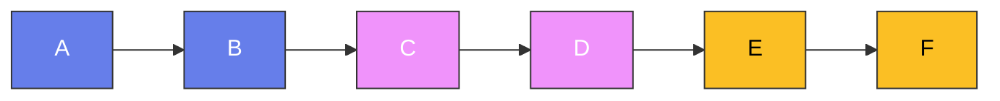

# 春秋战国五百年 · 女性篇

## 一、春秋战国时期的女性地位

### 1. 男尊女卑的社会

春秋战国时期，是一个男尊女卑的社会。女性在社会中的地位很低，她们的命运往往由男性来决定。

**"三从四德"**。虽然"三从四德"的概念是在后来才正式提出的，但春秋战国时期已经有了类似的思想。女性被要求"未嫁从父，既嫁从夫，夫死从子"——一生都要服从男性。

**婚姻的不自主**。春秋战国时期的女性，婚姻不能自主。她们的婚姻由父母决定，自己没有选择的权利。

### 2. 女性的活动空间

尽管社会对女性有很多限制，但春秋战国时期的女性，仍然有一定的活动空间。

**贵族女性**。贵族女性可以接受教育，学习礼仪、音乐、舞蹈等。她们还可以参与一些社交活动，如宴会、祭祀等。

**平民女性**。平民女性需要参加劳动，如纺织、耕种等。她们的活动空间比贵族女性更大，但社会地位更低。

---

## 二、春秋战国时期的著名女性

### 1. 妲己

妲己是商朝末代君主纣王的宠妃。她被认为是导致商朝灭亡的"红颜祸水"。

**妲己的形象**。在传统的历史叙述中，妲己被描述为一个妖艳、残忍的女人。她迷惑纣王，让他做出很多荒唐的事情，最终导致了商朝的灭亡。

**历史的真相**。但现代历史学家认为，妲己的形象可能被后人夸大了。商朝的灭亡，主要是因为纣王的暴政，而不是因为妲己。

### 2. 妺喜

妺喜是夏朝末代君主桀的宠妃。她与妲己一样，被认为是导致夏朝灭亡的"红颜祸水"。

**妺喜的形象**。在传统的历史叙述中，妺喜被描述为一个奢侈、任性的女人。她让桀为她建造豪华的宫殿，最终导致了夏朝的灭亡。

### 3. 褒姒

褒姒是西周末代君主幽王的宠妃。她被认为是导致西周灭亡的"红颜祸水"。

**"烽火戏诸侯"**。传说周幽王为了博褒姒一笑，点燃了烽火台。诸侯们以为有外敌入侵，率军来救，结果发现是假的。后来犬戎真的来进攻时，诸侯们不再相信烽火，没有人来救援。

### 4. 文姜

文姜是鲁桓公的夫人，齐僖公的女儿。她与她的哥哥齐襄公有不伦之恋。

**文姜的故事**。文姜嫁给鲁桓公后，仍然与齐襄公保持不正当关系。鲁桓公发现后，齐襄公派人杀死了鲁桓公。文姜因此被后人唾弃。

### 5. 夏姬

夏姬是春秋时期郑国的公主，以美貌著称。她的一生充满了传奇色彩。

**夏姬的美貌**。夏姬被认为是春秋时期最美丽的女人。她的美貌迷倒了很多人，包括陈国的君臣和楚国的贵族。

**夏姬的命运**。夏姬的命运非常坎坷。她先后嫁给了多个男人，经历了多次战乱和变故。但她始终保持着优雅和从容。

---

## 三、太后与政治

### 1. 宣太后

宣太后是秦国的太后，秦昭襄王的母亲。她是中国历史上第一位被称为"太后"的女性。

**宣太后的执政**。秦昭襄王即位时年幼，宣太后临朝听政。她执政期间，秦国的国力不断增强，为后来的统一奠定了基础。

**宣太后的私生活**。宣太后的私生活非常丰富。她与义渠王有私情，还为义渠王生了两个儿子。后来，她设计杀死了义渠王，消除了秦国的一个威胁。

### 2. 赵太后

赵太后是赵国的太后，赵孝成王的母亲。她在赵国的政治中发挥了重要作用。

**触龙说赵太后**。《战国策》记载了一个著名的故事：触龙劝说赵太后，让她同意让小儿子长安君去齐国做人质。触龙用"父母之爱子，则为之计深远"的道理，说服了赵太后。

### 3. 吕后

吕后是汉高祖刘邦的夫人。她在刘邦死后，掌握了汉朝的大权。

**吕后的执政**。吕后执政期间，推行了一系列政策，维持了汉朝的稳定。但她也大肆杀戮刘邦的子孙，引起了后人的批评。

---

## 四、女性与战争

### 1. 女性在战争中的角色

春秋战国时期的战争，主要是男性参加的。但女性在战争中也扮演了一定的角色。

**后勤保障**。女性在战争中主要负责后勤保障，如缝制衣物、准备食物等。

**鼓舞士气**。一些女性还会在战场上鼓舞士气，如唱歌、跳舞等。

### 2. 女性与城防

在一些情况下，女性也会参与城防。

**守城**。当城池被围困时，城中的女性也会参与守城。她们会帮助搬运石头、滚木等，协助守城。

### 3. 女性与间谍

春秋战国时期，一些女性被用作间谍。

**美人计**。一些国家会派遣美女到敌国，用美色迷惑敌国的君臣，获取情报或制造混乱。

---

## 五、女性与文化

### 1. 女性与音乐

春秋战国时期的女性，在音乐方面有很高的造诣。

**民间音乐**。很多民间音乐是由女性创作和演唱的。《诗经》中收录了很多女性创作的诗歌。

**宫廷音乐**。宫廷中的女性，也参与音乐的创作和表演。

### 2. 女性与舞蹈

春秋战国时期的女性，在舞蹈方面有很高的造诣。

**宫廷舞蹈**。宫廷中的女性，经常为君主表演舞蹈。舞蹈的形式多种多样，有祭祀舞蹈、庆祝舞蹈、娱乐舞蹈等。

### 3. 女性与纺织

春秋战国时期的女性，在纺织方面有很高的造诣。

**丝织品**。女性是丝织品的主要生产者。她们织造的丝绸，不仅供自己使用，还用于贸易。

---

## 六、女性与婚姻

### 1. 婚姻的形式

春秋战国时期的婚姻，主要有以下几种形式：

**聘娶婚**。聘娶婚是最常见的婚姻形式。男方需要向女方家庭下聘礼，才能娶到女方。

**政治联姻**。春秋战国时期，各国之间经常进行政治联姻。公主嫁给其他国家的君主或贵族，以巩固两国的关系。

**抢婚**。在一些情况下，男方会用武力抢走女方。这种婚姻形式在边疆地区比较常见。

### 2. 婚姻的礼仪

春秋战国时期的婚姻，有一套完整的礼仪。

**六礼**。婚姻的礼仪包括六步：纳采、问名、纳吉、纳征、请期、亲迎。这六步缺一不可。

### 3. 婚姻的不幸

春秋战国时期的女性，在婚姻中往往处于弱势地位。

**被遗弃**。丈夫可以随意遗弃妻子，而妻子却不能主动离开丈夫。

**被虐待**。一些女性在婚姻中遭受虐待，但她们无法反抗。

---

## 七、女性与法律

### 1. 女性的法律地位

春秋战国时期的女性，在法律上处于弱势地位。

**没有财产权**。女性没有独立的财产权。她们的财产由父亲或丈夫管理。

**没有人身自由**。女性没有人身自由。她们的行动受到父亲或丈夫的限制。

### 2. 女性的法律保护

尽管女性在法律上处于弱势地位，但春秋战国时期的一些法律，也对女性提供了一定的保护。

**禁止虐待妻子**。一些诸侯国的法律，禁止丈夫虐待妻子。如果丈夫虐待妻子，妻子可以提出离婚。

**保护寡妇**。一些诸侯国的法律，保护寡妇的权益。寡妇可以继承丈夫的财产，也可以再嫁。

---

## 八、女性与宗教

### 1. 女性与巫术

春秋战国时期的女性，在宗教活动中扮演了重要的角色。

**女巫**。一些女性是巫师，负责沟通人与神灵。她们在社会中有一定的地位。

### 2. 女性与祭祀

春秋战国时期的女性，也参与祭祀活动。

**祭祀祖先**。女性参与祭祀祖先的活动，祈求祖先的保佑。

**祭祀神灵**。女性也参与祭祀神灵的活动，祈求风调雨顺、国泰民安。

---

## 九、女性的历史贡献

### 1. 经济贡献

春秋战国时期的女性，在经济方面做出了重要的贡献。

**纺织**。女性是丝织品的主要生产者。她们织造的丝绸，不仅供自己使用，还用于贸易。

**农业**。平民女性也参与农业生产，帮助耕种土地、收割庄稼。

### 2. 文化贡献

春秋战国时期的女性，在文化方面做出了重要的贡献。

**音乐和舞蹈**。女性在音乐和舞蹈方面有很高的造诣。她们创作和表演的音乐和舞蹈，丰富了当时的文化生活。

**文学**。《诗经》中收录了很多女性创作的诗歌。这些诗歌反映了当时女性的生活和情感。

### 3. 政治贡献

春秋战国时期的女性，在政治方面也做出了一定的贡献。

**太后执政**。一些太后在君主年幼时临朝听政，维持了国家的稳定。

**政治联姻**。女性通过政治联姻，促进了各国之间的和平与交流。

---

## 十、结语

春秋战国时期的女性，生活在男尊女卑的社会中。她们的社会地位很低，命运往往由男性来决定。但她们仍然在经济、文化、政治等方面做出了重要的贡献。

这个时期的故事告诉我们：女性是社会的重要组成部分，她们的贡献不应该被忽视。这些教训，至今仍然具有重要的现实意义。

