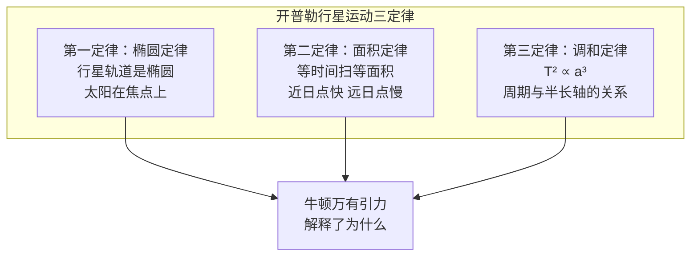

# 开普勒与行星运动定律

## 一、一个不屈的灵魂

**约翰内斯·开普勒**（Johannes Kepler，1571-1630 年）的一生充满了苦难——他幼年丧父、母亲被指控为女巫、妻子和多个孩子先他而去、他本人饱受疾病折磨。但他用数学的确定性对抗命运的无常——他发现了行星运动的三条定律，为牛顿的万有引力理论奠定了基础。

开普勒出生于德国符腾堡的一个贫困家庭——他的父亲是一名雇佣兵，母亲是旅店老板的女儿。开普勒的天赋很早就被发现——他获得了图宾根大学的奖学金，在那里接受了严格的数学和天文学训练。

## 二、神秘的宇宙几何

开普勒是一个虔诚的路德宗信徒——他相信上帝用数学创造了宇宙。在他的第一本著作**《宇宙的奥秘》**（Mysterium Cosmographicum，1596 年）中，开普勒试图用**五种正多面体**解释行星轨道的间距——他相信行星的排列遵循着神圣的几何规律。

这个理论是错误的——但它展示了开普勒的思维方式：他相信宇宙有内在的数学秩序，而天文学家的任务就是发现这个秩序。这种信仰支撑了他一生的研究。

## 三、第谷的数据

1600 年，开普勒来到布拉格，成为**第谷·布拉赫**（Tycho Brahe）的助手。第谷是当时最伟大的观测天文学家——他的肉眼观测精度达到了 1 角分，这在望远镜发明之前是不可思议的。

第谷在 1601 年突然去世——他的观测数据传给了开普勒。这些数据是天文学史上最宝贵的遗产之一——开普勒用它们发现了行星运动定律。

## 四、火星的八字形

开普勒首先研究的是**火星**的轨道。他花了数年时间试图用圆形轨道拟合第谷的数据——但始终有 8 角分的误差。8 角分是一个很小的角度——大约是满月直径的 1/4。大多数天文学家会忽略这个误差——但开普勒不会。

开普勒后来写道："正是这 8 角分为天文学的改革指明了道路。"他放弃了圆形轨道，尝试了各种曲线——最终发现火星的轨道是一个**椭圆**。

## 五、行星运动三定律

开普勒在 1609 年发表了**《新天文学》**（Astronomia Nova），其中包含了行星运动的前两条定律：

**第一定律（椭圆定律）**：行星绕太阳运行的轨道是椭圆，太阳位于椭圆的一个焦点上。

**第二定律（面积定律）**：行星与太阳的连线在相等时间内扫过相等的面积。这意味着行星在近日点运动较快，在远日点运动较慢。

1619 年，开普勒在**《世界的和谐》**（Harmonices Mundi）中发表了第三条定律：

**第三定律（调和定律）**：行星公转周期的平方与轨道半长轴的立方成正比。用公式表示：T² ∝ a³。

这三条定律是天文学史上最优美的发现之一——它们用简洁的数学关系描述了行星运动的规律。

## 六、开普勒的遗产

开普勒的贡献不仅是三条定律——他展示了如何用**数学模型**描述自然规律。他没有解释行星为什么会这样运动——这个解释要等到牛顿的万有引力理论。

开普勒的一生也展示了科学探索的代价——他牺牲了个人幸福，承受了贫困和疾病，只为追求宇宙的真理。他的座右铭是："我只测量上帝的创造。"
