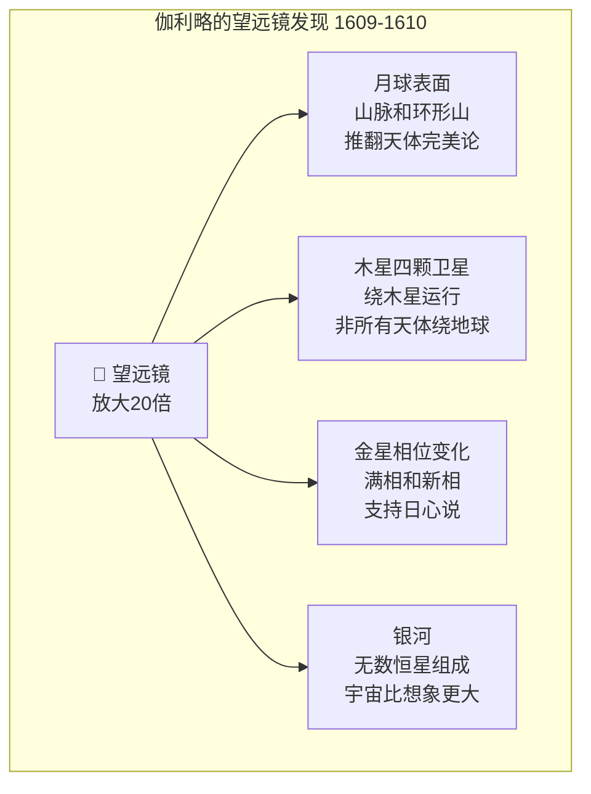

# 伽利略与望远镜

## 一、一根改变世界的管子

1608 年，荷兰眼镜商人**汉斯·利伯希**（Hans Lippershey）发明了望远镜——一根装有两块透镜的管子，可以让远处的物体看起来更近。这个发明最初被视为玩具——但一位意大利天文学家将它指向了天空，从此改变了人类对宇宙的理解。

**伽利略·伽利雷**（Galileo Galilei，1564-1642 年）在 1609 年听说了利伯希的发明——他立即理解了它的科学价值。伽利略没有见过利伯希的望远镜——他根据描述自己制造了一架。他的第一架望远镜放大倍率只有 3 倍——但他很快改进到了 20 倍。

## 二、星空的新面目

1609 年末至 1610 年初，伽利略将他的望远镜指向了天空——他看到的一切都颠覆了传统的宇宙观：

**月球表面**不是光滑的球体，而是布满了山脉和环形山。这与亚里士多德的"天体完美"理论矛盾。

**木星有四颗卫星**——它们绕着木星运行，而不是绕着地球。这证明了不是所有天体都绕地球运行。

**金星有完整的相位变化**——像月亮一样有满相和新相。这只有在金星绕太阳运行时才可能发生——这是支持日心说的直接证据。

**银河**不是一条模糊的光带——而是由无数颗恒星组成的。这暗示着宇宙比任何人想象的都要大。

## 三、星际信使

1610 年 3 月，伽利略出版了**《星际信使》**（Sidereus Nuncius）——一本简短但震撼的小书，报告了他的望远镜观测结果。这本书在欧洲引起了轰动——伽利略一夜之间成为了最著名的科学家。

伽利略将木星的四颗卫星命名为"美第奇星"——以向托斯卡纳大公科西莫二世·德·美第奇致敬。这个命名策略既展示了伽利略的政治智慧，也为他赢得了宫廷数学家的职位。

## 四、与教会的冲突

伽利略的望远镜观测为日心说提供了有力证据——但他公开支持日心说的行为引起了天主教会的警觉。1616 年，红衣主教贝拉明警告伽利略：不得"持有、教授或捍卫"哥白尼的学说。

1632 年，伽利略出版了**《关于两大世界体系的对话》**（Dialogo sopra i due massimi sistemi del mondo）——这本书表面上是中立地比较地心说和日心说，但实际上明显偏向日心说。教皇乌尔班八世感到被背叛——他曾经是伽利略的朋友和赞助人。

1633 年，伽利略被宗教裁判所审判——被指控为"强烈怀疑异端"。在严刑威胁下，伽利略被迫公开宣布放弃日心说。传说他在宣布放弃后低声说了一句："Eppur si muove"（然而它仍在运动）——但这个故事可能是后人编造的。

## 五、望远镜革命

伽利略的望远镜开启了天文学的新时代——**望远镜天文学**。此后四百年，天文学的发展在很大程度上取决于望远镜的改进：更大的镜片、更精密的机械、更灵敏的探测器。

伽利略的贡献不仅是天文学的——他的**实验方法**（通过观测和实验检验理论）奠定了现代科学的基础。爱因斯坦称伽利略为"现代科学之父"——因为伽利略第一个将实验和数学结合起来，建立了科学的方法论。

## 六、真理与权威

伽利略的故事是科学史上最著名的冲突之一——它展示了**真理与权威**的张力。伽利略的观测是正确的——地球确实在绕太阳运行。但权威拒绝接受真理——教会坚持地心说长达两百多年。

伽利略的故事也提醒我们：科学的进展不是一帆风顺的——它需要勇气、耐心和坚持。真理最终会胜利——但胜利的过程可能是漫长的。
