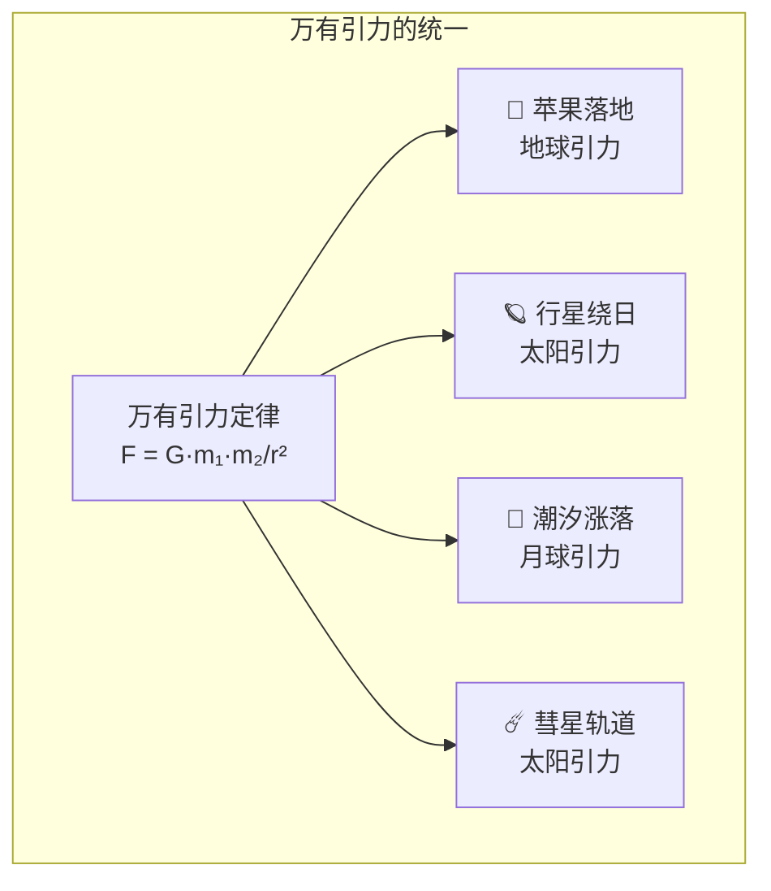

# 牛顿与万有引力

## 一、一个苹果的故事

关于牛顿发现万有引力的故事，最著名的是苹果的传说——牛顿坐在苹果树下，看到苹果落地，突然想到了引力。这个故事出自**威廉·斯蒂克利**（William Stukeley）的回忆录——他声称牛顿在 1726 年亲口告诉了他这个故事。

故事的真实性难以考证——但苹果的意象捕捉到了牛顿发现的核心：**使苹果落地的力和使月球绕地球运行的力是同一种力**。这个看似简单的洞察，是人类思想史上最伟大的飞跃之一。

## 二、天纵之才

**艾萨克·牛顿**（Isaac Newton，1642-1727 年）出生于英格兰林肯郡的一个农民家庭——他是一个早产儿，出生时据说可以装进一夸脱的杯子。牛顿在剑桥大学三一学院度过了大部分学术生涯——1669 年，年仅 26 岁的他就成为了卢卡斯数学教授。

牛顿的创造力在 1665-1666 年集中爆发——当时剑桥大学因为瘟疫而关闭，牛顿回到家乡伍尔索普庄园。在这"奇迹年"中，牛顿发展了微积分、发现了白光的组成、开始思考引力理论。

## 三、万有引力定律

牛顿的**万有引力定律**断言：任何两个物体之间都存在引力，引力的大小与两个物体的质量的乘积成正比，与它们之间距离的平方成反比。用公式表示：F = G · m₁ · m₂ / r²。

这个定律的革命性在于它的**普遍性**——它不仅解释了苹果为什么落地，还解释了行星为什么绕太阳运行、潮汐为什么涨落、彗星为什么有椭圆轨道。一个简单的数学公式统一了天上的运动和地上的运动——这是科学史上最伟大的统一。

## 四、《自然哲学的数学原理》

1687 年，牛顿出版了**《自然哲学的数学原理》**（Philosophiæ Naturalis Principia Mathematica）——这被广泛认为是科学史上最伟大的著作。《原理》用数学方法推导出了三大运动定律和万有引力定律，并将它们应用于行星运动、潮汐、彗星等问题。

《原理》的出版过程颇为戏剧性——牛顿不愿意发表他的发现，是**埃德蒙·哈雷**（Edmund Halley）说服了他。哈雷甚至资助了出版费用——因为皇家学会当时资金不足。

## 五、牛顿的预言

万有引力理论最惊人的成就是**哈雷彗星**的预言。哈雷在 1705 年用牛顿的理论计算了 1682 年出现的彗星的轨道——他发现这颗彗星的轨道与 1531 年和 1607 年出现的彗星轨道相同。哈雷预言这颗彗星将在 1758 年回归——他没有活到那一天，但彗星确实按时出现了。

这个预言是万有引力理论最有力的验证——它证明了牛顿的理论不仅能解释已知现象，还能预测未知现象。

## 六、牛顿的局限

牛顿的万有引力理论有一个哲学困难：引力是如何"穿过"空间作用的？牛顿自己也对此感到困惑——他承认"不假装知道引力的原因"。这个困难直到爱因斯坦的广义相对论才得到解决——引力不是一种力，而是时空弯曲的表现。

牛顿还犯了一个著名的错误——他晚年将大量时间投入了炼金术和神学研究。这些研究在当时被视为浪费天才——但近年来历史学家发现，牛顿的炼金术研究可能对他的科学思维产生了微妙的影响。

## 七、站在巨人的肩膀上

牛顿有一句名言："如果我看得更远，那是因为我站在巨人的肩膀上。"这句话常被引用来说明科学的累积性——但历史学家指出，牛顿说这句话时可能带有讽刺意味（他的对手胡克身材矮小）。

无论这句话的原意如何，它道出了一个真理：科学的进步是集体的成就。牛顿的万有引力理论建立在哥白尼、开普勒和伽利略的工作基础上——没有前人的观测和思考，牛顿不可能完成他的理论。
