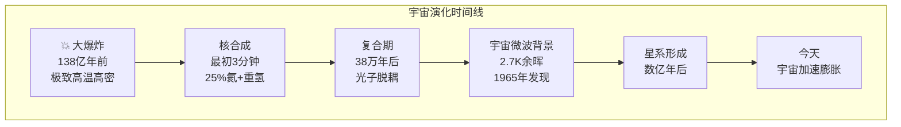

# 宇宙膨胀与大爆炸

## 一、星系在退行

20 世纪初，大多数天文学家还以为银河系就是整个宇宙。改变这一切的，是美国天文学家**埃德温·哈勃**（Edwin Hubble，1889-1953 年）。1924 年，他用威尔逊山天文台口径 2.5 米的望远镜确认：仙女座"星云"远在银河系之外，是一个独立的星系——宇宙的疆域骤然扩大了亿万倍。

哈勃没有停下脚步。他继续测量星系的距离，并结合光谱中的**红移**——星系的光谱线向红色方向偏移，意味着星系正在远离我们。1929 年，他发表了一条惊人的规律：**星系的退行速度与距离成正比**——距离每增加 100 万秒差距（约 326 万光年），退行速度就增加约每秒 70 公里。这就是**哈勃定律**。唯一的解释是：整个宇宙的空间正在膨胀，如同膨胀的气球表面，每一点都在远离其他的点。

## 二、方程里的膨胀宇宙

其实早在哈勃的观测之前，理论已经悄悄走在了前面。1922 年，俄国数学家**亚历山大·弗里德曼**（Alexander Friedmann，1888-1925 年）在求解爱因斯坦广义相对论的场方程时发现：宇宙的解天然是动态的——要么膨胀，要么收缩，唯独不能静止。**弗里德曼方程**第一次用数学语言告诉人类，宇宙整体可以演化。可惜他英年早逝，这一成果在当时几乎无人理睬。

1927 年，比利时神父兼物理学家**乔治·勒梅特**（Georges Lemaître，1894-1966 年）独立得到了同样的膨胀解，并向前迈出更大胆的一步：如果宇宙在膨胀，那么回溯过去，宇宙必定起源于一个密度极高的状态。1931 年，他把这个开端称为"**原初原子**"——整个宇宙最初是一个超越想象的巨大"原子"，它的"裂变"就是时间与空间的创生。这便是**大爆炸**理论的雏形。

## 三、稳态的挑战

并非所有人都买账。1948 年，英国天文学家**弗雷德·霍伊尔**（Fred Hoyle，1915-2001 年）等人提出**稳态宇宙论**：宇宙虽然在膨胀，但物质会在真空中不断凭空创生，填补空隙，使宇宙在任何时候看起来都一样——没有开端，也没有终结。颇具讽刺意味的是，"大爆炸"（Big Bang）这个名字，正是霍伊尔在广播节目中为嘲讽对手理论而发明的，没想到反而成了对方流传至今的正式名字。

两种宇宙观对峙了近二十年。最终裁决它们的，将是一个最不起眼的发现——一段怎么都消不掉的无线电噪音。

## 四、宇宙的第一缕光

早在 1948 年，俄裔物理学家**乔治·伽莫夫**（George Gamow，1904-1968 年）就作出预言：如果宇宙起源于炽热的开端，那么大爆炸的余晖今天应该还在——经过百亿年的膨胀冷却，它已退化为温度仅几开尔文的微波辐射，均匀弥漫整个天空。这就是**宇宙微波背景辐射**（CMB）。

1965 年，贝尔实验室的两位工程师**阿诺·彭齐亚斯**（Arno Penzias，1933- 年）和**罗伯特·威尔逊**（Robert Wilson，1936- 年）在调试一台射电天线时，被一种顽固的噪音困扰——他们清除天线上的鸽粪，排除纽约市方向的干扰，噪音依然来自天空的每一个方向，昼夜不变。他们不知道，普林斯顿大学的同行正在专门建造仪器寻找伽莫夫预言的余晖。两条线索一接通，谜底揭晓：那正是大爆炸留下的光子，对应的温度约 **2.7 开尔文**。两人因此获得 1978 年诺贝尔物理学奖。

CMB 的发现给了稳态宇宙论致命一击——一个永恒不变的宇宙，不可能携带着这样一份"开端的余温"。同一时期，**大爆炸核合成**理论也算出：宇宙诞生后最初三分钟里，合成了约 25% 的氦和几乎全部的重氢，与今天的实测丰度惊人吻合。大爆炸宇宙学自此成为主流。

## 五、回望时间的开端

从哈勃的星系退行，到弗里德曼的方程，从勒梅特的原初原子，到鸽粪旁那段微波噪音——人类用半个世纪拼凑出宇宙最深邃的故事：时间有一个开端。约 **138 亿年**前，宇宙从极致的高温高密中诞生，膨胀、冷却，生出星系、恒星，最终生出我们。

大爆炸理论并不回答"开端之前是什么"，它把人类的视线带到了时间本身的边界。而这条边界，正是科学所能抵达的最远的故乡。
