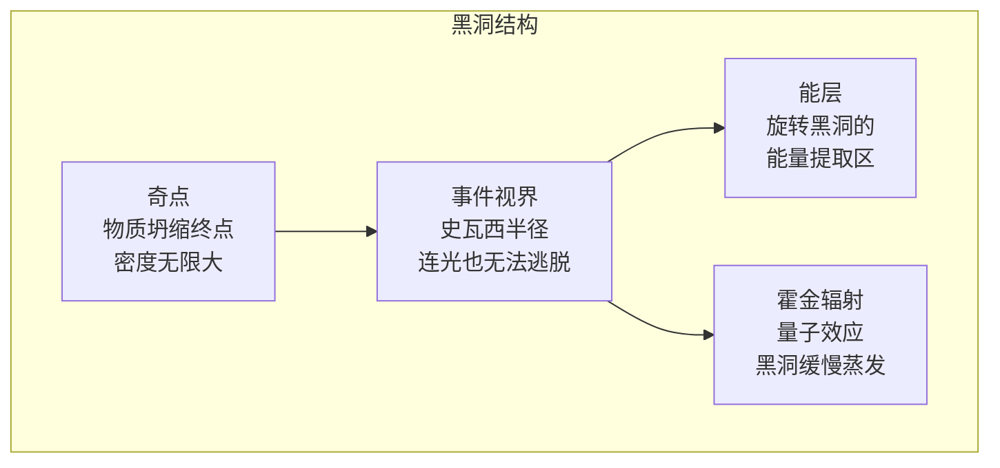

# 黑洞的奥秘

## 一、战火中诞生的解

1915 年 11 月，阿尔伯特·爱因斯坦（Albert Einstein，1879-1955 年）在柏林的普鲁士科学院完成了**广义相对论**的场方程——一组描述物质如何弯曲时空的方程。这组方程优美却极其难解，爱因斯坦自己只找到了近似解，他甚至怀疑精确解是否存在。

就在这时，东线战场上的一位德国炮兵军官给出了答案。卡尔·史瓦西（Karl Schwarzschild，1873-1916 年）本是杰出的天文学家，战争爆发后志愿入伍。1915 年底，他在俄国前线的战壕里读到爱因斯坦的论文，利用战斗间隙，竟然在几周内解出了场方程的**第一个精确解**——一个球对称质量周围的时空结构。他把结果寄给爱因斯坦，爱因斯坦大为惊讶，并于 1916 年 1 月在科学院代为宣读。

史瓦西没能看到这个解的全部含义——1916 年 5 月，他因在前线染上的重病去世，年仅 42 岁。但他的解中潜伏着一个"怪物"：如果一颗恒星的质量被压缩进一个临界半径之内——太阳的临界半径只有 3 公里，地球只有 9 毫米——时空将弯曲到连光也无法逃脱。这个临界半径后来被称为**史瓦西半径**。当时几乎没人相信自然界真会制造这种东西，包括爱因斯坦本人。

## 二、恒星的宿命

1930 年，19 岁的印度青年苏布拉马尼扬·钱德拉塞卡（Subrahmanyan Chandrasekhar，1910-1995 年）乘船前往英国求学。在漫长的航程中，他计算了**白矮星**的稳定性——他发现，当白矮星质量超过太阳的 1.4 倍时，电子简并压力将无法对抗引力，星体必然继续坍缩。这就是著名的**钱德拉塞卡极限**。

这个结论遭到了天文学权威爱丁顿的公开嘲讽，年轻的钱德拉塞卡备受打击（半个世纪后，他因此获得 1983 年诺贝尔物理学奖）。但计算不会说谎：1939 年，罗伯特·奥本海默（Robert Oppenheimer，1904-1967 年）与学生斯奈德发表论文，用广义相对论严格计算了一颗大质量恒星的坍缩——星体将无可挽回地缩进史瓦西半径之内，从可观测的宇宙中"消失"。讽刺的是，奥本海默本人对这个结果并不热衷；同年二战爆发，他转身去了洛斯阿拉莫斯，成为"原子弹之父"，这个课题随之沉寂了近二十年。

## 三、一个名字的诞生

1960 年代，类星体、脉冲星等一系列新发现，迫使物理学家重新捡起恒星坍缩这个被搁置的问题。1967 年，美国物理学家约翰·惠勒（John Wheeler，1911-2008 年）在纽约的一次学术会议上首次使用了"**黑洞**"（Black Hole）这个词——它简洁、传神，迅速流传开来。惠勒是核物理出身、中年后转向引力研究的传奇人物，也是费曼的老师；他坚信坍缩天体值得认真对待，而这个名字让全世界都记住了它。

1971 年，天文学家发现天鹅座 X-1 的异常——一颗看不见的致密天体正在疯狂撕扯它的伴星——它成为第一个被广泛接受的黑洞候选体。黑洞从方程里的解，变成了天空中的实体。

## 四、黑洞不黑

故事如果到此为止，黑洞就是宇宙的终点：只进不出，永恒囚禁。1974 年，斯蒂芬·霍金（Stephen Hawking，1942-2018 年）把量子力学请进了广义相对论的领地。他指出，在黑洞**事件视界**附近，真空中不断产生又湮灭的虚粒子对，可能一个掉进黑洞、一个逃逸——对外部观察者而言，黑洞仿佛在缓慢地向外辐射粒子。这就是**霍金辐射**。

霍金辐射意味着黑洞会"蒸发"：质量越小，蒸发越快；一个恒星质量的黑洞，寿命远超今天的宇宙年龄，但终归也会消失。黑洞不再是绝对的监狱——这个结论优美、惊人，也引发了延续至今的"信息悖论"之争。

## 五、听见与看见黑洞

2015 年 9 月 14 日，**LIGO**（激光干涉引力波天文台）探测到人类历史上第一个引力波信号：13 亿光年外，两个质量分别为 36 倍和 29 倍太阳的黑洞猛烈合并，瞬间把相当于 3 个太阳质量的能量以引力波的形式洒向宇宙。爱因斯坦百年前预言的时空涟漪，终于被人类"听见"。2017 年，这项发现获得诺贝尔物理学奖。

2019 年 4 月 10 日，**事件视界望远镜**（EHT）——一个由全球射电望远镜联网组成的、口径等同于地球大小的虚拟望远镜——发布了人类历史上第一张黑洞照片：5500 万光年外 M87 星系中心，一个 65 亿倍太阳质量的超大质量黑洞，橙红色的光环勾勒着它的暗影。照片公布那天，全球的头条被同一个圆环占据。

从战壕里的数学解，到事件视界上的真实影像，人类用了一百年。黑洞曾是理论家笔下最荒诞的怪物，如今它是检验人类智慧最锋利的磨刀石——而在它与量子力学的交界处，物理学下一场革命的线索，或许正在黑暗中发光。
