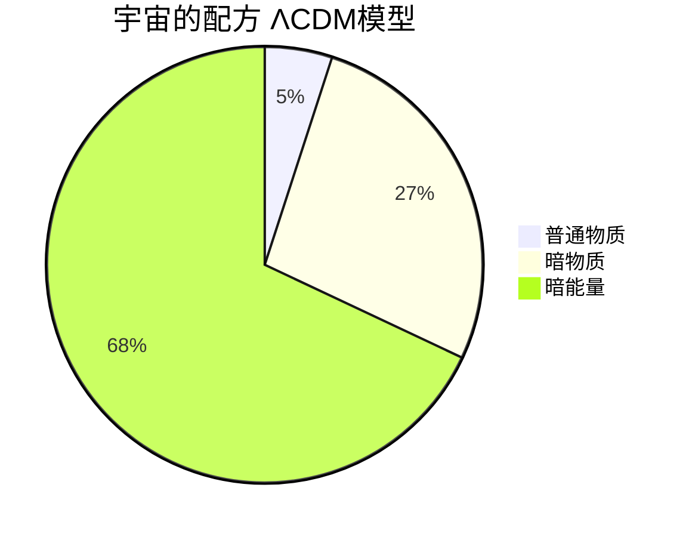

# 暗物质与暗能量

## 一、星系团里的失踪案

1933 年，加州理工学院的一位瑞士天文学家给星系团做了一次"称重"，结果让整个天文学界不得安宁。弗里茨·兹威基（Fritz Zwicky，1898-1974 年）观测了**后发座星系团**——一个包含上千个星系的庞然大物。他用两种方法估算星系团的质量：一是数星系、量亮度，"称"出可见物质的总质量；二是测量星系的运动速度，用引力定律推算需要多少质量，才能把这群高速飞奔的星系束缚在一起。

两种方法的结果相差上百倍。可见物质提供的引力，远远不足以拴住这些星系——按常理，这个星系团早该分崩离析。兹威基大胆断言：星系团中必然存在大量看不见的物质，他称之为"**暗物质**"（dunkle Materie，德语）。

兹威基是个出名的怪人，思想超前、言辞刻薄，同事们半开玩笑地无视了他的结论。这一搁置，就是将近四十年。

## 二、星系边缘的倔强

1970 年代，美国女天文学家薇拉·鲁宾（Vera Rubin，1928-2016 年）在测量星系的**旋转曲线**——恒星绕星系中心旋转的速度随距离的分布。按照牛顿力学的直觉，星系外围的恒星应当像太阳系外围的行星一样越转越慢，曲线呈开普勒式下降。

观测结果恰恰相反：从仙女座星系开始，一个又一个星系的外围恒星，旋转速度快得离谱，曲线平坦地向远方延伸，毫无下落的迹象。唯一的解释是：每个星系都浸泡在一个巨大的、看不见的**暗物质晕**之中——看得见的星系，不过是冰山浮出水面的那一角。鲁宾一生与诺贝尔奖擦肩而过，但她提供的证据，让暗物质从怪谈变成了主流科学。

## 三、猎捕看不见的粒子

暗物质究竟是什么？它不参与电磁相互作用——不发光、不吸光，却能产生引力。主流的候选者是一种假想的粒子：**WIMP**（弱相互作用大质量粒子）——大爆炸留下的遗迹，弥散在整个宇宙之中。此外，**轴子**（axion）等更轻灵的候选者也榜上有名；而"暗物质只是普通暗天体"的猜想（由褐矮星、黑洞组成的 MACHO），已被观测基本排除。

为了逮住 WIMP，人类把探测器埋进了深地——厚重的岩层能屏蔽宇宙射线的干扰。中国锦屏地下实验室的 **PandaX**、意大利的 **XENON**、美国的 **LUX/LZ**，几十个实验用液氙、液氩和超纯锗守株待兔。几十年过去，探测器的灵敏度提升了亿万倍，却至今一无所获。也有人另辟蹊径，猜测引力定律本身在大尺度上需要修正（MOND 理论），但它难以解释全部观测。暗物质的真实身份，仍是当代物理学最大的悬案之一。

## 四、宇宙在加速

如果说暗物质把星系"拽"在一起，那么另一项发现则要把整个宇宙"推"开。1998 年，两支相互竞争的国际团队——索尔·珀尔马特（Saul Perlmutter，1959 年- ）领导的超新星宇宙学计划，与布莱恩·施密特（Brian Schmidt，1967 年- ）、亚当·里斯（Adam Riess，1969 年- ）领衔的高红移超新星搜寻队——通过观测遥远的 **Ia 型超新星**（宇宙中亮度恒定的"标准烛光"），得出一个惊人的结论：宇宙的膨胀不仅没有因引力而减速，反而在**加速**。

驱动加速的神秘成分被命名为**暗能量**。它均匀弥漫在空间中，性质诡异——排斥而不是吸引。爱因斯坦当年为凑出静态宇宙而引入、后来自称"一生最大错误"的宇宙学常数 Λ，竟以这种方式复活了。2011 年，珀尔马特、施密特与里斯共享诺贝尔物理学奖。

## 五、宇宙的配方

把两笔账合在一起，现代宇宙学的标准模型 **ΛCDM** 给出了一份令人不安的"宇宙配方"：我们熟悉的普通物质——恒星、行星、你和我——只占宇宙总质能的约 **5%**；暗物质约占 **27%**；暗能量约占 **68%**。

换句话说，人类研究了千百年的"物质世界"，只是宇宙的零头；剩下 95% 的宇宙，我们知道它存在，称得出它的分量，画得出它的影响，却不知道它究竟是什么。这份无知并不令人沮丧——它意味着宇宙最精彩的章节，还一页都没有被翻开。
