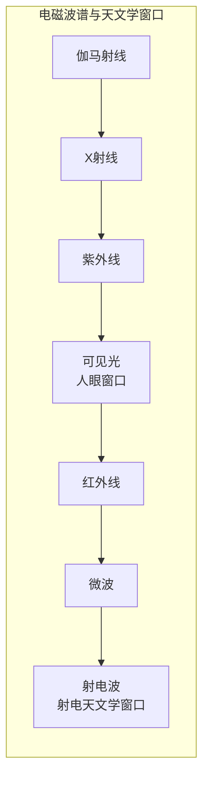

# 射电天文学——倾听宇宙的静默之声

## 一、意外打开的窗口

可见光只是电磁波谱上极窄的一段。在红光之外，还有红外线、微波、射电波——它们的波长比可见光长得多，人眼完全无法感知。宇宙在这些波段上是什么样子？在 20 世纪 30 年代之前，没有人知道，甚至没有人认真想过这个问题。

打开这扇窗口的，是一位贝尔实验室的工程师。**卡尔·央斯基**（Karl Jansky，1905-1950 年）在 1931 年受命调查短波通信中的静电干扰来源。他搭建了一座可旋转的天线阵，耐心地记录了各种噪声——雷暴、附近的电子设备，还有一种来源不明的、每天都有规律出现的"嘶嘶"声。经过一年的追踪，1933 年，央斯基得出结论：这种噪声来自银河系的中心方向。宇宙在射电波段上"说话"了——这是射电天文学的诞生。

## 二、一个人的天文台

央斯基的发现当时并没有引起天文学界的重视——毕竟，那只是一个工程师的副业成果。真正接过火炬的，是一位美国无线电爱好者。**格罗特·雷伯**（Grote Reber，1911-2002 年）在 1937 年自掏腰包，在自家后院建造了世界上第一台专用的**射电望远镜**——一个直径约 9.5 米的抛物面天线。

雷伯用这台简陋的设备系统地扫描天空，绘制出了第一张射电天图，确认了央斯基发现的银心辐射，还发现了天鹅座和仙后座中的强射电源。整整十年，他几乎是世界上唯一的射电天文学家。直到第二次世界大战之后，战时积累的雷达技术被转向和平用途，射电天文学才真正繁荣起来。

## 三、小绿人与脉冲星

1967 年，剑桥大学的一位研究生在分析数据时，注意到了一个奇怪的信号——它以极其精确的周期跳动着，每隔 1.337 秒来一次脉冲。这位研究生名叫**乔丝琳·贝尔**（Jocelyn Bell Burnell，1943 年-），她的导师是**安东尼·休伊什**（Antony Hewish，1924-2021 年）。

信号的周期性精确得令人不安——研究团队一度半开玩笑地把它标记为"LGM"，意为"小绿人"（Little Green Men）。进一步观测排除了外星文明的可能性：这是一种高速旋转的**中子星**——恒星坍缩后的致密残骸，像宇宙灯塔一样，每转一圈就朝地球扫过一束射电波。这就是**脉冲星**。1974 年，休伊什因这一发现获得诺贝尔物理学奖——而作为第一发现者的贝尔却未能分享，这成为诺贝尔奖历史上最著名的争议之一。

## 四、类星体与宇宙深处

射电望远镜还把人类的视野推向了宇宙的尽头。20 世纪 60 年代初，天文学家发现了一批奇特的射电源——它们看起来像恒星，却位于数十亿光年之外。这些**类星体**（Quasar）的亮度惊人——一个类星体的能量输出可以超过整个银河系。它们的能源是什么？答案是星系中心的**超大质量黑洞**——物质坠入黑洞时释放的巨大能量，点亮了宇宙最深的角落。

## 五、大锅时代

射电天文学的标志，是一口又一口越来越大的"锅"。1963 年建成的**阿雷西博望远镜**（Arecibo Telescope）口径达 305 米，建在波多黎各的天然石灰岩洼地中，此后半个多世纪一直是世界上最大的单口径射电望远镜。它发现了第一颗脉冲双星（为引力波的存在提供了间接证据），绘制了金星表面的雷达地图，还在 1974 年向球状星团 M13 发送了著名的"阿雷西博信息"。2020 年 12 月，阿雷西博的馈源平台坍塌，一代传奇就此谢幕。

接棒者在中国。由**南仁东**（1945-2017 年）主持推动的 **FAST**——500 米口径球面射电望远镜，于 2016 年在贵州平塘的喀斯特洼地中建成。南仁东为这个工程奔波了二十二年，从选址到立项再到建成，他燃尽了生命最后的时光，在 FAST 落成一年后病逝。FAST 的灵敏度是阿雷西博的两倍多，已发现上千颗脉冲星，被世人称为"中国天眼"。

## 六、听见看不见的宇宙

射电天文学教给人类的，是一种谦卑的知觉——我们肉眼所见的光，只是宇宙交响曲中的一个声部。脉冲星的滴答、类星体的轰鸣、星际分子的低语，都藏在波长更长的声音里。从央斯基天线上的嘶嘶声，到贵州群山之间的巨大天眼，人类学会了用耳朵去仰望星空——而宇宙，远比我们曾经看见的更加喧嚣。
