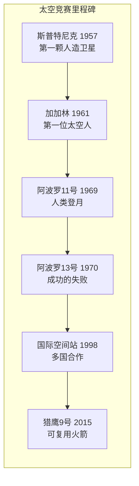

# 太空竞赛

## 一、来自太空的哔哔声

1957 年 10 月 4 日深夜，苏联哈萨克斯坦的拜科努尔发射场，一枚由洲际导弹改装的火箭托举着一颗 83.6 公斤的抛光铝球升入夜空。这颗名叫**斯普特尼克一号**（Sputnik 1）的人造卫星进入轨道后，开始以固定的节奏向地面发送无线电信号——"哔……哔……哔……"。任何人用一台普通的短波收音机，都能收听到这个来自太空的声音。

这个简单的哔哔声震动了整个美国——它意味着苏联的火箭可以把弹头投送到地球上任何一个角落，也意味着太空不再是中立的疆域。这场竞赛背后站着苏联航天的总设计师**谢尔盖·科罗廖夫**（Sergei Korolev，1907-1966 年），一个在古拉格劳改营里待过六年、身份被严格保密的工程师。三个月后，美国仓促发射的先锋号火箭在全世界电视观众面前升空一米便轰然坠落爆炸——这份羞辱直接催生了 1958 年美国国家航空航天局（NASA）的成立，也彻底点燃了**太空竞赛**。

## 二、加加林的一百零八分钟

苏联的下一记重拳来得更快。1961 年 4 月 12 日，27 岁的空军飞行员**尤里·加加林**（Yuri Gagarin，1934-1968 年）乘坐**东方一号**飞船升空，以 108 分钟绕地球一周，成为第一个进入太空的人类。起飞前他喊出的那句"出发！"传遍了世界。归来时，他在数千米高空被弹射出舱，靠降落伞落在萨拉托夫的一片田野上——一位正在劳作的农妇和她的孙女，目睹了这位从天而降的"天外来客"。

加加林的微笑登上了全世界的报纸头版。对美国而言，这不只是技术的落后，更是声望的溃败。六周后，1961 年 5 月 25 日，上任不久的美国总统**约翰·肯尼迪**（John F. Kennedy，1917-1963 年）在国会发表演说，许下一个近乎疯狂的承诺："在这个十年结束之前，把一个人送上月球，并让他安全返回地球。"当时美国全部的载人航天经验，只是艾伦·谢泼德一次 15 分钟的亚轨道飞行——月球在那时，遥远得如同一句口号。

## 三、鹰已着陆

为了兑现承诺，美国把超过联邦预算百分之四的经费、四十万人和两万家企业投入了**阿波罗计划**。1969 年 7 月 16 日，**阿波罗 11 号**搭载三名宇航员升空。7 月 20 日，登月舱"鹰"与指令舱分离，向月面下降——着陆过程中计算机连续报警，剩余燃料只够再烧几十秒，阿姆斯特朗改为手动操控，驾驶登月舱越过一片布满巨石的陨石坑，最终稳稳落在静海平原。

"休斯顿，这里是静海基地。'鹰'已着陆。"六小时后，**尼尔·阿姆斯特朗**（Neil Armstrong，1930-2012 年）扶着舷梯缓缓走下，在月面上踩下人类在另一个天体上的第一个脚印："这是我个人的一小步，却是人类的一大步。"十九分钟后，**巴兹·奥尔德林**（Buzz Aldrin，1930 年—）也踏上了月面，而**迈克尔·柯林斯**（Michael Collins，1930-2021 年）独自留在环月轨道上。肯尼迪的豪言，在十年期限到来之前兑现了。

## 四、一次"成功的失败"

太空竞赛并非只有凯旋。1970 年 4 月，**阿波罗 13 号**在飞往月球途中，服务舱的氧气罐突然爆炸——"休斯顿，我们有麻烦了。"登月计划当场作废，登月舱被临时改造成"救生艇"：三名宇航员挤在冰冷狭小的舱内，靠地面工程师用硬纸板、胶带和袜子滤芯设计出的应急装置过滤二氧化碳，绕行月球一周后溅落太平洋，奇迹般生还。NASA 把这次任务称为一次"**成功的失败**"——目标全然落空，人却一个不少地回了家。

## 五、从对手到伙伴

1975 年，美国的阿波罗飞船与苏联的联盟号飞船在轨道上对接，两国宇航员在太空握手——竞赛的硝烟开始散去。1998 年，由美、俄、欧、日、加等十余国共建的**国际空间站**（ISS）开始组装，从此地球轨道上始终有人类常驻。冷战时的对手，成了同一条轨道上的室友。

进入二十一世纪，主角中闯入了新的玩家。2015 年 12 月，**埃隆·马斯克**（Elon Musk，1971 年—）创立的 SpaceX 公司首次实现**猎鹰 9 号**火箭第一级的陆上回收——一枚刚刚把卫星送上天的火箭，自己调转方向、减速、悬停，稳稳地竖回发射场。**可复用火箭**把发射成本压到传统火箭的一个零头，太空的大门第一次向商业敞开。从斯普特尼克的哔哔声到猎鹰 9 号的回收着陆，六十多年过去，人类进入太空的理由，已经从两个超级大国的对抗，变成了整个物种共同的远征。
