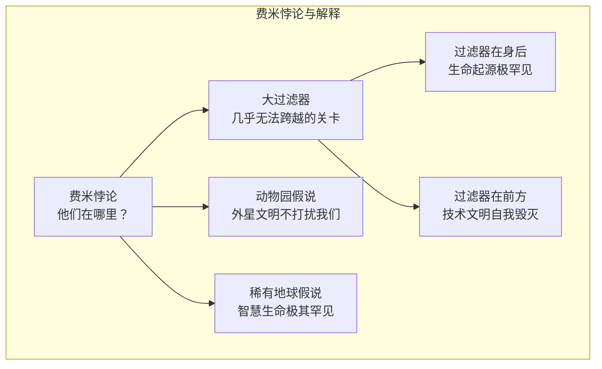

# 寻找外星生命

## 一、一个写在黑板上的方程

1959 年，物理学家**朱塞佩·科可尼**（Giuseppe Cocconi，1914-2008 年）和**菲利普·莫里森**（Philip Morrison，1915-2005 年）在《自然》杂志发文提出：如果外星文明存在，他们最可能用 1420 兆赫兹的无线电波与我们联络——那是中性氢原子的特征频率，宇宙中最普遍的"通用频道"。

年轻的射电天文学家**弗兰克·德雷克**（Frank Drake，1930-2022 年）读到了这篇文章，此后一生都与这个问题绑在一起。1961 年，他在西弗吉尼亚州的**绿岸天文台**召集了人类历史上第一次外星文明学术会议。为了安排议程，他在黑板上随手写下一个方程：

N = R* × fp × ne × fl × fi × fc × L

这就是后来著名的**德雷克方程**。它把"银河系有多少可通信文明"这个宏大问题，拆解成一串可以逐项讨论的因子——恒星形成率、有行星的恒星比例、宜居行星数、生命与智慧出现的概率、文明存续时间等。德雷克后来说，方程的价值不在算出答案，而在把无知变成可以研究的问题。

## 二、奥兹马计划——第一次倾听

其实早在会议之前，德雷克就已开始行动。1960 年 4 月，他启动了**奥兹马计划**（Project Ozma）——名字取自奥兹国童话里遥远的公主。他把绿岸那台直径 26 米的射电望远镜对准了两颗邻近太阳的恒星：**天仓五**（Tau Ceti）和**天苑四**（Epsilon Eridani），在 1420 兆赫兹上监听了约 150 个小时。

结果一片寂静，仅有一次虚惊——后来证实是军方的雷达。但这次一无所获的尝试，开启了延续至今的**SETI**（搜寻地外文明）事业。1977 年，俄亥俄州立大学的"大耳朵"望远镜曾捕捉到一段持续 72 秒的强烈窄带信号——著名的 **Wow! 信号**——但它再也没有出现过。

## 三、费米悖论——他们在哪里？

然而，倾听得越久，一个问题就越发刺耳。

1950 年夏天，物理学家**恩里科·费米**（Enrico Fermi，1901-1954 年）在洛斯阿拉莫斯国家实验室与同事共进午餐，闲聊中谈到外星人的传闻，费米忽然冒出一句："**他们在哪里？**"（Where is everybody?）

这随口一问，后来被称为**费米悖论**。它的逻辑简单得无懈可击：银河系年龄超过 100 亿年，哪怕某个文明以远低于光速的速度扩张，几百万年——宇宙尺度上不过一瞬——也足以殖民整个星系。如果智慧生命并不罕见，银河应该早已熙熙攘攘，可天空一片沉默。**大静默**与**高概率**之间的矛盾，就是费米悖论的核心。

## 四、大过滤器与动物园假说

为了解释这片沉默，人们提出了形形色色的假说。

经济学家**罗宾·汉森**（Robin Hanson，1959 年出生）在 1990 年代提出了最令人不安的一个——**大过滤器**（Great Filter）：从荒芜行星到星际文明之间，存在某道几乎无法跨越的关卡。这道关卡可能在我们身后——生命起源或智慧出现本身就是亿万中无一的奇迹；也可能在我们前方——技术文明注定在掌握自我毁灭的能力后不久走向终结。前者意味着我们孤独但安全，后者意味着死寂的宇宙里埋满了文明的墓碑。

另一种假说温和得多。1973 年，射电天文学家**约翰·鲍尔**（John A. Ball）提出了**动物园假说**：外星文明早已知道我们的存在，只是约定不打扰——就像人类观察自然保护区中的动物，我们只是被静静注视的展品。

## 五、从火星陨石到系外行星大气

就在 SETI 持续倾听的同时，另一条战线传来了轰动一时的消息。1984 年，地质学家在南极的**艾伦丘陵**捡到一块陨石，编号 **ALH84001**——它来自火星，形成于约 40 亿年前。1996 年，**戴维·麦凯**（David McKay，1936-2013 年）团队在《科学》杂志上宣布：陨石内部发现了疑似微生物化石的链状结构，以及可能与生命活动有关的化学痕迹。时任总统克林顿专门召开了新闻发布会。

然而随后的十几年里，质疑声渐占上风——那些"化石"比已知最小的细菌还小得多，无机的地质过程也能制造出类似结构。ALH84001 成了科学史上最著名的悬案之一：它提醒人们，**宣称发现生命需要多么严苛的证据**。

真正的突破来自系外行星。1995 年，瑞士天文学家**米歇尔·马约尔**（Michel Mayor，1942 年出生）和**迪迪埃·奎洛兹**（Didier Queloz，1966 年出生）发现了首颗绕类太阳恒星运行的系外行星**飞马座 51b**，获 2019 年诺贝尔物理学奖。此后，开普勒望远镜等项目把确认的系外行星数量推到五千颗以上，其中一些位于**宜居带**——温度允许液态水存在的区域。

更激动人心的是，2021 年发射的**詹姆斯·韦伯太空望远镜**已能分析系外行星大气的成分——行星从恒星前方经过时，恒星光穿过大气，留下分子的指纹。天文学家期待找到**生物特征气体**——氧气与甲烷并存之类的"失衡"组合。2023 年，韦伯在行星 K2-18b 的大气中探测到疑似二甲基硫醚的信号——在地球上它几乎只由海洋生物产生——结果虽至今充满争议，却预示着答案或许不再遥远。

## 六、两种可能，同样震撼

作家阿瑟·克拉克说过："存在两种可能：要么我们在宇宙中是孤独的，要么不是。两种可能都同样令人恐惧。"

六十多年过去，人类的耳朵越来越灵敏，宇宙却始终沉默。但这沉默本身也是信息——它逼迫我们重新审视生命的稀有与珍贵。如果有一天，我们在某颗遥远行星的大气里读到了生命的气息，或等来了那句迟到已久的问候，人类将不再是宇宙中孤独的提问者。而在那一天到来之前，我们继续倾听、继续发问——这种追问本身，或许就是智慧生命存在的最好证明。
