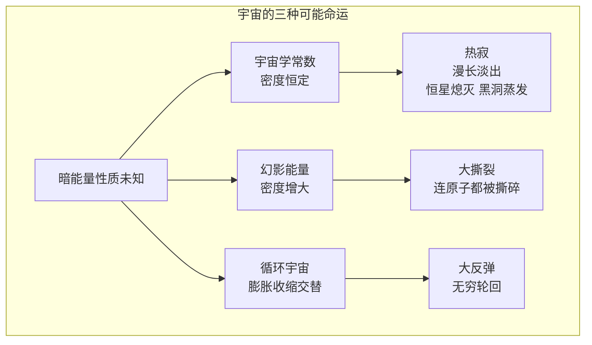

# 宇宙的未来

## 一、热寂——一个来自蒸汽机时代的预言

宇宙的结局会是什么？这个问题听起来纯粹属于天文学家，但它最早的答案却出自研究蒸汽机的人。

19 世纪中叶，物理学家研究热机效率时发现了一条冷酷的定律——**热力学第二定律**：孤立系统中**熵**只增不减，热量总从高温流向低温，有序总趋向混乱。1865 年，德国物理学家**鲁道夫·克劳修斯**（Rudolf Clausius，1822-1888 年）正式提出熵的概念，并把这条定律推广到整个宇宙：宇宙的熵趋向最大值，能量趋向彻底均匀。

英国的**开尔文勋爵**（Lord Kelvin，1824-1907 年）在 1852 年就得出了悲观的推论：宇宙终将迎来**热寂**（Heat Death）——所有恒星熄灭，所有温差抹平，所有可以做功的能量耗尽，宇宙变成一锅温度均匀、再无变化的稀汤。那时人们连银河系之外还有星系都不知道，但热力学的预言已悬在宇宙头顶：熵只增不减，时间的尽头注定是永恒的沉寂。

## 二、1998 年的意外——加速膨胀的宇宙

20 世纪的天文学让问题变得更加扑朔迷离。哈勃发现宇宙在膨胀之后，人们原以为问题只剩一个：引力会不会让膨胀停下来？答案取决于物质的多寡——物质够多，膨胀将减速、反转，最终坍缩成"大挤压"；物质不够，宇宙将永远膨胀、慢慢冷却。

1998 年，**索尔·珀尔马特**（Saul Perlmutter，1959 年出生）领导的超新星宇宙学项目，与**布莱恩·施密特**（Brian Schmidt，1967 年出生）、**亚当·里斯**（Adam Riess，1969 年出生）领衔的高红移超新星搜寻队——两支相互竞争的团队——分别通过观测遥远的 **Ia 型超新星**得出同一个谁也没料到的结论：宇宙的膨胀不但没有减速，反而在**加速**。三人因此分享了 2011 年诺贝尔物理学奖。

驱动这场加速的幕后推手被称为**暗能量**——它约占宇宙总质能的 68%，而组成你我、行星和恒星的普通物质只占不到 5%。宇宙的命运，如今握在这种我们几乎一无所知的东西手里。

## 三、三种命运：热寂、大撕裂与大反弹

暗能量的性质决定了宇宙的结局，而物理学家已经为它写好了几个截然不同的剧本。

如果暗能量就是爱因斯坦当年随手写进方程又后悔删掉的**宇宙学常数**——一种密度恒定的真空能量——那么宇宙将一路加速膨胀下去。星系彼此远去，本星系群之外的一切终将退出我们的视野；恒星在约 10 万亿年后陆续熄灭，只剩下白矮星、中子星和黑洞在黑暗中慢慢冷却、蒸发。这就是 21 世纪版本的**热寂**——不是骤然落幕，而是漫长到近乎永恒的淡出。

如果暗能量比宇宙学常数更"凶"——密度随时间增大的**幻影能量**——结局将变成一场灾难片。2003 年，物理学家**罗伯特·考德威尔**（Robert Caldwell）等人描绘了**大撕裂**（Big Rip）的场景：膨胀力不断增强，先是星系团被扯散，接着是星系、恒星系，行星被撕离恒星，恒星被撕成原子，最后连原子本身也被撕裂，宇宙终结于一场连时空都被扯碎的风暴。

还有一种剧本不肯接受"一次性的宇宙"。2001 年起，**保罗·斯坦哈特**（Paul Steinhardt，1952 年出生）和**尼尔·图洛克**（Neil Turok，1958 年出生）等人提出了**循环宇宙**模型：我们的大爆炸并非开端，而是一次**大反弹**（Big Bounce）——上一个宇宙收缩到极点之后反弹重生，膨胀与收缩像呼吸一样周而复始。在这个图景里，宇宙没有开端也没有终结，只有无穷无尽的轮回。

目前所有的观测都还站在热寂一边——暗能量的行为与宇宙学常数惊人地吻合。但"目前"这个词，在宇宙学里从来都带着保留。

## 四、多元宇宙与人择原理

当我们追问"为什么宇宙的参数恰好允许生命存在"时，问题又深了一层。

**永恒暴胀**理论的提出者之一**安德烈·林德**（Andrei Linde，1948 年出生）指出：暴胀一旦开始，可能永远不会在所有地方同时停止——某些区域停止暴胀、形成我们这样的宇宙，而别处仍在疯狂膨胀，不断"长出"新的宇宙。于是有了**多元宇宙**（Multiverse）的图景：我们的宇宙只是无数个泡泡宇宙中的一个，每个宇宙的物理常数都可能不同。

1973 年，物理学家**布兰登·卡特**（Brandon Carter，1942 年出生）提出了**人择原理**：我们之所以观测到这样的宇宙，是因为只有这样的宇宙才允许观测者存在。这听起来像同义反复，却做出过真实的预言——1987 年，**史蒂文·温伯格**（Steven Weinberg，1933-2021 年）用人择论证推算出宇宙学常数必须很小，否则星系来不及形成，便不会有任何人来问这个问题。十年后暗能量的发现，让这个曾被视为遁词的推理赢得了迟来的尊重。

当然，多元宇宙永远无法被直接观测，它在科学共同体中至今争议不断——它究竟是深刻的洞察，还是物理学在证据尽头的一次华丽转身，恐怕还要争论很多年。

## 五、暗淡蓝点

1990 年 2 月 14 日，已经飞离地球 60 亿公里的**旅行者 1 号**接到指令，转身回望太阳系，拍下了那张著名的照片。在悬浮于阳光中的一粒微尘上，住着所有人——这是**卡尔·萨根**（Carl Sagan，1934-1996 年）对这张照片的解说，他称之为**暗淡蓝点**（Pale Blue Dot）。

谈论宇宙的未来，动辄是万亿年后的图景——恒星熄灭、黑洞蒸发、时间失去意义。在这样深不见底的时间面前，人类的全部历史不过是一声短促的呼吸。但萨根提醒过我们另一件事：我们是恒星物质的产物，是宇宙用来认识自己的一种方式。宇宙的结局或许早已写定，但此刻——在这颗悬浮于阳光中的微尘上，有一种生命正在仰望星空，试图理解它从何处来、向何处去。无论终局是热寂、撕裂还是轮回，这份理解本身，已经是无垠黑暗中一点不肯熄灭的光。
