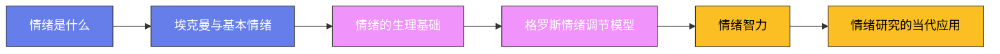

# 情绪心理学

## 一、情绪是什么：百年争论的起点

情绪看似简单——喜怒哀乐人人有之，定义起来却异常困难。心理学家一般把情绪拆成三个成分：**主观体验**（我感到害怕）、**生理唤醒**（心跳加速、手心出汗）、**行为表达**（皱眉、逃跑的冲动）。一场争论持续了一个多世纪：这三者谁先谁后、谁是原因谁是结果？

1884 年，**威廉·詹姆斯**（William James）发表《什么是情绪？》，提出了与常识相反的观点：常识说"遇到熊→感到害怕→发抖逃跑"，詹姆斯说顺序其实是"遇到熊→身体发抖逃跑→我们觉察到身体的反应，于是感到害怕"。**詹姆斯-兰格理论**（丹麦生理学家兰格同年独立提出类似观点）认为：每种情绪都是对特定身体反应的感知，情绪的区别即身体反应模式的区别。

1927 年，**沃尔特·坎农**（Walter Cannon）提出尖锐批评：内脏反应太慢、太粗糙，无法区分千差万别的情绪——恐惧和愤怒时心跳都加速，身体反应根本不够"分辨"它们。**坎农-巴德理论**主张：丘脑同时把信号发给皮层（产生体验）和身体（产生唤醒），二者是平行的，不存在谁引起谁。

1962 年，**斯坦利·沙赫特**（Stanley Schachter）和**杰罗姆·辛格**（Jerome Singer）用一个大嗓门实验提出了**双因素理论**：情绪 = 生理唤醒 × 认知标签。他们给约 184 名男性大学生注射肾上腺素，却谎称是维生素"Suproxin"。被试分为三组：**告知组**（被告之会有心悸手抖等真实副作用）、**误告知组**（被告知错误副作用）、**不告知组**。注射后被试进入等候室，里面有一名假装成被试的实验助手，或表演欣快（玩纸飞机、转呼啦圈），或表演愤怒（抱怨问卷、撕碎问卷）。结果：**不告知组和误告知组**——对自己的生理唤醒没有现成解释的人——更容易被助手的表演"感染"，报告更强的情绪体验；知道自己为何心跳加速的告知组则相对平静。结论：同样的生理唤醒，贴上"兴奋"的标签就是兴奋，贴上"愤怒"的标签就是愤怒。

这个理论解释了生活中许多现象：走过摇摇晃晃的吊桥后更容易觉得迎面遇到的异性有魅力（**吊桥效应**，Dutton & Aron，1974）——心跳加速被误贴为心动；喝咖啡过量后的手抖心悸，可能被误读为"我今天特别烦躁"。

## 二、埃克曼与基本情绪：表情是全人类的语言吗

**保罗·埃克曼**（Paul Ekman，1934—）是情绪心理学最有名的一张面孔——美剧《别对我撒谎》（Lie to Me）的主角就以他为原型。他毕生研究的问题是达尔文 1872 年《人类和动物的表情》留下的：表情是先天普遍的，还是文化习得的？

埃克曼的决定性证据来自新几内亚。1967—1968 年，他深入巴布亚新几内亚高地，研究几乎未接触过西方文明的**福尔族**（Fore）人。他不能用翻译情绪词汇的方法（语言不通），于是改用故事匹配法：给福尔人讲一个简短故事（"他妈妈去世了"），让他们从几张照片中选出与故事情绪相符的面孔。结果：福尔人的选择与美国人高度一致。反向实验同样成立——埃克曼拍下福尔人表达各种情绪的面孔带回美国，美国大学生也能准确辨认。

基于跨文化证据，埃克曼提出六种**基本情绪**：**快乐、悲伤、愤怒、恐惧、厌恶、惊讶**（后来又加入轻蔑等）。每种基本情绪对应一套独特的、全人类的面部肌肉运动模式。为了精确描述这些模式，埃克曼与华莱士·弗里森（Wallace Friesen）在 1978 年开发出**面部动作编码系统**（FACS）——把面部运动分解为 40 多个独立的"动作单元"（AU），比如 AU12（嘴角上扬）是真诚微笑（杜兴式微笑）的必要成分，礼貌假笑往往只有嘴动而眼不动。

埃克曼的另一个贡献是**微表情**研究：当人说谎掩饰情绪时，真实情绪会在 1/25 秒到 1/5 秒内"泄漏"出来，一闪而过。他在《说谎》（Telling Lies，1985）中系统论述了如何从面部表情、声音和身体动作捕捉欺骗的线索。需要说明的是：微表情测谎的实战准确率一直存在争议，学界普遍认为它"有线索价值但远非测谎仪"。

基本情绪阵营中还有另一位重要人物。**罗伯特·普拉切克**（Robert Plutchik，1927—2006）1980 年提出**情绪轮**（Wheel of Emotions）模型：八种基本情绪两两相对——快乐对悲伤、信任对厌恶、恐惧对愤怒、惊讶对期待；相邻情绪按不同强度与组合排列成色轮，例如快乐与信任混合产生"爱"，恐惧与惊讶混合产生"敬畏"。这个模型的优点是把情绪的**强度渐变**（恼火—愤怒—暴怒）与**情绪混合**同时纳入了一个直观结构，至今仍是情感计算和心理咨询科普中最常用的图示之一。

基本情绪理论并非没有挑战者。丽莎·费尔德曼·巴瑞特（Lisa Feldman Barrett）的**情绪建构论**认为：情绪不是先天的"模块"，而是大脑根据身体状态、情境和文化概念现场"建构"出来的——同样的心悸，在葬礼上被建构成悲伤，在婚礼上被建构成激动。这场"基本情绪派"与"建构论派"的论战，至今是情绪心理学最活跃的前沿之一。

## 三、情绪的生理基础

情绪不仅是主观体验，更是实实在在的神经事件。其中研究最充分的结构是**杏仁核**（amygdala）——深藏在大脑颞叶中的杏仁状核团。

**约瑟夫·勒杜**（Joseph LeDoux）用老鼠的恐惧条件反射实验发现，恐惧信息有两条通路：**"低路"**（丘脑→杏仁核）快而粗糙——看到草丛里弯曲的影子，不等看清是蛇还是绳子，身体已经跳起来；**"高路"**（丘脑→皮层→杏仁核）慢而精确——皮层仔细分析后确认"只是绳子"，再让杏仁核解除警报。低路是保命装置，代价是经常误报；焦虑症患者的问题常在于低路过于敏感、高路的刹车又不够有力。

情绪的化学基础同样清晰：恐惧与应激离不开**杏仁核-下丘脑-垂体-肾上腺轴**的激活，快乐与奖赏离不开**多巴胺**系统，亲密与信任与**催产素**有关，而血清素的失调与抑郁、冲动攻击密切相关。抑郁症的一线药物 SSRI（选择性血清素再摄取抑制剂）正是作用于血清素系统。

身体与情绪的关系是双向的，这就是詹姆斯-兰格理论留下的现代遗产——**面部反馈假说**：做出一个表情会反过来影响情绪体验。1988 年，心理学家施特拉克（Fritz Strack）做了著名的"咬笔实验"：用牙齿横咬一支笔（被迫做出微笑状）的被试，看漫画时觉得比用嘴唇含笔（被迫做出不笑状）的被试更好笑。这个实验在 2016 年的一次大规模重复中未能复现，引发激烈争论；但后续更严格的元分析表明，面部反馈效应虽然比最初认为的小得多，方向上依然存在——身体姿态和表情确实会以轻微但可测的方式回馈情绪。

## 四、格罗斯的情绪调节模型

人无法选择不生气，但可以选择生气之后怎么办。**詹姆斯·格罗斯**（James Gross，1948—）1998 年提出的**情绪调节过程模型**（Process Model of Emotion Regulation）是当代情绪调节研究的总框架。核心思想是：情绪像一个按时间展开的过程，我们可以在过程的五个时间点上介入——

1. **情境选择**：趋近或避开某些会引发情绪的场景。不想焦虑就少刷坏消息，社交恐惧者绕开人多的聚会。
2. **情境修正**：身处情境中，动手改变它。开会前主动找组织者把发言调到第一个，免得煎熬整场。
3. **注意分配**：改变注意力的指向。打针时盯着窗外看而不是盯着针头；焦虑时把注意力拉回呼吸。
4. **认知改变（重评）**：改变对情境的解释——这是格罗斯模型中研究最多的策略。把公开演讲的心跳加速解释为"身体在为我供能"而不是"我完了"；把堵车听成一段强制休息时间。
5. **反应调整**：情绪已经发生后调整反应输出，最典型的是**表达抑制**——脸上不动声色。

格罗斯团队的系统研究发现，五种策略的效果差异巨大。**认知重评**（reappraisal）效果最好：它从源头上改变了情绪体验，降低负面情绪的同时不增加生理代价，还能提升记忆和社会互动的质量。**表达抑制**（suppression）效果最差：表面不动声色，内心翻江倒海——主观负面情绪没减少，交感神经激活反而增强，血压上升，甚至损害对话者的感受（对方会感到莫名的不舒服）。长期习惯性使用抑制策略的人，抑郁和焦虑水平更高，亲密关系质量更低。

这解释了东亚文化中的一个悖论：文化鼓励"喜怒不形于色"，但心理学证据表明，表情忍得住，代价在体内悄悄记账。健康的情绪调节不是"压住"，而是"转化"。

## 五、情绪智力：从学术概念到大众热词

1990 年，**彼得·萨洛维**（Peter Salovey，后任耶鲁大学校长）和**约翰·梅耶**（John Mayer）发表了一篇标题就为《情绪智力》的论文，首次定义了这个概念：感知、使用、理解和管理情绪的能力。他们提出的**四分支模型**按能力层级排列——

1. **感知情绪**：准确识别自己和他人的情绪（从表情、声音、艺术作品中）。
2. **使用情绪促进思维**：利用情绪帮助判断和解决问题（在合适的心情下做合适的思考）。
3. **理解情绪**：理解情绪的复杂变化（愤怒下面可能盖着恐惧；爱恨如何交织）。
4. **管理情绪**：调节自己与他人的情绪，促进成长。

对应的能力测验是 MSCEIT（梅耶-萨洛维-卡鲁索情绪智力测验），以能力测试的方式测量情绪智力。

真正把"情绪智力"推上大众舞台的是科学记者**丹尼尔·戈尔曼**（Daniel Goleman，1946—）。他 1995 年出版的《情绪智力》（Emotional Intelligence）成为现象级畅销书，在《纽约时报》畅销书榜上停留了一年半。戈尔曼的版本中，情绪智力包含五个成分：自我意识、自我调节、动机、共情、社交技能。书名页上一句宣传语——情绪智力比智商更能决定人生成功——让"情商"（EQ）一词从此进入汉语日常词汇。

学术界的反应则复杂得多。批评者指出：戈尔曼版本的情绪智力边界模糊，与已有的大五人格、社交技能等概念大量重叠；"情商决定 80% 成功"这类流行说法并无研究支持，戈尔曼本人从未如此断言。不过严肃的元分析也表明：情绪智力（尤其是能力测验测得的）与工作绩效、领导效能、人际关系质量确实存在中等程度的相关。另一位研究者鲁文·巴昂（Reuven Bar-On）开发的 EQ-i 量表（1997）走的是"混合模型"路线，把情绪智力当作人格特质与技能的组合来测量。

公允的结论是：情绪智力是一个真实有用的构念，但它既不是智商的替代品，也不是万能钥匙——它预测的是"与人打交道"和"与自己的情绪打交道"这类特定领域的成功。

## 六、情绪研究的当代应用

情绪心理学已经深度渗入临床、教育、职场和人工智能。

在**临床心理学**中，几乎所有主流疗法都在处理情绪：认知行为疗法（CBT）本质上是大规模的认知重评训练；辩证行为疗法（DBT，Linehan 为边缘型人格障碍开发）专门教授情绪调节技能；情绪聚焦疗法（EFT）则主张"只有先抵达情绪，才能离开情绪"。焦虑和抑郁的核心症状都是情绪调节失灵——反刍思维就是反复咀嚼负面情绪而不得其出。

在**教育**领域，**社会情感学习**（SEL）课程把情绪识别、情绪调节、共情列进中小学课表。追踪研究发现，系统接受 SEL 教育的学生学业成绩平均提升约 11 个百分点，行为问题显著减少。

在**人工智能**领域，埃克曼的 FACS 系统成了表情识别算法的标注标准，情感计算（affective computing）试图让机器识别和回应人类情绪——从客服机器人判断用户是否愤怒，到车内摄像头监测司机是否疲劳或路怒。只是机器"识别"的终究是表情模式，而不是体验本身——那条从生理信号到主观感受的鸿沟，依然是哲学和神经科学共同面对的最难问题。

还有一个职场绕不开的概念——**情绪劳动**（emotional labor）。社会学家**阿莉·霍克希尔德**（Arlie Hochschild）1983 年在《被管理的心》（The Managed Heart）中研究空乘人员后发现：服务业员工被要求按职业脚本表达情绪——微笑、耐心、永远友好——这本身就是一种劳动。她区分了两种表演：**表层扮演**（只改表情，内心不动）与**深层扮演**（主动调动记忆和想象，让自己真的产生相应情绪）。研究发现：长期表层扮演与情绪耗竭、倦怠显著相关，而深层扮演的代价小得多——这与格罗斯"抑制有害、重评较优"的发现遥相呼应。

情绪心理学的百年历程浓缩成一句话，或许是：情绪不是理性的敌人，而是进化留给我们的快速决策系统；学会读懂它、调节它，而不是压制它，是现代人的必修课。

