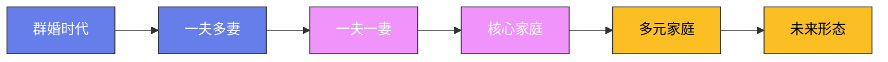

# 家庭与婚姻制度的演变

## 一、史前：群婚与母系社会

在人类文明的早期阶段，婚姻制度尚未形成——男女之间的关系是自由的、临时的。恩格斯在《家庭、私有制和国家的起源》中将人类早期的婚姻形式分为三个阶段：群婚制（一群男性与一群女性之间的婚姻关系）、对偶婚制（一对男女之间的临时关系，但不排斥其他关系）和专偶婚制（一夫一妻制）。

**母系社会**：在许多早期文明中，社会以母亲的血统来追溯——这是因为早期人类不了解男性在生育中的作用。母系社会的特点是：财产和地位通过母亲传给子女，男性在家庭中的地位较低。中国的仰韶文化（约公元前5000年—前3000年）和纳西族的"走婚"制度都是母系社会的遗存。

## 二、古代：一夫多妻与父权制

随着农业的出现和私有财产的产生，父权制逐渐取代了母系社会——男性成为家庭和社会的主导者。

**古代美索不达米亚**：《汉谟拉比法典》（约公元前1776年）规定了婚姻的法律框架——丈夫可以娶多个妻子，但必须为每个妻子提供经济保障。法典还规定了离婚的条件——如果妻子不育，丈夫可以纳妾。

**古代中国的"三妻四妾"**：中国古代的婚姻制度是一夫多妻制——但准确地说是"一夫一妻多妾制"。妻子只能有一个，但可以有多个妾。妻和妾的地位有严格区分——妻子是"正室"，妾是"偏房"。中国古代的婚姻讲究"父母之命，媒妁之言"——婚姻的决定权在父母，而非当事人。

**古希腊的婚姻**：古希腊的婚姻是"契约婚姻"——丈夫和妻子的家庭之间签订婚姻契约。古希腊女性的地位很低——妻子的主要职责是生育和管理家务。雅典的女性不能拥有财产、不能参与政治、不能接受教育。

**古罗马的婚姻**：古罗马的婚姻制度经历了从"严格婚姻"到"自由婚姻"的转变。早期的罗马婚姻是"买卖婚姻"——丈夫用金钱"购买"妻子。晚期的罗马婚姻变得更加自由——夫妻双方可以自由离婚，女性在家庭中的地位也有所提高。

## 三、中世纪：基督教的婚姻观

基督教对婚姻制度产生了深远影响——它将婚姻提升为"圣事"（sacrament），强调婚姻的神圣性和不可解除性。

**奥古斯丁的婚姻理论**：圣奥古斯丁（354—430年）是基督教婚姻理论的奠基人——他认为婚姻有三个目的：生育、忠诚和神圣性。奥古斯丁强调婚姻的不可解除性——离婚被视为对上帝誓言的违背。

**中世纪的贵族婚姻**：中世纪的欧洲贵族婚姻主要是政治联盟——国王和贵族通过婚姻来扩大领土和巩固权力。最著名的例子是亨利八世（1491—1547年）——他为了与安妮·博林结婚，与罗马教廷决裂，建立了英国国教。

**中国的"三从四德"**：中国古代对女性的要求是"三从四德"——"三从"是未嫁从父、既嫁从夫、夫死从子；"四德"是妇德、妇言、妇容、妇功。这些规范将女性束缚在家庭中——限制了她们的社会参与。

## 四、近代：婚姻自由与女权运动

**启蒙运动的婚姻观**：启蒙运动强调个人自由和理性——这影响了人们对婚姻的看法。卢梭在《爱弥儿》中提出了"爱情婚姻"的理念——婚姻应该建立在爱情的基础上，而非政治或经济利益。

**工业革命的影响**：工业革命改变了家庭的经济功能——家庭不再是生产单位，而是消费单位。女性开始走出家庭，进入工厂工作——这为女权运动奠定了经济基础。

**女权运动**：19世纪的女权运动争取了女性的财产权、受教育权和选举权。1848年，美国女权主义者伊丽莎白·凯迪·斯坦顿在塞内卡瀑布会议上发表了《感伤宣言》——这是美国女权运动的起点。1920年，美国宪法第19修正案赋予了女性投票权。

## 五、20世纪：婚姻的多元化

**离婚法的改革**：20世纪，许多国家改革了离婚法——从"过错离婚"（必须证明一方有过错）转向"无过错离婚"（双方同意即可离婚）。美国加利福尼亚州在1969年通过了美国第一部无过错离婚法。

**同性婚姻**：21世纪初，同性婚姻开始获得法律承认。2001年，荷兰成为世界上第一个承认同性婚姻的国家。2015年，美国最高法院在"奥贝格费尔诉霍奇斯案"中裁定同性婚姻受宪法保护。截至2025年，全球已有30多个国家承认同性婚姻。

**非婚同居**：20世纪后半叶，非婚同居变得越来越普遍——在一些欧洲国家（如瑞典和法国），超过一半的新生儿是非婚生育。非婚同居的兴起反映了人们对婚姻制度的态度变化——婚姻不再是唯一被接受的家庭形式。

## 六、当代与未来

**晚婚与不婚**：在发达国家，结婚年龄不断推迟——日本的平均初婚年龄男性31岁、女性29岁。越来越多的人选择不结婚——"单身贵族"成为一种生活方式。

**丁克家庭**："丁克"（DINK，Double Income No Kids）家庭是指选择不生育的夫妻——这种现象在发达国家越来越普遍。丁克家庭的兴起反映了人们对生育的态度变化——生育不再是婚姻的必然结果。

**独居现象**：瑞典社会学家玛丽安娜·伊瓦特松在《独居时代》中指出——独居正在成为一种全球趋势。在瑞典和挪威，超过一半的家庭是独居家庭。独居的兴起反映了个人主义的兴起和传统家庭观念的淡化。

**代孕与辅助生殖**：现代辅助生殖技术（如试管婴儿和代孕）正在改变传统的生育方式。代孕引发了伦理争议——代孕母亲的权利、代孕合同的合法性和代孕的商业化都是争议的焦点。

## 七、家庭的本质

家庭的形式在不断变化——但家庭的本质是什么？家庭是人类最基本的社会单位——它提供了情感支持、经济保障和社会化功能。无论家庭的形式如何变化，这些基本功能不会改变。未来的家庭可能会更加多元化——但"家"的概念将永远存在。

## 八、古代中国的宗族制度

宗族制度是中国传统社会最基本的社会组织形式——它以血缘关系为纽带，将同一姓氏的数百乃至数千人联结成一个互助、自治的社会单元。

**宗族的组织结构**：一个典型的宗族以"祠堂"为核心——祠堂是宗族的精神中心和议事场所。宗族的首领是"族长"——通常由辈分最高、年龄最大的男性担任。族长拥有广泛的权力——裁决族内纠纷、主持祭祀活动、管理族产、惩罚违反族规的族人。宗族的族规（"家法"）具有准法律效力——族长可以依据家法对族人施以罚款、杖责甚至逐出宗族等惩罚。

**族田与族学**：宗族的经济基础是"族田"——属于整个宗族共同所有的田地。族田的收入用于：资助贫困族人、举办祭祀活动、修缮祠堂和资助族学。"族学"是宗族自办的学校——它为族中所有子弟提供免费或低费的教育。族学的存在使得贫困家庭的子弟也有机会接受教育——这是宗族制度对社会流动的重要贡献。以徽州（今安徽黄山市）的宗族为例——明清时期，徽州的程氏、汪氏、吴氏等大族都拥有大量的族田和族学。这些宗族培养出了大量的进士和举人——徽州因此被称为"东南邹鲁"（文化昌盛之地）。

**宗族与地方治理**：在中国传统社会中，宗族实际上承担了大量的地方治理功能。"皇权不下县"——朝廷的行政机构只到县级，县以下的乡村治理主要依靠宗族和乡绅。宗族调解族内纠纷、管理水利灌溉、组织赈灾救济、维护社会治安。在广东、福建等南方省份，宗族的势力尤为强大——有时宗族之间会因为水源、土地和商业利益发生冲突，甚至演变为武装械斗（"械斗"）。清代的台湾和广东，宗族械斗时有发生——造成大量伤亡。

**宗族制度的衰落**：1949年新中国成立后，宗族制度被视为"封建残余"——土地改革没收了族田，祠堂被改作他用，族长的权力被取消。文化大革命期间（1966—1976年），大量祠堂和族谱被销毁。但宗族文化并未完全消失——改革开放以来，在广东、福建、浙江等省份，宗族活动有所复兴。许多村庄重建了祠堂、续修了族谱——但现代宗族的功能已从"治理"转变为"文化认同"和"情感联系"。

## 九、日本的"家"制度

日本的"家"（いえ）制度是东亚家庭制度中一个独特的变体——它强调"家"作为一个超越个人的、永久存续的单位。

**"家"的内涵**：日本的"家"不仅仅是"家庭"——它是一个包含财产、社会地位和职业传统的"制度"。"家"的核心不是血缘关系——而是"家业"（祖先传下来的职业和技能）和"家名"（家族的姓氏和声誉）。一个"家"的当主（家长）不一定是血缘上的长子——如果长子无能，可以收养有能力的养子来继承家业。这种"养子制度"是日本"家"制度最独特的特征——它使日本的家族企业能够跨越数代而保持活力。

**养子制度的影响**：日本的养子制度规模远超中国和韩国。江户时代（1603—1868年），约25%—35%的武士家庭和商人家庭有养子——这一比例在世界范围内是罕见的。养子制度的核心逻辑是：家业的延续比血缘的延续更重要。铃木汽车的创始人铃木道雄没有儿子——他收养了女婿作为养子，使铃木家族的姓氏和企业得以延续。三井财阀从17世纪延续到20世纪——其关键因素之一就是灵活的养子制度，确保了每一代都有有能力的经营者。日本学者将这种制度称为"超血缘的家族主义"——它使日本形成了独特的"家—企业—国家"的同构关系。

**明治民法与"家"制度的法律化**：1898年的《明治民法》将"家"制度法律化——每个日本人都必须属于一个"家"，由"户主"管理。户主拥有极大的权力——可以决定家族成员的婚姻、居住地和职业。女性在"家"制度中处于从属地位——嫁入的妻子必须服从丈夫家的规矩。战后新宪法（1947年）废除了"家"制度——但其文化影响至今犹存。日本企业的"终身雇佣制"和"年功序列制"被认为与"家"制度有深厚的文化渊源——公司是"家"的延伸，员工是"家人"。

## 十、非洲的一夫多妻制

一夫多妻制（Polygyny，一个男性同时拥有多个妻子）在非洲有着悠久的历史——至今仍被许多非洲国家的法律所承认。

**一夫多妻制的经济逻辑**：在传统农业社会中，一夫多妻制有其经济合理性——更多的妻子意味着更多的劳动力和更多的后代。在西非的约鲁巴社会中，妻子不仅是伴侣——更是经济上的合作伙伴。妻子们各自经营自己的小生意（如市场贸易），并将收入的一部分交给丈夫。丈夫则负责提供住所、食物和子女的教育费用。在这种制度下，一个拥有多个妻子的男性通常被视为富有和有能力的象征。

**一夫多妻制的现实**：现代非洲的一夫多妻制正在逐渐减少，但并未消失。据联合国统计，撒哈拉以南非洲约有30%的已婚女性处于一夫多妻的婚姻中。比例最高的国家包括：布基纳索（36%）、马里（35%）和塞内加尔（34%）。一夫多妻制对女性的影响是复杂的——在某些情况下，妻子们之间形成了姐妹般的互助关系；在另一些情况下，妻子之间存在激烈的竞争和冲突。妻子之间的地位通常按入门顺序排列——第一个妻子（"大姐"）拥有最高的地位和最多的话语权。

**法律改革的趋势**：越来越多的非洲国家正在通过法律来限制或规范一夫多妻制。南非在1996年宪法中承认了传统婚姻（包括一夫多妻制），但同时赋予了所有妻子平等的法律权利。肯尼亚2014年的《婚姻法》限制了一夫多妻制——要求丈夫在迎娶新妻子前获得现有妻子的同意（但这一条款后来被删除）。埃塞俄比亚、坦桑尼亚和津巴布韦等国则完全禁止了一夫多妻制。这种法律改革反映了非洲社会的现代化趋势——但法律的改变能否带来观念的改变，仍然需要时间来验证。

## 十一、现代中国的婚姻观变化

改革开放以来，中国人的婚姻观念经历了前所未有的剧变——从"父母之命、媒妁之言"到"自由恋爱"，从"传宗接代"到"丁克"甚至"不婚"。

**1950年《婚姻法》**：新中国成立后的第一部法律就是1950年的《婚姻法》——它废除了包办婚姻、男尊女卑和漠视子女利益的封建主义婚姻制度。《婚姻法》明确规定：实行婚姻自由、一夫一妻、男女权利平等。这部法律在当时引起了巨大的社会震动——据统计，1950—1953年间，全国约有数百万对包办婚姻被解除。童养媳制度被废除——无数被卖给夫家做童养媳的年轻女性获得了自由。《婚姻法》是新中国社会改造的重要组成部分——它从根本上改变了中国人的婚姻观念。

**改革开放后的变化**：1978年改革开放以来，中国的婚姻观念发生了深刻变化。"自由恋爱"逐渐取代了"介绍婚姻"——年轻人开始通过学校、工作和社交活动认识伴侣。1980年修订的《婚姻法》将法定结婚年龄提高到男22岁、女20岁——这在当时是世界上最高的法定婚龄之一，反映了国家控制人口增长的意图。"彩礼"（男方家庭给女方家庭的礼金）在改革初期有所减少——但近年来在农村地区又有所抬头，"天价彩礼"成为一个严重的社会问题。

**21世纪的婚姻危机**：进入21世纪，中国的结婚率持续下降——从2013年的9.9‰下降到2023年的约4.8‰。与此同时，离婚率从2003年的1.1‰上升到2019年的3.4‰。这些数据反映了中国社会的深层变化：经济压力（高房价、高教育成本）使年轻人推迟结婚甚至放弃结婚；女性经济独立程度提高——不再需要依附婚姻获得经济保障；个人主义价值观的兴起——越来越多的人认为个人自由和生活品质比婚姻更重要。2021年实施的"离婚冷静期"政策（30天的强制等待期）引发了激烈争论——支持者认为它有助于减少冲动离婚，反对者认为它限制了公民的离婚自由。

**丁克与不婚**："丁克"（DINK）家庭在中国城市中越来越普遍——选择不生育的夫妻从1980年代的极少数发展到今天的相当比例。"不婚主义"也在年轻一代中逐渐流行——2023年的调查显示，中国约有超过2亿人处于"独居"状态。这些现象引发了"人口危机"的担忧——中国的人口出生率从2016年的12.95‰下降到2023年的6.39‰。政府正在通过放开生育限制（从"二孩"到"三孩"）、提供育儿补贴等措施来应对——但效果有限。婚姻和生育观念的变化是一个不可逆转的社会趋势——它需要社会制度和公共服务的全面调整来适应。

## 十二、家庭的永恒价值

**亲密关系的需要**：无论婚姻制度如何变化，人类对亲密关系的基本需求不会改变。英国精神分析学家约翰·鲍尔比（1907—1990年）提出的"依恋理论"认为——人类从出生起就需要与他人建立情感联结，这种联结是心理健康的基石。缺乏稳定的情感联结会导致焦虑、抑郁和行为问题——这已在大量研究中得到证实。婚姻和家庭制度的变迁，本质上是人类在不同历史条件下寻找最佳方式来满足这种基本需求。

**超越血缘的家庭**：现代社会中，"家庭"的定义正在不断扩展——收养家庭、继亲家庭、同性伴侣家庭、"选择的家庭"（朋友之间形成的类似家庭的关系）都应被视为合法的家庭形式。美国家庭社会学家斯蒂芬妮·孔茨在《我们的方式：美国家庭的非凡历史》中指出——"传统家庭"从来就不是单一的、固定的形式；每一代人都在重新定义什么是"家庭"。真正重要的不是家庭的形式——而是家庭中是否存在爱、尊重和支持。正如利奥·托尔斯泰在《安娜·卡列尼娜》的开篇所写："幸福的家庭都是相似的，不幸的家庭各有各的不幸。"——这种相似性，或许正是人类家庭永恒的本质。

