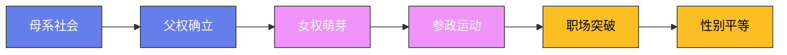

# 女性地位的历史变迁

## 一、史前：母系社会的辉煌

在人类文明的早期阶段，许多社会是母系的——血统和财产通过母亲传承。这并不是因为女性"统治"男性——而是因为早期人类不了解男性在生育中的作用。

**中国的仰韶文化**（约公元前5000年—前3000年）：仰韶文化遗址出土了大量女性雕像——这表明女性在当时的社会中享有崇高的地位。仰韶文化的社会组织可能是母系氏族——财产和地位通过母亲传承。

**纳西族的"走婚"**：中国云南的纳西族至今保留着"走婚"制度——男性晚上到女性家中过夜，白天回到自己家中。孩子由母亲和舅舅抚养——父亲不承担抚养责任。走婚制度是母系社会的活化石。

## 二、古代：父权制的建立

随着农业的出现和私有财产的产生，父权制逐渐取代了母系社会——男性成为家庭和社会的主导者。

**古代美索不达米亚**：《汉谟拉比法典》（约公元前1776年）规定了男性的主导地位——丈夫可以休妻，但妻子不能休夫。通奸的妻子会被处死——但通奸的男性不会受到惩罚。

**古希腊的女性地位**：古希腊女性的地位很低——雅典女性不能拥有财产、不能参与政治、不能接受教育。女性的主要职责是生育和管理家务——柏拉图在《理想国》中虽然主张男女平等，但他的观点在当时是异类。

**古罗马的女性地位**：古罗马女性的地位比希腊女性稍高——罗马女性可以拥有财产、经营商业和参与社交活动。但罗马女性仍然不能投票和担任公职——女性的政治权利在罗马也是缺失的。

**古代中国的"三从四德"**：中国古代对女性的要求是"三从四德"——"三从"是未嫁从父、既嫁从夫、夫死从子；"四德"是妇德、妇言、妇容、妇功。这些规范将女性束缚在家庭中——限制了她们的社会参与。

## 三、中世纪：基督教与伊斯兰教的女性观

**基督教的女性观**：基督教对女性的态度是矛盾的——一方面，夏娃是"诱惑者"，导致人类堕落；另一方面，圣母玛利亚是"纯洁"和"慈爱"的象征。中世纪的基督教强调女性的"顺从"——妻子必须服从丈夫。

**伊斯兰教的女性观**：伊斯兰教在初期改善了女性的地位——女性获得了继承权和财产权。但后来的伊斯兰社会对女性施加了更多的限制——如面纱（hijab）、一夫多妻制和性别隔离。

**中世纪欧洲的女性**：中世纪的欧洲女性在某些领域享有较高的地位——修女可以接受教育、经营修道院的财产。一些女王和女贵族在政治中发挥了重要作用——如英国的伊丽莎白一世（1533—1603年）和法国的凯瑟琳·德·美第奇（1519—1589年）。

## 四、近代：女权运动的兴起

**启蒙运动与女性权利**：启蒙运动强调"人人生而平等"——但启蒙思想家们对女性权利的态度是矛盾的。卢梭在《爱弥儿》中主张女性应该接受教育——但教育的目的是成为更好的妻子和母亲。玛丽·沃斯通克拉夫特（1759—1797年）在《女权辩护》中反驳了卢梭——她主张女性应该享有与男性平等的教育和政治权利。

**美国女权运动**：1848年，伊丽莎白·凯迪·斯坦顿在塞内卡瀑布会议上发表了《感伤宣言》——这是美国女权运动的起点。宣言模仿了《独立宣言》——"我们认为这些真理是不言而喻的：所有男人和女人生而平等。"1920年，美国宪法第19修正案赋予了女性投票权。

**英国女权运动**：英国女权运动的领袖是埃米琳·潘克赫斯特（1858—1928年）——她领导了"妇女社会政治联盟"，采用激进的方式争取女性投票权。潘克赫斯特多次被捕和绝食——她的斗争最终促成了1918年英国女性投票权的实现。

## 五、20世纪：女性解放

**避孕药的发明**：1960年，美国食品药品监督管理局（FDA）批准了第一种口服避孕药——"恩诺维德"。避孕药的发明是女性解放的里程碑——它使女性能够控制自己的生育，从而获得更多的人生选择。

**女性进入职场**：20世纪后半叶，越来越多的女性进入职场——但女性在职场中面临"玻璃天花板"（invisible barrier）的阻碍。女性的平均收入仍然低于男性——"性别工资差距"至今仍是全球性问题。

**女权主义的浪潮**：
- **第一波女权运动**（19世纪末—20世纪初）：争取投票权和财产权。
- **第二波女权运动**（1960年代—1980年代）：争取职场平等、生育权利和性别平等。
- **第三波女权运动**（1990年代至今）：强调多元性、交叉性和个体赋权。

## 六、当代：进展与挑战

**女性教育**：全球女性的受教育水平在过去几十年中显著提高——在许多发达国家，女性的大学入学率已经超过男性。但在一些发展中国家（如撒哈拉以南非洲和南亚），女性的受教育机会仍然有限。

**女性政治参与**：全球女性的政治参与水平有所提高——但仍然不足。截至2025年，全球只有约26%的国会议员是女性。一些国家（如北欧国家）的女性政治参与水平较高——但大多数国家的女性政治参与仍然有限。

**性别暴力**：性别暴力仍然是全球性问题——世界卫生组织估计，全球约三分之一的女性曾遭受过身体或性暴力。#MeToo运动（2017年）揭露了职场性骚扰的普遍性——它推动了社会对性别暴力的关注和反思。

## 七、女性地位的未来

女性地位的提高是一个漫长而曲折的过程——它需要法律的保障、教育的普及和文化的变革。正如联合国前秘书长科菲·安南所说："没有哪个工具比女性的赋权更能促进发展。"女性地位的提高不仅关乎女性——它关乎整个人类社会的进步。

## 八、中国古代的才女

在"女子无才便是德"的主流观念下，中国古代仍然涌现了一批才华横溢的女性——她们以文学、学术和政治才能，在男性主导的世界中留下了不可磨灭的印记。

**班昭与《汉书》**：班昭（约49—120年）是中国历史上第一位女历史学家。她的父亲班彪和哥哥班固是《汉书》的主要编纂者——班固去世时，《汉书》的八表和《天文志》尚未完成。汉和帝下诏命班昭续写——她圆满完成了这项工作，使《汉书》成为继《史记》之后中国最重要的史书。班昭还撰写了《女诫》七篇——这部作品原本是教导班家女儿的家训，但它后来成为封建社会女性教育的经典文本。《女诫》的核心主张是女性的"卑弱"和"敬慎"——这在后世被批评为强化了对女性的压迫。但值得注意的是，班昭本人是一位拥有卓越学术成就的女性——《女诫》可能是她在特定历史条件下的自保策略，而非真心认同女性的从属地位。

**李清照与宋词**：李清照（1084—约1155年）是中国文学史上最伟大的女词人——被誉为"千古第一才女"。李清照的词以"婉约"著称——"寻寻觅觅，冷冷清清，凄凄惨惨戚戚"（《声声慢》）是汉语文学中最令人心碎的开头。她与丈夫赵明诚共同收藏金石书画——两人过着"赌书消得泼茶香"的幸福生活。但靖康之变（1127年）打破了她的生活——金兵南下，赵明诚在逃亡途中病逝，李清照携带的大量金石书画在战火中散失殆尽。晚年的李清照在孤独和贫困中度过——但她的词作达到了更高的艺术境界。她不只是"婉约"——"生当作人杰，死亦为鬼雄。至今思项羽，不肯过江东"（《夏日绝句》）展现了一个女性在国破家亡之际的刚烈气节。李清照证明了：才华没有性别之分。

**谢道韫与咏絮之才**：谢道韫（约349—409年）是东晋著名的才女——她的叔父是淝水之战的总指挥谢安。谢道韫最著名的故事是"咏絮之才"——一次下雪时，谢安问子侄们："白雪纷纷何所似？"侄子谢朗说："撒盐空中差可拟。"谢道韫说："未若柳絮因风起。"这个比喻千百年来一直被视为天才灵感的典范。谢道韫嫁给了王羲之的儿子王凝之——但她对丈夫的才能并不满意，曾说："不意天壤之中，乃有王郎！"（没想到天地之间竟然有王凝平这样的人！）这种直言不讳的性格在古代女性中极为罕见。

## 九、武则天：中国唯一的女皇帝

武则天（624—705年）是中国历史上唯一的女皇帝——她的存在本身就是对"女子不得干政"传统观念的最有力挑战。

**从才人到皇帝**：武则天14岁入宫，成为唐太宗的才人（低级嫔妃）。太宗去世后，她按照惯例到感业寺出家为尼。但唐高宗李治对她念念不忘——将她接回宫中，封为昭仪。武则天凭借过人的政治智慧和果断手段，在宫斗中击败了王皇后和萧淑妃——655年被立为皇后。此后她逐渐掌握了朝政大权——高宗晚年多病，朝政实际上由武则天处理。690年，武则天废掉自己的儿子唐睿宗，自立为帝——改国号为"周"，成为中国历史上唯一一位正统女皇帝。

**武则天的政治成就**：武则天在位期间（690—705年），推行了一系列重要政策。她大力推行科举制度——首创"殿试"（皇帝亲自主持的考试），使更多寒门子弟有机会进入官僚体系。她重视农业生产——编纂了《兆人本业记》，指导农民耕作。她维护了边疆安全——击败了吐蕃和突厥的入侵。武则天的统治被后世称为"政启开元，治宏贞观"——她为唐玄宗的"开元盛世"奠定了基础。

**无字碑的争议**：武则天去世后，与唐高宗合葬于乾陵——她的墓前立着一块无字碑。为什么无字碑？千百年来众说纷纭。一种说法是武则天认为自己的功绩太大，无法用文字表达；另一种说法是武则天认为自己的过错太多，无法用文字辩护；还有一种说法是武则天将评判权留给了后人。无论真正原因如何，无字碑本身就是武则天性格的最好注脚——她是一个不按常理出牌的人。

## 十、日本的女性地位

日本女性地位的历史变迁是东亚文化中一个独特的案例——它既有"女帝传统"的辉煌，也有近代以来对女性权利的系统性压制。

**古代日本的女帝**：日本历史上曾出现过六位女天皇（八代）——其中推古天皇（554—628年，在位592—628年）是日本第一位正式的女天皇。推古天皇在位期间，圣德太子（574—622年）作为摄政推行了"十七条宪法"和"冠位十二阶"改革——这些改革奠定了日本中央集权国家的基础。持统天皇（645—703年）主持了日本从飞鸟时代向奈良时代的过渡——她实施了"大宝律令"，建立了系统的法律体系。这些女天皇的统治证明了女性同样具备卓越的治国能力。

**平安时代的女性文学**：平安时代（794—1185年）是日本女性文学的黄金时代。紫式部（约978—约1014年）创作了《源氏物语》——被誉为世界上第一部长篇小说。清少纳言（约966—约1025年）的《枕草子》是日本随笔文学的鼻祖——"春曙为最，渐转白的山顶，微露紫意"这样优美的句子流传千年。平安时代的贵族女性在文学上的成就远超同时代的男性——这在一个方面证明了女性的才华并不逊于男性。

**明治维新后的倒退**：明治维新（1868年）虽然使日本走上了现代化道路——但女性地位在某些方面反而倒退了。明治政府颁布的《明治民法》（1898年）将女性定义为"无行为能力人"——妻子的财产权、继承权和离婚权受到严格限制。1883年颁布的《娼妓取缔规则》虽然名义上是管理卖淫，但实际上是在制度化对女性身体的控制。明治政府的女性政策背后是"富国强兵"的国策——女性被视为生育"忠臣良民"的工具。

**战后的进步**：1945年日本战败后，在盟军占领当局的推动下，新宪法（1947年）赋予了女性完整的选举权和被选举权。1946年的战后首次大选中，39名女性当选国会议员——其中一位是长年从事妇女运动的市川房枝。但形式上的平等并未带来实质上的改变——日本社会中根深蒂固的性别观念仍然强大。直到今天，日本在世界经济论坛的"性别差距指数"中仍排名靠后（2023年排名第125位，在146个国家中）。日本女性在职场中面临严重的"天花板效应"——管理层中女性比例仅为约15%，远低于北欧国家的40%以上。

## 十一、印度的嫁妆制度

印度的嫁妆制度（Dowry）是南亚社会中最具争议性的传统之一——它不仅造成了严重的性别歧视，还导致了大量针对女性的暴力事件。

**嫁妆制度的历史根源**：印度的嫁妆制度有复杂的历史根源。在古代印度教传统中，嫁妆原本是女儿从父家继承的"份额"——因为女性通常不能继承不动产，嫁妆就成为她们的"移动财产"。但在历史演变中，嫁妆逐渐异化为一种"购买婚姻"的交易——男方家庭要求女方家庭支付大量现金、黄金和消费品，作为迎娶新娘的"对价"。嫁妆的金额取决于男方的社会地位、教育程度和职业——一个拥有美国绿卡的印度男性可以要求数十万美元的嫁妆。

**嫁妆死亡**："嫁妆死亡"（Dowry Death）是印度社会中最骇人听闻的现象之一——新娘因嫁妆不足而被丈夫或其家人杀害，通常以"厨房事故"（如炉灶爆炸）的形式伪装。印度国家犯罪记录局的数据显示：每年约有7000名女性死于嫁妆相关的暴力——这意味着每天约有20名女性因嫁妆问题被杀害。印度在1961年就颁布了《禁止嫁妆法》——但法律的执行力度极弱，嫁妆制度仍然在社会中根深蒂固。

**女权运动的抗争**：印度的女权运动对嫁妆制度进行了长期而艰苦的抗争。1972年，女权活动家维纳·马宗达创立了"反对嫁妆妇女论坛"——这是印度第一个专门针对嫁妆问题的民间组织。该组织的策略包括：在婚礼上举行抗议、向媒体揭露嫁妆暴力事件、推动立法改革。2010年代，社交媒体成为抗争的新工具——"StopDowry"运动在网络上获得了广泛关注。改变一种延续了数百年的社会习俗是极其困难的——但每一代人的抗争都在推动着观念的缓慢转变。

## 十二、非洲女性的处境

非洲大陆54个国家的女性处境千差万别——但一些共同的挑战（如割礼、早婚和教育不足）仍然普遍存在。

**女性割礼**：女性生殖器切割（FGM，Female Genital Mutilation）是非洲面临的最严重的人权问题之一。FGM包括对女性外生殖器的部分或全部切除——通常在没有任何麻醉和消毒的情况下进行。世界卫生组织估计，全球约有2亿女性接受过FGM——其中大多数分布在非洲的29个国家。在索马里，98%的女性接受过FGM；在几内亚，95%的女性接受过FGM。FGM的并发症包括：出血、感染、慢性疼痛、难产和心理创伤。联合国于2012年通过决议，呼吁在全球范围内消除FGM——但废除这一传统面临着巨大的文化阻力，因为许多社区将FGM视为女性成年和纯洁的标志。

**早婚**：在撒哈拉以南非洲，约40%的女孩在18岁前结婚——其中12%在15岁前结婚。早婚的后果是灾难性的：过早怀孕增加了母婴死亡的风险；早婚的女孩通常被迫辍学——这限制了她们的经济独立能力。尼日尔是全球早婚率最高的国家——76%的女孩在18岁前结婚。一些非洲国家已经开始采取行动——埃塞俄比亚在2005年将法定结婚年龄提高到18岁，并开展了大规模的反早婚宣传活动。到2023年，埃塞俄比亚的早婚率已从2005年的60%下降到约40%。

**非洲女性的政治参与**：在政治参与方面，一些非洲国家反而走在了世界前列。卢旺达是全球女性议员比例最高的国家——2023年，卢旺达下议院61%的席位由女性占据。这一成就的部分原因是1994年种族大屠杀后卢旺达男性人口锐减——但卢旺达政府也通过宪法规定了女性议员的最低比例。利比里亚的埃伦·约翰逊·瑟利夫在2005年成为非洲第一位民选女总统——她在2011年获得诺贝尔和平奖。这些例子证明了：即使在最困难的环境中，女性的政治领导力也可以绽放光芒。

## 十三、女性地位的反思

**结构性不平等**：女性面临的不平等不是孤立的——它与种族、阶级、宗教和国籍等其他形式的不平等交织在一起。黑人女性、贫困女性和宗教少数群体中的女性面临着多重压迫——这种"交叉性"（intersectionality）是美国法律学者金伯利·克伦肖在1989年提出的概念。理解女性地位必须理解这些交叉因素——否则分析就是不完整的。

**男性的角色**：女性地位的提高不仅是女性的事业——男性在其中也扮演着关键角色。父权制不仅压迫女性——它也限制了男性的情感表达和社会角色。"有毒男性气质"（toxic masculinity）——要求男性坚强、独立、不表露情感——对男性自身的心理健康也造成了伤害。真正的性别平等意味着：男性和女性都可以自由地选择自己的生活方式——不受刻板的性别角色的束缚。联合国的"HeForShe"运动（2014年由艾玛·沃特森发起）呼吁男性成为性别平等的盟友——这不是一场"女性对抗男性"的战争，而是所有人共同争取更公正社会的运动。

