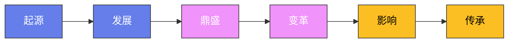

# 儒林外史：士人众生相

## 引言

吴敬梓以一部《儒林外史》，将科举制度下读书人的百态人生铺陈于纸上。
全书无一主角贯穿始终，却以数十个士人形象编织出一幅封建末世的精神全景图。
这些人物或疯或痴，或贪或伪，或狂或迂，无一不是科举体制对人性扭曲的活标本。

吴敬梓不做道德说教，只以白描手法让人物自己表演，讽刺的锋芒藏在不动声色的叙述之中。
范进的疯、周进的哭、严监生的手指、匡超人的堕落——每一个场景都像是从现实生活中直接截取的片段，没有一丝多余的修饰。
以下逐一剖析书中最具代表性的人物，看他们如何在功名利禄的漩涡中沉浮，又如何成为制度的牺牲品。

---

## 一、范进——中举发疯的深层悲剧

范进是全书最广为人知的形象。
他二十岁应考，考到五十四岁才中秀才，此后又蹉跎多年，终于在一次乡试中中举。
消息传来时，他正在集市上卖鸡换米糊口，回家看到报帖，竟欢喜得发了疯——拍着手大笑，一脚踩进泥塘里，披头散发，满身泥水，口中只喊"我中了"。

范进的发疯不是偶然的情绪失控，而是三十四年屈辱积压的总爆发。
在漫长的科举生涯中，他忍受着岳父胡屠户的辱骂、邻里的白眼、自身的穷困潦倒。
他的精神早已被压缩到了极限，中举的瞬间如同一个被压弯到极点的弹簧突然松开，反弹的力量将他的理性彻底击溃。
这一幕的讽刺在于：科举制度许诺读书人"朝为田舍郎，暮登天子堂"的美梦，但实现这个梦的代价却是精神的毁灭。

更深层的悲剧在于，范进中举前后的巨大落差暴露了整个社会的价值体系。
中举之前，他家断粮三天，母亲饿得两眼发昏，他不得不抱一只生蛋的母鸡去集市上卖。
中举之后，送田产的、送银子的、送房屋的纷至沓来，张乡绅立刻登门拜访，送上白银和一套宅院。
范进本人的才学、品格、能力没有任何变化，变化的仅仅是报帖上一个名字。
这种荒诞的反差说明：科举制度下的社会不认人，只认功名。

胡屠户的态度转变是另一重讽刺。
范进中秀才时，胡屠户拎着一副大肠来贺，席间不停教训女婿，说他"尖嘴猴腮"，不像做老爷的样子。
中举之后，同一个胡屠户提着七八斤肉、四五千钱登门，口口声声称范进"贤婿老爷"。
最精彩的细节是：范进发疯后，众人让胡屠户去打他一巴掌以治疯病。
胡屠户的手竟抖得打不下去，勉强打了之后手掌弯不过来，暗想果然是天上的文曲星打不得的。
前后两张面孔，精确地映射出整个社会以功名为标准衡量人的价值体系。

---

## 二、周进——老童生的号板之哭

如果说范进的故事是科举成功者的疯狂，那么周进的故事则是科举失败者的绝望。
周进六十多岁仍是童生，在薛家集教私塾糊口，受尽冷眼。
新中的秀才梅玖当面嘲笑他，举人王惠在席间对他颐指气使，连学生们都不把他放在眼里。
一个教书先生，因为没有功名，在自己赖以为生的行当里也抬不起头。

一次偶然的机会，他随商人进贡院参观，看到自己一辈子梦寐以求却从未进入的号舍。
积压一生的委屈如决堤洪水般涌出，他伏在号板上放声大哭。
哭了一阵又是一阵，众人劝不住，直哭到口里吐出鲜血来。
这一哭，哭的不是一时的悲伤，而是六十年蹉跎岁月的总清算。
号板——科举考试的物质载体——对于周进来说既是希望的象征，也是耻辱的见证。
他一生的努力都指向这几尺见方的狭小空间，却始终未能踏入其中。

周进的哭有一种原始的、动物性的悲痛，不是文人的伤春悲秋，而是一个被命运反复碾压的人终于找到一个可以释放的缺口。吴敬梓写他"哭了一阵又是一阵"，写他"口里吐出鲜血"，用的是最朴素的白描，却产生了最强烈的感染力。读者在这里笑不出来，因为周进的痛苦太真实了——那是一个人用一生的时间去撞一堵墙，撞到头破血流也没有撞开的绝望。

周进后来靠几个商人的资助捐了个监生，得以参加乡试，一路考中进士，做了国子监司业。
命运的转折如此荒诞——决定一个读书人一生沉浮的，不是才学，而是金钱。
商人凑钱替他买了一个考试资格，他便从被社会抛弃的老童生一跃成为受人尊敬的学官。
那些没有商人资助的穷书生呢？他们只能像周进未被资助前那样，在屈辱中默默老去，连哭的机会都没有。

吴敬梓安排周进与范进的故事前后相接，构成一组精妙的对仗。
一个考到老才中，一个考到疯才中；一个靠钱买资格，一个靠运气得功名。
两条路径，同一个终点，指向同一个结论——科举制度所谓"选贤与能"不过是一场精心包装的赌博，赌注是人的一生。

---

## 三、严监生——两根手指的吝啬密码

严监生临死前伸出两根手指不肯咽气，家人猜了许多——是还有两个亲人未见？
是还有两笔银子未交代？都不对。
最后赵氏猜中：油灯里点着两茎灯草，太费油了。
挑掉一茎，严监生才安然闭目。
这个细节让严监生成为中国文学中最著名的吝啬鬼形象，与葛朗台、阿巴贡、夏洛克并列世界文学画廊。

但细读全书会发现，严监生的吝啬并非单纯的个人品性缺陷，而是中小地主在科举体制下的生存焦虑的外化。
他一生节俭度日，家财万贯却从不舍得享用，因为他深知这些财产来之不易。
他更深知在功名等级森严的社会里，没有功名庇护的财富随时可能被吞噬。
他的吝啬本质上是一种不安全感——一个没有功名的富人在官绅面前毫无自保能力，唯有紧握手中的银子才能获得一点可怜的安全感。

书中写到严监生替哥哥严贡生平息官司，花钱消灾，战战兢兢地四处打点。
他明明家财远胜于哥哥，却在哥哥面前唯唯诺诺，不敢有半句怨言。
这不是因为他天性懦弱，而是因为他深知：在这个社会里，有钱无权的富人是有功名的恶人的天然猎物。
他的吝啬和懦弱是同一枚硬币的两面——都是缺乏功名保护的弱者在丛林法则下的生存策略。

更具悲剧性的是，他省吃俭用攒下的家业，最终被哥哥严贡生巧取豪夺。
他一生小心翼翼，临终连一茎灯草都舍不得多烧，而他死后，那个横行霸道的哥哥却轻而易举地霸占了他的田产、欺负他的遗孀。
吝啬者用一生节俭换来的，不是安稳，而是被人觊觎的猎物。
这才是严监生真正的悲剧——在弱肉强食的封建社会，守财本身就是一种无力的挣扎。
那两根手指，指向的不是一茎灯草，而是整个让守法者无法自保的社会制度。

---

## 四、严贡生——横行乡里的伪君子

严贡生是严监生的哥哥，与弟弟的谨小慎微形成鲜明对比。
他行事霸道，满口仁义道德，实际无恶不作。
他最经典的劣迹是强占邻居的猪：邻居的猪跑到他家，他便据为己有，邻居来讨，他反要邻居付饲养费。
他赖掉船钱——坐船到家后假装摔倒，赖船家颠簸了他，不仅不付钱反而要船家赔偿。
他讹诈乡民、霸占弟弟的家产，种种行径令人发指。

严贡生的可怕之处不在于他的恶行本身，而在于他始终以读书人的体面自居。
他开口闭口"我们乡绅人家"，言谈举止端着一副道德楷模的架子，却干着连泼皮无赖都不如的勾当。
他是科举制度培养出的另一类产物——功名给了他社会地位和法律特权，却没有给他任何道德约束。
他深谙"有功名便有道理"的游戏规则，因此肆无忌惮地利用自己的贡生身份欺压百姓、攫取利益。

严贡生最阴毒的行为是在弟弟死后对赵氏的欺凌。严监生在世时他不敢公然动手，弟弟一死他立刻换了一副面孔。他声称赵氏只是妾室没有资格继承家产，要将自己的儿子过继为严监生的嗣子从而吞并全部家业。这不是一时的贪念，而是蓄谋已久的掠夺。

严监生与严贡生的兄弟对照是吴敬梓精心设计的讽刺结构。
一个吝啬到死，一个贪婪无度；一个胆小怕事，一个横行霸道。
然而最终的结局却是吝啬者含冤而死、贪婪者坐享其成。
这个颠倒的结局无情地揭示了封建社会的运行逻辑：善良和节俭不能自保，强权和无耻才是生存之道。

---

## 五、杜少卿——吴敬梓的精神自画像

杜少卿是全书中最接近作者自身形象的人物。
他出身官宦世家，祖父是状元，家财丰厚，为人豪爽仗义，广交朋友，慷慨散金。
他不愿做官，拒绝了朝廷的征辟，宁可过清贫自在的生活。
他携妻游山，饮酒赋诗，蔑视功名利禄，在满目疮痍的儒林中显得格格不入。

杜少卿身上寄托着吴敬梓的理想人格：真性情、重义轻利、不为世俗所累。
他对朋友的慷慨近乎不计后果——有人来借银子他明知不还仍照借不误，有人落难来投奔他二话不说就收留。他的豪爽不是做给人看的，而是发自内心的性情流露。在一个人人戴着面具表演的儒林中，杜少卿是少有的真面孔。

但吴敬梓并没有将他写成一个完美的圣人。
杜少卿的豪爽有时近乎挥霍无度，他的仗义常常被骗子利用，他散尽家财之后陷入困顿，不得不靠典当度日。
他曾对妻子说"我把产业都变卖了，你跟着我过苦日子"，妻子竟欣然同意。
这种安排反映了吴敬梓的清醒认知：在一个以功名利禄为核心价值的社会里，真诚和慷慨注定是一种"不合时宜"的品质，坚守这种品质的代价就是被边缘化、被贫困吞噬。

杜少卿的存在为全书的讽刺基调提供了一个参照系。
正是因为有了他的真，才更显出范进的疯、严贡生的恶、匡超人的伪的荒谬。
他不是解决之道，而是一个清醒的旁观者和无力的反抗者——他看透了科举制度的虚伪，却无力改变它，只能选择退出。
杜少卿最终搬到了南京，过着穷困但自在的日子，这恰恰是吴敬梓本人晚年生活的写照。

---

## 六、马二先生——八股选家的悲哀

马二先生（马纯上）是杭州有名的八股文选家，一生致力于编选八股文范文，指导士子应考。
他学问扎实，为人真诚善良，却将全部才华倾注在一项本质上毫无创造性的工作上。
他的悲哀不在于他做得不好，而在于他做得太好——他把八股文的技法研究得炉火纯青，却从未意识到这套技法本身是对思想和创造力的戕害。
他是科举制度最忠实的仆人，也是最深重的受害者。

马二先生游西湖一段是全书最精彩的讽刺篇章之一。
他走在西湖美景之中，满眼看到的不是湖光山色，而是沿途卖食的店铺和茶楼里的八股文选本。
路过苏堤春晓、断桥残雪，他视若无睹；看到茶馆里有人谈论八股文章，他却如获知音，立刻凑上前去。
一个文人面对天下第一等山水，心中所想所念竟然只有功名和八股，这不是个人的审美缺陷，而是科举制度对一整个阶层精神世界的全面占领。
当一种教育制度能让读书人丧失审美能力、丧失对自然之美的感受力时，它的异化力量已经深入骨髓。

马二先生的善良恰恰加深了他的悲剧性。
他真心帮助匡超人，传授八股文技法，资助其应考，如同一个父亲对待自己的孩子。
他不知道的是，他培养出的这个年轻人日后将成为全书中最无耻的文人。
马二先生以真诚之心做了一件客观上助纣为虐的事情，这正是科举制度的系统性悲剧——它不仅扭曲了受教育者，也扭曲了教育者。

更令人唏嘘的是，马二先生本人并不富裕，他选八股文的收入勉强糊口，却仍然慷慨资助匡超人。
他的善良是真实的，他的贫穷也是真实的，而他帮助匡超人所进入的那个功名世界，恰恰是他自己一生困顿的根源。
他像一个虔诚的传教士，把信徒送进了天堂，自己却始终站在天堂的门外。

---

## 七、匡超人——从淳朴到无耻的堕落轨迹

匡超人是全书中人格变化最为剧烈的人物，也是吴敬梓刻画最为精细的讽刺对象。
他出场时是一个淳朴孝顺的乡村少年，白天杀猪卖豆腐，晚上在灯下苦读，侍奉卧病在床的老父亲。
父亲半夜要方便，他小心翼翼地背起老人，不让父亲受一点委屈。
这是一个理想化的起点——匡超人最初的样子，正是科举制度许诺给天下读书人的美好图景：通过个人奋斗改变命运的善良青年。

然而随着他一步步踏入功名的世界，他的人格开始系统性地崩塌。
第一阶段，他在杭州结识了一帮假名士，学会了附庸风雅和投机钻营。
这些人表面上吟诗作赋、高谈阔论，实际上互相吹捧、沽名钓誉。
匡超人在这种环境中迅速蜕变，从一个朴素的乡下少年变成了一个油滑的城市混混。

第二阶段，他为了攀附权贵，抛弃了与自己患难与共的糟糠之妻，入赘豪门。
第三阶段，他冒名顶替、伪造身份，在外招摇撞骗，甚至对曾经提携自己的马二先生恩将仇报。
每一步堕落都不是突然发生的，而是在功名利禄的诱惑下一点一点妥协的结果。
吴敬梓通过匡超人的轨迹揭示了一个残酷的真相：科举制度不是在选拔人才，而是在批量生产伪君子。

吴敬梓用极其耐心的笔法，记录了匡超人每一次道德滑坡的具体情境：第一次撒谎时他还有些不安，第二次便坦然了许多，到后来连一丝犹豫都没有了。这种渐进式的堕落比突然的堕落更加可怕，因为它说明恶不是一种选择，而是一种在特定环境中几乎不可避免的演变。

匡超人的堕落尤其令人痛心之处在于，他并非天生卑劣。
他的转变有清晰的因果链条：贫穷使他渴望功名，功名需要他学会钻营，钻营使他丧失底线，丧失底线使他彻底沦为无耻之徒。
每一个环节都有"合理性"，每一步妥协都有"不得已"的借口，但串在一起便构成了一条通往人格毁灭的不归路。
这正是吴敬梓最深刻的批判：制度性的恶不需要恶人来执行，它只需要给普通人一个接一个"合理"的理由。

---

## 八、王冕——开篇的理想灯塔

全书以元末明初的王冕开篇，他是一个自学成才的画家和隐士。
他出身贫寒，替人放牛为生，却在牛背上自学绘画，终成一代名家。
他画的荷花"精神、颜色无一不像"，名动一方。
达官贵人纷纷来求画，他一概不理；朱元璋做了皇帝，派人来征召他做官，他连夜逃入会稽山中，隐居以终老。

吴敬梓将王冕置于卷首，用意深远：以一个不慕功名、保持独立人格的理想人物为全书定下价值坐标。
然后用后面数十个被功名扭曲的人物来反衬这个理想的可望而不可即。
王冕的人生选择——以才华自立、拒绝功名、归隐山林——在科举制度确立之后几乎成为绝响。
他是一个参照物，也是一种挽歌。

王冕的存在构成了一组根本性的对照。
他代表了读书人的另一种可能——不以科举为人生唯一出路，不以功名为衡量价值的唯一标准，凭借自身的才华和人格尊严安身立命。
全书以王冕始，以四个市井奇人终（季遐年写字、王太下棋、盖宽作画、荆元弹琴），首尾呼应。
这暗示真正的才情和品格存在于体制之外的边缘人身上，而体制之内的"成功者"们反而是精神上的废墟。

值得注意的是，王冕的故事发生在元末明初，科举制度尚未完全固化，社会还有一定的缝隙容纳这样的人物。
而全书正文所写的时代，科举已经深入人心，成为社会运转的核心机制，王冕式的人物再无容身之地。
吴敬梓以时间的落差暗示了一种历史性的悲哀：制度一旦确立，便会吞噬一切反对它的力量，留给个人的选择空间越来越小。

---

## 九、科举制度对精神世界的系统性扭曲

纵观全书，科举制度对读书人精神世界的扭曲至少体现在三个层面。

**第一，价值的单一化。**
科举将"功名"确立为衡量人生价值的唯一尺度，读书的目的不再是修身齐家、明理致知，而是"书中自有黄金屋，书中自有颜如玉"。
范进中举前后判若两人的社会待遇、周进因功名有无而遭受的天壤之别，都在宣告一个残酷的信号：在这个社会里，人不是人，人是功名的附属物。
一个读书人的价值不是由他的才学、品德、贡献决定的，而是由他是否拥有功名、拥有什么级别的功名决定的。
这种单一的价值尺度将无数读书人逼上了一条独木桥，桥的对面是荣华富贵，桥的下面是万丈深渊。

**第二，人格的表演化。**
当功名成为唯一目标，道德便沦为获取功名的工具。
匡超人的孝顺从真心变成了表演，严贡生的仁义从信念变成了伪装，那些假名士们的风雅从性情变成了招牌。
整个士人阶层陷入了一种集体性的精神分裂：口中说的是圣贤之道，行的是蝇营狗苟之事，而且这种分裂已被社会默许为常态。
当一个社会的精英阶层普遍处于言行不一的状态时，这个社会的道德根基就已经腐烂了。

**第三，审美的荒漠化。**
马二先生游西湖而不见山水，鲁编修只会用八股文的眼光评判一切文字。
科举制度不仅摧毁了读书人的道德感，也摧毁了他们的审美能力和感受力。
当一个教育体制能让读书人对美视而不见、对善无动于衷时，它制造的就不是人才，而是精神上的残疾人。
更为深刻的是，这种审美荒漠化不是个别人的缺陷，而是整个阶层的集体病症——不是某个人看不见西湖的美，而是整个制度让所有读书人都看不见了。

---

## 十、各色人物的讽刺意义与吴敬梓的创作意图

吴敬梓的讽刺从不流于脸谱化。
范进不是单纯的可笑之人，他的疯癫背后是三十四年的精神酷刑。
严监生不是单纯的吝啬鬼，他的抠门背后是中小地主的生存恐惧。
匡超人不是天生的坏人，他的堕落是一个善良青年被制度一步步吞噬的过程。
马二先生不是迂腐的老学究，他的真诚恰恰使他的悲剧更加令人心酸。
这种"哀其不幸"与"怒其不争"并存的笔法，使《儒林外史》的讽刺远远超越了嘲讽的层次，达到了悲悯的高度。

吴敬梓本人出身于科举世家，他自己也曾参加科举、也曾热衷功名，最终在看清制度的本质后选择了决裂。他散尽家财移居南京，靠卖文和朋友接济度日，晚年穷困潦倒。这种亲身经历赋予了他独特的写作视角——他不是站在体制外面冷嘲热讽的旁观者，而是从体制内部走出来、以切肤之痛书写反叛的参与者。他笔下的人物没有一个是完全可恨的，也没有一个是完全无辜的，因为他们都是同一个制度的产物和受害者。

全书的艺术结构本身就是一种讽刺手法。没有统一的主角，没有贯穿的情节，人物走马灯般登场又退场——这种松散的结构恰恰映射了科举制度下士人阶层的精神状态：没有共同的理想，没有真正的团结，每个人都在功名的棋盘上各自为战。范进中举后便消失在视野中，周进做了官便不再被提及——每个人物都只是制度机器上的一颗螺丝钉，拧紧了便发挥作用，报废了便被丢弃。

《儒林外史》的终极追问不是"这些人怎么这么可笑"，而是"是什么样的制度，把这些人变成了这样"。
吴敬梓以数十个士人形象汇聚成一面巨大的镜子，照出的不是个人的丑态，而是整个科举体制——乃至整个封建价值体系——的荒诞与残忍。
这部书写于两百多年前，但它所揭示的"制度如何异化人"的命题，至今仍有穿透时代的力量。

