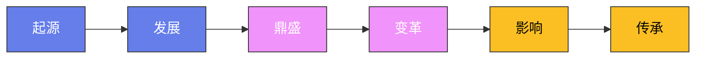

# 封神演义：权力博弈与人物动机

## 一、纣王：从英明天子到亡国暴君（30-40行）

纣王帝辛并非生来昏庸。小说开篇交代他"托梁换柱，力大无比，天资聪敏，辩才过人"，
是商汤数百年基业中最被看好的继承者。即位初期，四海升平，诸侯臣服，朝中有关闻太师、
比干丞相、武成王黄飞虎等一干能臣辅佐，国力处于鼎盛。这样一个文武双全的君主，何以
在短短数年间走向覆灭？小说给出的答案是：一次失控的欲望，打开了通往深渊的闸门。

女娲宫进香是全书的转折点。纣王在女娲宫见到圣像，竟生出轻薄之念，在粉墙上题写
亵渎之诗。这一举动表面上是色欲之祸，深层却暴露了纣王性格中最致命的缺陷——对权力
的绝对自信让他丧失了对神明的敬畏。他认为天下万物皆可为己所用，连上古神灵也不例外。
女娲大怒，欲亲自前往朝歌兴师问罪，却被两道红光阻住——那是殷商尚存的气运。于是女
娲派出轩辕坟三妖（千年狐狸精、九头雉鸡精、玉石琵琶精）入宫惑乱，以此加速商朝气数
的终结。纣王的一念之差，不仅为自己招来了灭亡的种子，更打开了妖邪入宫的大门。

妲己入宫后，纣王的变化是渐进而不可逆的。最初只是沉迷美色、荒废朝政；继而开始
疏远忠臣、亲近佞幸；最终发展为系统性的残暴统治。炮烙之刑是纣王暴政的标志性符号——
将铜柱烧红涂油，令犯人赤足行走其上，坠入炭火中活活烧死。这不仅仅是惩罚，更是一种
权力的表演：纣王通过极端的残忍来震慑群臣，让所有人不敢再进谏直言。酒池肉林则代表
了欲望的无底洞——在巨大的酒池中泛舟嬉戏，将肉悬挂成林，日夜宴饮，完全沉溺于感官
的放纵之中。虿盆更为恐怖，将活人投入满是毒蛇的深坑，看着受刑者在毒蛇啃咬中痛苦死
去，纣王与妲己在旁饮酒观赏。这三种刑罚构成了一套完整的暴政逻辑：炮烙镇压异见，酒
池肉林满足私欲，虿盆取乐消遣。

然而纣王并非完全丧失了人性。小说中有多处细节暗示他内心的挣扎：杀比干时他犹豫过，
黄飞虎反出朝歌时他懊悔过，甚至在鹿台自焚前，他对着空旷的大殿说出了"悔不听忠谏之
言"的话。纣王是一个被欲望和权力异化的人，而非天生的恶魔。正因如此，他的悲剧才具
有警示意义——再英明的君主，一旦突破底线，便会以加速度坠入深渊，再无回头之路。

最终，周军兵临城下，纣王独自登上鹿台，穿戴整齐，纵火自焚。他至死不肯投降，保
持着最后的帝王尊严。这个结局既是天命的裁决，也是纣王性格的必然——一个至高无上的
王，绝不会允许自己成为阶下之囚。

## 二、妲己：被指派的祸水与真正的施害者（30-40行）

妲己的身份极为特殊：她本是轩辕坟中修炼千年的狐狸精，受女娲之命附身于冀州侯苏
护之女苏妲己，入宫迷惑纣王，加速商朝灭亡。这个设定赋予了她双重身份——她既是女娲
计划的执行者，也是一个有着自身欲望和算计的独立妖精。

女娲的命令很明确：惑乱君心，使纣王荒废国政，但不可残害无辜生灵。然而妲己入宫
后，很快就超出了女娲的授权范围。她不仅仅是"惑君"，更主动设计残害忠良。炮烙之刑
的构想出自她手，虿盆的毒蛇是她建议投放的，姜王后被挖眼烙手是她亲自审讯的结果，伯
邑考被剁成肉酱制成肉饼送给姬昌也是她的计策。这些行为远远超出了一只妖精执行上级任
务的范畴，暴露了她内心深处的权力欲和虐待本能。

妲己为何如此残暴？小说给出了几层解读。第一层是妖性：狐狸精本就狡诈多疑，千年
的修行让她的智慧足以在人间宫廷中游刃有余，但妖的本性让她对人类的痛苦缺乏共情。第
二层是安全感的缺失：她以假身份混入宫廷，随时可能被识破，所以她必须通过极端手段清
除所有可能威胁自己的人。第三层是权力的快感：纣王对她的言听计从让她体会到了操控天
下至尊者的满足感，这种快感会上瘾，驱使她不断试探权力的边界。

妲己对纣王的感情是复杂的。一方面她确实履行了惑君的使命，另一方面她在与纣王的
相处中产生了某种依恋。小说中多处描写纣王与妲己饮酒作乐时的默契，以及妲己在纣王受
挫时流露出的焦虑。但这种感情并非爱情，而更像是同类之间的惺惺相惜——两个都在享受
权力快感的人，互相成为对方的共犯。妲己用美色控制纣王，纣王用皇权庇护妲己，二人形
成了一种共生关系，彼此依赖，互相成全。

妲己的结局极具讽刺意味。周军攻入朝歌后，她试图逃回女娲处寻求庇护，却被女娲亲
手拿下，交由姜子牙处置。女娲的翻脸不认人揭示了一个残酷的真相：妲己从一开始就是弃
子。她被派去执行一项注定被清算的任务，无论做得好还是做得坏，最终都不会有善终。姜
子牙在斩妖台上将她处死，狐狸精的千年修行化为乌有。

妲己的悲剧在于：她以为自己在掌控局面，实际上她和纣王一样，都不过是天命棋局中
的棋子。她既是施害者，也是受害者——被女娲利用，被纣王依附，最终被天命抛弃。

## 三、姜子牙：天命的执行者与世俗的智者（30-40行）

姜子牙是《封神演义》中最核心的人物，他的身份是封神大业的总执行人——代天封神，
辅佐明君，完成商周鼎革。他的存在贯穿全书始终，是连接仙界与人间的枢纽。

姜子牙的早年并不顺利。他三十二岁上昆仑山，拜元始天尊为师，在山上修行四十年，
却始终未成仙道。元始天尊告诉他："你生来命薄，仙道难成，只可受人间之福。"这句话
看似残酷，实则是天命的安排——姜子牙注定不是仙人，而是人间改朝换代的推动者。被遣
下山后，他投奔旧友宋异人，娶妻马氏，尝试过卖面、卖笊篱、开饭店等营生，全部失败。
马氏嫌他无能，与他和离。这段经历塑造了姜子牙的性格：他尝尽了人间的酸甜苦辣，比任
何仙人都更懂世俗的运行法则。七十二岁下山，前半生几乎全是失败，这种磨砺让他具备了
超乎常人的耐心和韧性。

渭水垂钓是姜子牙命运的转折点。他在渭水之滨以直钩垂钓——"宁在直中取，不向曲
中求"——等待明主的到来。周文王姬昌梦见飞熊入怀，出猎寻访，于渭水边遇到姜子牙。
文王亲自为他拉车八百步，姜子牙告诉他："你拉我八百步，我保你周朝八百年。"这段佳
话的背后是精心的布局：姜子牙深知文王求贤若渴，直钩垂钓本身就是一场以退为进的政治
表演，他用最朴素的方式将自己包装成世外高人，一出场便占据了道德和智慧的制高点。

入周之后，姜子牙展现了非凡的政治才能和军事谋略。他辅佐文王积聚国力，又在文王
去世后辅佐武王姬发，在牧野之战中一举击溃商军。他既是运筹帷幄的军师，又是身先士卒
的统帅——面对截教仙人的各种法宝阵法，他凭借元始天尊赐下的打神鞭和杏黄旗屡屡化险
为夷。他的领导风格是冷静而务实的：不追求个人的武力表现，而是专注于全局的战略部署。

姜子牙最核心的使命是执行封神榜。封神榜由元始天尊拟定，上面列有三百六十五位正
神的名额。这些名额需要用在商周大战中阵亡的仙人和将领的灵魂来填充。换句话说，这场
大战中的所有牺牲者，无论是商朝的忠臣还是截教的门人，他们的死都是封神榜的"材料"。
姜子牙深知这一点，所以他面对战友的死亡时往往表现得异常冷静——不是冷血，而是他理
解这些死亡在天命中的意义。他的冷静背后是一种深沉的悲悯：他知道这些人必须死，但也
知道他们的死并非毫无价值。

封神完毕后，姜子牙自己却未能封神。元始天尊将打神鞭交还，让他享受人间富贵，最
终以齐侯之尊终老。这个结局暗含深意：姜子牙是操盘手，不是棋子。他设计了封神的棋局，
却拒绝成为棋局中的一员，因为他从一开始就知道——真正的自由，不在天庭的编制里。

## 四、哪吒：叛逆之子的毁灭与重生（20-30行）

哪吒的故事是《封神演义》中最惨烈、最动人的篇章，其核心是一个关于父子关系、自
我认同和肉体牺牲的悲剧。

哪吒的来历非凡。他是灵珠子转世，由陈塘关总兵李靖之妻殷夫人怀胎三年六个月方才
降生。出生时是一个肉球，李靖以为是妖孽，拔剑劈开，哪吒从中跃出。这个出生方式就预
示了父子关系的紧张——李靖从一开始就对这个孩子心存芥蒂，认为他的降生不祥。这种猜
疑像一根刺，深深扎在父子关系的根基之上，此后再未拔除。

闹海杀龙是哪吒命运的引爆点。七岁的哪吒在九湾河洗澡，混天绫搅动了东海龙宫。
巡海夜叉李艮前来喝问，被哪吒用乾坤圈打死。龙王三太子敖丙率兵来战，被哪吒剥皮抽
筋。这段情节中，哪吒展现出了超乎年龄的战斗力和毫不留情的杀伐果断。他并不是有意挑
衅，但他的力量远超他能控制的范围——一个七岁的孩子，手持太乙真人赐予的至宝，面对
冲突时只会用最直接的方式解决问题。敖丙的龙筋被他抽出来，打算做成腰带献给父亲，这
个天真的想法背后是一个孩子渴望被父亲认可的本能。

然而李靖的反应令哪吒心碎。东海龙王敖光上天庭告状，要水淹陈塘关。李靖的第一反
应不是保护儿子，而是逼哪吒自尽以谢罪。哪吒在绝望中喊出了全书最震撼的一句话："爹
爹，你的骨肉，我还给你，我不连累你！"随后他以剑自刎，剔骨还父，割肉还母，将生命
还给了父母。这一幕的惨烈在于：哪吒用自己的肉体毁灭来证明自己不欠父母任何东西——
既然你们认为我是负担，那我把这条命还给你们。

太乙真人用莲藕为哪吒重塑肉身，莲花化身让他摆脱了凡胎，从此不再受父母血缘的束
缚。重生后的哪吒第一件事就是追杀李靖——他要报复父亲的冷酷。燃灯道人赐给李靖一座
玲珑塔，用塔中的三昧真火镇住哪吒，迫使他认父。这段父子和解的过程充满了权力的意味：
哪吒的屈服不是因为原谅，而是因为力量的不对等。玲珑塔的存在让李靖永远握有压制哪吒
的筹码，父子之间的裂痕从未真正弥合，只是被外力强行弥缝。

哪吒的故事是全书对父权最尖锐的拷问：一个孩子为了证明自己的价值而毁灭自我，重
生后又被同一套权力结构重新束缚。他始终没有获得真正的自由。

## 五、杨戬：封神第一战将（15-20行）

杨戬，号清源妙道真君，玉鼎真人的得意弟子，是封神大战中阐教阵营最可靠的战斗力。
他的核心能力是八九玄功——七十二般变化，能化为飞禽走兽、花草树木、男女老幼，在战
场上几乎立于不败之地。这种变化之术不仅仅是障眼法，而是真正的形神俱变，连气息和法
力波动都能随之改变，让敌人无法辨别真伪。

杨戬出场较晚，但一旦登场便成为战场的中流砥柱。他第一次亮相就击败了魔家四将，
此后在多次关键战役中发挥决定性作用。与哪吒的暴力美学不同，杨戬的战斗风格以智取为
主、力战为辅。他善于变化潜入敌阵，刺探情报，从内部瓦解对手。面对截教仙人层出不穷
的法宝，杨戬往往能凭借变化之术避开锋芒，找到破绽一击致命。他是全书中最接近"完美
战士"形象的角色——冷静、高效、不拖泥带水。

杨戬最具传奇色彩的战绩是担山赶日、斧劈桃山。他母亲是玉帝的妹妹，因私配凡人被
压在桃山之下。杨戬劈山救母的故事比哪吒闹海更早，也更深地体现了他对抗权威的勇气。
但与哪吒不同，杨戬的反抗是理性的、有策略的——他没有和天庭硬碰硬，而是通过修炼强
大自身，最终以实力赢得了谈判的筹码。这段经历让他明白了力量才是改变命运的根本。

在封神大战中，杨戬始终保持着冷静和克制。他不像哪吒那样冲动，也不像雷震子那样
单纯，他更像是一个职业军人——接受任务、完成任务、不问缘由。这种态度让他成为姜子
牙最信赖的部下，也让他在残酷的战场上始终保持着清醒的判断力。封神之后，杨戬肉身成
圣，不受封神榜约束，成为极少数既参与了封神大战又保持了自由身的人物之一。

## 六、申公豹：搅局者与悲剧叛徒（15-20行）

申公豹是《封神演义》中最具争议性的人物之一。他与姜子牙同为元始天尊门下，却走
上了截然相反的道路。小说给出的理由是申公豹嫉妒姜子牙获得了封神的重任，于是叛出阐
教，投奔截教通天教主，利用截教的力量对抗姜子牙。但嫉妒只是表象，更深层的原因是他
对整个封神计划的不满。

申公豹最著名的特征是他那句"道友请留步"——每当他遇到截教门人，便以此话开头，
挑拨离间，怂恿对方下山与姜子牙作对。这句话在小说中反复出现，几乎成了截教仙人走向
毁灭的丧钟。每一个被申公豹"留步"的道友，最终都难逃在封神大战中阵亡、灵魂上榜的
结局。申公豹以一己之力，将大量截教门人拖入了这场本来可以避免的战争。他的口才和煽
动力是全书中最可怕的能力——比任何法宝都更具杀伤力。

申公豹的动机并非单纯的嫉妒。他代表的是阐教内部的异见力量——他不满元始天尊的
偏心，不满封神榜的设计将截教门人当作"耗材"，更不满整个封神大业背后的权力算计。
他的反叛本质上是对既定秩序的抗议，尽管这种抗议最终被证明是徒劳的，甚至适得其反——
他的搅局反而加速了截教的覆灭，让更多的截教门人成为封神榜上的名字。

申公豹的结局颇具黑色幽默。封神完毕后，他被塞进了北海之眼，永世不得翻身。一个
试图反抗命运的人，最终被命运以最残酷的方式囚禁。他的悲剧在于：他看清了封神大业的
本质，却没有找到正确的反抗方式——他的搅局不仅没有改变结果，反而让更多的无辜者成为
了牺牲品。

## 七、封神榜的权力博弈（15-20行）

封神大战表面上是商周之争，实质上是一场涉及天庭、阐教、截教、人间四方的权力重
组。要理解这场博弈，必须从天庭的困境说起。

昊天上帝是天庭之主，但他的天庭几乎是一个空壳——缺乏足够的神职人员来运转庞大
的天地秩序。三百六十五个正神之位空缺，天庭的行政系统处于瘫痪状态。昊天上帝需要"招
工"，但仙人们自由自在，谁愿意去天庭当公务员受约束？于是昊天上帝与元始天尊、太上
老君达成了一个协议：借商周鼎革之机，用战死者的灵魂来填充天庭的编制。这就是封神榜
的本质——一张天庭的招聘启事，招聘的方式是战争。仙界的权力真空，需要人间的鲜血来
填补。

阐教和截教的对立由此被激化。阐教（元始天尊为首）主张精英主义，门人数量少但质
量高；截教（通天教主为首）主张有教无类，门人数量庞大但良莠不齐。封神榜需要大量的
灵魂来填坑，截教门人数量众多，自然成了最大的"供应商"。元始天尊将封神榜交给姜子
牙执行，本质上就是让阐教来主导这场收割截教的战争。截教的"有教无类"在平时是胸怀
天下的美德，在封神大业面前却成了致命的弱点——门人越多，被收割的就越多。

通天教主并非不知道这个阴谋，但他选择相信"公平竞争"——他告诫门人不要下山参
与商周之争，以免被卷入封神榜。然而申公豹的挑拨、门人的义气用事，让截教门人一批又
一批地奔赴战场，最终几乎被一网打尽。通天教主最后亲自出手布下诛仙阵、万仙阵，试图
扭转局面，却因太上老君和准提道人的联手干预而失败。截教从此一蹶不振，门人十去七八。

商周鼎革在这场博弈中扮演的是人间舞台的角色。商朝的气数已尽，周朝当兴——这是
天命，无人能改。纣王的暴政、妲己的蛊惑，都是天命自我实现的手段。姬昌、姬发父子不
过是天命的载体，真正推动历史车轮的是仙人们在幕后的角力。

封神榜揭示了一个冷酷的权力逻辑：所有的牺牲都是被设计的，所有的反抗都是徒劳的。
无论是纣王的挣扎、妲己的算计、哪吒的叛逆还是申公豹的反叛，最终都在天命的棋局中被
消解。封神榜上的三百六十五位正神，不是胜利者的奖赏，而是权力重组的代价。那些在战
争中死去的人——无论是忠臣还是叛将，无论是仙人还是凡人——他们的灵魂被封为神，却
永远失去了自由。这或许就是《封神演义》最深层的悲剧：神位不是荣耀，而是一种永恒的
奴役。

