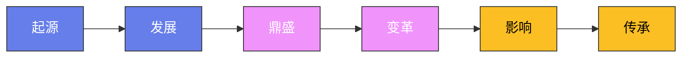

# 水浒传：重大事件多视角还原

> 同一件事，立场不同则真相不同。本文从当事人各自的视角出发，还原《水浒传》中八桩重大事件的全貌，分析矛盾冲突的深层根源。

---

## 一、智取生辰纲——杨志视角与晁盖视角

**杨志视角：一个能臣的宿命溃败**

杨志并非庸人。他出身武侯世家，殿司制使官出身，深知江湖险恶。
押送生辰纲前，他已做了周密部署：改大旗为小旗，变明走为暗行；不许军健饮酒，不许歇凉逗留；选最热时辰赶路，避人耳目。
每一步都说明他是一个有实战经验的职业军人。他甚至提前向梁中书立了军令状——出了差错甘当死罪。

但他的致命弱点在于"孤"。
梁中书派了个老都管随行，此人是蔡夫人的心腹，名义上是协助，实际上是监军。
杨志对军健们呼来喝去、动辄藤条打骂，老都管看在眼里，早已心生不满。
当黄泥岗上众人热得走不动时，老都管带头发难，杨志的权威在那一刻土崩瓦解。
他不是输给了晁盖的计谋，而是输给了自己无法驾驭的内部矛盾。

更可悲的是，杨志丢掉生辰纲后选择了自杀——他觉得无颜面对梁中书。
这说明他对体制的忠诚已经到了自我毁灭的程度。被人救下后，他才被迫走上了落草之路。

**晁盖视角：精密策划的团伙行动**

晁盖一伙的行动堪称教科书级别的团队协作。吴用是总策划，核心设计是"白胜卖酒下药"的连环套。
第一步，七人扮作贩枣商人先到黄泥岗，制造"路遇"的合理性。
第二步，白胜挑酒上冈，故意在杨志面前叫卖，用"不卖"制造稀缺。
第三步，贩枣客人先买一桶痛饮，证明酒无问题。
第四步，刘唐假装贪便宜，用瓢从另一桶舀酒喝，暗中下药。
第五步，白胜假装追赶夺瓢，实则掩护药已入桶。

整个计划的精妙之处在于"分层信任"。
杨志是警觉的，他不允许军健买酒。但贩枣客人先喝过一桶酒后，杨志的防线被从内部瓦解——不是他自己放松了，而是手下人替他做了决定。
晁盖团队赢在攻心：他们攻的不是杨志一人，而是整个押送队伍的集体意志。

吴用事后说"此计只可智取"，这话不假。
如果硬抢，杨志武艺高强，七个书生加一个白胜未必是对手。
但智取的关键不在计策本身，而在对人性弱点的精准判断：杨志管不住手下，手下恨杨志，而炎热和干渴是压垮骆驼的最后一根稻草。

**矛盾根源**：杨志代表的是体制内的执行者，能力有余但缺乏人心；晁盖代表的是体制外的造反者，资源有限但凝聚一心。
生辰纲之争的本质，是一个不得人心的孤将对抗一群志同道合的亡命之徒。更深一层看，杨志的悲剧根源在于他想通过替权贵卖命来重振家门——因为权贵从来不把棋子当人。

---

## 二、林冲逼上梁山——林冲视角与高俅视角

**林冲视角：忍无可忍的退让之路**

林冲是八十万禁军教头，有身份、有家室、有体面。他的每一步退让都是理性选择。
妻子在岳庙被高衙内调戏，他忍了——拳头举起来又放下，因为认出对方是高俅的儿子，得罪不起。
被骗入白虎堂、诬陷带刀行刺，他忍了——因为他相信法律会给公道，刺配沧州已是最好的结果。
在沧州牢城，他忍了——管营差拨索贿，他照给；安排看守草料场，他服从。

直到风雪山神庙那夜。大雪压塌了草厅，他只好到山神庙暂避。
亲耳听到陆谦、富安、管营三人在门外密谋要他的命——火烧草料场，让他葬身火海，再以"失火烧毁军需"的罪名上报，连死后都不得清白。
林冲那一刻的爆发，不是冲动，是一个被逼到绝路的人终于看清现实。
体制不会保护他，法律不会还他公道，唯一的活路是亲手斩断与旧世界的一切联系。

杀陆谦时林冲说了一句："杀人可恕，情理难容。"
这八个字是他整个转变的注脚——他不是天生的反叛者，他是在"情理"二字被彻底践踏之后，才拿起了刀。

**高俅视角：一个权臣的日常操作**

高俅并非专门针对林冲。在高俅的权力版图里，一个禁军教头连棋子都算不上。
儿子看上林冲妻子，那就弄过来；林冲不识趣，那就除掉他。这不是深仇大恨，这是权力的日常运作。
高俅安排白虎堂陷阱、买通押解公差沿途暗杀、派人到沧州追杀——每一步都轻描淡写，因为他从不需要亲自出面，有的是人替他办脏事。

高俅的失算在于，他把林冲逼成了一个没有退路的人。
没有退路的人是最危险的，因为他们不再恐惧任何后果。
林冲上梁山后，成了梁山最能打的将领之一——高俅亲手为自己的对手输送了一员虎将。

**矛盾根源**：林冲与高俅的冲突，本质上是"体制内个体"与"体制本身"的冲突。
林冲相信规则，但规则被高俅垄断。当守规矩的人发现规矩只是强者用来约束弱者的工具时，造反就成了唯一的正义。
林冲的悲剧是所有"体制内老实人"的缩影——你越忍让，对方越得寸进尺；你想息事宁人，对方要你命。

---

## 三、武松打虎与杀嫂——一个英雄的两副面孔

**景阳冈：人虎之争**

武松打虎前喝了十八碗酒，这不是鲁莽，是酒壮人胆。
店家告知山上有虎，武松不信——或者说，他不愿信。
一个刚在柴进庄上受了冷遇、急于回家见哥哥的人，不想被一只老虎挡住去路。
等到真在山冈上遇到猛虎，酒劲上涌、退路已断，武松的选择只剩一个：拼命。

打虎的过程极其写实。老虎扑、掀、剪三招，武松闪、躲、骑。
最后按住虎头，拳拳到肉，不是什么武功绝学，纯粹是求生本能驱动下的暴力倾泻。
打完虎后武松自己也瘫倒在地，这说明他不是武艺碾压，而是以命搏命。

**杀嫂：一个法外执行者的逻辑**

打虎让武松成了都头，一个体制内的执法者。
所以当他发现兄长武大郎被毒杀后，他第一反应不是报仇，而是取证、报官。
他找到郓哥作证，找到何九叔拿到骨殖证据——砒霜中毒的铁证。一切走的是正规司法程序。
但县令收了西门庆的贿赂，驳回了状子。武松的司法之路断了。

杀嫂那场戏，武松请了四邻作见证，当众审问潘金莲，录了口供，然后才动手。
他杀的不只是一个淫妇，他是在执行一场私人审判——既然官府不给公道，他就自己造一个公堂。
杀西门庆则更为直接，狮子楼上那一刀，是对整个腐败司法的控诉。

杀人后武松没有逃跑，他提着两颗人头去县衙自首。
这个细节至关重要：他不想做逃犯，他想证明自己杀的是该杀之人，他渴望体制认可他的正义。

**矛盾根源**：武松的核心矛盾是"守法"与"正义"之间的撕裂。
他想做良民、做都头、做一个被体制认可的英雄，但体制保护不了他最亲的人。
后来醉打蒋门神、血溅鸳鸯楼，他才彻底黑化，不再对体制抱任何幻想。

---

## 四、宋江杀阎婆惜——一个小吏的致命污点

**宋江视角：恩情变仇怨的困局**

宋江纳阎婆惜为外室，本是一桩施恩图报的善举——阎婆惜父死无钱安葬，宋江出资相助，阎婆以女相许。
但宋江对阎婆惜并无真感情，新鲜过后便渐渐冷落，十天半月不去一趟。
阎婆惜正值青春，与宋江的同僚张文远暗中勾搭，宋江也睁一只眼闭一只眼——他不在乎这个女人，他在乎的是自己的名声和体面。

致命转折在于晁盖的来信。刘唐送来感谢信和一根金条，宋江收信后随手塞进招文袋，回家后忘记取出。
阎婆惜发现这封信，抓住了宋江最大的把柄——私通梁山贼寇，这是灭门的罪。
阎婆惜提出三个条件：休书一封、房产归她、金条全给她。前两条宋江都答应了，唯独第三条，金条他已退还了一大部分，拿不出来。
阎婆惜不肯信，尖声威胁要报官。宋江被逼到了悬崖边——他伸手去夺招文袋，阎婆惜死攥不放，宋江一刀下去，一切不可挽回。

**阎婆惜视角：一个被物化女子的反噬**

阎婆惜并非天生恶人。她被母亲当商品一样送给了宋江，又被宋江像玩物一样冷落。
她对张文远的感情，是她在被动人生中唯一一次主动选择。
她抓住招文袋的把柄要挟宋江，手段确实卑劣，但从她的角度看，这是她唯一能掌控命运的筹码。

阎婆惜的悲剧在于，她低估了宋江——她以为这个平日里温文尔雅的押司不会杀人。
但宋江骨子里不是文人，他是一个在官场混迹多年、深谙"斩草除根"之道的精明人。
当所有退路都被堵死时，他的反应比任何人都果断。

**矛盾根源**：宋江杀阎婆惜的根源不在那封信，而在宋江自身的人格分裂。
他既要做好人，又要干犯法的事；既要面子，又有隐秘的欲望。
阎婆惜不过是撕开了这层伪装的一只手。杀人灭口之后，宋江从"道德楷模"彻底沦为"杀人逃犯"——但也因此获得了进入梁山的入场券。

---

## 五、浔阳楼题反诗——宋江的真心话与大冒险

**醉中题诗：压抑太久的爆发**

宋江被刺配江州后，表面是个安分的囚徒，内心早已翻江倒海。
他私放晁盖、怒杀阎婆惜、一路颠沛到江州，这些经历让他对"忠义"二字的理解产生了裂缝。
浔阳楼上那顿独酌，是裂缝被酒精撕开的瞬间。

"自幼曾攻经史，长成亦有权谋"——这不是酒后狂言，这是宋江的真实自白。
他从来不是一个安分的小吏，他有野心、有能力，只是被体制压制得太久。
"他时若遂凌云志，敢笑黄巢不丈夫"——黄巢是造反的代名词，宋江拿黄巢自比，说明他内心深处早已认同了反抗的道路。
四句诗，写尽了一个中年男人半生憋屈后的狂放。

**黄文炳的告发：一个投机者的嗅觉**

黄文炳是江州通判，一个被闲置的中层官僚。
他看到宋江的反诗，不是出于忠君爱国，而是出于政治投机——告发一个反贼，能换来升迁的机会。
他层层追查，先确认笔迹，再查宋江身份，然后上报蔡九知府。整个过程冷静、高效。

戴宗传假信是吴用的计策，试图伪造蔡京家书来搭救宋江。
可惜被黄文炳识破——因为图章有误，蔡京用的是讳字图章，信上却用了普通印鉴。一个小细节葬送了整盘棋。
黄文炳不仅识破了假信，还顺藤摸瓜把戴宗也拉下水，建议蔡九知府将二人就地处斩。
最终梁山好汉江州劫法场，血洗无为军，才把宋江从鬼门关拉了回来。

**矛盾根源**：宋江题反诗不是偶然失言，而是长期伪装的必然崩塌。
一个人如果内心与外在长期撕裂，总有一个临界点会让真话脱口而出。黄文炳只是那个恰好在场的听众。
这场风波的真正意义在于：它迫使宋江彻底放弃"回归体制"的幻想，从此以梁山为归宿。

---

## 六、三打祝家庄——梁山军事能力的分水岭

**宋江视角：一场不得不打的政治仗**

祝家庄、扈家庄、李家庄三庄联盟，是梁山周边最大的地方武装，拥兵万余，粮草充足。
杨雄、石秀、时迁偷鸡被抓，祝家庄公开叫板梁山，扬言要捉尽梁山好汉。
这对宋江的威信构成了直接挑战——如果连一个地主庄院都收拾不了，梁山如何服众？

宋江此战的真正难点不在军事，在人心。
祝家庄地形复杂、盘陀路机关重重，梁山人马两度攻入都吃了亏。
第一次正面强攻，大军在盘陀路中迷路，处处遭遇伏兵，宋江险些被捉。
第二次分兵迂回，又中埋伏，折了杨林、邓飞等人。

**石秀视角：情报工作决定战局**

石秀是三打祝家庄中贡献最大的人之一。
他深入祝家庄内部，以"投宿"为名侦察地形，摸清了盘陀路的破解方法——看白杨树转弯，遇白杨左转，无白杨右转。
这份情报是第二、三次进攻的关键基础。

石秀的外号叫"拼命三郎"，在祝家庄一战中体现得淋漓尽致。
他孤身潜入敌后，随时可能暴露被杀，但他沉着冷静，把每一条路、每一棵树都记在心里。
没有石秀的情报，梁山在盘陀路里就是瞎子。

**孙立视角：卧底的艺术**

孙立的里应外合是第三打成功的决定性因素。
他以"登州兵马提辖"的身份投奔祝家庄，声称奉命来助战，取得信任后在关键时刻反水，打开庄门引梁山军马杀入。
孙立的表演天衣无缝，因为他本身就是体制中人——一个体制内的军官去骗一个地主武装，降维打击。

但孙立的代价也很大。他出卖了同门师兄弟栾廷玉，祝家庄破后栾廷玉死于乱军之中。
孙立从此背上了"卖友求荣"的骂名，这在江湖上是比杀人更重的罪。
他虽然在梁山站稳了脚跟，但始终被主流派系边缘化——排座次时只排第三十九位。

**矛盾根源**：三打祝家庄的深层矛盾是"正规军事思维"与"江湖游击思维"的碰撞。
宋江前两仗用的是江湖打法——靠人多、靠猛冲；第三仗才真正转向了有组织、有情报、有内应的系统化作战。
这标志着梁山从草寇向准军事集团的转型。同时也暴露了梁山的短板：没有情报体系，没有后勤保障，打不了硬仗。

---

## 七、排座次的政治学——天罡地煞背后的派系平衡

**天罡地煞的分配逻辑**

一百零八人排座次，表面上是"天定"（石碣天文），实际上是极为精密的政治安排。
三十六天罡以武将和嫡系为主，七十二地煞以技能型和附属型人才为主。
排在最前面的核心圈层——宋江、卢俊义、吴用、公孙胜、关胜、林冲——覆盖了领袖、副领袖、军师、宗教权威、朝廷降将、草根元老六大支柱。

卢俊义排第二而非吴用，这个安排大有深意。
卢俊义是河北首富、棍棒天下无双，他的加入为梁山带来了"正统性"——一个体面人自愿上山，比十个草莽英雄更有说服力。
吴用虽然功劳更大，但他出身乡村教师，排在卢俊义之后是给"招安路线"铺路。

**派系平衡的艺术**

梁山内部至少有六大派系：晁盖旧部（吴用、刘唐、三阮）、朝廷降将（关胜、呼延灼、秦明）、地方豪强（柴进、李应、卢俊义）、江湖游侠（武松、鲁智深、杨志）、技术人才（萧让、金大安、安道全）、附庸势力（登州系、少华山系）。

宋江排座次的核心原则是：谁都不能太强，谁都不能太弱。
朝廷降将给了高位但没有实权——关胜排第五、秦明排第七，看似风光，实际上兵权被分散到各营。
晁盖旧部功劳大但被拆散——吴用归了宋江、三阮被分到水军、刘唐被边缘化。
地方豪强有钱但被架空军权——柴进排第十，名义上掌管钱粮，实际上只是个财务总监。
最典型的例子是花荣——宋江最嫡系的心腹，却只排第九，因为把他排太高会引起其他派系不满。

**矛盾根源**：排座次解决了"谁坐哪里"的问题，但没有解决"为什么坐这里"的问题。
很多排名靠后的好汉心怀不满，这种不满在招安争议中集中爆发。
更深层的矛盾是：石碣天文这一套"天命"叙事，本质上是宋江用神秘主义包装权力分配——你排名低不是因为我偏心，是天意。这种话术能骗一时，骗不了一世。

---

## 八、招安的争议——忠义与反抗的终极撕裂

**宋江视角：一个知识分子的执念**

宋江始终没有把自己当成造反者。他上梁山是被迫的，他的人生目标始终是回归体制、光宗耀祖。
招安对他来说不是投降，而是浪子回头。他相信只要为国立功，朝廷会接纳梁山好汉，所有人都能洗白上岸。
这种信念有其合理性——宋江见过太多落草为寇的下场，不是死于内斗就是被官军剿灭。他想为兄弟们找一条活路。
但他忽略了一个根本问题：朝廷从来不会真正信任一群曾经造反的人。

宋江对招安的执着，还有一层更深的心理动因：他需要被"正名"。
一个杀人犯、一个逃犯、一个造反头子，只有通过招安才能洗去身上的污点，重新成为"宋公明"。
这种对身份认同的渴望，比任何政治理想都更强烈。

**李逵视角：底层的直觉反抗**

李逵反对招安，不是因为他有什么政治理想，而是因为他本能地知道：回到体制里，他这种人只有死路一条。
李逵是赤贫阶层出身，他在梁山上活得最快活——有肉吃、有酒喝、不用给人下跪。
招安意味着重新回到等级秩序的最底层，重新被人呼来喝去。

"杀去东京，夺了鸟位"——李逵的口号粗糙，但逻辑清晰：既然已经造反了，为什么要半途而废？
李逵不识字、不懂政治，但他比宋江更清醒地看到了一个事实：他们和朝廷之间没有信任基础，招安只是另一种形式的送死。鲁智深也反对招安："招安招安，招甚鸟安！"武松更是直言："今日也招安，明日也招安，冷了兄弟们的心！"

**征方腊的代价：招安的残酷验证**

征方腊一战，梁山好汉阵亡五十九人，病故十人，合计折损近七成。
最终能回京受封的只有二十七人。
秦明被方腊军乱箭射死，董平被一刀砍为两段，张清被枪挑落马——这些曾经在梁山上意气风发的英雄，死在了一个他们本不必参与的战场上。

更讽刺的是，征方腊结束后，朝廷对梁山好汉的最终回答是：用完就杀。
宋江被毒酒赐死，卢俊义被水银毒杀。
宋江临死前毒杀李逵，对他说："我为人一世，只主张忠义二字，不肯半点欺心。今日朝廷赐死无辜，宁可朝廷负我，我忠心不负朝廷。"
一个至死都在为体制辩护的人，最终被体制亲手埋葬。

**矛盾根源**：招安之争的本质是"身份认同"之争。
宋江认同的是士大夫的忠孝价值观，李逵认同的是底层的生存逻辑，鲁智深认同的是佛家的超脱智慧。
梁山一百零八人从来没有统一的政治理想——他们只是被命运暂时抛在了同一条船上，而这条船注定要驶向不同的彼岸。
招安不是出路，而是一场精心包装的集体殉葬。

---

*结语：《水浒传》写的是造反，但真正动人的是造反之前的故事。每个人在体制与良知之间反复挣扎、步步后退、直到退无可退的全过程。施耐庵不写英雄怎么崛起，他写英雄怎么被逼成英雄。而最深的悲剧不在于造反本身，而在于造反之后，他们依然找不到出路。梁山聚义看似轰轰烈烈，实则是一群走投无路的人抱团取暖——火灭了，人也就散了。*

