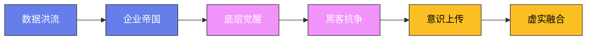

# 赛博朋克架空城邦：新东京

## 一、巨型城市分区

新东京（Neo-Tokyo）是地球上最大的城市——人口超过8000万，面积覆盖了整个关东平原，从旧东京湾一直延伸到秩父山脉脚下，东西跨度140公里，南北纵深90公里。这座城市是在2049年"大崩溃"后的废墟上重建的：那年旧东京湾海平面上升淹没沿海三区，随后的"墨田大地震"又夷平半个都市圈，五大企业联合体以"灾后重建"为名瓜分全部土地，用三十七年把这里改造成人类史上第一座真正的垂直城市。新东京分为七个主要区域：

**天穹区**（Sky Dome）：城市的最高层——漂浮在500米高空的巨型平台群，由四十七座反重力引擎阵列托举，总居住面积却只有十二平方公里，住着全城最尊贵的三万八千人。天穹区是大企业总部和超级富豪的居所——空气清新、阳光充足、没有犯罪，连风都是过滤过的。最负盛名的建筑是天网集团的总部"天柱塔"，一座高达2100米的黑色棱柱体，塔顶常年隐没在云层之上，据说只有在台风过境的清晨才能从地面看到它的尖顶。天穹区通过"天梯"（高速电梯）与地面连接——一共只有九部，每部的单程票价高达4000新币，相当于地铁阶层四个月的收入，普通人根本无法进入。天梯站的安检由钢铁之魂的军用机器人把守，没有天穹区的"虹膜通行证"者格杀勿论——2091年曾有十七名下城青年试图劫持天梯，他们的尸体被吊在天环桥上示众了整整一个月。

**中环区**（Midtown）：城市的中层——100-300米高的巨型建筑群，由两千多栋相互连接的摩天楼组成，高楼之间以封闭式天桥和管道输送带相连，一个中环白领可以整月不接触地面。中环区是中产阶层的居住区——办公楼、公寓、商场和医院，著名的"银座第七螺旋"购物中心有八十八层，号称"买得到一切合法的东西"。中环区的空气质量一般——有空气净化系统但不完美，每到冬季逆温层形成时，灰色的雾霾会在天桥之间滞留数周不散，中环人称之为"尘眠季"。

**下城区**（Downtown）：城市的地面层——0-100米高的旧建筑群，大部分是"大崩溃"前就存在的老楼，墙皮剥落、管道外露，到处挂着几十年前的霓虹灯招牌。下城区是普通工人的居住区——工厂、仓库、廉价公寓和小商店。著名的"巢鸭蜂巢公寓"一栋楼里塞着四万两千人，最小的居住单元只有2.4平方米，住户们自嘲为"罐子里的沙丁鱼"。下城区的空气质量差——阳光被上层建筑遮挡，常年阴暗潮湿，许多街区一年到头只有正午前后四十分钟能见到一线天光，居民们把这段时间称为"圣光时刻"，有些老人会准时搬着凳子坐在巷口晒太阳，这几乎是他们一天中唯一的奢侈。

**地铁区**（Subway）：城市的地下层——旧地铁时代遗留的一百七十多公里隧道和废弃车站。地铁区是穷人的居住区——据非官方统计约有六十万人栖身在废弃地铁站搭建的棚户中，最大的聚居点是旧丸之内线的"大手町站"，被称为"地下王都"，里面有自己的集市、诊所、甚至一座由退役机器人看守的"治安所"。地铁区没有阳光——靠人造灯光照明，电力多是从上层电网私接的，电力公司的"剪线队"每月清剿一次，剪完三天内又会被重新接上，这场猫鼠游戏已持续了二十年。

**工业区**（Industrial Zone）：城市的外围——巨型工厂和化工厂连绵四十公里，从空中俯瞰像一块烧红的烙铁贴在大地上。工业区的空气污染极其严重——工人必须戴防毒面具才能工作，即便如此，工业区工人的平均肺活量也只为正常人的六成。著名的"川崎第七冶炼厂"有三万名工人，厂区内常年弥漫着橙黄色的烟雾，工人们下班时吐出的痰都是铁锈色的。

**边缘区**（Fringe）：城市的边缘——废弃建筑和垃圾场，是"大崩溃"后从未被重建的区域，官方地图上被标注为"待开发区"，实际早已成为法外之地。边缘区是帮派的领地——警察不敢进入，连无人机巡逻都只在高空掠过，因为低空飞行器会被帮派用电磁枪打下来拆零件卖。最醒目的地标是"垃圾山"——一座高220米的巨型垃圾堆，据说下面埋着大崩溃时代整片街区的残骸，拾荒者至今仍在山中挖掘旧时代遗物。

**网络空间**（Cyberspace）：虚拟世界——通过脑机接口进入。网络空间是新东京的"第八区"——它没有物理位置，但拥有自己的法律和文化。高峰时段同时在线人数超过三千万，其中约四百万人处于"常驻"状态——他们的肉体躺在廉价的"浸泡舱"里，靠营养液维持生命，意识则永远活在虚拟世界中。网络空间中最繁华的虚拟都市叫"镜城"，是天网集团用旧东京数据1:1复刻的，许多从不出门的新东京人对镜城的熟悉程度远超过他们居住的实体街区。

## 二、不同阶层生存状态

**天穹阶层**：大企业高管和超级富豪——他们住在天穹区的空中别墅中，享受最好的食物、医疗和教育。天穹阶层的平均寿命超过150岁——靠基因改造和器官替换续命。其中最年长的是天网集团的创始人之一、被称为"不老翁"的麻生羲昭，官方档案记载他出生于2019年，今年已经113岁，但圈内人都知道他实际年龄远不止于此——他的大脑据称已经被完整移植进第三具克隆躯体。天穹阶层的孩子们五岁起植入神经协处理器，十二岁时运算能力就超过普通成年人，但他们中的大多数一生都没踏上过真正的地面——对他们来说，"地面"只是舷窗外一片模糊的灰色。

**中环阶层**：中产专业人士——律师、医生、工程师、程序员。中环阶层的生活条件良好——但他们的工作压力极大，每天工作12小时以上，许多人还要在下班后继续在网络空间中"值夜勤"，实际清醒时间普遍超过18小时。中环有句自嘲："我们用命换钱，用钱换命。"为维持高强度工作，约七成中环白领长期服用暗影制药的"清醒"系列神经兴奋剂，这种蓝色小药丸能让人连续工作72小时不觉疲倦，代价是五年后不可逆的神经衰退。中环女程序员铃木惠曾在网络空间留下著名遗书："我今年三十一岁，我感觉自己已经用完了。"她在连续加班四十一天后死于工位上，此事引发了当年的"银座静默"抗议，但最终不了了之。

**下城阶层**：普通工人——工厂工人、快递员、清洁工。下城阶层的生活条件一般——他们的工资只够维持基本生活。一个典型的下城家庭：男人在川崎第七冶炼厂做炉前工，月薪3800新币；女人在巢鸭蜂巢公寓做楼层保洁，月薪2600新币；一家四口挤在11平米的单元里，每月房租就要交掉2900新币。剩下的钱要精打细算：合成食物占去大半，还有孩子的学费、防毒面具滤棉、每月一次的"天梯税"（即便他们从不去天穹区，这笔钱也照收，名义是"城市基础设施维护费"）。

**地铁阶层**：社会底层——失业者、流浪者、残疾人，生活极其艰难，靠捡拾垃圾和偷窃为生。在"地下王都"大手町站，有一种独特的以物易物经济：旧时代电子零件、还能用的药片、干净的饮用水，都是硬通货。地铁阶层中流传着一位传奇人物"站长老周"的故事：他原是旧地铁系统的末代司机，大崩溃那年他驾驶的列车被困在隧道里，他带着三百多名乘客在地下走了两天两夜找到出口，从此被视为地铁区的守护神。老周死于2087年，下葬那天，据说有五万人沿着废弃铁轨为他送行。

**帮派成员**：边缘区的居民，加入了各种地下帮派。帮派成员的生活充满暴力——他们的平均寿命只有30岁。边缘区的规矩很简单：要么有枪，要么有人，要么有用。新人入伙通常要立"投名状"——完成一次帮派指派的危险任务，比如潜入中环区偷取某个企业职员的身份芯片，或者截杀敌对帮派的运货队。能活过三年的人会被尊称为"老炮"，活过十年的则会成为一方头目——但这样的幸运儿一百个里也挑不出一个。

## 三、大企业势力

新东京被五大企业集团控制。它们之间明面上维持着"新东京共同开发协议"的和平框架，暗地里的倾轧从未停止——2094年的"芯片战争"中，天网集团和钢铁之魂为争夺军用AI芯片专利权，各自雇佣帮派在边缘区火拼四十天，死伤上千人，最后以基因动力出面调停、双方平分市场告终。

**天网集团**（Skynet Corp）：控制着网络空间和人工智能技术——是新东京最强大的企业。天网集团的"天网"系统监控着城市的每一个角落——全城部署着超过两亿个摄像头和传感器，连地铁区的棚户里都装着伪装成烟雾报警器的窃听器，隐私在新东京是不存在的。天网集团首席执行官织田美雪是城中最有权势的女人，她的名言被刻在天柱塔大厅的黑色大理石上："秩序不是免费的，它用数据支付。"

**基因动力**（Gene Dynamics）：控制着基因改造和器官替换技术——是新东京最赚钱的企业。基因动力的"完美基因"套餐售价超过1000万新币——只有天穹阶层消费得起。其创始人白川枫博士原本是东京大学的遗传学教授，大崩溃后他带着实验室的全部资料投奔企业联合体，用二十年时间建成了全球最大的基因库。但关于白川的黑暗传闻从未停止：据说基因动力的克隆躯体技术来源于对边缘区流浪者的非法人体实验，2096年一名叛逃的研究员向觉醒者组织泄露了部分实验记录，三天后这名研究员的尸体在垃圾山被发现——全身的皮肤都被完整剥离，手法与基因动力的器官摘取手术一模一样。

**钢铁之魂**（Steel Soul）：控制着机器人和自动化技术——新东京80%的工厂由钢铁之魂的机器人运营。其拳头产品"工蜂-9型"工业机器人全身上下有一千四百个零部件，却只需要一个人类监工就能管理一整条生产线——这意味着每一台机器人的上岗都伴随着三到五名工人的失业。钢铁之魂还生产城防用的"猎犬"巡逻机器人，这些四足机械兽装备着电击枪和捕捉网，在下城区的街巷中日夜游荡，是下城孩子们童年噩梦中永恒的主角。

**暗影制药**（Shadow Pharma）：控制着药物和毒品市场——合法药物和非法毒品都由暗影制药生产和销售。他们明面上的拳头产品是中环白领离不开的"清醒"系列兴奋剂，暗地里的利润大头却来自名为"黄泉"的强效致幻剂——吸食者会在幻觉中见到死去的亲人，许多人为追求这短暂的团聚而倾家荡产。暗影制药最精明的地方在于：它同时向警局出售"黄泉"的解毒剂，两头赚钱，滴水不漏。

**新东京电力**（Neo-Tokyo Electric）：控制着城市的能源供应——电力、网络和数据都由新东京电力垄断。它的"稻妻"聚变反应堆群坐落在城市东侧的填海岛上。电力公司对欠费用户毫不留情——切断电力意味着断水、断暖、断网，在地下四十米深的地铁区，断电就等于死刑。2089年冬天，电力公司对大手町站实施"惩戒性断电"，一夜冻死四百多人，此事在官方记录中被称为"例行线路检修"。

## 四、地下帮派

新东京的边缘区有数百个地下帮派——其中最强大的是：

**红龙会**：最大的亚洲帮派——控制着边缘区的毒品和武器市场，成员约有一万两千人，现任龙头是外号"赤婆"的老妇人陈九红，据说她年轻时是基因动力高级研究员，因拒绝参与人体实验被追杀，逃入边缘区后用二十年白手起家。红龙会的成员身上都有红色龙纹身——纹身的染料中掺有微量的追踪纳米颗粒，这是帮派控制成员的手段。背叛者会被"剥皮"（活生生剥掉纹身区域的皮肤）——刑罚由专门的"刑堂"执行，剥下的皮会挂在红龙会总坛"龙王庙"的廊下风干示众。

**铁骷髅**：最大的白人帮派——控制着边缘区的器官黑市，成员大多是大崩溃后滞留新东京的欧美裔雇佣兵后裔。铁骷髅的成员都是基因改造的"增强人"——他们的力量和速度远超普通人，骨骼中植入了钛合金支架，皮肤下衬着防弹纤维。他们的首领"主教"维克多·克劳斯据说全身70%已机械化，每天要在低温舱中睡眠以防肉体部分溃烂。铁骷髅的器官生意链条完整：从地铁区"收货"（绑架健康的流浪者），到边缘区"加工"（活体摘取），再通过暗网卖给中环甚至天穹区的买家——一颗健康的肾脏在黑市上能卖到80万新币。

**幽灵团**：最神秘的黑客组织——他们能入侵任何系统、窃取任何数据。幽灵团的成员从不露面——只在网络空间中活动，其标志是一只漂浮在数据流中的白色面具。关于幽灵团的领袖"零"有无数传说：有人说他是天网集团的叛逃AI工程师，有人说他根本不是人而是一段产生自我意识的人工智能，还有人说"零"早已死亡，现在的幽灵团由他的七个弟子共同维持。2095年幽灵团发动了震惊全城的"熄灯行动"——他们入侵新东京电力的控制系统，让全城停电了整整十七分钟，在这十七分钟里，天网系统第一次陷入瘫痪，无数被监控的市民第一次尝到了"不被注视"的滋味。

## 五、文化习俗

**赛博改造文化**：新东京人热衷于"赛博改造"——用机械和电子装置替换身体部位。最常见的改造是"义眼"（增强视力、夜视、热成像）和"义肢"（增强力量、速度）。在下城区的"秋叶原义体一条街"，花3000新币就能换上一只二手义眼，当然，手术台是露天的，麻醉剂是过期的。极端的改造包括"全身义体化"——将整个身体替换为机械——这在法律上是灰色地带，因为2093年通过的《人格延续法案》只承认"大脑存活者"的人权，而全身义体化者的大脑是否算"存活"，至今仍在最高法院拉锯。新东京人对改造程度有一套隐形的身份密码：改造率低于10%的叫"肉人"，多是付不起改造费的穷人；改造率30%-60%的叫"半铁"，是主流状态；改造率超过90%的被称为"铁裔"，他们在择偶市场上极受欢迎——因为那意味着富有。

**虚拟现实文化**：新东京人花大量时间在网络空间中——工作、社交、娱乐都在虚拟世界中进行。"虚拟成瘾"是一个严重的社会问题——许多人宁愿活在虚拟世界中也不愿面对现实。据统计，新东京每年有约两万人的肉体因为长期浸泡在营养舱中而衰竭死亡，他们被称为"坐化者"。在镜城中，甚至有专门为坐化者设立的"数字墓地"，亲友可以付费让死者的AI人格副本继续"活"在虚拟世界里——这项服务由天网集团运营，年费18万新币，广告词是："死亡不再是告别。"

**快时尚文化**：新东京的时尚变化极快——每周都有新的潮流。下城阶层的时尚是"朋克风"——皮革、铆钉、荧光色，下城青年喜欢用荧光涂料在皮肤上画电路纹样，这种潮流叫"人皮主板"，据说起源于某位无名帮派纹身师。中环阶层的时尚是"极简风"——黑白灰、干净利落，一件看不出牌子的羊绒大衣是中环精英的标配，他们称之为"无声的昂贵"。天穹阶层的时尚是"定制风"——每件衣服都是独一无二的，最顶级的裁缝是天穹区的"织羽斋"，做一件礼服要等待两年，起价200万新币。

**饮食文化**：新东京的饮食分为三个层次：下城阶层吃"合成食物"——用化学原料合成的廉价食物，味道和营养都不如天然食物，最典型的是"代餐砖"，一块灰扑扑的方块就能提供一天所需的热量，下城人开玩笑说："我们的人生就像代餐砖——管饱，但没滋味。"中环阶层吃"培育肉"——在实验室中培育的人造肉，中环区最著名的培育肉餐厅"源氏肉坊"号称能还原旧时代神户牛肉的霜降纹理，一份300克售价1200新币。天穹阶层吃"天然食物"——真正的蔬菜、水果和肉类，价格是合成食物的100倍，天穹区的"云上温室"里种着真正的草莓，一颗的价钱抵得上地铁阶层一年的收入。每年冬至，天穹区的富豪们会举办"真味宴"，宴席上的一道清蒸真鱼常常成为城中谈资——因为全城的天然鱼存量每年都在减少，吃到真鱼正变得越来越像一种权力的仪式。

## 六、社会矛盾

新东京的社会矛盾极其尖锐——贫富差距、阶层固化、企业垄断、帮派暴力、环境污染交织在一起。

**贫富差距**：天穹阶层人均年收入超过1000万新币——地铁阶层人均年收入不到1万新币，差距超过1000倍。一个具象的对比：天穹区富豪为宠物狗定制的义肢价值50万新币，而地铁区的母亲为给发烧的孩子买一支退烧药，要在黑市上卖掉自己最后一头长发。新东京有一句流传很广的谚语："这座城市唯一平等的，是雨。"——但连这句话都是错的，因为天穹区有气象护盾，雨根本落不进去。

**阶层固化**：从下城阶层晋升到中环阶层的概率不到1%——从中环阶层晋升到天穹阶层的概率不到0.01%。阶层流动几乎不可能。唯一被官方承认的上升通道是每三年一届的"登塔考试"——理论上任何市民都可以参加，成绩最优异的一百人将获得企业编制。但考试的内容涵盖神经协处理器操作、高阶数据思维等只有植入昂贵脑机接口才能掌握的科目，一个下城孩子要先凑齐80万新币的植入费才谈得上"公平竞争"。2097年，巢鸭蜂巢公寓的少年阿健成为三十年来第一个通过登塔考试的下城子弟，全城媒体大肆报道了这个"新东京梦"的样板——但很少有人追问，阿健的植入费是红龙会垫付的，代价是为帮派服务十五年。

**企业垄断**：五大企业集团控制着新东京的一切——从能源到医疗、从网络到食物。普通人没有选择——只能接受企业的定价和服务。企业之间甚至发行各自的"信用分"，一个人在天网集团的信用分低，求职、租房、就医都会被歧视。2092年，五大企业解散了最后一届民选市政府，"市议会"从此变成企业高管的月度茶话会，市民私下称之为"分饼会"。

**反抗运动**：新东京的地下有一个名为"觉醒者"（The Awakened）的反抗组织——他们的目标是推翻大企业的统治、实现社会平等。觉醒者的成员包括工人、黑客、医生和退伍军人——他们的行动包括罢工、黑客攻击和暗杀企业高管。觉醒者的精神领袖是被称为"回声"的神秘人物，没人见过他（或她）的真面目，但每月一次，"回声"的演讲会通过被劫持的公共屏幕传遍全城："他们告诉你，梯子断了是因为你不够努力。但我们想说——是他们锯断了梯子。"觉醒者最著名的一次行动是2098年的"天梯之夜"：他们同时在九部天梯的控制系统中植入病毒，让天梯全部停摆了六个小时，并在天穹区的外墙投影上打出了巨大的标语——"你们头顶的蓝天，是我们肺里的灰。"行动过后，天网集团展开长达半年的大搜捕，三千人被捕，觉醒者元气大伤，但那句标语永远留在了新东京人的记忆里。如今，在下城区的墙面上、地铁区的隧道里、甚至中环区卫生间的门板上，仍能偶尔看到有人用荧光涂料悄悄写着同一句话。

