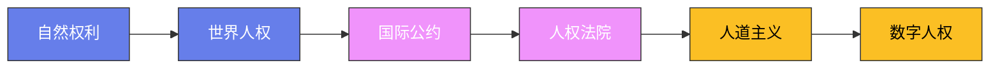

# 人权法：从废墟上写下的尊严

## 纽伦堡的启示

1945年11月，纽伦堡国际军事法庭开庭，纳粹德国的高官们坐在被告席上。他们的辩护词听上去无懈可击：我们所做的一切，都符合当时德国的法律。法庭的回答改写了法律史：存在高于国家法律的标准，**反人类罪**不因国内法的授权而免责。国家主权这堵墙，第一次被凿开了一个洞——墙后面对本国人民做的事，从此不再只是"内政"。

为这个洞奔走的有一个波兰犹太律师拉斐尔·莱姆金（Raphael Lemkin，1900—1959）。他的家人几乎全部死于大屠杀，他自己造出了"genocide"（种族灭绝）这个词，四处游说，终于在1948年12月9日推动联合国通过《防止及惩治灭绝种族罪公约》。第二天，1948年12月10日，《世界人权宣言》通过。两份文件背靠背落地，像是人类在尸骨未寒时立下的双重誓言。

## 巴黎的十八个月

宣言的起草从1946年开始，耗时十八个月。委员会主席是埃莉诺·罗斯福（Eleanor Roosevelt，1884—1962）——罗斯福总统的遗孀，她以政治声望把一群背景迥异的法学家拢在一张桌子上。副主席是中国的张彭春（P. C. Chang，1892—1957），当西方代表争论权利的神学来源时，他提醒委员会：世界上不止一种哲学，宣言要能让儒家、伊斯兰和基督教传统的人都认得下；第一条里"赋有理性和良心"的"良心"，正是他把儒家的"仁"译成conscience的结果。黎巴嫩人查尔斯·马利克（Charles Malik，1906—1987）带来存在主义的锋利，法国人勒内·卡森（René Cassin，1887—1976）搭起了宣言的骨架，后来因此获得1968年诺贝尔和平奖。印度的汉萨·梅赫塔（Hansa Mehta，1897—1995）坚持第一条写"all human beings"而不是"all men"——差一个词，一半人类就可能被悄悄划出去。

1948年12月10日，巴黎夏约宫，联合国大会以48票赞成、0票反对、8票弃权通过宣言。投弃权票的是苏联集团六国、南非和沙特。第一条的中文是：人人生而自由，在尊严和权利上一律平等。

## 从宣言到条约

宣言本身没有法律约束力，于是下一步是把道德承诺铸成条约。1966年，联合国通过《公民权利和政治权利国际公约》与《经济、社会及文化权利国际公约》，1976年生效——两公约与宣言合称"国际人权宪章"。

区域层面走得最快的是欧洲。1950年11月4日，欧洲理事会成员国在罗马签署《欧洲人权公约》，1959年又在斯特拉斯堡设立**欧洲人权法院**。它做了一件此前不可想象的事：允许个人直接起诉自己的国家。一个普通法国人可以告法国政府，一个土耳其工人可以把土耳其送上被告席，近七亿欧洲人活在这个机制之下。美洲1969年、非洲1981年先后跟进，人权从纸面宣言长出了执行机构。

## 海牙的法庭

纽伦堡和东京审判都是战胜国的临时法庭，胜者为王的味道挥之不去。90年代的前南斯拉夫问题国际法庭（1993年）和卢旺达问题国际法庭（1994年）是补课，后者第一次由国际法庭认定种族灭绝罪成立。真正的制度突破在1998年7月：罗马外交大会上，120个国家投票通过《罗马规约》；2002年7月1日，批准书满60份，**国际刑事法院**在海牙正式成立——人类历史上第一个常设的、审判个人而非国家的国际刑事法庭，管辖种族灭绝罪、战争罪、反人类罪和侵略罪。2012年，刚果军阀卢班加成为第一个被定罪的人。美国、中国、俄罗斯至今未加入——法庭的权力有多大，大国的戒心就有多重。

## 普遍的还是相对的

人权是不是放之四海皆准？1993年维也纳世界人权大会前，若干亚洲国家发表《曼谷宣言》，主张人权必须考虑各国文化与国情，批评西方把自身标准强加于人——这就是著名的"亚洲价值观"之争。最终171个国家通过《维也纳宣言和行动纲领》，写下妥协的句子：人权是普遍的，但落实方式可以多样。

这场争论没有结束，也不该被轻易嘲笑。但有一条底线越来越清晰：文化相对性可以讨论权利的优先级，却不能为酷刑和屠杀辩护。人权的真正敌人，往往不是相对主义，而是选择性执行——只盯着别国监狱的人，看不见自己关塔那摩的铁窗。

## 翻译最多的文件

《世界人权宣言》至今被翻译成500多种语言，是世界上翻译版本最多的文件。从纽伦堡到海牙，人权法七十年讲清了一件事：国家对人民做的事，不再只是内政。这堵墙上每一块砖都浸过血，而砌墙的工作，远没有完工。

