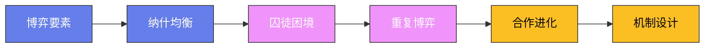

# 中国经济改革

## 一、改革开放的背景

1978 年，中国开始了"改革开放"——这是人类历史上最伟大的经济改革之一。改革开放使中国从一个贫穷的农业国家变成了世界第二大经济体——它影响了数十亿人的生活。

**改革前的中国经济**：1978 年以前，中国实行的是计划经济体制——政府控制了所有的经济活动。计划经济的结果是——经济增长缓慢，人民生活水平低下。1978 年，中国的人均 GDP 只有 156 美元——远低于世界平均水平。

**十一届三中全会**：1978 年 12 月，中国共产党召开了十一届三中全会——这是改革开放的起点。会议决定将工作重心转移到经济建设上来——这标志着中国从"以阶级斗争为纲"转向"以经济建设为中心"。

## 二、农村改革

农村改革是中国经济改革的起点——它从"家庭联产承包责任制"开始。

**家庭联产承包责任制**：1978 年，安徽省凤阳县小岗村的 18 户农民秘密签订了"包产到户"的协议——他们将集体的土地分到各户，每户负责自己的产量。家庭联产承包责任制的成功促使政府在全国推广——到 1983 年，全国 98% 的农村实行了家庭联产承包责任制。

**农村改革的成效**：农村改革取得了巨大的成功——1978—1984 年间，中国的粮食产量增长了 33%，农民收入增长了 166%。农村改革的成功为后来的经济改革提供了信心和经验。

**乡镇企业**：农村改革还催生了"乡镇企业"——它们是农村地区的集体或私营企业。乡镇企业在 20 世纪 80 年代和 90 年代快速发展——它们成为中国工业化的重要力量。

## 三、城市改革

城市改革在 20 世纪 80 年代中期开始——它主要包括国有企业改革和价格改革。

**国有企业改革**：国有企业改革的目标是提高国有企业的效率——改革的方式包括"放权让利"（给企业更多的自主权和利润留成）、"承包制"（企业承包经营）和"股份制改造"（将国有企业改为股份制公司）。

**价格改革**：价格改革的目标是将计划价格转向市场价格——改革的方式是"双轨制"。双轨制是指同一种商品有两种价格——计划内价格（由政府决定）和计划外价格（由市场决定）。双轨制是一种渐进的改革方式——它避免了价格突然放开带来的冲击。

**双轨制的争议**：双轨制引发了激烈的争论——支持者认为它是一种巧妙的过渡方式，批评者认为它导致了腐败和不公平。双轨制确实导致了"官倒"（政府官员利用价格差异牟利）——但总体而言，双轨制是一种成功的改革方式。

## 四、对外开放

对外开放是中国经济改革的重要组成部分——它使中国融入了全球经济。

**经济特区**：1980 年，中国设立了四个经济特区——深圳、珠海、汕头和厦门。经济特区是对外开放的"试验田"——它们实行特殊的经济政策，吸引外资和技术。深圳是最成功的经济特区——它从一个小渔村变成了一个现代化的大城市。

**加入 WTO**：2001 年 12 月 11 日，中国正式加入世界贸易组织（WTO）——这是中国经济改革的重要里程碑。加入 WTO 使中国的贸易更加开放——中国的出口在加入 WTO 后快速增长，成为世界第一大出口国。

**外资的贡献**：外资对中国经济的发展做出了重要贡献——它带来了资金、技术和管理经验。外资企业在中国的出口中占很大比重——它们也促进了中国的技术进步和管理创新。

## 五、市场经济的建立

1992 年，中国共产党第十四次全国代表大会明确提出了建立"社会主义市场经济体制"的目标——这标志着中国经济改革进入了新阶段。

**社会主义市场经济**：社会主义市场经济是中国独特的经济体制——它将市场机制与社会主义制度相结合。社会主义市场经济的特点是——"公有制为主体，多种所有制经济共同发展"和"按劳分配为主体，多种分配方式并存"。

**市场经济的成就**：市场经济的建立使中国经济快速增长——1978—2023 年间，中国的 GDP 年均增长率为 9.5%。中国在 2010 年超过日本成为世界第二大经济体——在 2023 年，中国的 GDP 超过了 17 万亿美元。

## 六、当代中国经济的挑战

当代中国经济面临着几个重要的挑战。

**增长模式转型**：中国经济需要从"投资驱动"转向"创新驱动"——过去的投资驱动模式导致了产能过剩、环境污染和债务积累。创新需要更好的制度环境——包括知识产权保护、金融市场改革和教育投资。

**不平等**：中国的不平等问题日益严重——城乡差距、地区差距和收入差距都在扩大。不平等可能会威胁社会稳定——政府需要通过税收、社会保障和教育来减少不平等。

**人口老龄化**：中国的人口老龄化问题日益严重——劳动年龄人口在 2012 年达到峰值后开始下降。人口老龄化会增加社会保障的负担，减少劳动力供给——政府需要通过延迟退休、提高生育率和吸引移民来应对。

中国经济改革的遗产告诉我们：渐进式改革是一种有效的改革方式——它避免了"休克疗法"带来的社会动荡。中国经济改革的经验对其他发展中国家有重要的借鉴意义。

