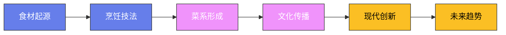

# 各地火锅文化

## 一、火锅的起源

火锅的历史可以追溯到商周时期——考古出土的"鼎"（三足青铜器）就是最早的"火锅"——在鼎中加水和肉，下面生火加热。但现代意义上的火锅——用汤底涮食材——成型于宋代。南宋林洪在《山家清供》中记载了"拨霞供"——用兔肉在沸汤中涮熟，"风涌云变，雪浪翻银"。

火锅之所以能从众多烹饪方式中脱颖而出——是因为它最符合中国人"围坐共食"的社交习惯。一口锅、一群人——大家围坐在一起，边涮边聊，吃的不只是食物，是气氛。

## 二、重庆火锅

**起源**：重庆火锅起源于长江和嘉陵江边的码头——1920年代，朝天门码头的纤夫和船工用廉价的牛下水（毛肚、黄喉、鸭肠等）在麻辣汤底中涮食。最初叫"水八块"——因为食材都是"下水"（内脏），汤底只有辣椒和花椒。

**汤底**：重庆火锅的灵魂是"牛油锅底"——用牛油（不是植物油）炒制郫县豆瓣、干辣椒、花椒、姜、蒜、冰糖、料酒等数十种配料。正宗重庆火锅的汤底是"老油"——回收再利用的汤底（但出于卫生考虑，现在已不提倡）。

**食材**：重庆火锅的食材以"下水"为主——毛肚（牛百叶，涮15秒）、黄喉（牛的主动脉，涮30秒）、鸭肠（涮10秒）、鹅肠、鸭血、脑花（猪脑）、腰片（猪腰子）。重庆人说"吃火锅不吃毛肚等于没吃"。

**蘸料**：重庆火锅的蘸料极其简单——只有香油和蒜泥。把涮好的食材在香油蒜泥碟中蘸一下——香油能降温、蒜泥能解辣。

**文化**：重庆火锅不只是食物——它是重庆人的社交方式。重庆人说"没有什么事是一顿火锅解决不了的，如果有，那就两顿"。重庆的火锅店密度全国第一——大街小巷遍地都是，凌晨两点仍然人声鼎沸。

## 三、四川火锅

**起源**：四川火锅与重庆火锅同源——但风格不同。四川火锅（以成都为代表）更注重"香"而非"辣"——汤底中加入了更多的香料（八角、桂皮、草果、砂仁等）。

**区别**：
- 重庆火锅用牛油——四川火锅用菜籽油或混合油
- 重庆火锅更辣更麻——四川火锅更香更鲜
- 重庆火锅食材以下水为主——四川火锅食材更丰富
- 重庆火锅蘸香油蒜泥——四川火锅蘸油碟或干碟（辣椒面）

**串串香**：四川火锅的"街头版"——各种食材穿在竹签上，放入麻辣汤底中煮熟。按签子数结账——一根签子几毛钱。成都的串串香店比火锅店还多。

## 四、北京涮羊肉

**起源**：北京涮羊肉的历史可追溯到元代——传说忽必烈征战途中，厨师将羊肉在沸水中快速涮熟。清代涮羊肉在北京流行——"东来顺"（始于1903年）是北京涮羊肉的代表。

**锅底**：北京涮羊肉的锅底极简——清水加葱段、姜片和枸杞。与重庆火锅的重口味完全不同——北京涮羊肉追求的是"羊肉本味"。

**食材**：主角只有一个——羊肉。选用内蒙古草原的羔羊——后腿肉切成薄如纸的大片，在沸水中涮至变色即可（约10秒）。蘸料用芝麻酱、韭菜花、腐乳、辣椒油和葱花调制——芝麻酱是灵魂。

**文化**：北京涮羊肉讲究"清水一盏、葱姜两三片"——越简单越好。老北京人吃涮羊肉的仪式感很强——用铜锅（中间有烟囱放炭火），羊肉必须是手切的（不是机器切的），蘸料必须自己调。

## 五、广东打边炉

**起源**：广东人称吃火锅为"打边炉"——"边炉"指放在饭桌旁边的炉子。广东打边炉与北方火锅的最大区别——汤底清淡、食材新鲜。

**汤底**：广东打边炉的汤底以清汤为主——猪骨汤、鸡汤或清水加枸杞和红枣。广东人认为"好食材不需要浓汤掩盖"——汤底越清淡，越能吃出食材的本味。

**食材**：广东打边炉的食材极其丰富——海鲜（虾、蟹、鱼片、鲍鱼）、肉类（牛肉、猪肉、鸡肉）、内脏（猪肝、猪腰、牛百叶）、蔬菜（生菜、茼蒿、豆苗）、丸子（牛肉丸、鱼丸、虾丸）、豆腐和粉丝。

**潮汕牛肉火锅**：广东打边炉的极致——用清水（或牛骨汤）涮新鲜牛肉。潮汕牛肉必须是当天宰杀的——从屠宰到上桌不超过4小时。牛肉按部位分：嫩肉、三花趾、五花趾、匙柄、匙仁、脖仁、吊龙、胸口朥——每个部位的口感不同。蘸料用沙茶酱——潮汕牛肉火锅的灵魂。

## 六、云南火锅

**汽锅鸡火锅**：用云南建水特产的汽锅做火锅——中间有一根空心管，蒸汽从管中上升凝结成汤。鸡肉在汽锅中蒸制——不加一滴水，汤全是蒸汽凝结的精华。

**菌菇火锅**：云南是"菌类王国"——鸡枞、松茸、牛肝菌、干巴菌、青头菌等数十种野生菌。菌菇火锅的汤底用老母鸡和猪骨熬制——加入各种菌菇后鲜味倍增。云南人说"吃菌子要趁季节"——每年6-9月是野生菌的旺季。

**酸汤火锅**：贵州苗族的酸汤火锅——用西红柿和米汤发酵的酸汤做底。酸辣鲜香——比麻辣火锅更开胃。

## 七、海南椰子鸡火锅

**起源**：海南特色火锅。用新鲜椰子水做汤底——加入文昌鸡（海南特产的嫩鸡）。椰子水的清甜和鸡肉的鲜嫩完美融合。蘸料用沙姜、青橘汁和酱油——清爽解腻。

**文化**：椰子鸡火锅在2010年代从海南走向全国——成为"网红火锅"。深圳是椰子鸡火锅的"第二故乡"——深圳的椰子鸡火锅店比海南还多。

## 八、东北酸菜白肉火锅

**起源**：东北冬季的传统火锅。酸菜（大白菜发酵）和五花肉在猪骨汤中炖煮——酸菜的酸味化解了五花肉的油腻。配料有粉条、冻豆腐和血肠。

**杀猪菜**：东北农村过年杀猪后的宴席菜——新鲜猪血灌血肠、酸菜白肉、猪下水同煮。热气腾腾的一大锅——亲朋好友围坐在一起，边吃边聊。

## 九、日式涮涮锅（しゃぶしゃぶ）

**起源**：日本涮涮锅从中国涮羊肉演变而来——20世纪初传入日本。日式涮涮锅用昆布（海带）和木鱼花熬制的清汤做底——涮薄切的牛肉片。

**特点**：日式涮涮锅比中国火锅更"精致"——食材摆盘精美、蘸料有芝麻酱和柑橘醋两种选择、配菜有豆腐和蔬菜。

## 十、韩式部队锅

**起源**：朝鲜战争后，韩国人在美军基地附近捡拾剩余的午餐肉、香肠和芝士，加入泡菜和面条煮成火锅。"부대"就是"部队"——部队锅是战争的产物。

**现代部队锅**：现代部队锅已不再使用"剩余物资"——而是用新鲜的午餐肉、香肠、芝士、拉面和泡菜。韩国人吃部队锅是社交活动——大家围坐一锅，边吃边聊。

## 十一、瑞士奶酪火锅（Fondue）

**起源**：瑞士阿尔卑斯山区的传统冬日美食。用格鲁耶尔奶酪和埃曼塔尔奶酪在白葡萄酒中融化——用长叉子叉着面包块蘸入融化的奶酪中。冬天围坐在壁炉旁吃奶酪火锅是瑞士人的传统。

**巧克力火锅**：瑞士火锅的甜品版——用黑巧克力和奶油融化，蘸上水果、棉花糖和饼干。

## 十二、泰国火锅

**泰国Mookata**：泰国和东南亚流行的烧烤火锅一体锅——中间凸起的部分用来烤肉，周围凹下的部分用来涮菜。烤肉的油脂滴入汤中——汤底越来越鲜。

## 十三、越南火锅

**越南涮涮锅（Lẩu）**：越南火锅以酸辣为主——汤底用番茄、菠萝和罗望子熬制，酸味清新自然。配菜有鲜虾、鱼片、牛肉和各种蔬菜（空心菜、豆芽、薄荷叶）。越南人吃火锅配米粉——把米粉放入汤中煮熟，连汤带粉一起吃。

**越南海鲜火锅**：岘港和芽庄的海鲜火锅用新鲜海鲜做底——螃蟹、虾、鱼和贝类在锅中煮出鲜甜的汤底。配菜用当地的热带蔬菜——苦瓜、秋葵和各种香草。

## 十四、印度火锅

**印度咖喱火锅**：印度没有传统意义上的"火锅"——但有类似的概念。印度人用厚底锅（Karahi）煮咖喱——客人可以把饼（Naan或Roti）撕碎蘸入咖喱中。北印度的"Karahi Gosht"（羊肉咖喱锅）是冬季的社交美食。

## 十四（补）、土耳其火锅

**土耳其火锅（Kelle Paça Çorbası）**：土耳其传统——用羊头肉和蹄子在汤中慢炖。虽然不是典型的"涮火锅"，但土耳其人确实有围坐共享热汤的传统。冬天的深夜，土耳其人聚集在小餐馆里喝一碗热气腾腾的羊头汤——配面包蘸着吃。

## 十五（补）、中东火锅

**中东涮锅（Fondue Orientale）**：黎巴嫩和叙利亚有类似的涮锅传统——用羊肉汤做底，涮切薄的羊肉片和蔬菜。蘸料用芝麻酱（Tahini）和柠檬汁——酸香浓郁。

## 十六（补）、火锅的四季

**春食火锅**：春天的火锅讲究"鲜"——时令蔬菜（荠菜、春笋、豌豆苗）是主角。上海人春天吃腌笃鲜火锅——咸肉、鲜肉和春笋在砂锅中慢炖，汤色乳白。

**夏食火锅**：夏天的火锅讲究"爽"——酸汤火锅（贵州）、椰子鸡火锅（海南）、冬阴功火锅（泰国）都是夏天的选择。重庆人说"夏天吃火锅才是正宗"——在40°C的高温下吃麻辣火锅，出一身汗反而更凉快。

**秋食火锅**：秋天的火锅讲究"补"——菌菇火锅（云南）、羊肉火锅（北京）是秋天的选择。秋天的菌菇最鲜——松茸、鸡枞、牛肝菌在火锅中煮出的汤底鲜美无比。

**冬食火锅**：冬天的火锅讲究"暖"——酸菜白肉火锅（东北）、涮羊肉（北京）、麻辣火锅（重庆）是冬天的选择。在零下20°C的东北——一家人围坐一锅热气腾腾的酸菜白肉火锅，窗外是飘飞的雪花——这种温暖是任何暖气都无法替代的。

## 十五、墨西哥火锅

**墨西哥奶酪火锅（Queso Fundido）**：墨西哥北部传统。融化的奶酪配墨西哥辣椒（Jalapeño）和香肠（Chorizo）——用玉米饼蘸着吃。在墨西哥北部的烧烤派对上，Queso Fundido是必备的开胃菜。

## 十六、火锅蘸料的哲学

火锅蘸料是"个性化"的最后一道工序——同一种食材，蘸不同的调料，味道完全不同。

**重庆蘸料**：香油+蒜泥——简单到极致，但蒜泥的辛辣和香油的温润形成了完美的平衡。

**北京蘸料**：芝麻酱+韭菜花+腐乳——三种调料的比例因人而异。芝麻酱是灵魂——好的芝麻酱要用石磨研磨，表面浮着一层芝麻油。

**潮汕蘸料**：沙茶酱——沙茶酱用虾米、花生、椰丝、辣椒和蒜炒制。潮汕牛肉火锅的灵魂不在牛肉——在沙茶酱。

**日式蘸料**：芝麻酱或柑橘醋（Ponzu）——芝麻酱浓厚、柑橘醋清爽。日本人根据食材选择蘸料——肥肉蘸柑橘醋解腻、瘦肉蘸芝麻酱增香。

**东南亚蘸料**：泰式火锅蘸料用鱼露、青柠汁、辣椒和花生碎——酸辣鲜甜四味俱全。

## 十七、火锅的经济学

中国火锅产业的规模令人惊叹——2023年中国火锅市场规模超过6000亿元，是中式正餐中规模最大的品类。海底捞、呷哺呷哺、小龙坎等火锅连锁品牌遍布全国。

火锅为什么能成为最大的餐饮品类？因为它有天然的"标准化"优势——火锅不需要厨师（食材切好直接上桌），服务员只需要端菜和加汤，厨房只需要切配不需要烹饪。这意味着火锅店的人工成本远低于其他餐馆——而且更容易扩张。

海底捞的成功更是将火锅的"服务"做到了极致——等位时免费美甲、擦鞋、小吃；就餐时服务员全程关注、主动加汤换盘；离开时送小礼物。有人说"海底捞卖的不是火锅——是服务"。

## 十八、火锅的社会学

火锅之所以能成为全球最受欢迎的烹饪方式之一——是因为它完美地解决了"众口难调"的问题。一口锅中可以涮各种食材——喜欢吃肉的涮肉、喜欢吃菜的涮菜、能吃辣的坐辣锅、不能吃辣的坐清汤锅。

火锅还是一种"平等"的饮食方式——所有人围坐同一口锅，没有人有"专属的菜"。这种"共享"的仪式感——在快节奏的现代生活中显得格外珍贵。

中国人说"没有什么事是一顿火锅解决不了的"——这句话的背后是火锅的社交功能。在热气腾腾的锅前，人与人之间的距离被拉近了——不管你是老板还是员工、长辈还是晚辈，在火锅面前都是平等的"食客"。

火锅也是一种"民主"的烹饪方式——每个人自己决定涮什么、涮多久、蘸什么料。没有人替你做主——你的口味你做主。这种"自主性"在高度标准化的现代生活中显得格外珍贵。

火锅还是中国地域文化的缩影——重庆的麻辣、北京的清汤、广东的海鲜、云南的菌菇、东北的酸菜——每一种火锅都是一方水土、一方人的味觉记忆。一个重庆人在外地吃到正宗的重庆火锅——那种瞬间的感动，不只是味蕾的满足，而是"家乡"的确认。

## 十九、火锅的全球化

火锅正在征服世界——从亚洲到欧洲、从美洲到澳洲，火锅店遍地开花。

**海外的中国火锅**：海底捞在海外开设了超过100家门店——伦敦、纽约、东京、新加坡、悉尼都有海底捞。外国人第一次吃中国火锅往往被"麻辣"震撼——但很快就会爱上这种"又辣又爽"的感觉。

**韩式部队锅的全球传播**：随着韩流文化的传播，韩式部队锅和韩式烤肉在东南亚和欧美越来越受欢迎。韩国流行文化（K-pop、韩剧）是韩国餐饮全球化的最大推手。

**瑞士奶酪火锅**：瑞士奶酪火锅（Fondue）是西方最著名的"火锅"——在欧美国家，Fondue是冬季聚餐的经典选择。巧克力火锅是Fondue的甜品版——用黑巧克力和奶油融化，蘸上水果和棉花糖。

## 二十、火锅的未来

**一人食火锅**：单人小火锅（如呷哺呷哺）正在改变火锅的社交属性——一个人也能吃火锅。这种"一人食"模式反映了现代社会的个体化趋势。

**智能火锅**：机器人送菜、智能点单、自动调温——科技正在改变火锅的体验。海底捞的"智慧餐厅"已经实现了从点单到送菜的全流程自动化。

**健康火锅**：低脂汤底、有机食材、无添加蘸料——健康饮食的趋势也影响了火锅产业。椰子鸡火锅、菌菇火锅等"清淡系"火锅越来越受欢迎。

**火锅外卖**：疫情期间催生了"火锅外卖"——海底捞、呷哺呷哺等品牌推出了火锅外卖套餐。在家吃火锅成为新趋势——外卖平台上的火锅订单量在2020年后暴增。

## 二十一、火锅的精神

火锅的精神是"共享"——一口锅、一群人、无数种食材。在火锅面前，没有高低贵贱——所有人都在同一口锅中涮着自己的食物。这种"平等"和"共享"的精神——正是中国饮食文化的核心价值。

火锅也是"包容"的象征——清汤和辣锅可以并存、海鲜和蔬菜可以同涮、老人和年轻人可以围坐。这种"包容"精神——让火锅成为了最适合中国人的社交方式。

一个重庆人说"没有什么事是一顿火锅解决不了的"——这句话的背后是火锅的社交功能。在热气腾腾的锅前，人与人之间的距离被拉近了——不管你是老板还是员工、长辈还是晚辈，在火锅面前都是平等的"食客"。这种温暖——是火锅给予中国人最珍贵的礼物。

