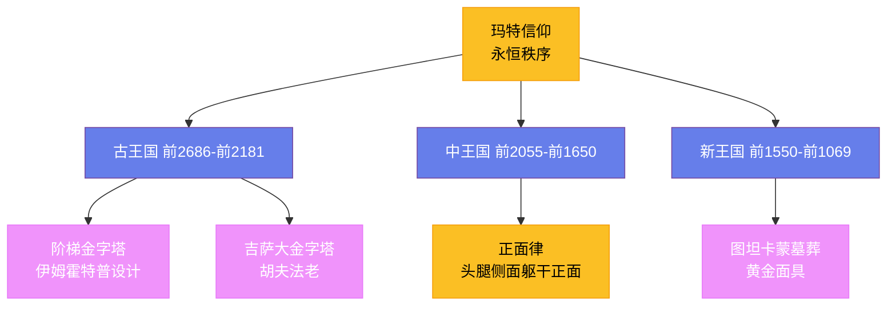

---
title: "古埃及与美索不达米亚艺术"
date: 2026-08-25
weight: 2
draft: false
cover:
  image: "https://images.unsplash.com/photo-1539650116574-8efeb43e2750?w=1200"
  alt: "古埃及金字塔"
  caption: "金字塔是古埃及文明最著名的象征，称霸世界最高建筑三千八百多年"
---

# 古埃及与美索不达米亚艺术

## 一、尼罗河畔的三千年

古埃及艺术是人类历史上延续时间最长的艺术传统之一——从约公元前 3100 年美尼斯统一上下埃及，到公元前 332 年亚历山大大帝征服埃及，三千年间其风格几乎没有发生根本性的变化。这种惊人的稳定性源于古埃及人对**玛特**（Ma'at，秩序与真理女神）的信仰：宇宙是永恒不变的，艺术的职责就是维护这种永恒的秩序。因此，古埃及艺术从不追求个人风格的创新——它的目的是实用的，是为死者和神灵服务的工具，而非审美的对象。

早在古王国时期，古埃及人就确立了一套严密的**图像法则**。法老的雕像必须庄严肃穆，双腿分开直立，目视前方；贵族的雕像可以稍带生活气息，但绝不能有丝毫的随意。法老左塞尔的阶梯金字塔（约公元前 2670 年）由宰相**伊姆霍特普**（Imhotep，约前 2667—前 2648）设计——他是人类历史上第一位留下姓名的建筑师，后来被埃及人奉为医神。

## 二、金字塔与狮身人面像

**金字塔**是古埃及文明最著名的象征。吉萨大金字塔（约公元前 2560 年）由法老**胡夫**（Khufu，约前 2589—前 2566 在位）建造——它高 146.5 米，由约 230 万块平均重 2.5 吨的石灰岩块砌成。直到 1889 年埃菲尔铁塔建成之前，它一直是世界上最高的人造建筑，称霸了整整三千八百多年。金字塔的建造需要精密的数学和天文知识——它的四边几乎精确指向正东南西北，误差不超过 0.05 度。古埃及人如何在没有铁器和滑轮的情况下搬运和堆砌这些巨石，至今仍是考古学界争论不休的话题。

**狮身人面像**（斯芬克斯）位于吉萨金字塔群前方——它长约 73 米，高约 20 米，由一整块天然石灰岩雕凿而成。它的面容可能属于法老**哈夫拉**（Khafre，约前 2558—前 2532 在位），象征着法老兼具狮子的力量和人类的智慧。三千年的风沙侵蚀了它的鼻子和胡须，但它沉默的凝视至今仍然震撼着每一个来访者。

## 三、墓室中的永恒世界

古埃及的**壁画**和**浮雕**遵循严格的**正面律**——人物的头部和腿部呈侧面，躯干和眼睛呈正面。这种看似"不正确"的画法并非因为古埃及人缺乏技巧，而是他们认为侧面最能表现头部轮廓，正面最能表现肩膀和胸部——艺术的目的不是模仿视觉，而是记录永恒。壁画的色彩也有严格的象征意义：男性皮肤用红棕色，女性用淡黄色，神灵的皮肤可以是蓝色或金色。

**图坦卡蒙**（Tutankhamun，前 1341—前 1323）的墓葬于 1922 年被英国考古学家**霍华德·卡特**（Howard Carter，1874—1939）发现——这是考古学史上最重要的发现之一。墓中出土了五千多件文物，其中最著名的是重达 10.23 公斤的黄金面具——它用天青石、黑曜石和彩色玻璃镶嵌，至今仍是古埃及艺术的标志。卡特在墓门口等金主卡那封勋爵到来后才进入墓室，他后来在日记中写道："我看到了奇妙的事物。"（I see wonderful things.）这句话成为了考古学史上最著名的描述。

## 四、两河流域的叙事力量

美索不达米亚（"两河之间"）位于今天的伊拉克境内——与埃及的永恒主义不同，这片土地上政权更迭频繁，艺术风格也随之变化。**苏美尔人**发明了楔形文字（约公元前 3200 年），建立了最早的城市国家；**阿卡德人**在萨尔贡大帝（Sargon of Akkad，约前 2334—前 2279）统治下建立了第一个帝国，留下了一尊著名的青铜头像——它有精美的卷发和深邃的眼睛，被认为是古代写实主义的杰作。

**亚述浮雕**是美索不达米亚艺术的高峰。亚述王宫（约前 865—前 612 年）的墙壁上装饰着数百块雪花石膏浮雕，描绘了国王猎狮、军队攻城和俘虏受刑的场景——细节之精确令人惊叹：被射中的狮子在痛苦中弓起脊背，猎犬的肌肉紧绷，飞矢穿过空气。这些浮雕既是艺术，也是政治宣传——它们向所有来访者宣告国王的勇武和帝国的力量。

**伊什塔尔门**（Ishtar Gate，约前 575 年）是巴比伦城的主要入口——它由蓝色琉璃砖砌成，装饰着 575 只龙和公牛的浮雕。这些神兽象征不同的神灵：龙代表主神马尔杜克，公牛代表风暴神阿达德。伊什塔尔门的复原品如今收藏在柏林佩加蒙博物馆——当参观者站在它面前时，依然能感受到古代巴比伦的辉煌。

**汉谟拉比法典碑**（约前 1754 年）是美索不达米亚最重要的文物之一——它刻在一块 2.25 米高的黑色闪长岩上，顶端是**汉谟拉比**（Hammurabi，前 1810—前 1750）从太阳神沙马什手中接过权杖的浮雕。法典共 282 条，涉及财产、商业、婚姻和刑罚——"以眼还眼"的原则就出自其中。这块石碑不仅是人类最早的成文法典之一，也是一件杰出的艺术品。

## 五、永恒与叙事的遗产

古埃及和美索不达米亚的艺术虽然风格迥异，但共同奠定了西方艺术的基础。希腊人从埃及人那里学到了比例和纪念性建筑的观念，从美索不达米亚人那里学到了叙事和装饰的技巧。金字塔的几何完美、壁画的永恒姿态和浮雕的叙事力量，在此后三千年的艺术中不断回响。这些古代文明用石头和色彩证明：艺术从来不仅是审美的游戏——它是权力的语言、信仰的容器和文明的记忆。
