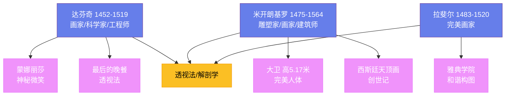

---
title: "文艺复兴"
date: 2026-08-25
weight: 5
draft: false
cover:
  image: "https://images.unsplash.com/photo-1553913861-c0fddf2619ee?w=1200"
  alt: "文艺复兴艺术"
  caption: "文艺复兴是西方艺术和文化的转折点，确立了'艺术家'的概念"
---

# 文艺复兴

## 一、文艺复兴的起源

文艺复兴（Renaissance，"重生"）是 14—17 世纪欧洲的一场文化运动——它起源于意大利的佛罗伦萨，后来传播到整个欧洲。文艺复兴的核心是"人文主义"——对人的价值和尊严的重新发现。

文艺复兴为什么首先发生在意大利？几个因素起了作用：意大利是古罗马的中心——古典文化的遗产无处不在；意大利的城市（佛罗伦萨、威尼斯、罗马）商业繁荣——富有的商人和银行家资助艺术家；拜占庭帝国灭亡（1453 年）后，希腊学者带着古典手稿来到意大利。

**美第奇家族**（Medici）是佛罗伦萨最有权势的家族——他们也是文艺复兴最重要的赞助人。**洛伦佐·德·美第奇**（Lorenzo de' Medici，1449—1492）被称为"伟大的洛伦佐"——他资助了**波提切利**、**米开朗基罗**和**达芬奇**等艺术家。

## 二、文艺复兴三杰

文艺复兴的三位最伟大的艺术家是**达芬奇**、**米开朗基罗**和**拉斐尔**。

**列奥纳多·达芬奇**（Leonardo da Vinci，1452—1519）是人类历史上最全面的天才之一。他不仅是画家，还是科学家、工程师、解剖学家和发明家。他的绘画代表作是《蒙娜丽莎》（约 1503—1519 年）和《最后的晚餐》（约 1495—1498 年）。《蒙娜丽莎》的微笑是艺术史上最著名的谜——她的表情似乎随着观看角度而变化。达芬奇的笔记包含了飞行器、坦克和潜水艇的设计——这些设计在数百年后才被实现。

**米开朗基罗·博纳罗蒂**（Michelangelo Buonarroti，1475—1564）是雕塑家、画家和建筑师。他的雕塑《大卫》（1501—1504 年）是文艺复兴雕塑的杰作——它高 5.17 米，展现了圣经英雄大卫的完美人体。西斯廷教堂的天顶画（1508—1512 年）是米开朗基罗最伟大的绘画作品——它描绘了《创世记》的场景，包括上帝创造亚当的经典画面。

**拉斐尔·桑西**（Raffaello Sanzio，1483—1520）是文艺复兴盛期的代表画家。他的《雅典学院》（1509—1511 年）描绘了古希腊的哲学家和科学家——柏拉图和亚里士多德位于画面中央。拉斐尔的画作以其和谐的构图、柔和的色彩和理想化的人物著称——他被认为是"完美画家"。

## 三、文艺复兴的科学与艺术

文艺复兴不仅是艺术的复兴，还是科学的革命。艺术家们开始研究透视法、解剖学和光学——这些研究直接推动了科学的发展。

**透视法**是文艺复兴最重要的技术创新之一。建筑师**菲利波·布鲁内莱斯基**（Filippo Brunelleschi，1377—1446）在 1420 年代发现了线性透视的数学原理——平行线在远方汇聚于一点。透视法使得绘画能够表现三维空间——它是文艺复兴绘画的基础。

布鲁内莱斯基还建造了佛罗伦萨大教堂的穹顶（1420—1436 年）——它是文艺复兴建筑的标志。穹顶直径 42 米，不用支撑架建造——它的结构创新至今仍令工程师惊叹。

## 四、威尼斯画派

威尼斯画派是文艺复兴的重要分支——它以色彩丰富和光线处理著称。**乔尔乔内**（Giorgione，1477—1510）和**提香**（Titian，1488—1576）是威尼斯画派的代表人物。

提香是文艺复兴最伟大的色彩大师——他的画作以丰富的色彩和自由的笔触著称。他的代表作包括《乌尔比诺的维纳斯》（1538 年）和《酒神巴库斯与阿里阿德涅》（1523 年）。提香对后来的画家——包括鲁本斯、委拉斯凯兹和印象派——产生了深远影响。

## 五、北方文艺复兴

文艺复兴不仅限于意大利——北方欧洲（特别是佛兰德斯和德国）也发展了独特的文艺复兴传统。

**扬·凡·艾克**（Jan van Eyck，约 1390—1441）是佛兰德斯画派的创始人——他完善了油画技术，使得绘画能够表现极其精细的细节。他的《阿尔诺芬尼夫妇》（1434 年）是北方文艺复兴的杰作——画中的镜子、窗户和衣物的细节令人惊叹。

**阿尔布雷希特·丢勒**（Albrecht Dürer，1471—1528）是德国文艺复兴最重要的艺术家——他既是画家，也是版画家。丢勒的版画以其精密的线条和丰富的细节著称——他的《忧郁》（1514 年）是艺术史上最神秘的版画之一。

## 六、文艺复兴的遗产

文艺复兴是西方艺术和文化的转折点。它确立了"艺术家"的概念——艺术家不再是工匠，而是有创造力的个人。它发展了透视法、解剖学和油画技术——这些技术成为后来数百年艺术的基础。文艺复兴的精神——人文主义、对古典的尊重和对创新的追求——至今仍是西方文化的核心。
