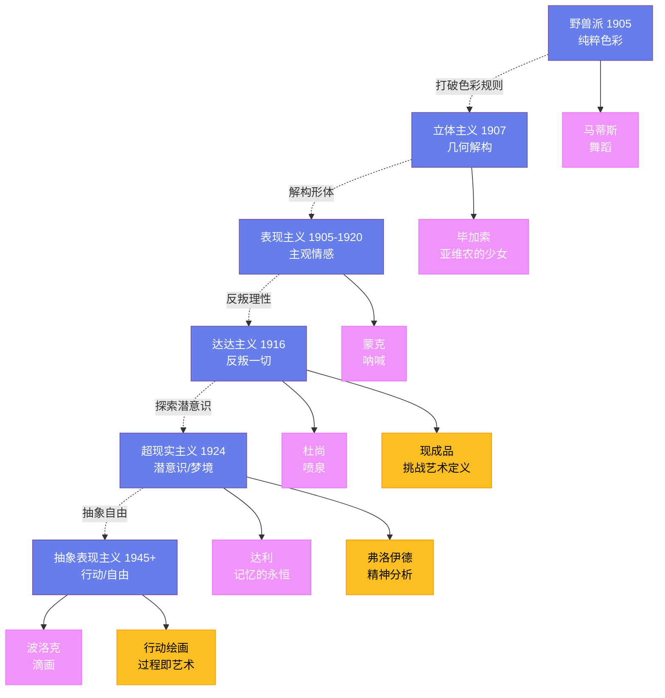

---
title: "现代艺术的诞生"
date: 2026-08-25
weight: 8
draft: false
cover:
  image: "https://images.unsplash.com/photo-1553913861-c0fddf2619ee?w=1200"
  alt: "现代艺术"
  caption: "现代艺术打破了传统的规则和边界，证明了艺术可以是任何东西"
---

# 现代艺术的诞生

## 一、野兽派

1905 年，巴黎秋季沙龙展出了一群年轻画家的作品——评论家**路易·沃克塞尔**（Louis Vauxcelles）看到这些色彩狂野的画作旁边有一座古典风格的雕塑，惊呼："多纳泰罗被野兽包围了！"从此，这群画家被称为"野兽派"（Fauvism）。

野兽派的核心人物是**亨利·马蒂斯**（Henri Matisse，1869—1954）——他用纯粹的、未调和的色彩来表达情感，而不是描述现实。他的《舞蹈》（1910 年）用红、蓝、绿三种颜色描绘了五个裸体人物在绿色草地和蓝色天空之间跳舞的场景——色彩的力量超越了形体的细节。

## 二、立体主义

1907 年，**巴勃罗·毕加索**（Pablo Picasso，1881—1973）画了《亚维农的少女》——这幅画被认为是立体主义的起点。画中的五个裸体女性被分解为几何形状——她们的面孔像非洲面具一样扭曲。这幅画打破了自文艺复兴以来的透视法传统。

毕加索和**乔治·布拉克**（Georges Braque，1882—1963）共同发展了立体主义。他们将物体分解为多个角度的视图，然后在画布上重新组合——观众同时看到物体的正面、侧面和背面。立体主义的"拼贴"技术——将报纸、布料等实物粘贴在画布上——是现代艺术的重要创新。

## 三、表现主义

表现主义（Expressionism）在 1905—1920 年间在德国兴起——它强调主观情感的表达，而不是客观现实的再现。

**爱德华·蒙克**（Edvard Munch，1863—1944）的《呐喊》（1893 年）是表现主义的标志性作品——一个扭曲的人物在血红色的天空下张嘴尖叫。蒙克的灵感来自一次日落时的散步——他写道："我感到一声无尽的呐喊穿过自然。"

"桥社"（Die Brücke，1905 年成立）和"蓝骑士"（Der Blaue Reiter，1911 年成立）是德国表现主义的两个主要团体。**瓦西里·康定斯基**（Wassily Kandinsky，1866—1944）是蓝骑士的核心人物——他是最早的抽象画家之一。

## 四、达达主义与超现实主义

一战（1914—1918）摧毁了欧洲的乐观主义——许多年轻艺术家认为：传统艺术和理性思维导致了战争的灾难。**达达主义**（Dadaism，1916 年在苏黎世诞生）就是对这一切的反叛——它反对逻辑、反对美学、反对一切。

**马塞尔·杜尚**（Marcel Duchamp，1887—1968）是达达主义的代表——他在 1917 年将一个小便器命名为《喷泉》，提交给一个艺术展。这个"现成品"（ready-made）挑战了艺术的定义——如果一个日常物品被放在美术馆里就是艺术，那么艺术的边界在哪里？

**超现实主义**（Surrealism）在 1924 年由**安德烈·布勒东**（André Breton）发起——它受弗洛伊德的精神分析理论影响，探索潜意识和梦境。**萨尔瓦多·达利**（Salvador Dalí，1904—1989）的《记忆的永恒》（1931 年）描绘了融化的钟表挂在荒凉的风景上——它是超现实主义最著名的图像。

## 五、抽象表现主义

二战后，艺术的中心从巴黎转移到了纽约。**抽象表现主义**（Abstract Expressionism）是美国第一个重要的艺术运动。

**杰克逊·波洛克**（Jackson Pollock，1912—1956）发展了"滴画"技术——他将画布铺在地上，用棍子将颜料滴洒在画布上。他的大型滴画（如《第 1A 号，1948 年》）充满了能量和运动——它们不是描绘任何东西，而是行动本身的记录。

**马克·罗斯科**（Mark Rothko，1903—1970）的画作由大面积的色块组成——他说他的画应该让人"哭泣"。罗斯科的画作看似简单，但它们的色彩微妙、层次丰富——观看它们是一种冥想式的体验。

## 六、现代艺术的遗产

现代艺术打破了传统的规则和边界——它证明了艺术可以是任何东西。从野兽派的色彩到立体主义的解构，从达达主义的反叛到抽象表现主义的自由，现代艺术彻底改变了人类对艺术的理解。
