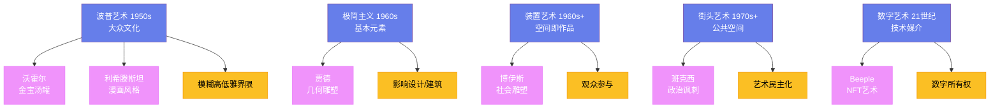

# 波普艺术与当代艺术

## 一、波普艺术

1950 年代末，一群英国艺术家开始从大众文化中汲取灵感——他们将广告、漫画和消费品引入艺术。这个运动被称为"波普艺术"（Pop Art）。

**安迪·沃霍尔**（Andy Warhol，1928—1987）是波普艺术最著名的代表。他的《金宝汤罐》（1962 年）和《玛丽莲·梦露》（1962 年）是波普艺术的标志性作品。沃霍尔说："每个人都能成名 15 分钟。"他的"工厂"（The Factory）工作室成为了纽约文化圈的中心。

**罗伊·利希滕斯坦**（Roy Lichtenstein，1923—1997）用漫画的风格创作大型绘画——他用本戴点（Ben-Day dots）来模仿印刷效果。他的《哭泣的女孩》（1964 年）是波普艺术的经典。

波普艺术的意义在于：它模糊了"高雅艺术"和"低俗文化"的界限。它挑战了艺术精英主义——如果金宝汤罐可以是艺术，那么艺术无处不在。

## 二、极简主义

极简主义（Minimalism）在 1960 年代兴起——它将艺术简化到最基本的元素：形状、颜色和材料。

**唐纳德·贾德**（Donald Judd，1928—1994）的几何雕塑使用了工业材料（铝、不锈钢、有机玻璃）——它们没有象征意义，只是物体本身。**丹·弗莱文**（Dan Flavin，1933—1996）用荧光灯管来创作装置——光本身成为了艺术媒介。

极简主义的影响超越了艺术——它深刻影响了建筑、设计和生活方式。苹果公司的产品设计就深受极简主义影响。

## 三、装置艺术与行为艺术

1960 年代以来，艺术的媒介不断扩展。**装置艺术**（Installation Art）将整个空间变成艺术作品——观众进入作品内部，而不是站在外面观看。**行为艺术**（Performance Art）将艺术家的身体和行动作为艺术媒介。

**约瑟夫·博伊斯**（Joseph Beuys，1921—1986）是德国最重要的当代艺术家——他的"社会雕塑"概念将艺术扩展到社会和政治领域。他最著名的行为艺术是《如何向一只死兔子解释绘画》（1965 年）——他脸上涂满蜂蜜和金箔，抱着一只死兔子，低声向它解释墙上的画作。

## 四、街头艺术

1970 年代以来，街头艺术（Street Art）从纽约和费城的涂鸦文化中发展出来。**让-米歇尔·巴斯奎特**（Jean-Michel Basquiat，1960—1988）从涂鸦艺术家成长为国际知名的画家——他的作品融合了文字、符号和图像。

**班克西**（Banksy）是当代最著名的街头艺术家——他的真实身份至今未被确认。班克西的作品以政治讽刺和社会批评著称——他的涂鸦出现在世界各地的墙壁上。

## 五、数字艺术

21 世纪，数字技术为艺术创作提供了新的可能性。**数字绘画**、**3D 打印**和**虚拟现实**成为了新的艺术媒介。

2021 年，数字艺术家**Beeple**（Mike Winkelmann）的 NFT 作品《每一天：前 5000 天》在佳士得拍卖会上以 6930 万美元成交——这引发了关于数字艺术和 NFT 的广泛讨论。NFT（非同质化代币）的核心创新在于解决了数字艺术的"复制悖论"：数字文件可以被无限复制，那"原作"在哪里？NFT通过区块链技术为数字作品提供了可验证的所有权证明——你拥有的不是图像本身（任何人都可以截图），而是"这幅作品的第1号版本"的不可篡改的认证。这个机制在2021年催生了一场狂热：Bored Ape Yacht Club等NFT项目在巅峰时期单个头像售价超过300万美元，整个NFT市场年交易额超过250亿美元。但泡沫很快破裂——到2023年，超过95%的NFT项目市值归零，许多投机者血本无归。这场大起大落留下了一个值得深思的问题：当"所有权"可以与"体验"分离时，艺术的价值究竟来自哪里？

更深层的变革来自AI生成艺术。2022年，杰森·艾伦用Midjourney生成的《太空歌剧院》在美国科罗拉多州博览会的数字艺术比赛中获得一等奖，引发了艺术界的激烈抗议——画家们认为"输入几个关键词不叫创作"。但这场争论暴露了一个根本性的问题：如果艺术的价值在于"表达"，那么表达的工具重要吗？摄影术发明时，画家们也曾发出同样的哀叹。当代艺术家Refik Anadol用机器学习算法处理数百万张图像和数据流，生成沉浸式的"数据雕塑"——他的作品《无人监督》（Unsupervised）在纽约现代艺术博物馆展出，观众被卷入一个由AI"想象"出的视觉漩涡中。这些实践表明，数字艺术的真正挑战不是"AI能否创造艺术"，而是"当创作的门槛降到几乎为零时，什么才值得被称为艺术"。

## 六、当代艺术的特征

当代艺术的特征是多元性和全球化。来自亚洲、非洲和拉丁美洲的艺术家越来越多地出现在国际舞台上。中国的**艾未未**、日本的**草间弥生**和印度的**安尼施·卡普尔**都是当代最有影响力的艺术家。

当代艺术不再有统一的风格或运动——它是多种风格、媒介和观念的共存。这个多元性既是当代艺术的力量，也是它的挑战——它使得"什么是艺术"这个问题比以往任何时候都更加复杂。
