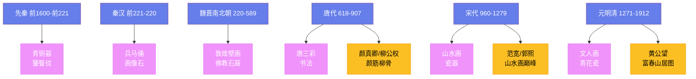

---
title: "中国艺术简史"
date: 2026-08-25
weight: 10
draft: false
cover:
  image: "https://images.unsplash.com/photo-1578662996442-48f60103fc96?w=1200"
  alt: "中国艺术"
  caption: "中国艺术的核心精神是'意境'——超越形式的精神境界"
---

# 中国艺术简史

## 一、先秦艺术

中国艺术的源头可以追溯到新石器时代。**仰韶文化**（约前 5000—前 3000 年）的彩陶以其精美的几何图案和鱼纹著称。**龙山文化**（约前 2500—前 2000 年）的黑陶以其薄如蛋壳的质地著称——有些陶器的壁厚仅 1 毫米。

**青铜器**是商周时期（约前 1600—前 256 年）最重要的艺术形式。商代的**司母戊鼎**（约前 1300 年）重 832 公斤——它是已知最大的古代青铜器。青铜器上的饕餮纹、夔龙纹和云雷纹展示了商周时期精湛的铸造技术和丰富的想象力。

## 二、秦汉艺术

秦始皇（前 259—前 210 年）统一中国后，留下了两个伟大的艺术遗产：**万里长城**和**兵马俑**。1974 年在西安发现的秦始皇兵马俑包含了约 8000 个真人大小的陶俑——每一个的面部特征都不同。兵马俑是 20 世纪最伟大的考古发现之一。

汉代（前 206—220 年）的艺术以画像石和画像砖著称——它们描绘了历史故事、神话传说和日常生活。汉代的漆器和丝织品也达到了极高的水平。

## 三、魏晋南北朝与佛教艺术

佛教在东汉传入中国后，深刻影响了中国艺术。**敦煌莫高窟**（始建于 366 年）是世界上最大的佛教艺术宝库——它包含 735 个洞窟，4.5 万平方米的壁画和 2000 多尊彩塑。

**云冈石窟**（460 年始建）和**龙门石窟**（493 年始建）是另外两个重要的佛教石窟——它们的佛像雕刻融合了印度和中国的艺术风格。

## 四、唐代艺术

唐代（618—907 年）是中国艺术的黄金时代。**唐三彩**以其鲜艳的釉色著称——黄、绿、褐三种颜色在陶器上流动，创造出华丽的效果。唐代的书法以**颜真卿**和**柳公权**为代表——"颜筋柳骨"是书法的最高标准。

唐代的绘画以**阎立本**和**吴道子**为代表。阎立本的《步辇图》描绘了唐太宗接见吐蕃使者的场景。吴道子被称为"画圣"——他的线条被称为"吴带当风"。

## 五、宋代艺术

宋代（960—1279 年）是中国绘画的巅峰。**宋徽宗赵佶**（1082—1135）不仅是皇帝，还是杰出的画家和书法家——他的《芙蓉锦鸡图》和"瘦金体"书法是宋代艺术的代表。

宋代山水画达到了极高的水平。**范宽**的《溪山行旅图》、**郭熙**的《早春图》和**李唐**的《万壑松风图》是宋代山水画的三大杰作。宋代的**汝窑**、**官窑**和**哥窑**瓷器以其素雅的釉色著称——"雨过天青云破处"是对汝窑天青釉的赞美。

## 六、元明清艺术

元代（1271—1368 年）的文人画以**赵孟頫**和"元四家"（黄公望、吴镇、倪瓒、王蒙）为代表。黄公望的《富春山居图》是中国山水画的巅峰之作。

明代（1368—1644 年）的艺术以**沈周**、**文徵明**、**唐寅**和**仇英**为代表——他们被称为"明四家"。明代的青花瓷和景德镇瓷器达到了极高的水平。

清代（1644—1912 年）的艺术以"四僧"（朱耷、石涛、弘仁、髡残）和"扬州八怪"为代表。朱耷（八大山人）的画作以简练的笔墨和奇特的构图著称——他笔下的鸟和鱼常常翻白眼，象征着对清朝统治的不满。

## 七、中国艺术的精神

中国艺术的核心精神是"意境"——超越形式的精神境界。中国画不追求写实，而追求"气韵生动"——画面应该有生命力和精神力量。书法不仅是写字，更是人格的表达——"字如其人"。中国艺术的这些精神至今仍影响着东亚的艺术传统。
