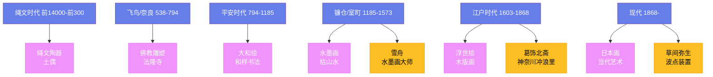

# 日本艺术

## 一、绳文与弥生时代

日本最早的艺术可以追溯到**绳文时代**（约前 14000—前 300 年）。绳文陶器是世界上最古老的陶器之一——它们以绳纹装饰和火焰形的造型著称。绳文时代的**土偶**（dogu）是神秘的小型人形雕塑——它们的眼睛像护目镜，可能是与生育或宗教仪式有关。

**弥生时代**（约前 300—300 年）的陶器风格更加简洁——反映了从狩猎采集向农耕社会的转变。

## 二、佛教艺术

佛教在 6 世纪从中国和朝鲜传入日本，深刻影响了日本艺术。**法隆寺**（始建于 607 年）是世界上最古老的木结构建筑之一——它的金堂和五重塔展示了飞鸟时代（538—710 年）的建筑艺术。

奈良时代（710—794 年）的佛教雕塑达到了极高的水平。**东大寺卢舍那大佛**（752 年）高 15 米——它是世界上最大的青铜佛像之一。

## 三、平安时代与大和绘

平安时代（794—1185 年）发展了独特的日本艺术风格。**大和绘**（Yamato-e）是日本传统的绘画风格——它以鲜艳的色彩和叙事性构图著称。**《源氏物语绘卷》**（12 世纪）是大和绘的代表作——它描绘了紫式部小说中的场景。

平安时代的书法以**小野道风**和**藤原行成**为代表——他们发展了日本独特的"和样"书法。

## 四、禅宗与水墨画

镰仓时代（1185—1333 年）和室町时代（1336—1573 年），禅宗从中国传入日本，带来了水墨画的传统。**雪舟**（Sesshū Tōyō，1420—1506）是日本最伟大的水墨画家——他的山水画融合了中国和日本的风格。

禅宗艺术的特点是简洁和空寂。**枯山水**（karesansui）是禅宗庭园的代表——**龙安寺**（1450 年）的石庭只有 15 块石头和白砂——它是"空"的美学的极致表达。

## 五、浮世绘

**浮世绘**（Ukiyo-e）是江户时代（1603—1868 年）最重要的艺术形式——它是木版画的一种，描绘了歌舞伎演员、美人、风景和日常生活。

**葛饰北斋**（Katsushika Hokusai，1760—1849）的《富岳三十六景》（1831 年）是浮世绘最著名的作品——其中《神奈川冲浪里》是世界上最有名的日本艺术品。**歌川广重**（Utagawa Hiroshige，1797—1858）的《东海道五十三次》（1834 年）描绘了从江户到京都的 53 个驿站。

浮世绘在 19 世纪中叶传入欧洲——它对印象派画家（特别是莫奈和梵高）产生了深远影响。

## 六、现代日本艺术

明治维新（1868 年）后，日本艺术开始与西方艺术融合。**横山大观**和**下村观山**发展了"日本画"的新风格——他们将传统的日本画技法与西方的透视法和光影处理结合起来。

20 世纪的日本艺术在国际上产生了重要影响。**草间弥生**（Yayoi Kusama，1929—）以她的波点装置和南瓜雕塑著称——她是当代最知名的日本艺术家。草间弥生从 10 岁起就开始出现幻觉——她看到世界被圆点覆盖，这些幻觉后来成为了她艺术的核心元素。她从 1977 年起自愿住进东京的一家精神病院，每天步行到工作室创作——她的"无限镜屋"系列用镜面和灯光创造出无限延伸的空间幻觉，让观众仿佛置身于宇宙之中。

**村上隆**（Takashi Murakami，1962—）将日本的动漫文化与当代艺术融合——他的"超扁平"（Superflat）理论认为，日本战后的消费文化、动漫和传统绘画都共享一种"平面性"的美学。他的作品将可爱的卡通形象与暴力和色情的元素并置——这种刻意的不协调既是对日本社会的讽刺，也是对西方艺术界"异域风情"期待的回应。村上隆还与路易威登合作设计手袋，模糊了艺术与商业的边界——这本身就是波普艺术精神在 21 世纪的延续。

**奈良美智**（Yoshitomo Nara，1959—）画的大头小孩——带着斜睨的眼神和天真的外表——已成为日本当代艺术最具辨识度的图像之一。他的作品融合了朋克摇滚的反叛精神和儿童插画的简洁形式，表达了孤独、愤怒和纯真的复杂交织。2019 年 10 月，他的布面丙烯画作《背后藏刀》（Knife Behind Back）在香港苏富比以约 2490 万美元成交——创下了日本当代艺术家的拍卖纪录。
