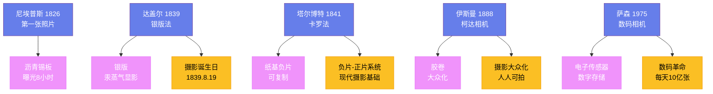

---
title: "摄影术的发明"
date: 2026-08-25
weight: 12
draft: false
cover:
  image: "https://images.unsplash.com/photo-1553913861-c0fddf2619ee?w=1200"
  alt: "摄影术"
  caption: "摄影术的发明是人类视觉史上的革命"
---

# 摄影术的发明

## 一、暗箱与摄影的前身

摄影的原理可以追溯到古代——**暗箱**（camera obscura）的原理在公元前 4 世纪就被亚里士多德描述过。暗箱是一个黑暗的房间或盒子，光线通过一个小孔进入，在对面的墙上形成倒像。文艺复兴时期的画家使用暗箱来辅助绘画——达芬奇在他的笔记中描述了暗箱的原理。

但暗箱只能形成暂时的图像——它无法将图像永久地记录下来。将图像永久记录下来需要一种对光敏感的材料。

## 二、尼埃普斯与达盖尔

**约瑟夫·尼塞福尔·尼埃普斯**（Joseph Nicéphore Niépce，1765—1833）是第一个成功永久记录图像的人。1826 年（或 1827 年），他在一块涂有沥青的锡板上拍摄了窗外的景色——曝光时间长达 8 小时。这张照片《窗外景色》是世界上现存最早的照片。

尼埃普斯与**路易-雅克-芒代·达盖尔**（Louis-Jacques-Mandé Daguerre，1787—1851）合作，继续研究摄影技术。尼埃普斯在 1833 年去世后，达盖尔继续工作——他在 1839 年发明了**达盖尔银版法**（daguerreotype）。

达盖尔银版法使用银版作为感光材料——经过曝光和汞蒸气显影后，银版上形成精细的图像。达盖尔银版法的图像非常清晰——但每张照片都是独一无二的，不能复制。

1839 年 8 月 19 日，法国科学院公布了达盖尔银版法——这一天被认为是摄影术的诞生日。

## 三、卡罗法与塔尔博特

英国人**威廉·亨利·福克斯·塔尔博特**（William Henry Fox Talbot，1800—1877）独立地发明了另一种摄影技术——**卡罗法**（calotype，1841 年）。卡罗法使用纸基负片——可以从一张负片制作多张正片。这是现代摄影的基础——"负片-正片"系统一直使用到数码摄影的出现。

## 四、摄影与艺术

摄影的发明引发了激烈的争论：摄影是艺术吗？许多画家认为摄影是对艺术的威胁——保罗·德拉罗什（Paul Delaroche）据说看到达盖尔银版法后惊呼："从今天起，绘画死了！"

但绘画并没有死——相反，摄影的出现推动了绘画的变革。印象派画家开始关注光线和瞬间印象——部分原因是摄影可以比绘画更精确地记录现实，因此画家需要找到摄影无法做到的事情。

## 五、摄影的发展

1888 年，**乔治·伊斯曼**（George Eastman）推出了**柯达相机**——它的口号是"你按下按钮，我们做剩下的"。柯达相机使用胶卷——它使得摄影变得简单和便宜。摄影从此不再是专业人士的专利，而是大众的爱好。

20 世纪，摄影成为了一种重要的艺术形式。**安塞尔·亚当斯**（Ansel Adams，1902—1984）以拍摄美国西部的风景著称——他的黑白照片以其精确的曝光和丰富的影调著称。**亨利·卡蒂埃-布列松**（Henri Cartier-Bresson，1908—2004）是"决定性瞬间"理论的创始人——他认为摄影应该捕捉生活中转瞬即逝的时刻。

## 六、数码摄影

1975 年，柯达的工程师**史蒂文·萨森**（Steven Sasson）发明了第一台数码相机——它重 3.6 公斤，拍摄一张照片需要 23 秒。数码摄影使用电子传感器代替胶卷——图像以数字数据的形式存储。

数码摄影在 21 世纪初取代了胶卷摄影。2000 年代，数码相机的销量超过了胶卷相机。2010 年代，智能手机的摄像头使得每个人都可以随时随地拍照——每天全球拍摄的照片超过 10 亿张。

摄影术的发明是人类视觉史上的革命——它改变了人类记录和分享经验的方式。从达盖尔的银版到今天的智能手机摄像头，摄影已经走过了近 200 年的历史。
