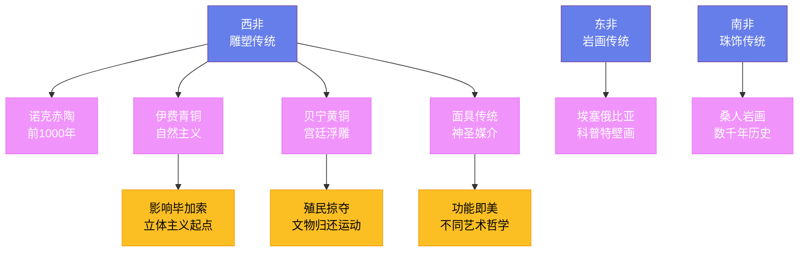

---
title: "非洲艺术"
date: 2026-08-25
weight: 14
draft: false
cover:
  image: "https://images.unsplash.com/photo-1578662996442-48f60103fc96?w=1200"
  alt: "非洲艺术"
  caption: "非洲艺术教给我们最重要的一课是：美的标准不是唯一的"
---

# 非洲艺术

## 一、大陆之广，艺术之丰

非洲是世界上第二大大陆——面积约 3020 万平方公里，拥有 54 个国家和超过 2000 种语言。它的艺术传统如同它的地理和语言一样多样：从撒哈拉沙漠以北的伊斯兰装饰艺术，到西非热带草原的木雕面具；从埃塞俄比亚高原的科普特基督教壁画，到南非的岩画和珠饰。将如此丰富的传统统称为"非洲艺术"，本身就带有一种简化——但正是在这种多样性中，非洲艺术展现了一种共同的特质：艺术与生活的密不可分。在大多数非洲语言中，甚至没有"艺术"这个独立的词汇——因为艺术就是生活本身。

## 二、西非雕塑的黄金传统

西非是撒哈拉以南非洲雕塑传统最丰富的地区。**诺克文化**（约前 1000—前 500 年，今尼日利亚中部）的赤陶雕塑是撒哈拉以南非洲最早的雕塑作品——它们的人头造像有着夸张的三角眼、穿孔的瞳孔和精细的发型，风格高度程式化却又充满表现力。这些头像在地下沉睡了两千多年，直到 1928 年才在锡矿开采中被偶然发现。

**伊费王国**（约 1100—1400 年）的青铜和赤陶头像以其惊人的自然主义著称——面部的比例精确、表情沉静，皮肤的质感甚至可以看到细微的划痕和毛孔。德国考古学家**利奥·弗罗贝纽斯**（Leo Frobenius，1873—1938）在 1910 年第一次见到伊费头像时，拒绝相信这是非洲人的作品——他坚持认为这些头像出自传说中沉没的亚特兰蒂斯文明。这种荒谬的猜测恰恰暴露了欧洲人对非洲艺术的无知和偏见。

**贝宁王国**（约 1400—1897 年）的黄铜铸造技术达到了极高水平。贝宁的宫廷艺人为奥巴（国王）制作了大量的黄铜浮雕板，记录了宫廷仪式、战争场景和葡萄牙商人的形象——这些浮雕板原本装饰在宫殿的柱子上。1897 年，英国对贝宁发动惩罚性远征，掠走了约 4000 件黄铜和象牙雕刻——这些文物如今散落在大英博物馆、柏林民族学博物馆和纽约大都会博物馆。2022 年，德国宣布将归还其收藏的全部贝宁青铜器——这一决定被视为殖民时代文物归还运动的重要里程碑。

## 三、面具：神灵的面具

面具是非洲艺术中最广为人知也最容易被误解的形式。在西方观众眼中，面具是挂在墙上的装饰品；但在非洲的仪式语境中，面具是**神圣的媒介**——舞者戴上面具的那一刻，就不再是他自己，而是成为了神灵或祖先的化身。面具的使用通常与舞蹈、音乐和吟唱结合在一起——只有在这种整体的表演中，面具才真正"活"了。

**多贡人**（Dogon，马里）的面具以其几何造型著称——"卡纳加"（Kanaga）面具的顶部是双十字形结构，象征创世神话中的天地交合。**班巴拉人**（Bambara，马里）的"奇瓦拉"（Chi wara）羚羊面具用于农耕仪式——它象征传说中教会人类耕种的羚羊精灵，舞者在田地里成对舞蹈，祈求丰收。**丹族**（Dan，科特迪瓦和利比里亚）的面具以其光滑如镜的面部和优雅的曲线著称——它们分为十余种类型，每种有特定的社会功能：有的主持正义，有的管理火灾，有的专司娱乐。

**芳族**（Fang，加蓬和喀麦隆）的"比埃里"（Bieri）祖先守护像则展现了另一种美学——细长的躯干、夸张的头部和内敛的表情，具有一种超越时空的静穆力量。这些雕像原本安放在存放祖先遗骨的圆筒形篮子上，承担着守护家族的神圣职责。

## 四、非洲与欧洲现代主义

1907 年春天，**巴勃罗·毕加索**（Pablo Picasso，1881—1973）在巴黎特罗卡德罗宫的人种学博物馆里看到了非洲面具。他后来回忆说那次经历像一次"启示"——面具的变形和抽象不是对自然的模仿失败，而是一种有意识的艺术选择。这次邂逅直接催生了《亚维农的少女》（1907 年）——画面右侧两张面孔明显借用了非洲面具的形式语言，棱角分明、充满攻击性。这幅画被视为**立体主义**的起点，而立体主义又开启了整个现代艺术的革命。

**莫迪利亚尼**（Amedeo Modigliani，1884—1920）拉长的面孔源自非洲雕塑，**布朗库西**（Constantin Brâncuși，1876—1957）的抽象造型受到了非洲木雕的启发。然而，这种影响长期以来被艺术史淡化甚至否认——欧洲艺术家从非洲"借用"了形式，却很少承认欠下的债。直到今天，"原始主义"这个标签仍然是艺术史中最具争议的遗产之一。

## 五、当代非洲艺术

当代非洲艺术家在全球艺术舞台上的声音越来越响亮。**艾尔·阿纳祖伊**（El Anatsui，1944—，加纳）用数以万计的废弃瓶盖和铝条编织出巨大的挂毯式装置——它们如瀑布般从墙面垂落，金属的光泽在灯光下闪烁如同织物。这些作品既呼应了西非的肯特布纺织传统，也尖锐地指向了消费主义和殖民贸易的历史——那些瓶盖来自欧洲生产的烈酒，而酒精正是奴隶贸易时代欧洲用来交换非洲人的商品之一。阿纳祖伊在 2015 年获得了威尼斯双年展金狮奖终身成就奖。

**威廉·肯特里奇**（William Kentridge，1955—，南非）以炭笔动画和歌剧导演作品著称——他的动画通过反复擦除和重画同一个画面，让时间的流逝成为作品的一部分。他的《流亡中的费利克斯》（1994 年）等作品探讨了南非种族隔离制度的创伤和记忆。2022 年，肯特里奇在伦敦皇家艺术学院举办了大型回顾展，被《卫报》评为年度最重要的展览之一。

## 六、功能即美

非洲艺术教给我们最重要的一课是：美的标准不是唯一的。在西方传统中，"为艺术而艺术"被视为艺术的最高形式；但在非洲传统中，一件面具、一座雕像、一段织物的价值恰恰在于它的**功能**——它能否在仪式中有效地沟通神灵，能否在社会中维护秩序和传递知识。这种观念并非"原始"或"落后"，而是一种不同的艺术哲学——它提醒我们，艺术的定义可以比我们想象的更宽广。
