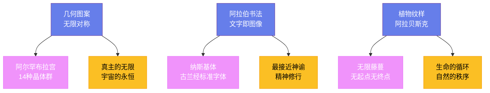

---
title: "伊斯兰艺术"
date: 2026-08-25
weight: 15
draft: false
cover:
  image: "https://images.unsplash.com/photo-1578662996442-48f60103fc96?w=1200"
  alt: "伊斯兰艺术"
  caption: "伊斯兰艺术用抽象和秩序创造了一种超越形象的崇高之美"
---

# 伊斯兰艺术

## 一、无形之像

公元 622 年，穆罕默德从麦加迁徙到麦地那——这一事件被称为"希吉拉"，标志着伊斯兰历的开始。此后一个世纪内，阿拉伯军队将伊斯兰教传播到从西班牙到印度河流域的广袤地区，创造了人类历史上扩张速度最快的文明之一。伊斯兰艺术也随之诞生——它不是一种单一的风格，而是一个横跨三大洲、绵延一千四百年的庞大传统。

伊斯兰艺术最显著的特征是对**具象形象**的回避。伊斯兰教禁止偶像崇拜——《古兰经》中虽然没有明确禁止描绘人物，但圣训中有"画像者将在末日受到惩罚"的记载。在宗教艺术中，这种禁令被严格执行：清真寺里没有神像、没有圣像、没有叙事壁画。取而代之的是三种独特的艺术形式：**几何图案**、**阿拉伯书法**和**植物纹样**。这三种形式交织在一起，创造出一种既高度抽象又极具装饰性的视觉语言。

## 二、石头与穹顶的诗篇

清真寺是伊斯兰建筑的核心。**圆顶清真寺**（Dome of the Rock，691 年，耶路撒冷）是现存最古老的伊斯兰建筑之一——它的八角形平面和金色穹顶成为此后一千多年伊斯兰建筑的原型。它的马赛克装饰由拜占庭工匠完成，金银底色上缠绕着藤蔓和珠宝纹样，但没有任何人物或动物的形象。

**科尔多瓦大清真寺**（784—987 年，西班牙）是倭马亚王朝在安达卢西亚留下的建筑奇迹——它有 856 根由大理石和花岗岩制成的柱子，双层红白相间的拱券如同棕榈树林般延伸到视线的尽头，创造出一种令人眩晕的空间韵律。1236 年基督教重新征服科尔多瓦后，一座文艺复兴式的大教堂被硬生生地插入了清真寺的中心——两种文明的叠加至今令来访者唏嘘不已。

奥斯曼帝国时期，**米马尔·希南**（Mimar Sinan，1489—1588）将伊斯兰建筑推向了巅峰。这位出身基督徒家庭的建筑大师为奥斯曼帝国设计了超过 300 座建筑，其中最著名的是**塞利米耶清真寺**（1568—1574 年，埃迪尔内）——它的穹顶直径 31.25 米，仅比圣索菲亚大教堂略小，但内部空间更加开阔通透。希南本人认为塞利米耶是他一生中最好的作品，他的墓地就安静地躺在清真寺旁。

**泰姬陵**（1632—1653 年，印度阿格拉）可能是世界上最著名的伊斯兰建筑。莫卧儿皇帝**沙贾汗**（Shah Jahan，1592—1666）为纪念他在 1631 年死于分娩的妻子穆姆塔兹·玛哈尔而建造了这座陵墓。超过两万名工匠参与了建造，白色大理石上镶嵌着由青金石、玛瑙和碧玉组成的精细花纹。泰姬陵的白色大理石会随光线变化而呈现不同的颜色——清晨是柔和的粉红，正午是耀眼的纯白，月光下则泛着淡淡的蓝晕。诗人泰戈尔称它为"永恒面颊上的一滴眼泪"。

## 三、文字即图像

在伊斯兰世界，**书法**享有高于一切艺术形式的地位——因为它是记录《古兰经》的工具，是最接近神谕的视觉表达。一位书法家在动笔之前必须净身、静心，书写被视为一种精神修行。

**伊本·穆拉**（Ibn Muqla，886—940）在 10 世纪制定了阿拉伯书法的系统比例规则——他以"点"为基本单位，规定每个字母的高度和宽度必须是点的整数倍，从而使书法从一种手艺升华为一门精确的科学。他的继任者**伊本·巴瓦卜**（Ibn al-Bawwab，？—1022）完善了**纳斯基体**（Naskh）——这种字体圆润流畅，成为此后抄写《古兰经》的标准字体，沿用至今。13 世纪的**雅库特·穆斯塔西米**（Yaqut al-Musta'simi，？—1298）是阿拔斯王朝最后一位伟大的书法家——据说在 1258 年蒙古人攻陷巴格达时，他躲在一座宣礼塔的顶层，在战火中坚持完成了他的最后一部《古兰经》抄本。

## 四、无限的几何

伊斯兰装饰的核心是**阿拉贝斯克**（arabesque）——一种无限延伸的植物藤蔓纹样。它的哲学含义深刻：藤蔓没有起点也没有终点，象征真主的无限和宇宙的永恒。在西班牙的阿尔罕布拉宫（14 世纪），墙壁和天花板上覆盖着令人叹为观止的灰泥雕刻和彩釉瓷砖——几何图案从八芒星到十六芒星层层嵌套，密密麻麻却井然有序。

现代数学的研究揭示了一个惊人的事实：伊斯兰几何图案中包含了 17 种平面晶体群（wallpaper group）中的至少 14 种——也就是说，中世纪的伊斯兰工匠在没有群论知识的情况下，通过直觉和经验几乎穷尽了平面对称的所有可能性。荷兰艺术家**M.C. 埃舍尔**（M.C. Escher，1898—1972）在 1936 年参观阿尔罕布拉宫后深受启发——他此后创作的那些著名的"不可能的图形"，灵感源头正是伊斯兰的几何装饰。

## 五、纸上的微观世界

在宗教空间之外的世俗领域，具象绘画并未消失——它以一种精致的形式存在：**波斯细密画**。细密画是为手抄本诗集和历史著作绘制的插图，画面通常只有巴掌大小，但细节之丰富令人叹为观止——每一片树叶、每一块砖、每一条衣纹都用细如发丝的画笔精心描绘。

**贝赫扎德**（Kamāl ud-Dīn Behzād，约 1450—1535）是波斯细密画最负盛名的大师。他在帖木儿王朝的赫拉特宫廷中作画，其代表作《约瑟被兄弟们出卖》（1488 年）中，人物的动态、色彩的搭配和空间的处理都达到了前所未有的高度。他的作品影响了此后数百年的波斯、印度和奥斯曼绘画传统。1506 年，他被萨法维王朝的开国君主伊斯玛仪一世任命为皇家图书馆馆长——这是画家在伊斯兰世界所能获得的最高荣誉。

## 六、伊斯兰艺术的回响

伊斯兰艺术对世界艺术的影响是深远的。中世纪的欧洲通过西班牙和西西里接触到了伊斯兰的几何装饰和阿拉伯数字；文艺复兴时期的威尼斯商人将伊斯兰的金属工艺和玻璃技术带回欧洲；19 世纪的欧洲设计师从伊斯兰图案中汲取灵感，推动了装饰艺术运动。今天，当我们凝视一座清真寺的穹顶、欣赏一幅细密画的精妙细节、或者赞叹一段书法的流畅线条时，我们看到的是一个延续了十四世纪的伟大传统——它用抽象和秩序创造了一种超越形象的崇高之美。
