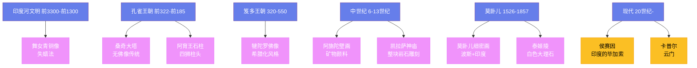

---
title: "印度艺术"
date: 2026-08-25
weight: 16
draft: false
cover:
  image: "https://images.unsplash.com/photo-1578662996442-48f60103fc96?w=1200"
  alt: "印度艺术"
  caption: "印度艺术在精神世界与感官体验之间找到了充满活力和想象力的平衡"
---

# 印度艺术

## 一、印度河下游的远古回响

印度艺术的源头可以追溯到**印度河文明**（约前 3300—前 1300 年）——它与古埃及和美索不达米亚并称为世界三大早期文明。摩亨佐-达罗和哈拉帕这两座规划整齐的城市遗址中，出土了数千枚滑石印章——上面刻着独角兽、大象、犀牛和至今未能破译的文字。最引人注目的是一尊仅高 10.5 厘米的**舞女青铜像**（约前 2500 年）——她单手叉腰，微微歪头，姿态自信而优雅。这尊小小的铜像证明，早在四千五百年前，印度次大陆的艺术家就已经掌握了失蜡法铸造技术，并且对人体之美有着敏锐的感知。

## 二、佛陀的足迹

公元前 6 世纪，**释迦牟尼**（Siddhartha Gautama，约前 563—前 483）在菩提伽耶悟道，佛教由此诞生。但在佛教诞生后的数百年里，艺术家从不直接描绘佛陀的形象——他们用**菩提树**象征悟道，用**法轮**象征初转法轮，用**足迹**象征佛陀的存在，用**空座**象征涅槃。这种"无佛像"的艺术传统在**桑奇大塔**（约前 3 世纪—1 世纪，中央邦）的浮雕中得到了完美体现——塔门上密密麻麻的浮雕讲述了佛陀前世（本生故事）和今生的种种事迹，但佛陀本人始终以符号的方式缺席。

**阿育王**（Ashoka，约前 304—前 232）是孔雀王朝的第三代君主——他在血腥征服羯陵伽后皈依佛教，成为佛教历史上最重要的护法者。他下令在全国各地竖立石柱——这些石柱的柱头雕刻着狮子、大象和公牛，工艺精湛，表面打磨得如同镜面。鹿野苑的**四狮柱头**（约前 250 年）后来成为了现代印度共和国的国徽。

佛陀第一次以人形出现，是在**犍陀罗**（约 1—5 世纪，今巴基斯坦和阿富汗）。这片处于东西方交汇处的土地曾受希腊化王国统治，犍陀罗的艺术家将希腊式的写实技巧与佛教的精神内涵融合在一起——佛陀穿着希腊式的厚重长袍，有着阿波罗式的面容，但表情却带着东方的冥想与超然。犍陀罗艺术沿着丝绸之路向东传播，深刻影响了中国的云冈石窟、龙门石窟和日本法隆寺的佛像造型。东亚的佛教艺术追根溯源，都流淌着犍陀罗的血脉。

## 三、石窟中的色彩世界

**阿旃陀石窟**（约前 2 世纪—7 世纪，马哈拉施特拉邦）是印度佛教艺术最灿烂的篇章。29 个洞窟开凿在瓦格拉河峡谷的半月形峭壁上，历经约七百年才告完成。洞窟内壁绘满了壁画——这些壁画使用矿物颜料和植物颜料混合绘制，以赭石、青金石和朱砂为主色调。第 1 窟的"莲花手菩萨"和第 17 窟的"悉达多王子出家"是其中最著名的作品——人物丰满而富有弹性，线条流畅如同音乐，色彩虽历经千年仍然鲜艳。中国画家**张大千**在 1941—1943 年临摹敦煌壁画时曾说，阿旃陀与敦煌是"同一条艺术河流的两个转弯"。

## 四、诸神的殿堂

印度教艺术以其丰富的想象力和感官的丰沛著称。**埃洛拉石窟**（约 6—10 世纪，马哈拉施特拉邦）的**凯拉萨神庙**（约 760—775 年）是从一整块玄武岩悬崖中自上而下雕刻出来的——工匠们先凿出寺庙的轮廓，再从外向内逐层雕刻，最终从岩石中"释放"出一座高 32.6 米的完整神庙。据估计，建造过程中凿除了约 20 万吨岩石。如果用现代工程技术复制这座神庙，即使使用最先进的设备也需要数年时间——而古代印度工匠只用了大约二十年。

**卡朱拉霍**（约 950—1050 年，中央邦）的寺庙群由昌德拉王朝建造——外墙上的雕塑描绘了日常生活的方方面面：乐师演奏、舞者起舞、情人相拥，以及那些最著名的**密荼那**（Mithuna，交合像）。这些性爱雕塑的比例不到全部雕塑的十分之一，但却吸引了最多的关注。学者们对其含义众说纷纭：一种解释认为它们象征了物质世界与精神追求的统一——只有经过感官的殿堂，才能进入内心的圣所。

## 五、莫卧儿的融合之美

莫卧儿帝国（1526—1857 年）是伊斯兰与印度两大传统碰撞与融合的产物。**阿克巴大帝**（Akbar the Great，1542—1605）不仅是一位军事征服者，更是一位艺术的热情赞助者——他的宫廷画家将波斯细密画的精致与印度绘画的鲜艳色彩结合起来，创造出独特的**莫卧儿细密画**。他的画室里同时有印度教徒和穆斯林画家工作——**达斯万特**（Daswanth）和**巴萨万**（Basawan）是其中最杰出的代表。阿克巴甚至下令绘制他的回忆录《阿克巴本纪》，全书配有 116 幅精美插图，每幅都堪称微型杰作。

**泰姬陵**（1632—1653 年）是莫卧儿建筑艺术无可争议的巅峰——它由**沙贾汗**（1592—1666）为亡妻建造，动用了两万多名工匠和一千多头大象。白色大理石的表面镶嵌着由青金石、玛瑙、碧玉和孔雀石组成的花卉纹样，书法家用黑色大理石在门框上镶嵌了《古兰经》的经文——这些文字从下往上看大小一致，因为书法家逐渐增大了高处字母的尺寸，以补偿视觉上的透视缩短。

## 六、走向现代

20 世纪以来，印度艺术在传统与现代之间寻找自己的道路。**M.F. 侯赛因**（Maqbool Fida Husain，1915—2011）被称为"印度的毕加索"——他以奔放的笔触描绘马匹、女神和宝莱坞明星，作品融合了印度民间艺术的活力与现代主义的形式语言。**安尼施·卡普尔**（Anish Kapoor，1954—）的大型雕塑在国际上享有盛誉——他为芝加哥千禧公园设计的《云门》（Cloud Gate，2006 年）以 110 吨不锈钢铸成，表面如同液态水银，映照出整座城市的天际线。它如今是芝加哥最受欢迎的地标之一，每天吸引数以万计的游客前来拍照。

从印度河的舞女铜像到云门的镜面反射，印度艺术走过了四千多年的旅程。它始终保持着一种独特的品质——在精神世界与感官体验之间、在神圣与世俗之间、在抽象与具象之间，印度的艺术家们总能找到一种充满活力和想象力的平衡。
