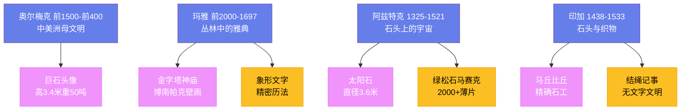

---
title: "美洲前哥伦布艺术"
date: 2026-08-25
weight: 17
draft: false
cover:
  image: "https://images.unsplash.com/photo-1578662996442-48f60103fc96?w=1200"
  alt: "美洲前哥伦布艺术"
  caption: "美洲原住民艺术的血脉从未中断"
---

# 美洲前哥伦布艺术

## 一、丛林中的巨石头像

1492 年哥伦布到达加勒比群岛之前，美洲大陆上已经繁荣了数千年的文明。中美洲（从墨西哥中部到哥斯达黎加）和南美洲安第斯山脉孕育了各自独立发展的艺术传统——它们与旧大陆完全隔绝，却独立发明了金字塔建筑、象形文字和精密历法。

**奥尔梅克文明**（约前 1500—前 400 年，墨西哥湾沿岸）是中美洲的"母文明"。它最著名的遗产是**巨石头像**——17 尊由整块玄武岩雕成的巨大人头，最大的高 3.4 米，重约 50 吨。每尊头像都戴着紧身的头盔，面部特征具有明显的非洲式风格——厚嘴唇、宽鼻子——这曾引发"非洲人先于哥伦布到达美洲"的猜测，但主流考古学家认为这些特征就是奥尔梅克统治者的真实面貌。这些石料来自 150 公里外的图斯特拉山脉——在没有轮子和役畜的条件下，奥尔梅克人如何将这些庞然大物运过沼泽和丛林，至今没有令人信服的答案。

## 二、玛雅：丛林中的雅典

**玛雅文明**（约前 2000—1697 年）创造了前哥伦布美洲最精致的艺术和最复杂的知识体系。玛雅的城市中心——**帕伦克**、**蒂卡尔**、**科潘**——矗立在热带雨林深处，金字塔神庙的顶端高过树冠，直刺天际。**蒂卡尔一号神庙**高约 47 米，在丛林中已经矗立了 1300 多年。

玛雅最伟大的国王**帕卡尔**（K'inich Janaab' Pakal，615—683）在位 68 年，将帕伦克建成了玛雅世界最优雅的城市。1952 年，墨西哥考古学家**阿尔贝托·鲁斯·吕利耶**（Alberto Ruz Lhuillier，1906—1979）在帕伦克铭文神庙的地板下发现了一条秘密阶梯，通向一间墓室——里面安放着帕卡尔的石棺，棺盖上刻着著名的"宇航员"浮雕：帕卡尔仰卧在世界树旁，身体介于生死之间。这幅图像后来被一些伪科学作家解读为"古代宇航员驾驶飞船"，但玛雅学家的释读表明，它描绘的是国王坠入冥界——玛雅宇宙观中死亡与重生的核心意象。

**博南帕克壁画**（约 790 年，恰帕斯州）是玛雅绘画的巅峰——三个房间的墙壁上画满了战争、俘虏献祭和宫廷庆典的场景，色彩以玛雅蓝（一种由靛蓝和黏土合成的耐久颜料）为主调，人物造型优雅而富有动感。1946 年这些壁画被外界发现时，色彩依然鲜艳如昨——它们在丛林的湿气中保存了将近一千二百年。

## 三、阿兹特克：石头上的宇宙

**阿兹特克文明**（约 1325—1521 年）在墨西哥谷地建立了中美洲最后一个伟大的帝国。他们的首都**特诺奇蒂特兰**（今墨西哥城）建在特斯科科湖中的岛屿上——1519 年西班牙征服者科尔特斯到达时，这座城市有约 20 万居民，比当时大多数欧洲城市都大。西班牙人形容它如同"梦中的城市"，然后从湖上将它夷为平地。

**太阳石**（约 1479 年）是阿兹特克艺术最著名的作品——直径 3.6 米，重约 24 吨的圆形玄武岩雕刻。它常被误称为"阿兹特克日历"，但实际上它描绘的是阿兹特克的宇宙观——中央是太阳神托纳蒂乌的面孔，舌头是一把黑曜石刀，周围的同心圆环刻着四个已经毁灭的前太阳时代和二十天历法符号。1790 年，这块巨石在墨西哥城大教堂广场的地下被重新发现——如今它是墨西哥国家人类学博物馆的镇馆之宝。

阿兹特克的**绿松石马赛克**工艺达到了极高的水准——一件现藏大英博物馆的双头蛇胸饰用了超过 2000 片绿松石薄片拼贴在木质底板上，每一片都经过精确的切割和打磨。这种工艺被视为只有王室和最高祭司才能使用的奢侈品。

## 四、印加：石头与织物的帝国

**印加帝国**（1438—1533 年）在其鼎盛时期从今天的哥伦比亚延伸到智利中部，人口约 1200 万——它是前哥伦布时代美洲最大的政治实体。印加人没有发明文字，但他们用**结绳记事**（quipu）的方式记录信息——不同颜色和打结方式的绳子组合在一起，可以记录数字、历史甚至诗歌。

印加建筑以其**精确的石工**闻名于世。**马丘比丘**（Machu Picchu，约 1450 年）坐落在安第斯山脉海拔 2430 米的山脊上——巨大的花岗岩石块经过精确切割，不用任何灰浆就严丝合缝地拼接在一起，石块之间的缝隙连一片剃须刀片都插不进去。这座"失落之城"在 1911 年被美国探险家**海勒姆·宾厄姆**（Hiram Bingham，1875—1956）重新发现——虽然他并非第一个到达这里的人，但他的著作让马丘比丘闻名世界。

讽刺的是，印加人最珍贵的艺术形式不是石雕，而是**纺织品**。在印加社会，精美的织物比黄金更有价值——它们用来表示社会地位、记录历史事件和进行外交馈赠。一件印加贵族的斗篷可能需要数千小时的劳动，使用了数百种不同颜色的丝线。

## 五、北美原住民的创造力

在北美大陆，原住民的艺术传统同样丰富多彩。**太平洋西北海岸**的印第安部落——**海达族**（Haida）、**特林吉特族**（Tlingit）、**夸扣特尔族**（Kwakwaka'wakw）——创造了世界上最壮观的**图腾柱**传统。一根图腾柱可以高达 18 米，雕刻着熊、鹰、鲸鱼和神话生物的形象——它们不是宗教偶像，而是家族的"纹章"，记录着祖先的传说和领地的权利。19 世纪末加拿大政府曾一度禁止竖立图腾柱和举办**夸富宴**（Potlatch），试图压制原住民文化——但图腾柱的传统顽强地存续到了今天。

**纳瓦霍族**的编织和银饰、**拉科塔族**的珠饰和羽毛头饰、**因纽特族**的骨雕和皂石雕刻，都展现了北美原住民对材料和形式的高度敏感。这些传统至今仍然活跃，并且越来越多地被主流艺术界所认可。

## 六、被中断的传统

前哥伦布艺术的历史是一部辉煌与悲剧交织的历史。西班牙征服者摧毁了特诺奇蒂特兰，熔化了无数金银艺术品；传教士焚烧了玛雅的树皮纸书籍——如今仅存四部玛雅抄本。但前哥伦布艺术的精神并未消亡。20 世纪的墨西哥壁画运动——**迭戈·里维拉**（Diego Rivera，1886—1957）、**大卫·阿尔法罗·西凯罗斯**（David Alfaro Siqueiros，1896—1974）和**何塞·克莱门特·奥罗斯科**（José Clemente Orozco，1883—1949）——将前哥伦布的图像与现代革命主题结合起来，创造了墨西哥民族认同的视觉语言。从奥尔梅克的巨石头像到里维拉的壁画，美洲原住民艺术的血脉从未中断。
