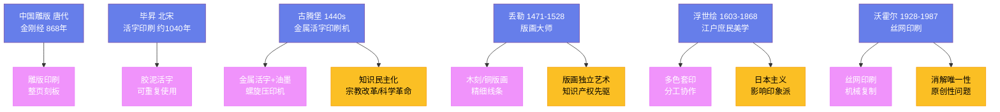

---
title: "版画与印刷术"
date: 2026-08-25
weight: 18
draft: false
cover:
  image: "https://images.unsplash.com/photo-1578662996442-48f60103fc96?w=1200"
  alt: "版画与印刷术"
  caption: "版画艺术是民主化与艺术性之间张力最生动的体现"
---

# 版画与印刷术

## 一、从印章到雕版

印刷术的起源可以追溯到人类最古老的复制冲动——用印章在泥板上压出印记，用拓片从石碑上复制文字。但真正意义上的印刷术诞生在中国。唐代的**雕版印刷**将整页文字和图案刻在一块木板上，涂上墨，铺上纸，用刷子均匀施压——一页印刷品就这样诞生了。

现存最早有明确纪年的印刷品是唐代咸通九年的**《金刚经》**（868 年）——这是一卷长 5.25 米的经卷，卷首有一幅精美的扉页画：释迦牟尼佛坐在莲花座上说法，周围环绕着弟子和护法神祇，线条流畅，构图饱满。这卷《金刚经》于 1900 年在敦煌莫高窟的藏经洞中被发现，后来落入英国探险家**奥莱尔·斯坦因**（Aurel Stein，1862—1943）之手，如今收藏在大英图书馆。卷末的题记写着"咸通九年四月十五日王玠为二亲敬造普施"——一个名叫王玠的人为了父母祈福而出资刻印了这卷经书，他不会想到自己创造了出版史上的一座里程碑。

## 二、毕昇与活字

北宋庆历年间（约 1040 年），一位名叫**毕昇**的普通工匠发明了**活字印刷术**——他用胶泥刻出单个的汉字，烧制成坚硬的字模，排版时用松脂和蜡将字模固定在铁板上，印刷完毕后加热即可拆版，字模可以反复使用。这是中国印刷史上划时代的发明。毕昇的事迹被同时代的科学家**沈括**（1031—1095）记录在《梦溪笔谈》中——如果没有沈括的记载，这位平民发明家的名字可能早已被历史遗忘。

然而，活字印刷在中文世界的推广并不顺利——汉字有数万个，铸造和管理如此庞大的字模库需要巨大的投入，而雕版印刷反而更加经济实用。活字印刷的真正革命发生在朝鲜半岛和欧洲。高丽王朝在 13 世纪就铸造了金属活字——现存最早的金属活字印刷品是高丽的《直指心体要节》（1377 年），比古腾堡圣经早了将近八十年。

## 三、古腾堡革命

1440 年代，德国美因茨的金匠**约翰内斯·古腾堡**（Johannes Gutenberg，约 1400—1468）将金属活字、油基墨水和螺旋压印机组合在一起，创造了欧洲第一台实用的**活字印刷机**。古腾堡的天才之处不在于发明了任何单一的技术——金属活字在朝鲜早已使用，螺旋压印机在欧洲用于榨葡萄已有数百年——而在于他将这些技术整合成一个完整的系统，使得书籍的大规模生产成为可能。

1455 年，古腾堡印刷了著名的**《四十二行圣经》**（因每页 42 行而得名）——它印刷了约 180 本，其中约 140 本用纸印刷，约 40 本用羊皮纸印刷。这部圣经的排版之精美、印刷之均匀，即使与手工抄本相比也毫不逊色。如今全世界仅存 49 本完整的或不完整的古腾堡圣经，每一本都是无价之宝——2018 年，一本完整的纸本古腾堡圣经在拍卖会上估价超过 3500 万美元。

印刷术的传播速度惊人。到 1500 年，欧洲已有超过 270 个城市拥有了印刷厂，共印刷了约 1000 万到 2000 万册书籍——这比此前一千年间欧洲所有手抄书的总和还要多。书籍的价格大幅下降，知识不再是修道院和宫廷的专利。宗教改革领袖马丁·路德充分利用了印刷术——他的论文和布道词在几周内就能传遍整个德意志。没有印刷术，宗教改革、科学革命和启蒙运动都不会以我们所知道的方式发生。

## 四、丢勒与北方版画

印刷术不仅改变了书籍，也催生了**版画**这一独立的艺术形式。**阿尔布雷希特·丢勒**（Albrecht Dürer，1471—1528）是北方文艺复兴最伟大的艺术家，也是版画艺术的第一位大师。他的木刻系列《启示录》（1498 年）以令人窒息的细节和戏剧性构图描绘了末日景象——《四骑士》中，骑士们骑马踏过人群，马匹的肌肉和衣服的褶皱都刻画得丝丝入扣。他的铜版画《骑士、死神与魔鬼》（1513 年）是版画史上最著名的作品之一——一位骑士坚定地骑马前行，死神在他身旁举着沙漏，魔鬼在他身后窥视，但骑士的目光纹丝不动。

丢勒不仅是一位伟大的版画家，还是一位精明的商人——他认识到印刷品可以无限复制、大量销售，从而摆脱了传统艺术家的赞助人依赖。他是有记载以来最早为自己的作品维权的艺术家之一——1506 年，他在威尼斯起诉了一位盗版其作品的版画家，成为知识产权史上的早期案例。

## 五、浮世绘：江户的庶民美学

**浮世绘**（Ukiyo-e，"浮动世界的图画"）是日本江户时代（1603—1868）发展起来的木版彩色印刷艺术。与欧洲版画不同，浮世绘是一种**分工协作**的产物——画师（如葛饰北斋）设计图案，雕刻师将图案刻在一块块木板上（每种颜色需要一块单独的木板），印刷师将纸对准木版逐色套印。一幅复杂的浮世绘可能需要十几块木版和二十多次套印。

**葛饰北斋**（1760—1849）是浮世绘最著名的艺术家。他的《富岳三十六景》系列（约 1830—1832 年）中最著名的一幅——《神奈川冲浪里》——描绘了一道巨浪即将吞没几只小船的瞬间，远处的富士山在浪谷之间安静地矗立。这幅画的蓝色使用了从欧洲进口的普鲁士蓝颜料，浪花如同利爪般伸向天空——它已成为全世界辨识度最高的图像之一。**歌川广重**（1797—1858）的《东海道五十三次》以诗意的风景描绘了从江户到京都的旅途——他的雨、雪和月光充满了东方的抒情气质。

19 世纪中叶，随着日本的开放，大量浮世绘作为茶叶和瓷器的包装纸流入欧洲——这些"包装纸"引起了欧洲艺术家的狂热追捧，形成了所谓的**日本主义**（Japonisme）风潮。莫奈收藏了 231 幅浮世绘，梵高临摹过歌川广重的作品，惠斯勒的夜景画明显受到了浮世绘构图的影响。

## 六、版画走向当代

20 世纪，版画成为现代艺术的重要媒介。**巴勃罗·毕加索**（1881—1973）在石版画和蚀刻版画领域进行了大量实验，**爱德华·蒙克**（1863—1944）的木刻以粗犷的线条和强烈的情感表现著称。**安迪·沃霍尔**（Andy Warhol，1928—1987）将**丝网印刷**技术引入艺术——他的《玛丽莲·梦露》系列（1967 年）通过机械复制的方式消解了传统艺术的"唯一性"，提出了关于原创性和复制的根本问题。这正是版画艺术几个世纪以来一直在探索的核心命题——当图像可以无限复制时，"原作"还意味着什么？

今天，数字印刷和 3D 打印正在继续扩展版画的边界。但传统手工版画的价值并未因此消减——恰恰相反，在一个一切都可以无限复制的数字时代，限量手工版画的稀缺性和手工性反而获得了新的意义。从王玠的《金刚经》到沃霍尔的丝网印刷，版画艺术走过了一千多年的历程——它始终是民主化与艺术性之间张力最生动的体现。
