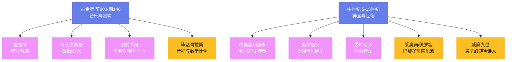

# 古希腊与中世纪音乐

## 一、古希腊音乐

在爱琴海的阳光之下，音乐与诗歌、舞蹈构成了古希腊文明的三位一体。古希腊人相信音乐具有塑造灵魂的力量——**柏拉图**（Plato，前 427—前 347 年）在《理想国》中写道，音乐教育是城邦公民最重要的训练之一，因为节奏与和声能够深入灵魂的最深处。他的学生**亚里士多德**（Aristotle，前 384—前 322 年）进一步区分了音乐的伦理功能与娱乐功能，认为不同的调式能够激发不同的情感状态。荷马史诗《伊利亚特》和《奥德赛》并非静默的文本，而是在**里拉琴**的伴奏下被游吟诗人吟唱的长歌，每一个音节都与琴弦的振动共振。

古希腊的音乐理论由**毕达哥拉斯**（Pythagoras，约前 570—前 495 年）奠基。传说他在经过铁匠铺时注意到锤子敲击铁砧发出的音程与锤子的重量成比例，由此发现了音程与数学比例之间的关系——八度对应 2:1，纯五度对应 3:2，纯四度对应 4:3。这一发现将音乐从经验的技艺提升为理性的科学。**阿里斯托塞努斯**（Aristoxenus，约前 354—前 300 年）则发展了更为实用的音阶理论，他将八度划分为七个音级，建立了调式（harmoniai）系统，这些调式被认为各自承载不同的伦理属性——多利亚调式庄重，弗里几亚调式狂放。

古希腊的乐器体系以**里拉琴**（lyre）和**阿夫洛斯管**（aulos）为两极。里拉琴是太阳神阿波罗的象征，代表理性、秩序与和谐，在正式场合由受过教育的公民演奏。阿夫洛斯管是酒神狄俄尼索斯的乐器，双簧共鸣，音色尖锐而热烈，代表激情与狂喜。这两种乐器的对立与互补，正如**尼采**在《悲剧的诞生》中所描述的日神精神与酒神精神的永恒张力。

## 二、格里高利圣咏

罗马帝国的崩塌将欧洲带入了漫长的中世纪。在修道院高耸的石墙之内，音乐成为了通往上帝的语言。**格里高利圣咏**（Gregorian chant）以教皇**格里高利一世**（Gregory I，约 540—604 年）命名，虽然这些旋律实际上是在此后数百年间逐渐演化定型的。传说格里高利一世在圣灵化为鸽子的启示下记录了这些圣咏，但历史学家更倾向于认为这是法兰克教会为了统一礼仪音乐而进行的长达数世纪的编纂工程。

格里高利圣咏的特征是极致的简朴：单声部、无伴奏、自由节奏、拉丁文歌词。它没有固定的节拍，旋律如同呼吸一般自然起伏，在石砌教堂的穹顶下回荡，营造出超越尘世的庄严与神圣。修士们每日六次聚集唱诵日课，从凌晨的晨祷到夜晚的晚祷，圣咏贯穿了整个修道院的日常生活。在**查理曼大帝**（Charlemagne，约 748—814 年）的推动下，格里高利圣咏在西欧范围内实现了标准化，成为中世纪教会统一的文化纽带。

## 三、复调音乐的诞生

9 至 10 世纪之间，一个革命性的变化悄然发生——音乐家们开始在单声部圣咏的基础上添加第二条旋律线，**复调音乐**（polyphony）由此诞生。最早的复调形式是**奥尔加农**（organum），在原有圣咏的上方或下方平行叠加一个声部，如同影子跟随光线。这种看似简单的创新实际上打破了单声部音乐绵延千年的统治，开启了西方音乐多声部思维的传统。

12 世纪的**巴黎圣母院乐派**将复调技术推向了前所未有的高度。**莱奥南**（Léonin，约 1135—1201 年）编纂了《奥尔加农大全》，为全年的礼仪日创作了两声部的复调音乐。他的继任者**佩罗坦**（Pérotin，约 1160—1230 年）更进一步，创作了三声部乃至四声部的复调作品——在 12 世纪末的巴黎，四个独立的旋律线在同一空间内交织缠绕，这在当时是人类听觉经验中前所未有的音响奇观。巴黎圣母院的石拱见证了这一革命，复调音乐从此成为西方音乐最核心的特征。

## 四、游吟诗人

当教会的圣咏在修道院中庄严回响时，另一种音乐正在城堡和宫廷中生长。11 至 13 世纪，法国南部的**游吟诗人**（troubadour）用奥克语吟唱关于爱情、骑士精神和自然之美的歌曲——这是欧洲世俗音乐的第一次大规模绽放。阿基坦的**威廉九世**（William IX，1071—1126 年）是历史记载中最早的游吟诗人，这位公爵既写诗又谱曲，他的作品大胆而直率，歌颂爱情的力量超越一切社会等级。

游吟诗人的传统很快跨越了比利牛斯山脉和莱茵河。在德国，**恋歌诗人**（Minnesinger）继承了这一传统，**瓦尔特·冯·德·福格尔韦德**（Walther von der Vogelweide，约 1170—1230 年）是其中最杰出的代表，他的情歌和政治歌曲在中古高地德语文学中占据着与但丁在意大利语文学中相当的位置。从格里高利圣咏到游吟诗人的世俗歌谣，中世纪音乐在神圣与世俗之间架起了一座桥梁，为文艺复兴时期音乐的全面繁荣奠定了基础。
