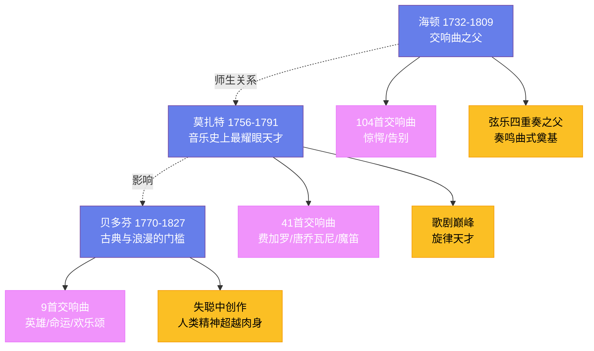

# 古典主义音乐

## 一、古典主义的风格

古典主义音乐（约 1750—1820 年）诞生于启蒙运动的理性之光中。当巴洛克的繁复装饰和对位迷雾逐渐消散，一种新的审美理想开始主导欧洲——清晰的结构、平衡的形式、优雅的旋律。这不是对复杂的否定，而是对秩序的重新定义。古典主义追求的是一种"高贵的单纯和静穆的伟大"，正如温克尔曼对古希腊艺术的描述。**奏鸣曲式**（sonata form）是古典主义音乐的核心形式，它由呈示部、发展部和再现部三个部分组成——呈示部提出主题，发展部将其拆解、变形、重组，再现部让主题凯旋归来。这种"正题—反题—合题"的辩证结构与启蒙时代的理性精神一脉相通，成为交响曲、奏鸣曲和室内乐的基石。

## 二、海顿

**弗朗茨·约瑟夫·海顿**（Franz Joseph Haydn，1732—1809 年）的一生是耐心与创造力的典范。他出身贫寒，父亲是奥地利的马车匠，八岁进入维也纳圣斯蒂芬大教堂唱诗班。1761 年，海顿开始在埃斯特哈齐家族的宫廷任职——这一干就是整整三十年。在匈牙利偏远的爱森施塔特宫殿里，海顿远离维也纳的喧嚣，日复一日地为宫廷乐队写作、排练、演出，用他自己的话说："我被隔离在世界之外，没有人能使我动摇和受苦，因此我不得不成为独创者。"

海顿创作了 **104 首交响曲**，数量之多几乎定义了这个体裁本身。他的《惊愕交响曲》（第 94 号，1791 年）在温柔如歌的柔板乐章中突然砸下一个震耳欲聋的强和弦——传说这是为了惊醒那些打瞌睡的伦敦听众。他的《告别交响曲》（第 45 号，1772 年）更为巧妙：在最后一个乐章中，乐手们依次吹灭蜡烛、起身离开舞台，只留下两把小提琴在空荡荡的台上哀婉结束——这是海顿向雇主发出的温和抗议：乐手们已经太久没有回家了。晚年的海顿两次访问伦敦，受到了英雄般的欢迎，牛津大学授予他荣誉音乐博士学位。他被后人尊称为"交响曲之父"和"弦乐四重奏之父"，但他自己始终谦逊地称自己为"一个仆人"——只不过这个仆人用音符建造了一座宫殿。

## 三、莫扎特

**沃尔夫冈·阿马德乌斯·莫扎特**（Wolfgang Amadeus Mozart，1756—1791 年）是音乐史上最耀眼的天才。他三岁弹琴，五岁作曲，六岁在维也纳皇宫为女皇玛丽亚·特蕾西亚演奏。父亲利奥波德带着他在欧洲巡回演出了十年——巴黎、伦敦、海牙、罗马，小莫扎特在每一个宫廷都引起了轰动。在罗马，他仅凭一次聆听就默写出了格雷戈里奥·阿列格里的《求主垂怜》——这部九声部的圣咏被梵蒂冈视为机密，禁止抄写和传播。

莫扎特的创作涵盖了几乎所有音乐形式：41 首交响曲、27 首钢琴协奏曲、5 首小提琴协奏曲、数量庞大的室内乐和宗教音乐。他的歌剧《费加罗的婚礼》（1786 年）、《唐·乔瓦尼》（1787 年）和《魔笛》（1791 年）将音乐与戏剧的融合推向了前所未有的高度。莫扎特的音乐听起来毫不费力——旋律如泉水般自然涌出，形式完美得仿佛天成。但在这表面的轻盈之下，隐藏着深沉的情感暗流。他能在最明媚的旋律中注入一缕忧郁，在最热闹的终曲里暗藏一丝不安。

1791 年 12 月 5 日，莫扎特在维也纳去世，年仅 35 岁。他的死因至今仍有争论——风湿热、肾病、甚至毒杀的猜测都曾被提出。他未完成的《安魂曲》（K. 626）由学生**弗朗茨·克萨韦尔·苏斯迈尔**（Franz Xaver Süssmayr，1766—1803 年）续完。莫扎特被葬在维也纳圣马克思公墓的一个普通墓穴中，没有墓碑，没有标识——但他的音乐已经填满了整个世界的沉默。

## 四、贝多芬

**路德维希·凡·贝多芬**（Ludwig van Beethoven，1770—1827 年）站在古典主义与浪漫主义的门槛上——他的一只脚踩在海顿和莫扎特建立的秩序之中，另一只脚已经踏入了个人情感与宏大叙事的未知疆域。他 22 岁从波恩来到维也纳，最初以钢琴演奏家的身份声名鹊起。他的即兴演奏令听众泪流满面，据说连钢琴的琴弦都承受不住他的力量而绷断。

贝多芬的九首交响曲是音乐史上最重要的作品集。第三交响曲"英雄"（1804 年）打破了古典交响曲的一切尺度——它的第一乐章比海顿和莫扎特任何一部交响曲都要长一倍，结构上大胆得令首演的听众困惑不已。这部作品原本题献给拿破仑，但当贝多芬得知拿破仑称帝的消息后，他愤怒地撕掉了扉页上的献辞。第五交响曲（1808 年）以那四个音符的"命运敲门"动机开头——短短四个音符被发展成了一整部交响曲的叙事。第九交响曲（1824 年）首次在交响曲中引入合唱，席勒的《欢乐颂》成为了人类团结的颂歌，如今是欧盟的盟歌。

贝多芬在 28 岁左右开始失聪——对一个音乐家而言，这无异于画家失去双眼。1802 年，他在海利根施塔特写下了一封近乎绝笔的信，倾诉失聪带来的绝望，但最终选择了继续创作。他最伟大的作品——第九交响曲、晚期弦乐四重奏、《迪亚贝利变奏曲》——都是在几乎完全失聪的状态下完成的。他用木棍咬着钢琴来感受振动，在想象中"听见"了整个管弦乐队。贝多芬的一生证明了一件事：人类精神的创造力可以超越肉身的限制，在最深的寂静中，最响亮的音乐仍然可以被听见。
