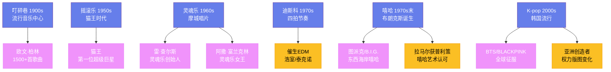

---
title: "流行音乐"
date: 2026-08-25
weight: 8
draft: false
cover:
  image: "https://images.unsplash.com/photo-1553913861-c0fddf2619ee?w=1200"
  alt: "流行音乐"
  caption: "好的旋律和真挚的情感始终是流行音乐不变的内核"
---

# 流行音乐

## 一、流行音乐的起源

流行音乐（Pop Music）的历史可以追溯到 19 世纪末，它与录音技术和大规模复制技术的诞生密不可分。当音乐可以被印刷、录制和贩卖时，一种全新的音乐形态开始形成——它不再属于教堂或宫廷，而是属于每一个愿意花钱购买一张乐谱或一张唱片的普通人。20 世纪初，纽约的**叮砰巷**（Tin Pan Alley）成为了流行音乐的中心——这条位于百老汇和第六大道之间的街区聚集了大量的歌曲作者和音乐出版商，钢琴声从每扇敞开的窗户中涌出，整条街道叮当作响，如同一条用音乐铺成的河流。**欧文·柏林**（Irving Berlin，1888—1989 年）从叮砰巷走出，写下了《白色圣诞》和《上帝保佑美国》——他一生创作了超过 1500 首歌曲，尽管他几乎不会读谱。

## 二、猫王与早期摇滚

1950 年代，一种源自美国南部的混合体开始席卷全国——摇滚乐将乡村音乐的白人叙事与节奏蓝调的黑人律动熔铸在一起。**猫王埃尔维斯·普雷斯利**（Elvis Presley，1935—1977 年）站在了这个熔炉的中心。1954 年，猫王在孟菲斯的太阳录音棚录制了第一首单曲《That's All Right》——这首歌原本是蓝调音乐家阿瑟·克鲁德普的作品，但猫王用他的方式重新诠释了它，将黑人的蓝调带入了白人主流市场。1956 年，猫王的《Heartbreak Hotel》成为全美冠军单曲，他在电视上的扭胯表演引发了保守家长的愤怒和青少年的狂热——摇滚乐的时代正式开启。

## 三、摩城与灵魂乐

在摇滚乐横扫美国的同时，底特律的一间小工作室里正在酝酿另一场革命。1959 年，**贝里·戈迪**（Berry Gordy，1929—）用借来的 800 美元创立了**摩城唱片**（Motown Records）——这是非裔美国人创立的最成功的唱片公司。戈迪的愿景是在底特律建立一条"音乐流水线"，就像福特汽车的生产线一样，从歌曲创作到编曲、录音、编舞到形象包装，每一个环节都精确控制。摩城的明星阵容令人眼花缭乱——**史蒂维·旺德**（Stevie Wonder，1950—）13 岁就获得了冠军单曲，**马文·盖伊**（Marvin Gaye，1939—1984 年）的《What's Going On》（1971 年）将灵魂乐提升到了社会批判的高度，**戴安娜·罗斯**（Diana Ross，1944—）从"至高无上"组合走出成为独唱巨星。

**灵魂乐**（Soul Music）将福音音乐的情感深度与节奏蓝调的节奏力量结合在一起。**雷·查尔斯**（Ray Charles，1930—2004 年）被认为是灵魂乐的创始人——他在 1954 年的《I Got a Woman》中将福音歌曲的旋律填上了世俗的歌词，创造了灵魂乐的基本范式。**阿撒·富兰克林**（Aretha Franklin，1942—2018 年）被尊为"灵魂乐女王"，她的《Respect》（1967 年）超越了歌曲本身，成为了民权运动和女性主义运动的双重圣歌。

## 四、迪斯科与电子音乐

1970 年代，**迪斯科**（Disco）从纽约的地下俱乐部中升起，以强烈的四拍节奏、华丽的弦乐编排和闪烁的迪斯科球为标志。**比吉斯**（Bee Gees）为电影《周末夜狂热》（Saturday Night Fever，1977 年）创作的配乐是迪斯科的巅峰之作——这张专辑在全球售出了超过 4000 万张，迪斯科文化达到了沸点。但迪斯科的统治也引发了强烈的反弹——1979 年芝加哥的"迪斯科毁灭之夜"事件中，数千人在棒球场上炸毁迪斯科唱片，标志着迪斯科时代的终结。然而迪斯科并未真正消亡——它的节奏基因催生了**电子舞曲**（EDM），从 1980 年代的浩室（House）和泰克诺（Techno）到 21 世纪席卷全球的 EDM 浪潮，迪斯科的脉搏从未停止跳动。

## 五、嘻哈

**嘻哈**（Hip Hop）在 1970 年代末的纽约布朗克斯区诞生——它不仅仅是一种音乐类型，更是一种完整的文化形态，包含 MC（说唱）、DJ（打碟）、涂鸦和街舞四个元素。1973 年 8 月 11 日，**DJ Kool Herc** 在布朗克斯塞奇威克大道 1520 号举办了一场派对——他使用两台唱机循环播放唱片中的节奏间隙（break），这被认为是嘻哈文化的诞生时刻。**Grandmaster Flash**、**Run-DMC** 和**公共敌人**（Public Enemy）是早期嘻哈的开拓者，Run-DMC 与 Aerosmith 合作的《Walk This Way》（1986 年）打破了摇滚与嘻哈之间的壁垒。

1990 年代，嘻哈成为了美国最流行的音乐类型。**图派克**（Tupac Shakur，1971—1996 年）和**B.I.G.**（The Notorious B.I.G.，1972—1997 年）是东西海岸嘻哈的代表人物——两人都在 25 岁时被枪杀，他们的死亡成为了嘻哈史上最沉痛的一页。21 世纪，嘻哈彻底征服了全球音乐市场。**坎耶·韦斯特**（Kanye West）、**德雷克**（Drake）和**肯德里克·拉马尔**（Kendrick Lamar）将嘻哈的艺术边界不断拓展——拉马尔的专辑《DAMN.》（2017 年）获得了普利策音乐奖，这是该奖项首次授予非古典/爵士音乐家。

## 六、K-pop 与全球流行

21 世纪初，**K-pop**（韩国流行音乐）以一种精心设计的工业化模式走向了全球。韩国娱乐公司将练习生制度发展到了极致——年轻的学员经过数年的声乐、舞蹈、语言和形象训练后才被允许出道。**防弹少年团**（BTS）在 2020 年凭借《Dynamite》成为首支登顶 Billboard Hot 100 的韩国组合，**BLACKPINK** 则成为了 YouTube 上订阅量最高的音乐频道之一。K-pop 的全球成功证明了流行音乐的权力版图正在发生深刻的变化——亚洲不再是西方流行文化的被动接受者，而是成为了全球流行文化的积极创造者。从叮砰巷到流媒体，流行音乐的形态不断变化，但好的旋律和真挚的情感始终是不变的内核。
