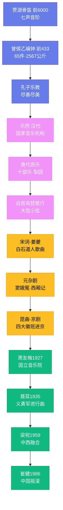

---
title: "中国音乐简史"
date: 2026-08-25
weight: 10
draft: false
cover:
  image: "https://images.unsplash.com/photo-1553913861-c0fddf2619ee?w=1200"
  alt: "中国音乐简史"
  caption: "从八千年前的贾湖骨笛到今天的数字音乐，中国音乐始终在传承与创新中前行"
---

# 中国音乐简史

## 一、远古与先秦：礼乐文明的奠基

中国音乐的源头可以追溯到八千年前。1987 年，河南舞阳贾湖遗址出土了一批骨笛，经碳十四测定距今约 7000 至 9000 年。这些骨笛用丹顶鹤的尺骨制成，大多有七个音孔，能吹奏出完整的七声音阶，甚至可以演奏《小白菜》这样的民歌。这是人类已知最早的可演奏乐器，比美索不达米亚的竖琴早了数千年。

进入夏商时期，音乐开始与祭祀和权力紧密相连。殷墟出土的甲骨文中已有"乐"字，形如丝弦张于木架之上，暗示弦乐器的存在。商代的编磬和编铙已经具备了音阶意识，音乐不再是随意的声响，而开始有了制度化的雏形。

周代（前 1046—前 256 年）是中国音乐史上第一个高峰。周公制礼作乐，建立了严格的礼乐等级制度——天子用八佾之舞，诸侯用六佾，大夫用四佾，不可僭越。音乐成为维护社会秩序的政治工具。1978 年出土的曾侯乙编钟（约前 433 年）震惊了世界：全套 65 件青铜编钟，总重 2567 公斤，横跨五个半八度，能演奏完整的五声、七声音阶，且每口钟能发出两个不同的音。这套编钟证明，早在战国初期，中国人已经掌握了精密的音律计算和青铜铸造技术。

孔子（前 551—前 479 年）对音乐的态度深刻影响了后世。他在齐国听到韶乐，"三月不知肉味"，赞叹其"尽善尽美"。孔子认为音乐不仅是娱乐，更是修身养性的途径——好的音乐能感化人心，败坏的音乐则会腐蚀社会。这种"乐教"思想贯穿了整个中国音乐史。

## 二、汉唐盛世：从乐府到燕乐

汉代（前 206—220 年）设立了乐府，这是中国历史上第一个国家级音乐机构。乐府由汉武帝扩大编制，李延年任协律都尉，负责采集民间歌谣、创作新曲。乐府诗如《孔雀东南飞》《陌上桑》等，原本都是配乐演唱的歌曲，后来曲调失传，只剩歌词流传至今。

魏晋南北朝时期，战乱频繁，却也是音乐大融合的时代。胡笳、琵琶、箜篌等西域乐器随丝绸之路传入中原。嵇康（223—262 年）临刑前弹奏《广陵散》，叹"广陵散于今绝矣"，成为中国音乐史上最悲壮的一幕。他所著的《声无哀乐论》提出音乐本身没有情感，情感来自听者内心——这一观点比西方类似的美学理论早了一千多年。

唐代（618—907 年）是中国音乐的黄金时代。唐玄宗李隆基本人精通音律，在宫中设立梨园，亲自教导数百名乐工，后世因此称戏曲演员为"梨园弟子"。他创作的《霓裳羽衣曲》融合了中原清商乐与印度婆罗门曲，是唐代燕乐的巅峰之作。唐代的十部乐和二部伎汇集了中原、西域、天竺、高丽等地的音乐，长安城里胡旋舞和柘枝舞风靡一时。白居易在《琵琶行》中描写的那位琵琶女，"大弦嘈嘈如急雨，小弦切切如私语"，让我们至今能感受到唐代器乐演奏的高超水平。

## 三、宋元明清：戏曲的崛起

宋代（960—1279 年）市民经济繁荣，音乐从宫廷走向民间。词是宋代最重要的音乐文学形式——柳永的词"凡有井水处，皆能歌柳永词"，说明他的作品在民间传唱之广。姜夔（约 1155—1221 年）是少数留下曲谱的宋代音乐家，他的《白石道人歌曲》用减字谱记录了十七首自度曲，是研究宋代音乐的珍贵资料。

元代（1271—1368 年）杂剧兴起，中国戏曲进入成熟期。关汉卿的《窦娥冤》、王实甫的《西厢记》、马致远的《汉宫秋》至今仍是戏曲舞台上的经典。元杂剧的音乐体制——一人主唱、曲牌联套——为后来的戏曲音乐奠定了基础。

明清两代，戏曲百花齐放。昆曲在明代中叶兴起，以其"水磨调"的细腻婉转著称。汤显祖的《牡丹亭》（1598 年）是昆曲文学的巅峰，"情不知所起，一往而深"至今令人动容。清代乾隆年间，四大徽班进京，与汉调融合，最终在道光年间形成了京剧。京剧以西皮、二黄为主要声腔，生旦净丑四大行当分工明确，成为影响最广的中国戏曲剧种。与此同时，各地地方戏——秦腔、豫剧、越剧、粤剧、川剧——也各具特色，构成了中国戏曲的庞大版图。

## 四、近现代：中西碰撞与新音乐

20 世纪初，西方音乐随传教士和留学生传入中国，传统音乐面临前所未有的冲击与变革。萧友梅（1884—1940 年）从德国莱比锡音乐学院学成归国，1927 年在上海创办了国立音乐院（今上海音乐学院），这是中国第一所专业音乐教育机构。黄自（1904—1938 年）创作了中国第一部清唱剧《长恨歌》，并培养了贺绿汀、刘雪庵等一批优秀作曲家。

抗日战争时期，音乐成为救亡图存的武器。聂耳（1912—1935 年）创作的《义勇军进行曲》（1935 年）后来成为中华人民共和国国歌。冼星海（1905—1945 年）在延安窑洞中写出了《黄河大合唱》（1939 年），"风在吼，马在叫，黄河在咆哮"的旋律激励了无数中国人。小提琴协奏曲《梁祝》（1959 年，何占豪、陈钢作曲）将越剧旋律与西方协奏曲形式完美结合，成为中国交响乐的代表作。

改革开放以后，中国音乐进入多元化时代。崔健 1986 年在北京工人体育馆演唱《一无所有》，宣告了中国摇滚乐的诞生。谭盾将中国民间音乐与西方先锋技法融合，凭《卧虎藏龙》配乐获得 2001 年奥斯卡最佳原创音乐奖。郎朗、王羽佳等钢琴家在国际舞台上大放异彩。周杰伦将 R&B、嘻哈与中国风元素融合，开创了华语流行音乐的新风格。从八千年前的贾湖骨笛到今天的数字音乐，中国音乐始终在传承与创新中前行。
