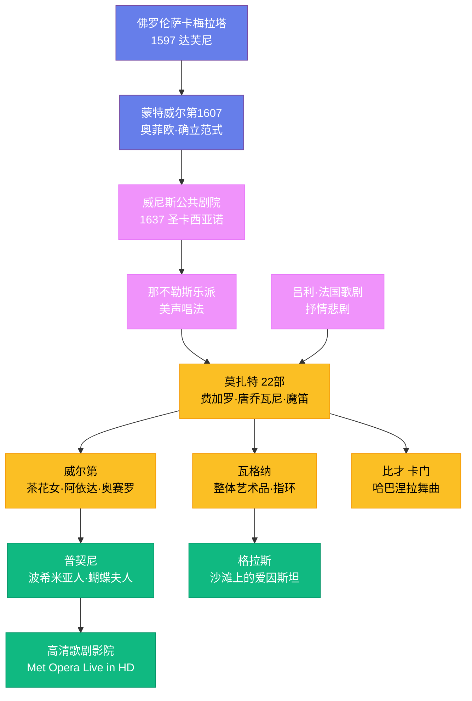

# 歌剧的历史

## 一、佛罗伦萨的实验：歌剧的诞生

16 世纪末，意大利佛罗伦萨有一群诗人、音乐家和学者，他们自称"卡梅拉塔"（Camerata），定期在巴尔迪伯爵的府邸聚会。他们有一个共同的执念：复兴古希腊悲剧。他们相信，古希腊戏剧是全程歌唱的，而非说白。于是他们尝试用一种介于说和唱的"宣叙调"风格来演绎戏剧，这便是歌剧的雏形。

1597 年，作曲家雅各布·佩里（Jacopo Peri）根据诗人奥塔维奥·里努奇尼的脚本创作了《达芙尼》（Dafne），这被公认为历史上第一部歌剧，可惜乐谱大部分失传。现存最早的完整歌剧是佩里的《尤里迪切》（Euridice），1600 年在佛罗伦萨美第奇宫首演，为法国国王亨利四世与玛丽·德·美第奇的婚礼庆典而作。

真正将歌剧提升为伟大艺术形式的是克劳迪奥·蒙特威尔第（Claudio Monteverdi，1567—1643 年）。他的《奥菲欧》（L'Orfeo）1607 年在曼图亚首演，是第一部至今仍在全球各大歌剧院频繁上演的歌剧。蒙特威尔第在剧中使用了约 40 件乐器的庞大编制，为不同角色和场景配置不同的音色，确立了歌剧的基本范式：序曲开场、咏叹调抒情、宣叙调推进剧情、合唱烘托气氛。

## 二、巴洛克时代：华丽与竞争

17 世纪，歌剧从贵族沙龙走向公共剧院。1637 年，威尼斯开设了世界上第一座面向公众的歌剧院——圣卡西亚诺剧院，歌剧从此不再是王公贵族的专属。到 17 世纪末，仅威尼斯一城就有十几座歌剧院同时运营，竞争激烈。

那不勒斯乐派在这一时期崛起，发展出"美声唱法"（bel canto）的演唱传统，强调声音的优美、灵活和技巧性。亚历山德罗·斯卡拉蒂（Alessandro Scarlatti，1660—1725 年）是那不勒斯歌剧的代表人物，一生创作了超过 60 部歌剧，确立了意大利序曲"快—慢—快"的三段式结构。阉人歌手法里内利（Farinelli，1705—1782 年）以其超凡的音域和技巧成为当时最耀眼的明星，据说西班牙国王菲利普五世每晚都要听他唱歌才能入睡。

与此同时，法国走出了自己的歌剧道路。让-巴蒂斯特·吕利（Jean-Baptiste Lully，1632—1687 年）为路易十四创建了法国歌剧（抒情悲剧）的传统，强调舞蹈、合唱和舞台效果，与意大利歌剧的重唱形成鲜明对比。亨德尔（George Frideric Handel，1685—1759 年）虽然是德国人，却在伦敦创作了超过 40 部意大利语歌剧，他的《朱利奥·凯撒》至今仍是巴洛克歌剧的保留剧目。

## 三、莫扎特：天才的歌剧世界

沃尔夫冈·阿马德乌斯·莫扎特（Wolfgang Amadeus Mozart，1756—1791 年）是歌剧史上最伟大的作曲家之一。他 11 岁就写出了第一部歌剧，一生创作了 22 部歌剧，每一部都闪耀着天才的光芒。

《费加罗的婚礼》（1786 年）是莫扎特与剧作家洛伦佐·达·蓬特合作的第一部杰作。在这部歌剧中，仆人费加罗的智慧胜过了伯爵的权力，莫扎特用音乐赋予每个角色鲜活的个性——伯爵夫人的咏叹调"Porgi amor"温柔哀婉，凯鲁比诺的"Voi che sapete"天真烂漫，堪称角色塑造的典范。《唐·乔瓦尼》（1787 年）将喜剧与悲剧、色情与道德融为一体，结尾石像索命的场景至今令人毛骨悚然。《魔笛》（1791 年）是莫扎特最后一部歌剧，用德语写成，融入了共济会的象征体系，帕帕基诺的"我是一个捕鸟人"是歌剧中最欢快的旋律之一。

莫扎特的歌剧之所以伟大，在于他用音乐揭示了人性的复杂——没有纯粹的好人或坏人，每个角色都有自己的欲望和挣扎。

## 四、19 世纪：歌剧的黄金时代

19 世纪是歌剧的鼎盛时期，意大利和德国分别发展出了两条伟大的歌剧传统。

朱塞佩·威尔第（Giuseppe Verdi，1813—1901 年）是意大利歌剧的巨人。他的创作生涯横跨半个世纪，从早期的《纳布科》（1842 年）到晚期的《法斯塔夫》（1893 年），每一部作品都紧扣时代脉搏。《茶花女》（1853 年）首演时惨遭失败——观众无法接受一个妓女作为歌剧女主角，但如今它是世界上演出次数最多的歌剧之一。《阿依达》（1871 年）为开罗歌剧院落成而作，凯旋进行曲气势恢宏。《奥赛罗》（1887 年）和《法斯塔夫》则展现了威尔第晚年炉火纯青的戏剧功力。威尔第不仅是作曲家，更是意大利民族统一运动的象征——"Viva V.E.R.D.I."曾是意大利人表达独立诉求的暗号。

理查德·瓦格纳（Richard Wagner，1813—1883 年）是歌剧史上最具争议也最具影响力的人物。他提出了"整体艺术品"（Gesamtkunstwerk）的理念，主张音乐、诗歌、戏剧和视觉艺术应当融为一体。他的《尼伯龙根的指环》由四部歌剧组成，总时长超过 15 小时，需要连续四个晚上才能演完，是歌剧史上规模最宏大的作品。瓦格纳发明了"主导动机"系统——用短小的音乐主题代表人物、事物或概念，贯穿整部作品。他在拜罗伊特建造了专门的歌剧院，至今每年夏天仍举办瓦格纳音乐节。

法国歌剧在这一时期同样辉煌。乔治·比才（Georges Bizet，1838—1875 年）的《卡门》（1875 年）首演时被批评为"不道德"，比才在首演三个月后郁郁而终，年仅 36 岁。但《卡门》很快成为世界上最受欢迎的歌剧——哈巴涅拉舞曲"爱情是一只自由的鸟"和斗牛士之歌几乎人人都能哼上几句。

## 五、真实主义与 20 世纪

19 世纪末，意大利歌剧出现了"真实主义"（verismo）流派，主张描写普通人的真实生活和强烈情感。贾科莫·普契尼（Giacomo Puccini，1858—1924 年）是这一流派最杰出的代表。《波希米亚人》（1896 年）描写了巴黎拉丁区穷艺术家的爱情与死亡，咪咪之死的场景催人泪下。《蝴蝶夫人》（1904 年）讲述了日本女子巧巧桑被美国军官抛弃的悲剧，"晴朗的一天"是歌剧中最著名的咏叹调之一。《图兰朵》（1926 年）未能在普契尼生前完成，由他的学生阿尔法诺续完，"今夜无人入睡"的旋律至今响彻世界各地的歌剧院。

20 世纪的歌剧更加多元。理查德·施特劳斯的《莎乐美》（1905 年）和《厄勒克特拉》（1909 年）将歌剧推向了感官刺激的极限。阿尔班·贝尔格（Alban Berg）的《沃采克》（1925 年）用无调性和十二音技法表现底层士兵的绝望，是 20 世纪最重要的歌剧之一。本杰明·布里顿（Benjamin Britten，1913—1976 年）的《彼得·格赖姆斯》（1945 年）复兴了英国歌剧传统。菲利普·格拉斯（Philip Glass）的极简主义歌剧《沙滩上的爱因斯坦》（1976 年）打破了传统歌剧的一切规则。

## 六、歌剧的今天

歌剧在 21 世纪依然充满活力。新创歌剧不断涌现——凯·萨里阿霍（Kaija Saariaho）的《远方的爱》（2000 年）、约翰·亚当斯（John Adams）的《尼克松在中国》（1987 年）都是当代经典。高清歌剧影院放映（Met Opera Live in HD）让全球数百万人在电影院里就能看到大都会歌剧院的演出。但歌剧也面临着观众老龄化、制作成本高昂、如何吸引年轻观众等现实挑战。歌剧的生命力在于它将音乐、戏剧、视觉和人声融为一体——这种综合艺术的魅力，是任何单一艺术形式都无法替代的。
