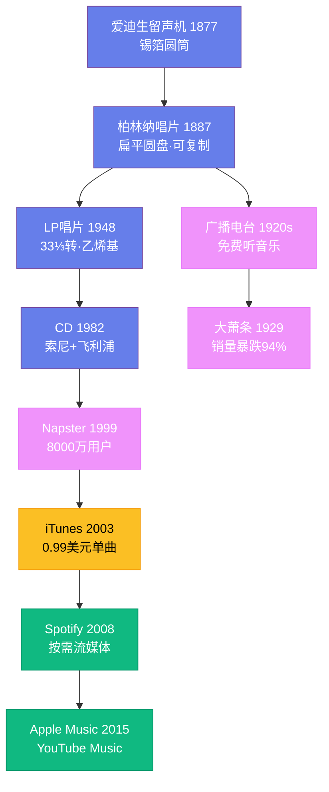

---
title: "音乐产业"
date: 2026-08-25
weight: 12
draft: false
cover:
  image: "https://images.unsplash.com/photo-1553913861-c0fddf2619ee?w=1200"
  alt: "音乐产业"
  caption: "音乐产业的商业模式在不断演变，但核心始终不变：好的音乐需要被听到，创作者需要获得合理的报酬"
---

# 音乐产业

## 一、录音技术的黎明

在录音技术出现之前，音乐产业几乎不存在——音乐是一种现场体验，无法被储存或复制。1877 年 12 月，托马斯·爱迪生（Thomas Edison）在新泽西的实验室里对着一个包着锡箔的圆筒唱了《玛丽有只小羊羔》，然后回放出来。这是人类第一次听到被录制下来的声音。爱迪生的留声机（phonograph）最初被设想为商务听写工具，而非音乐设备。

真正的突破来自埃米尔·柏林纳（Emile Berliner）。1887 年，这位德裔美国发明家发明了唱片（gramophone）——用扁平的圆盘代替爱迪生的圆筒。这个看似简单的改变意义深远：圆筒难以批量复制，而圆盘可以制作母版后大量压制。柏林纳的唱片为音乐的大规模商业化铺平了道路。1901 年，他的公司开始生产 78 转唱片，每面只能播放约三分钟——这个时长限制深刻影响了后来流行歌曲的长度标准。

## 二、唱片帝国的崛起

20 世纪初，唱片产业迅速成型。1901 年，柏林纳的助手埃尔德里奇·约翰逊成立了胜利留声机公司（Victor Talking Machine Company），推出了标志性的"主人的声音"商标——一只小狗歪头听着留声机。1902 年，意大利男高音恩里科·卡鲁索（Enrico Caruso）在米兰为胜利公司录制了一系列咏叹调，成为第一位唱片销量过百万的艺术家。卡鲁索的录音证明了一个道理：唱片不仅能记录声音，还能制造明星。

1920 年代，广播电台的兴起一度威胁到唱片产业——人们可以免费从广播里听音乐，何必买唱片？1929 年的大萧条更是雪上加霜，美国唱片销量从 1927 年的 1.04 亿张暴跌至 1932 年的 600 万张。唱片产业几乎灭绝，直到二战后才恢复元气。

1948 年是唱片技术的分水岭。哥伦比亚唱片公司推出了 33⅓ 转的 LP 唱片（Long Playing），采用乙烯基材料，每面可播放 20 多分钟。次年，RCA 推出了 45 转唱片作为回应。两种格式之争最终以共存告终——LP 用于专辑，45 转用于单曲。这一格局一直延续到 CD 时代。

## 三、摇滚乐重塑产业

1950 年代中期，摇滚乐的爆发彻底改变了音乐产业的面貌。唱片公司发现，年轻人愿意为音乐花钱——而且是大量的钱。1955 年，比尔·哈利的《昼夜摇滚》成为第一首登顶排行榜的摇滚歌曲。猫王埃尔维斯·普雷斯利（Elvis Presley）从太阳唱片转到 RCA，获得了前所未有的预付金，开创了天价签约的先例。

1960 年代，英国入侵（British Invasion）带来了新的商业奇迹。甲壳虫乐队（The Beatles）在 EMI/Parlophone 旗下创造了难以置信的销售纪录——他们的专辑《佩珀中士的孤独之心俱乐部乐队》（1967 年）被认为是第一张真正意义上的概念专辑，将专辑从歌曲的简单集合提升为完整的艺术作品。平克·弗洛伊德的《月之暗面》（1973 年）在公告牌专辑榜上停留了 937 周（超过 18 年），全球销量超过 4500 万张。

这一时期，唱片公司发展出了完整的产业链：A&R（艺人与曲目）部门负责发掘新人，制作人负责录音，市场部门负责推广，发行网络负责铺货。大唱片公司——华纳、环球、索尼、百代、BMG——逐渐形成了寡头垄断格局。

## 四、数字革命的冲击

1982 年，CD（Compact Disc）由索尼和飞利浦联合推出。CD 提供了比黑胶唱片更清晰的音质、更方便的使用和更长的播放时间。唱片公司欣喜若狂——消费者愿意用更高的价格重新购买他们已经拥有的音乐。全球 CD 销售额在 1999 年达到约 240 亿美元的历史峰值。

然而，数字技术也埋下了唱片产业崩溃的种子。1999 年，18 岁的大学生肖恩·范宁（Shawn Fanning）推出了 Napster——一个点对点音乐文件共享程序。用户可以免费下载几乎任何歌曲的 MP3 文件。在巅峰时期，Napster 拥有 8000 万注册用户。唱片产业如临大敌，美国唱片业协会（RIAA）对 Napster 提起诉讼，2001 年法院下令关闭了 Napster。但潘多拉的盒子已经打开——盗版下载从此一发不可收拾。全球音乐产业收入从 1999 年的 238 亿美元持续下滑至 2014 年的 142 亿美元。

2003 年，苹果推出了 iTunes Store，以每首 0.99 美元的价格销售数字单曲。史蒂夫·乔布斯说服了主要唱片公司授权数字销售，iTunes 到 2008 年成为全球最大的音乐零售商。但单曲下载模式进一步瓦解了专辑的概念——消费者不再需要买整张专辑，只挑喜欢的单曲购买。

## 五、流媒体时代

2008 年，瑞典的 Spotify 开始运营，开创了"按需流媒体"模式：用户可以免费听音乐（夹杂广告），或者每月支付 9.99 美元享受无广告服务。Spotify 的逻辑是：与其和盗版竞争，不如提供比盗版更方便的合法服务。到 2024 年，Spotify 拥有超过 6 亿用户，其中 2.2 亿为付费用户。

Apple Music（2015 年）、Amazon Music、YouTube Music 等平台相继加入竞争。流媒体收入在 2015 年首次超过数字下载，2018 年超过实体唱片，到 2023 年占全球音乐产业收入的 67%。音乐产业在经历了十五年的衰退后终于恢复增长，2023 年全球收入达到 286 亿美元。

但流媒体也引发了新的争议。Spotify 每次播放支付给版权方约 0.003 至 0.005 美元，这意味着一首歌需要被播放数百万次才能赚到可观的收入。独立音乐人抱怨平台偏袒大厂牌，小众音乐人难以获得推荐。音乐家的收入结构发生了根本变化——以前靠唱片销售，现在主要靠巡演和周边商品。泰勒·斯威夫特（Taylor Swift）2023 年的"时代巡演"全球收入超过 10 亿美元，刷新了巡演收入纪录，也印证了现场演出已成为音乐人最重要的收入来源。

## 六、产业的未来

音乐产业正在经历新一轮变革。人工智能可以创作音乐——2023 年，一首模仿德雷克和威肯风格的 AI 生成歌曲在社交媒体上疯传，引发了关于 AI 音乐版权和伦理的激烈讨论。区块链和 NFT 曾被寄予厚望，但 2022 年的市场降温让这一前景变得不确定。短视频平台 TikTok 已经成为音乐推广的重要渠道——Lil Nas X 的《Old Town Road》（2019 年）正是通过 TikTok 挑战走红，最终打破了公告牌单曲榜连续 19 周冠军的纪录。音乐产业的商业模式在不断演变，但核心始终不变：好的音乐需要被听到，创作者需要获得合理的报酬。
