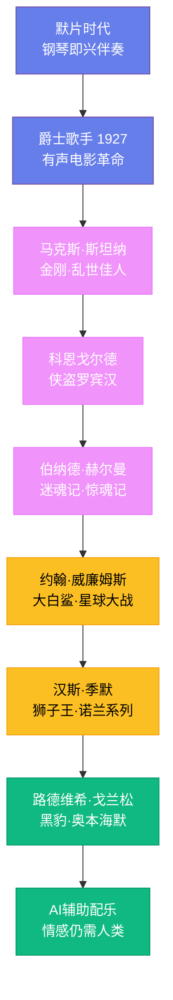

# 电影音乐

## 一、黑暗中的钢琴：默片时代

电影从诞生之日起就与音乐密不可分。1895 年 12 月 28 日，卢米埃尔兄弟在巴黎大咖啡馆放映《火车进站》时，现场就有钢琴伴奏。早期的电影放映商很快发现，没有音乐的电影会让观众感到不安——银幕上的人在动、在说话（虽然没有声音），但影院里死一般的寂静会让人产生一种诡异的感觉。音乐填补了这个空白。

默片时代的音乐没有统一标准。小城镇的影院可能只有一个钢琴师即兴伴奏，大城市的豪华影院则有完整的管弦乐队。钢琴师通常会准备一本"曲目手册"（cue sheet），上面标注着"追逐场景用《威廉·退尔序曲》""悲伤场景用《天鹅》"之类的提示。一些影院甚至雇用了专门的"音响效果师"，在放映时制造雷声、马蹄声和门响声。

少数默片拥有专门创作的配乐。1915 年，D.W. 格里菲斯的《一个国家的诞生》首映时配有约瑟夫·卡尔·布瑞尔创作的管弦乐配乐，这是电影音乐史上的里程碑。弗里茨·朗的《大都会》（1927 年）也有戈特弗里德·胡佩茨创作的完整配乐。但大多数默片的音乐是临时拼凑的，每次放映都可能不同。

## 二、有声电影的革命

1927 年 10 月 6 日，华纳兄弟推出了《爵士歌手》（The Jazz Singer），艾尔·乔尔森在片中说了那句著名的台词："等一下，等一下，你们还什么都没听到呢！"有声电影的时代到来了。电影音乐从此不再是附属品，而成为了电影叙事的核心组成部分。

马克斯·斯坦纳（Max Steiner，1888—1971 年）是好莱坞电影音乐的奠基人。这位维也纳出生的作曲家师从马勒和布鲁克纳，1929 年来到好莱坞。1933 年，他为《金刚》创作的配乐震惊了业界——当金刚爬上帝国大厦时，管弦乐队奏出的紧张旋律让观众的心跳加速。斯坦纳为《乱世佳人》（1939 年）创作的配乐成为了电影音乐的标杆，他发展了"主导动机"（leitmotif）技术——为每个角色和情感赋予特定的音乐主题，这些主题随着剧情发展而变化。斯坦纳一生为超过 300 部电影配乐，获得了 24 次奥斯卡提名，赢得 3 座小金人。

## 三、黄金时代的大师们

1930 至 1950 年代是好莱坞电影音乐的"黄金时代"。埃里希·科恩戈尔德（Erich Wolfgang Korngold，1897—1957 年）是维也纳的神童作曲家，12 岁就创作了歌剧。1934 年因纳粹迫害移居好莱坞，将欧洲晚期浪漫主义的宏大风格带入了电影配乐。他为《侠盗罗宾汉》（1938 年）创作的配乐至今仍是冒险电影音乐的典范。科恩戈尔德曾说："电影音乐应该是歌剧没有唱出来的部分。"

阿尔弗雷德·纽曼（Alfred Newman，1900—1970 年）为 20 世纪福克斯创作了标志性的片头号角音乐，这段旋律至今仍在每一部福克斯电影的开头响起。他一生获得 45 次奥斯卡提名，赢得 9 座奖杯。

伯纳德·赫尔曼（Bernard Herrmann，1911—1975 年）是电影音乐史上最独特的天才。他与希区柯克的合作堪称完美——《迷魂记》（1958 年）中催眠般的循环旋律、《惊魂记》（1960 年）中浴室场景的尖锐弦乐（只用了小提琴和中提琴，没有一件管乐器），都是电影音乐史上最令人难忘的时刻。赫尔曼还为奥逊·威尔斯的《公民凯恩》（1941 年）配乐，以及马丁·斯科塞斯的《出租车司机》（1976 年）——这是他最后一部作品，完成配乐后几小时便在睡梦中去世。

## 四、约翰·威廉姆斯：电影音乐的代名词

约翰·威廉姆斯（John Williams，1932 年出生）是电影音乐史上最伟大、最多产的作曲家。他的配乐定义了"大片"（blockbuster）时代的声音。

1975 年，史蒂文·斯皮尔伯格请威廉姆斯为《大白鲨》配乐。威廉姆斯只用了两个音符——E 和 F 的交替——就创造出了令人毛骨悚然的鲨鱼主题。这段音乐如此有效，以至于观众在鲨鱼还没出现时就已经开始紧张了。1977 年，他为乔治·卢卡斯的《星球大战》创作的配乐改变了电影音乐的历史——那段开场主题曲的铜管齐奏，瞬间将观众带入了一个遥远的银河系。威廉姆斯为《星球大战》创作了超过 20 小时的音乐，包括帝国进行曲（达斯·维达的主题）、莱娅公主的主题和尤达的主题，每一个都成为了流行文化的一部分。

威廉姆斯的其他经典配乐包括：《夺宝奇兵》（1981 年）的冒险主题、《E.T.》（1982 年）中自行车飞越月亮的场景音乐、《辛德勒的名单》（1993 年）中伊扎克·帕尔曼演奏的令人心碎的小提琴独奏、《哈利·波特》（2001 年）的魔法主题。他获得了 54 次奥斯卡提名（赢得 5 座），是奥斯卡历史上被提名最多的在世人物。

## 五、汉斯·季默：电子与管弦的融合

汉斯·季默（Hans Zimmer，1957 年出生）是当代最具影响力的电影作曲家。这位出生于法兰克福的音乐家没有受过正规的音乐学院训练——他的音乐教育来自在合成器和键盘上的自学。

季默 1988 年为《雨人》配乐，首次将电子合成器与管弦乐队深度融合，开创了一种全新的电影音乐风格。1994 年，他为《狮子王》创作的配乐赢得了奥斯卡奖。此后，他与克里斯托弗·诺兰的合作成为了电影音乐的传奇——《蝙蝠侠：黑暗骑士》（2008 年）中那个令人不安的单音持续音（由大提琴家马丁·蒂尔曼演奏）、《盗梦空间》（2010 年）中伊迪丝·皮雅芙的《不，我无怨无悔》被极度减速后变成的低沉轰鸣、《星际穿越》（2014 年）中管风琴的宇宙感、《敦刻尔克》（2017 年）中谢泼德音调制造的持续紧张感——每一部都重新定义了电影音乐的可能性。2021 年的《沙丘》配乐中，季默创造了全新的乐器音色，用改装的吉他和人声营造出异星的荒凉感。

## 六、电影音乐的今天与明天

当代电影音乐呈现出多元化的趋势。路德维希·戈兰松（Ludwig Göransson）为《黑豹》（2018 年）配乐时将非洲鼓乐和传统乐器融入管弦乐，为《奥本海默》（2023 年）配乐时用小提琴的泛音表现核裂变的不安。特伦特·雷兹诺（Trent Reznor）和阿提库斯·罗斯（Atticus Ross）这对九寸钉乐队的搭档为《社交网络》（2010 年）和《心灵奇旅》（2020 年）配乐，将电子音乐的冷峻质感带入了电影。人工智能正在被用于辅助配乐——它可以生成背景音乐或模仿特定风格，但真正伟大的电影音乐需要理解画面背后的情感，这是机器目前无法做到的。电影音乐的未来，依然是人类情感与技术创新的交汇点。
