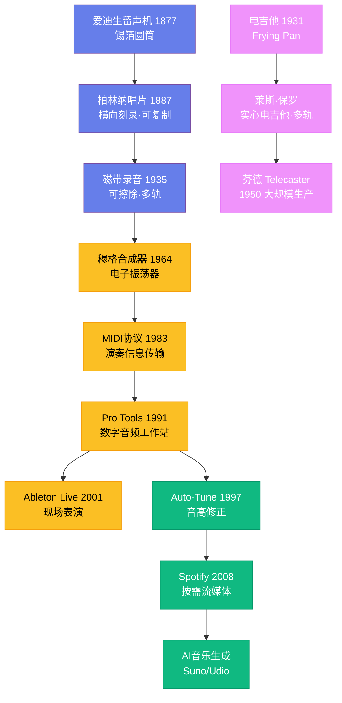

# 音乐与科技

## 一、声音的捕捉：录音技术的三次革命

在录音技术出现之前，音乐是一种转瞬即逝的体验——演奏完毕，声音便永远消失。1877 年 12 月，托马斯·爱迪生对着一个包着锡箔的圆筒唱了《玛丽有只小羊羔》，然后回放出来。这是人类第一次听到被录制下来的声音。爱迪生的留声机使用的是"纵向刻录"方式——唱针在锡箔上上下起伏记录声波，音质粗糙得几乎无法辨认。

第一次革命来自埃米尔·柏林纳。1887 年，他发明了唱片（gramophone），用扁平的圆盘代替圆筒，采用"横向刻录"方式——唱针在沟槽里左右摆动。这个改变看似微小，却意义深远：圆盘可以制作母版后大量压制，音乐从此可以大规模复制和销售。

第二次革命发生在 1925 年，电气录音技术取代了机械录音。此前，音乐家必须对着一个巨大的号角状传声器演奏，声音直接驱动刻录针。电气录音使用麦克风将声波转化为电信号，经过放大后再刻录，音质有了质的飞跃。1925 年，Victor 公司用电气录音技术录制了费城管弦乐团在斯托科夫斯基指挥下的演奏，听众第一次在唱片中听到了管弦乐队的全貌。

第三次革命是磁带录音。1935 年，德国 AEG 公司推出了"Magnetophon"磁带录音机，使用涂有氧化铁的塑料带记录声音。二战后，美国占领军将德国的磁带录音技术带回了本国。磁带录音的优势是革命性的：它可以反复录制和擦除，不像唱片母版那样只能刻一次。这使得"多轨录音"成为可能——1950 年代，莱斯·保罗（Les Paul，1915—2009 年）在自家车库里用改装的磁带录音机实验多轨录音，他可以一个人演奏吉他、贝斯和鼓，然后将它们叠加在一起。保罗还发明了实心电吉他（Gibson Les Paul），这把吉他至今仍是摇滚乐的标志性乐器。

## 二、电吉他的诞生与摇滚乐

电吉他的发明是 20 世纪音乐最重要的技术突破之一。1931 年，乔治·博尚普（George Beauchamp）和阿道夫·里肯巴克（Adolph Rickenbacker）制造了第一把实用的电吉他"Frying Pan"。但真正改变世界的是两个人：莱斯·保罗和里奥·芬德（Leo Fender，1909—1991 年）。

芬德是一个自学成才的电子工程师，1950 年推出了 Telecaster——第一把大规模生产的实心电吉他。1954 年的 Stratocaster 更是成为了吉他设计的标杆，吉米·亨德里克斯、埃里克·克莱普顿和无数吉他手都使用过它。芬德还发明了 Precision Bass（1951 年），将贝斯从笨重的立式贝斯变成了便携的电贝斯，彻底改变了乐队的编制。

吉米·亨德里克斯（Jimi Hendrix，1942—1970 年）将电吉他的可能性推向了极致。他用反馈（feedback）、失真（distortion）和哇音踏板（wah-wah pedal）创造了前所未有的声音——在 1967 年蒙特雷流行音乐节上，他在舞台上点燃了自己的吉他，这一幕成为了摇滚乐的永恒画面。亨德里克斯证明了电吉他不仅是一种乐器，更是一种全新的声音生成器。

## 三、合成器：声音的无限可能

1964 年，罗伯特·穆格（Robert Moog）推出了穆格合成器（Moog Synthesizer），开启了电子音乐的时代。合成器不再依赖物理振动产生声音，而是通过电子振荡器生成声波，再通过滤波器、放大器和包络线塑造音色。这意味着理论上可以创造出任何想象得到的声音。

温蒂·卡洛斯（Wendy Carlos）1968 年的专辑《Switched-On Bach》用穆格合成器演奏巴赫的作品，成为第一张白金销量的古典电子音乐专辑，让合成器从实验室走进了大众视野。基思·埃默森（Keith Emerson）在 Emerson, Lake & Palmer 乐队中将合成器变成了摇滚舞台上的主角。1970 年代末，日本的雅马哈推出了 DX7 合成器（1983 年），使用数字频率调制（FM）技术，价格只有模拟合成器的几分之一，迅速普及到了流行音乐的每一个角落——从菲尔·柯林斯的鼓机音色到惠特尼·休斯顿的伴奏，到处都是 DX7 的声音。

1983 年，MIDI（Musical Instrument Digital Interface）协议的诞生是另一个里程碑。MIDI 不传输声音，而是传输"演奏信息"——哪个音符、多大力度、持续多久。这使得不同的电子乐器可以互相通信，一台键盘可以控制整个合成器阵列。MIDI 成为了现代电子音乐制作的基础协议，至今仍在使用。

## 四、数字音频工作站：人人都是制作人

1991 年，Digidesign 推出了 Pro Tools，这是第一款真正意义上的数字音频工作站（DAW）。Pro Tools 将录音、编辑、混音和母带处理集成在一个软件中，运行在专用硬件上。它迅速成为了专业录音棚的标准配置——从麦当娜到 Radiohead，几乎所有主流艺人都在 Pro Tools 上录制音乐。

2001 年，柏林的 Ableton 推出了 Live，这款软件专为现场表演和电子音乐制作设计，允许用户实时触发和操控音频片段。Live 成为了电子音乐人和 DJ 的必备工具。苹果的 Logic Pro 和 GarageBand 则将专业级音乐制作带给了普通用户——GarageBand 随每一台 Mac 免费附赠，任何人打开电脑就能开始创作音乐。

DAW 的普及彻底改变了音乐产业的权力结构。以前，录制一张专辑需要租用专业录音棚、雇用录音师和制作人，成本动辄数十万美元。现在，一台笔记本电脑、一副耳机和一个 DAW 就够了。比莉·艾利什（Billie Eilish）的首张专辑《当我们入睡时，世界在做什么？》（2019 年）就是在她哥哥的卧室里用 Logic Pro 录制的，赢得了四项格莱美奖。

## 五、Auto-Tune：争议与革命

1997 年，安塔雷斯音频公司（Antares Audio Technologies）推出了 Auto-Tune——一款最初设计用于修正歌手音准的软件插件。它的原理是检测人声的音高，然后自动将其修正到最接近的正确音高上。

1998 年，雪儿（Cher）的《Believe》首次将 Auto-Tune 作为一种音效使用——那种机械化的、机器人般的人声效果震惊了听众。制作人马克·泰勒和布莱恩·希金斯故意将修正速度调到最快，让人声的音高跳跃变得明显可闻。这首歌登上了全球排行榜冠军。

Auto-Tune 从此成为了流行音乐中最常用的工具，也引发了激烈的争议。批评者认为它让歌手不需要真正的歌唱技巧，让所有人的声音听起来都一样。支持者则认为它是一种新的音色工具，就像电吉他曾经被传统吉他手鄙视一样。无论如何，Auto-Tune 已经深深嵌入了现代流行音乐——从 T-Pain 的标志性音色到 Bon Iver 的实验性使用，它既是修正工具，也是创作工具。

## 六、流媒体与 AI：新的前沿

2008 年，Spotify 在瑞典成立，开创了按需流媒体模式。到 2024 年，全球有超过 6 亿人使用流媒体服务听音乐。流媒体不仅改变了消费方式，也改变了创作方式——为了适应算法推荐和听众的短注意力，歌曲的前奏越来越短，平均时长从 1990 年代的 4 分多钟缩短到了 3 分钟左右。

人工智能正在进入音乐创作的每一个环节。OpenAI 的 Jukebox（2020 年）可以生成包含人声的完整歌曲。Google 的 MusicLM（2023 年）可以根据文字描述生成音乐。Suno 和 Udio 等 AI 音乐生成工具让任何人都能通过输入文字提示在几秒钟内生成一首完整的歌曲。2024 年，AI 生成的模仿德雷克和威肯风格的歌曲在社交媒体上引发了关于版权和创造力的激烈讨论。音乐与科技的关系从未如此紧密——每一次技术进步都重新定义了音乐的可能性，但音乐的核心——人类的情感表达——始终是技术无法替代的。
