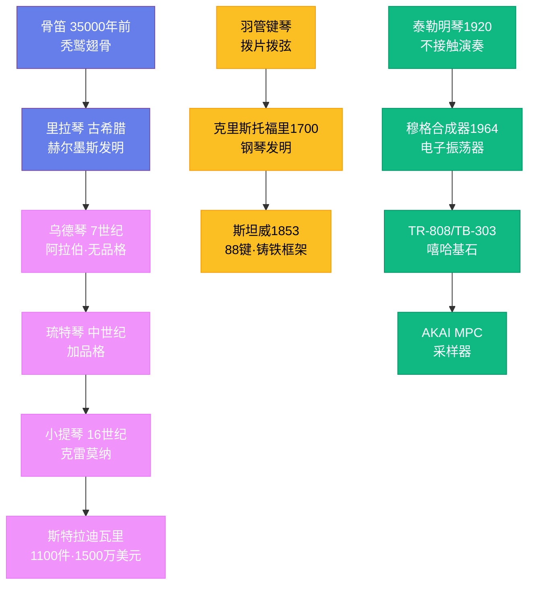

# 乐器的演变

## 一、骨与弦：最早的乐器

人类最早的乐器可能就是自己的身体——拍手、跺脚、拍打胸膛。但真正的乐器革命发生在数万年前。2008 年，考古学家在德国南部的霍勒费尔斯洞穴中发现了几支骨笛，距今约 35000 至 40000 年，用秃鹫的翅骨制成。这些骨笛能吹奏出完整的音阶，证明了智人在走出非洲之前就已经有了音乐能力。中国河南贾湖遗址出土的骨笛（约前 7000 年）更为精致，有七个音孔，能演奏七声音阶。

弦乐器的起源可能纯属偶然——猎人发现弓弦能发出声音。最早的弦乐器图像出现在公元前 2500 年左右的美索不达米亚浮雕上，描绘了竖琴和里拉琴的演奏场景。里拉琴（lyre）是古希腊最重要的乐器，传说由赫尔墨斯用龟壳发明。古希腊人认为里拉琴是阿波罗的象征，代表着理性和和谐。里拉琴的形制简单——一个共鸣箱、两根臂柱和几根弦——但它影响了后来所有的弦乐器。

## 二、从乌德琴到小提琴家族

公元 7 至 8 世纪，阿拉伯的乌德琴（oud）通过伊斯兰征服传入伊比利亚半岛。乌德琴是一种没有品格的拨弦乐器，琴身呈梨形，音色温暖圆润。欧洲人在此基础上发展出了琉特琴（lute），加上了品格以便更精确地按弦。琉特琴在中世纪和文艺复兴时期是欧洲最流行的乐器，从宫廷到酒馆无处不在。约翰·道兰（John Dowland，1563—1626 年）为琉特琴创作了大量精美的作品，至今仍是早期音乐演奏的保留曲目。

小提琴家族的出现是弦乐器史上最重要的事件。16 世纪初，小提琴在意大利北部的布雷西亚和克雷莫纳诞生。关于谁是小提琴的发明者仍有争议，但安德烈亚·阿马蒂（Andrea Amati，约 1505—1577 年）被公认为克雷莫纳小提琴制作传统的奠基人。他的孙子尼科洛·阿马蒂（Nicolò Amati，1596—1684 年）培养了两位最伟大的制琴师——安东尼奥·斯特拉迪瓦里（Antonio Stradivari，1644—1737 年）和朱塞佩·瓜尔内里（Giuseppe Guarneri，1698—1744 年）。

斯特拉迪瓦里一生制作了约 1100 件弦乐器，其中约 650 件存世。他的小提琴以其无与伦比的音质著称——音色既明亮又温暖，穿透力极强，即使在大型音乐厅中也能清晰传达。一把斯特拉迪瓦里小提琴在拍卖会上可以卖到 1500 万至 2000 万美元。科学家们用 CT 扫描、化学分析和声学建模研究了斯特拉迪瓦里琴的秘密，发现其木材经过特殊的化学处理，琴身的厚度分布极为精确，但至今没有人能完全复制其音质。瓜尔内里的小提琴音色更为浓烈和有力，尼科洛·帕格尼尼（Niccolò Paganini，1782—1840 年）使用的"加农炮"（Cannone）就是一把瓜尔内里琴。

## 三、钢琴：从羽管键琴到 88 键

钢琴的前身是羽管键琴（harpsichord）和击弦古钢琴（clavichord）。羽管键琴用拨片拨弦发声，音量无法控制；击弦古钢琴用金属楔击弦，可以表现力度变化但音量太小。巴尔托洛梅奥·克里斯托福里（Bartolomeo Cristofori，1655—1731 年）是佛罗伦萨美第奇家族的乐器保管员，他在 1700 年左右发明了一种全新的击弦机构——用包裹皮革的小锤击弦，通过擒纵机构让小锤在击弦后立即弹回，使弦能自由振动。这种乐器被称为"gravicembalo col piano e forte"（能轻能重的羽管键琴），后来简化为"pianoforte"，即钢琴。

克里斯托福里的发明在当时并未引起轰动。真正让钢琴流行起来的是德国的约翰·安德烈亚斯·施泰因（Johann Andreas Stein）和后来的维也纳制琴师们，他们改进了击弦机构，使触键更加灵敏。莫扎特试过施泰因的钢琴后赞不绝口。19 世纪，钢琴经历了巨大的发展——音域从 5 个八度扩展到 7 个多八度（88 键），铸铁框架取代了木框架以承受更大的弦张力，踏板系统也日趋完善。斯坦威（Steinway & Sons）1853 年在纽约成立，其 Model D 音乐会三角钢琴至今仍是钢琴家的首选。

钢琴成为了西方音乐最重要的乐器。从巴赫的《平均律钢琴曲集》到贝多芬的 32 首钢琴奏鸣曲，从肖邦的夜曲到德彪西的印象派，从拉格泰姆到爵士乐，钢琴无处不在。它也是音乐教育的基础——学习钢琴被视为理解音乐理论和和声的最佳途径。

## 四、铜管与木管：气流的艺术

管乐器的历史同样古老。单簧管（clarinet）由约翰·克里斯托弗·登纳（Johann Christoph Denner）在 1700 年左右的纽伦堡发明，最初只有两个键。莫扎特第一次听到单簧管时就被其音色迷住了，他为单簧管创作了《A 大调单簧管协奏曲》（K. 622，1791 年），这是单簧管曲目中最伟大的作品。

萨克斯管（saxophone）是唯一一种以发明者命名的乐器。阿道夫·萨克斯（Adolphe Sax，1814—1894 年）是比利时的乐器制造师，1840 年代在巴黎发明了萨克斯管——一种将木管的单簧哨头与铜管的锥形管身结合的乐器。萨克斯管最初被设计用于军乐队和歌剧，但真正让它大放异彩的是爵士乐。西德尼·贝谢（Sidney Bechet，1897—1959 年）是第一位伟大的爵士萨克斯手，查理·帕克（Charlie Parker，1920—1955 年）则用中音萨克斯管重新定义了爵士乐的语言。

小号（trumpet）的历史可以追溯到 3000 多年前的古埃及。但现代小号的活塞系统直到 19 世纪初才被发明，使小号能演奏完整的半音阶。路易斯·阿姆斯特朗（Louis Armstrong，1901—1971 年）用小号和歌声改变了爵士乐——他的即兴演奏和独特的嗓音影响了所有后来的爵士音乐家。迈尔斯·戴维斯（Miles Davis，1926—1991 年）则用弱音器小号的柔和音色开创了酷派爵士。

## 五、电子乐器：声音的新疆域

20 世纪，电子技术打开了乐器设计的全新维度。列夫·泰勒明（Léon Theremin，1896—1993 年）1920 年发明的泰勒明琴（theremin）是最早的电子乐器——演奏者不接触乐器，而是通过移动双手改变两个天线周围的电磁场来产生声音。泰勒明琴发出的那种飘忽不定的、幽灵般的音色后来成为了科幻电影配乐的标配。

罗伯特·穆格（Robert Moog）1964 年推出的穆格合成器开启了合成器时代。温蒂·卡洛斯 1968 年的《Switched-On Bach》证明合成器可以演奏严肃音乐。1980 年代，罗兰（Roland）的 TR-808 鼓机（1980 年）和 TB-303 贝斯合成器（1981 年）最初被认为是失败的产品——它们的声音太不像真实的鼓和贝斯了。但正是这种"不真实"的声音被嘻哈和电子音乐制作人发现了：808 的低沉底鼓成为了嘻哈的基石，303 的酸性音色催生了酸浩室（acid house）音乐。

采样器（sampler）是另一种革命性的电子乐器。1980 年代，Akai 的 MPC 系列采样器允许制作人录制任何声音，然后在键盘或打击垫上播放。嘻哈制作人用 MPC 采样旧唱片的鼓点和旋律片段，创造了全新的音乐——DJ Premier、J Dilla 和 Kanye West 都是 MPC 的大师。

## 六、数字时代的乐器

21 世纪，乐器的形态继续演变。MIDI 控制器可以模拟任何传统乐器的演奏方式。触摸屏上的虚拟乐器让手机变成了音乐创作工具。模块化合成器在 2010 年代复兴，音乐人通过连接不同的模块创造出独一无二的音色。但传统乐器并未消亡——钢琴、小提琴、吉他依然在音乐教育和演出中占据核心地位。乐器的演变史，本质上是人类不断探索新声音的历史——从骨笛到合成器，驱动我们的始终是同一个愿望：用声音表达语言无法传达的情感。
