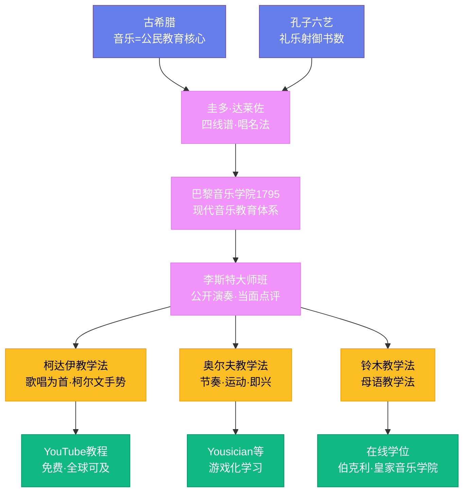

# 音乐教育

## 一、古代的乐教传统

音乐教育的历史几乎和音乐本身一样古老。在古希腊，音乐不是选修课，而是公民教育的核心。柏拉图在《理想国》中写道："音乐教育比其他任何教育都重要得多，因为节奏与和声深入灵魂的最深处，最有力地抓住它，带给它优雅。"亚里士多德在《政治学》中进一步阐述：音乐应该用于教育、净化和精神消遣。古希腊的男孩在体育馆学习体育，在音乐学校（didaskaleion）学习音乐——两者被视为同等重要。

在中国，孔子（前 551—前 479 年）将"乐"列为六艺之一（礼、乐、射、御、书、数），认为音乐是培养道德和维护社会秩序的重要工具。孔子本人精通琴、瑟等乐器，他教导学生不仅要学习音乐的技巧，更要理解音乐背后的精神内涵。《论语》记载，孔子在齐国听到韶乐后"三月不知肉味"，感叹"不图为乐之至于斯也"。这种"乐教"思想深刻影响了中国两千多年的教育传统。

## 二、中世纪：修道院与记谱法

罗马帝国崩溃后，欧洲的音乐教育转移到了修道院。修士们每天要唱诵八次日课（Liturgy of the Hours），格里高利圣咏（Gregorian chant）是教会音乐的核心。学习这些圣咏需要记忆大量的旋律——在没有记谱法的年代，这完全依赖口耳相传，学习效率极低。

改变这一切的是圭多·达莱佐（Guido d'Arezzo，约 991—1033 年），他是中世纪最重要的音乐教育家。圭多发明了四线谱——在四条横线上标注音符的位置，使音高有了视觉参照。他还发明了唱名法——用 ut、re、mi、fa、sol、la 六个音节来命名音阶中的六个音（后来 ut 被 do 取代，si 被加入成为第七个音）。这些音节取自一首赞美诗《圣约翰颂》（Ut queant laxis）中每一行的第一个音节。圭多的创新使得学习音乐的时间从十年缩短到了一年——学生不再需要逐首记忆旋律，而是可以通过读谱直接演唱。这是音乐教育史上最重要的革命。

## 三、文艺复兴至古典时期：宫廷与学院

文艺复兴时期，音乐教育开始从教会走向世俗。意大利的贵族家庭雇用专门的音乐教师教育子女。歌唱学校（scuole di canto）在威尼斯等城市兴起，培养教堂唱诗班的歌手。1585 年，圣塞西莉亚音乐学院（Accademia di Santa Cecilia）在罗马成立，这是欧洲最早的音乐教育机构之一。

18 至 19 世纪，欧洲各地建立了大量音乐学院，形成了现代音乐教育的体系。巴黎音乐学院（Conservatoire de Paris）1795 年由法国大革命政府创立，最初是为了培养军乐队的演奏员，后来发展成为世界上最负盛名的音乐学府之一。维也纳音乐学院（1817 年）、莱比锡音乐学院（1843 年，由门德尔松创立）和柏林音乐学院（1869 年）相继成立。这些学院建立了系统的课程体系：乐理、和声、对位法、视唱练耳、音乐史和主修乐器。

这一时期也出现了伟大的音乐教师。弗朗茨·李斯特（Franz Liszt，1811—1886 年）是 19 世纪最伟大的钢琴教师，他在魏玛开设的大师班吸引了来自全欧洲的学生。李斯特的教学方法独特——他不收学费，但要求学生在大师班上公开演奏，接受他的当面点评。安东·鲁宾斯坦（Anton Rubinstein，1829—1894 年）1862 年在圣彼得堡创立了俄国第一所音乐学院，培养了柴可夫斯基等杰出作曲家。

## 四、20 世纪的三大教学法

20 世纪初，三位音乐教育家发展出了影响深远的教学方法，至今仍是全球音乐教育的主流。

佐尔坦·柯达伊（Zoltán Kodály，1882—1967 年）是匈牙利作曲家和民族音乐学家。他在田野采集中发现，匈牙利农村的孩子虽然不识字，但人人都能唱几十首民歌——音乐教育应该从歌唱开始。柯达伊教学法的核心原则是：歌唱是音乐教育的基础，使用首调唱名法（moveable do）和柯尔文手势（用手的位置表示音高），优先使用本民族的民间音乐。在柯达伊教学法实施最彻底的匈牙利，经过系统训练的 18 岁青年可以视唱复杂的四声部合唱——这种水平在其他国家的音乐学院学生中都很难达到。

卡尔·奥尔夫（Carl Orff，1895—1982 年）是德国作曲家，他的《布兰诗歌》（1936 年）至今是音乐会最受欢迎的作品之一。奥尔夫教学法强调节奏、运动和即兴——他认为儿童学习音乐应该像学习语言一样自然，从说白、拍手和跺脚开始，逐步引入奥尔夫乐器（木琴、金属琴、鼓和音块）。奥尔夫教学法的课堂充满了游戏和互动——孩子们不是被动地听讲，而是主动地创造音乐。

铃木镇一（Shinichi Suzuki，1898—1998 年）是日本小提琴教育家，他发展了"母语教学法"（Suzuki Method）。铃木观察到，每个日本孩子都能学会说日语——不管日语有多难——因为他们在充满日语的环境中长大。他将同样的原则应用于音乐教育：让幼儿在充满音乐的环境中成长，先通过听和模仿学习演奏，再逐步引入读谱。铃木教学法从 1950 年代开始在日本推广，到 1970 年代已经传播到全球 40 多个国家。铃木曾说："所有能学会说话的孩子都能学会演奏音乐。"

## 五、音乐学院的黄金与危机

20 世纪，音乐学院体系在全球扩展。美国的茱莉亚学院（1905 年成立）、柯蒂斯音乐学院（1924 年）和伯克利音乐学院（1945 年）成为了世界顶级的音乐学府。中国的中央音乐学院（1950 年）和上海音乐学院（1927 年前身）培养了大量优秀的音乐家。

但音乐教育也面临着严峻的挑战。在美国，自 2008 年金融危机以来，大量公立学校削减了音乐课程——据美国国家艺术基金会的数据，低收入社区的儿童接受音乐教育的机会远低于富裕社区。英国的情况类似，2020 年的一项调查显示，英格兰只有不到四分之一的公立学校提供乐器小组课。音乐教育正在成为一种"奢侈品"，而非基本权利。

## 六、数字时代的音乐教育

数字技术正在重塑音乐教育的面貌。YouTube 上有数以百万计的免费音乐教程——从吉他入门到爵士和声，任何人只要有网络连接就能学习。Yousician、Simply Piano 等应用使用游戏化的方式教乐器演奏，通过麦克风实时评估学生的弹奏。伯克利音乐学院和皇家音乐学院都开设了在线课程和学位项目。

但数字教育也有局限。音乐本质上是一种社交活动——合奏、室内乐和乐团排练培养的不仅是音乐技能，还有倾听、合作和共情的能力。屏幕无法替代面对面的教学互动——老师纠正学生的手型、感受学生的呼吸、在排练中建立默契。音乐教育的未来，可能是线上与线下的融合——用数字工具扩展学习的边界，但保留人与人之间真实的音乐交流。
