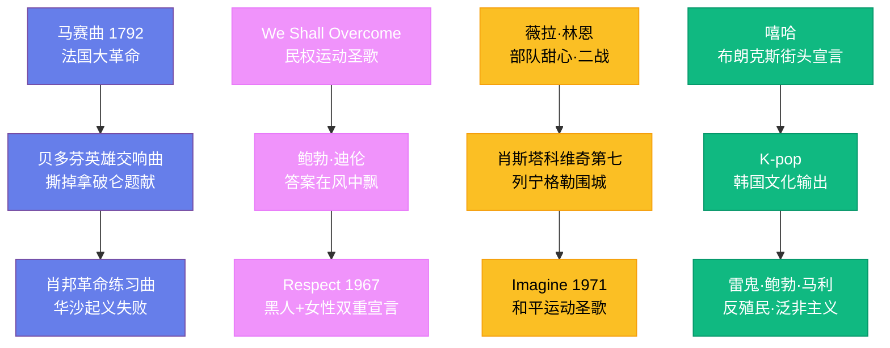

---
title: "音乐与社会"
date: 2026-08-25
weight: 19
draft: false
cover:
  image: "https://images.unsplash.com/photo-1553913861-c0fddf2619ee?w=1200"
  alt: "音乐与社会"
  caption: "只要人类社会存在，音乐就将继续扮演它不可替代的角色"
---

# 音乐与社会

## 一、革命的歌声

音乐与政治的纠葛由来已久。1792 年 4 月 24 日深夜，法国斯特拉斯堡的军事工程师鲁热·德·李尔在酒后一气呵成写出了《莱茵军团战歌》——这首歌后来被称为《马赛曲》，成为了法国大革命的象征，1795 年被定为法国国歌。拿破仑后来禁止了《马赛曲》，因为它代表的是革命精神，而他需要的是帝国秩序。音乐与权力的博弈，从那时起就没有停止过。

贝多芬（Ludwig van Beethoven，1770—1827 年）的《第三交响曲"英雄"》（1804 年）原本题献给拿破仑·波拿巴——贝多芬视他为共和理想的化身。但当拿破仑 1804 年称帝的消息传来，贝多芬勃然大怒，撕掉了题献页，大喊："他也不过是个普通人！"这部交响曲最终被题献给"一位伟人"——但不再指拿破仑。肖邦（Frédéric Chopin，1810—1849 年）的波兰舞曲则承载着另一种政治情感——他的祖国波兰在 18 世纪末被俄、普、奥三国瓜分，肖邦流亡巴黎，用音乐表达对故土的思念和对自由的渴望。他的《革命练习曲》（Op. 10 No. 12）据说是在听到华沙起义失败的消息后写下的。

## 二、民权运动的配乐

20 世纪中叶的美国民权运动，音乐是不可或缺的力量。灵歌（spirituals）和福音歌曲在教堂里激励着抗议者。1955 至 1956 年的蒙哥马利公交抵制运动中，人们在教堂里唱着"我们终将胜利"（We Shall Overcome）——这首歌后来成为了全球民权运动的圣歌。

鲍勃·迪伦（Bob Dylan，1941 年出生）1963 年在林肯纪念堂前的"向华盛顿进军"集会上演唱了《答案在风中飘》（Blowin' in the Wind），25 万人在场聆听。琼·贝兹（Joan Baez）用她清澈的女高音为抗议运动歌唱了数十年。阿撒·富兰克林（Aretha Franklin）1967 年翻唱的《Respect》超越了音乐本身——它成为了黑人争取平等权利和女性争取尊重的双重宣言。

南非的反种族隔离运动同样以音乐为武器。米里亚姆·马凯巴（Miriam Makeba，1932—2008 年）被称为"非洲妈妈"，她的歌声让全世界关注到了南非的种族隔离制度。休·马塞凯拉（Hugh Masekela）用小号吹奏的《Bring Him Back Home》（1987 年）呼唤释放纳尔逊·曼德拉。1990 年曼德拉出狱后，音乐家们在世界各地举办了庆祝音乐会。

## 三、战争中的旋律

两次世界大战期间，音乐被广泛用于鼓舞士气和凝聚人心。薇拉·林恩（Vera Lynn，1917—2020 年）在二战期间被称为"部队甜心"，她的《我们会再相见》（We'll Meet Again，1939 年）和《白崖》（The White Cliffs of Dover）给了前线士兵和后方家属巨大的精神慰藉。林恩在 2020 年以 103 岁高龄去世时，英国全国为她默哀。

在被围困的列宁格勒，音乐成为了抵抗的象征。1942 年 8 月 9 日，列宁格勒爱乐乐团在被德军围困的城市中首演了肖斯塔科维奇的《第七交响曲"列宁格勒"》（1941 年作曲）。乐团成员已经因饥饿和严寒减员严重，不得不从军队中召回乐手。演出通过广播向全城播放，甚至传到了德军阵地上。这次演出证明了：即使在最黑暗的时刻，人类的精神也不会被摧毁。

越战时期，音乐成为了反战运动的核心。1969 年 8 月，伍德斯托克音乐节在纽约州的一个农场举行，40 万人在泥泞中度过了三天——吉米·亨德里克斯用失真的电吉他演奏了扭曲版的《星条旗》，被解读为对越战的控诉。约翰·列侬（John Lennon，1940—1980 年）的《Imagine》（1971 年）唱出了"想象没有国家……没有宗教……没有财产"的世界，成为了和平运动的圣歌。

## 四、音乐与身份认同

音乐是身份认同最有力的表达方式之一。嘻哈音乐诞生于 1970 年代纽约南布朗克斯的非裔和拉丁裔社区——在贫困、暴力和被忽视的环境中，年轻人用说唱、DJ 和涂鸦创造了全新的文化。Grandmaster Flash 的《The Message》（1982 年）用直白的歌词描写了贫民窟的生活，开创了"意识说唱"的传统。Public Enemy 的《Fight the Power》（1989 年）成为了黑人反抗系统性种族主义的战歌。

K-pop 韩国流行音乐在 21 世纪成为了韩国最重要的文化输出。防弹少年团（BTS）的全球影响力令人惊叹——他们的联合国演讲、格莱美提名和社交媒体粉丝数量打破了亚洲艺人的所有纪录。K-pop 的成功不仅是音乐的胜利，更是韩国"文化立国"战略的成果。

雷鬼音乐与牙买加的拉斯塔法里运动紧密相连。鲍勃·马利的音乐传递了反殖民主义、泛非主义和精神觉醒的信息——他的《Exodus》（1977 年）被《时代》杂志评为"20 世纪最伟大的专辑"之一。

## 五、音乐与心理健康

音乐对心理健康的影响已被大量科学研究证实。2013 年发表在《自然神经科学》杂志上的一项研究发现，听音乐时大脑释放的多巴胺量与进食和性行为时相当。音乐治疗（music therapy）作为一种专业学科在二战后发展起来——最初是退伍军人医院用音乐帮助创伤后应激障碍（PTSD）患者康复。

神经科学家奥利弗·萨克斯（Oliver Sacks，1933—2015 年）在《脑袋里装了 2000 出歌剧的人》一书中记录了音乐对大脑的神奇影响：一些失语症患者仍然能唱歌，一些帕金森病患者在音乐的节奏引导下能恢复行走能力。音乐似乎直接作用于大脑的深层结构，绕过了语言和认知的障碍。

## 六、音乐的永恒功能

从法国大革命的《马赛曲》到民权运动的《We Shall Overcome》，从肖斯塔科维奇的列宁格勒交响曲到嘻哈的街头宣言，音乐始终是人类社会最强大的力量之一。它能激发革命、抚慰创伤、凝聚群体、表达身份。技术在变，风格在变，但音乐连接人心、推动变革的功能从未改变。只要人类社会存在，音乐就将继续扮演它不可替代的角色。
