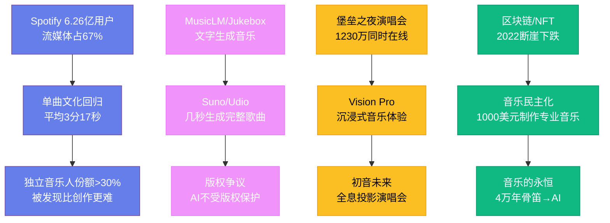

---
title: "音乐的未来"
date: 2026-08-25
weight: 20
draft: false
cover:
  image: "https://images.unsplash.com/photo-1553913861-c0fddf2619ee?w=1200"
  alt: "音乐的未来"
  caption: "音乐的未来，最终取决于我们作为人类，想要对彼此说些什么"
---

# 音乐的未来

## 一、流媒体的统治与反思

流媒体已经彻底重塑了音乐产业的版图。到 2024 年，Spotify 拥有超过 6.26 亿用户（其中 2.36 亿付费用户），Apple Music 拥有超过 1 亿订阅者，YouTube Music 的月活跃用户超过 8 亿。流媒体收入占全球音乐产业收入的 67%，2023 年全球音乐产业总收入达到 286 亿美元——这是自 1999 年 CD 时代巅峰以来的最高水平。

但流媒体也带来了深刻的结构性变化。单曲文化回归了——在 Spotify 上，听众的注意力集中在单曲而非专辑上，这与 1950 年代 45 转唱片时代的情形惊人地相似。为了适应算法推荐和听众的短注意力，歌曲的平均时长从 1990 年代的 4 分多钟缩短到了 3 分 17 秒（2023 年 Spotify 数据），前奏从十几秒缩短到了几秒甚至直接省略。泰勒·斯威夫特是少数仍坚持发行完整专辑并获得商业成功的艺术家——她的专辑《午夜》（Midnights，2022 年）在发行首日就打破了 Spotify 单日播放纪录。

流媒体的收入分配也引发了持续争议。Spotify 每次播放支付给版权方约 0.003 至 0.005 美元，这意味着独立音乐人需要每月获得数十万次播放才能靠流媒体维持生计。2024 年，Spotify 改变了版税政策，要求一首歌每年至少达到 1000 次播放才能获得版税收入——这一决定旨在减少"白噪音"和"欺诈流量"对版税池的稀释，但也引发了对小众音乐人生存空间的担忧。

## 二、人工智能：创作者还是工具？

人工智能正在以惊人的速度进入音乐创作领域。2023 年，Google 推出了 MusicLM，可以根据文字描述生成完整的音乐片段。OpenAI 的 Jukebox 可以生成包含人声的歌曲，甚至能模仿特定歌手的风格。Suno 和 Udio 等 AI 音乐生成工具让任何人都能通过输入文字提示在几秒钟内生成一首完整的歌曲——包括旋律、和声、编曲和人声。

2023 年 4 月，一首模仿德雷克（Drake）和威肯（The Weeknd）风格的 AI 生成歌曲《Heart on My Sleeve》在社交媒体上疯传，两天内获得了数百万次播放。环球音乐集团迅速要求各平台下架该歌曲，引发了关于 AI 音乐版权归属的激烈讨论。如果 AI 学习了某位歌手的所有作品来生成新歌，这算不算侵权？AI 生成的音乐版权归谁——是训练 AI 的公司、输入提示的用户，还是 AI 本身？

2024 年 3 月，美国版权局裁定，完全由 AI 生成的音乐不受版权保护，因为版权法只保护"人类作者"的作品。但人机协作的边界在哪里？如果一位音乐家用 AI 生成了旋律，然后自己编曲和录制，这算不算人类创作？这些问题尚无定论。

更深层的问题是：AI 能否创作出真正有情感的音乐？支持者认为，音乐的本质是模式和结构，AI 完全可以掌握这些模式。反对者则认为，音乐的力量来自创作者的生命体验——贝多芬的晚期四重奏之所以伟大，不仅因为它们的和声精妙，更因为它们表达了一个失聪者对生命的深刻理解。AI 没有生命体验，因此它的音乐无论多么"完美"，都缺乏灵魂。

## 三、虚拟现实与沉浸式体验

虚拟现实（VR）和增强现实（AR）正在创造全新的音乐体验形态。2020 年 4 月，说唱歌手特拉维斯·斯科特（Travis Scott）在电子游戏《堡垒之夜》中举办了一场虚拟演唱会，吸引了超过 1230 万同时在线观众——这是人类历史上规模最大的现场音乐活动。斯科特的虚拟形象在游戏世界中变大变小、穿越太空，创造了一种物理演唱会无法实现的视觉奇观。

2023 年，苹果发布了 Vision Pro 混合现实头显，为音乐体验开辟了新的可能性。用户可以在虚拟空间中"坐在"乐队中间听演奏，或者在沉浸式环境中体验音乐可视化。杜比全景声（Dolby Atmos）空间音频技术让听众在耳机中感受到声音从四面八方包围的效果——苹果音乐已经将大量曲库升级为 Atmos 格式。

虚拟偶像也在崛起。日本的初音未来（Hatsune Miku）是一个使用 Vocaloid 语音合成技术的虚拟歌手，自 2007 年出道以来已经举办了数百场全息投影演唱会。韩国的 aespa 组合将真人成员与虚拟化身（ae）结合，模糊了现实与虚拟的边界。

## 四、区块链与去中心化

区块链技术曾被寄予厚望，被认为能解决音乐产业的版权管理和收入分配问题。NFT（非同质化代币）让音乐人可以直接向粉丝出售音乐作品，绕过唱片公司和流媒体平台的中间环节。2021 年，DJ 3LAU 将专辑《Ultraviolet》作为 NFT 出售，获得了 1160 万美元。林肯公园的迈克·信田（Mike Shinoda）也通过 NFT 出售了单曲。

但 NFT 音乐市场在 2022 年经历了断崖式下跌，交易量缩水超过 90%。区块链音乐平台 Audius 和 Royal 虽然仍在运营，但用户规模远不及传统流媒体平台。区块链在音乐产业的应用前景仍然不确定——技术上可行，但大规模采用需要解决用户体验、监管合规和市场教育等诸多障碍。

## 五、音乐的民主化

数字技术正在以前所未有的方式民主化音乐创作和传播。一台笔记本电脑、一个 DAW（数字音频工作站）和一副耳机，成本不到 1000 美元，就能制作出专业水平的音乐。GarageBand 随每一台 Mac 免费附赠，BandLab 等在线工具甚至不需要下载任何软件。

SoundCloud、Bandcamp 和 TikTok 等平台让独立音乐人可以直接向全球听众发布音乐，不需要唱片公司的中介。贾斯汀·比伯（Justin Bieber）在 YouTube 上被发现，肖恩·门德斯（Shawn Mendes）在 Vine 上走红，利尔·纳斯·X（Lil Nas X）的《Old Town Road》通过 TikTok 挑战成为了 2019 年最热门的歌曲。2023 年，独立音乐人（不隶属于三大唱片公司）的流媒体市场份额首次超过了 30%。

但民主化也带来了信息过载的问题。Spotify 每天有超过 10 万首新歌上传——听众面对的是无尽的选择，注意力成为了最稀缺的资源。在这种环境下，被发现比创作更难。算法推荐成为了新的"守门人"——它比唱片公司的 A&R 部门更民主，但也更不可预测。

## 六、音乐的永恒

从 4 万年前的骨笛到今天的 AI 音乐生成器，人类一直在创造和享受音乐。技术在不断变化——从留声机到唱片到 CD 到流媒体到 AI——但音乐的核心从未改变。音乐是人类表达情感、连接彼此、理解世界的方式。贝多芬的《第九交响曲》在 1824 年首演时让观众起立鼓掌，200 年后它依然能让人热泪盈眶。一首好的流行歌曲能在三分钟内让你感受到快乐或悲伤。无论未来的技术如何发展——AI 作曲、VR 演唱会、脑机接口——真正打动人心的音乐，始终来自人类对美的追求和对情感表达的需要。音乐的未来，最终取决于我们作为人类，想要对彼此说些什么。
